# 不同角度的敌人-游戏开发系列 39

> 原文：<https://medium.com/nerd-for-tech/enemy-from-different-angles-game-dev-series-39-972f0c367185?source=collection_archive---------20----------------------->

目标:创造不同的敌人运动。

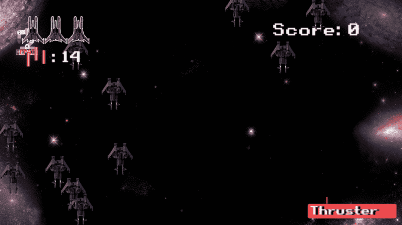

觉得我们的游戏太简单了？这可能是提高难度的好时机。

我们可以改变敌人的移动，使其更难被击中。

我对敌人的行动有一些想法。它将双向移动。

1.  **正常情况下直走。**
2.  **随机向右或向左移动对角线。
    当敌人不在场景区域时，瞬移到 x 轴上的对面。**

我们不会选择敌人的运动。随便点。

打开**敌人**脚本，创建一个整数变量作为移动 ID。

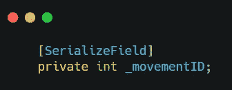

由于我们有 2 种运动类型，我们可以让它在 **Start()** 中随机选择 1。

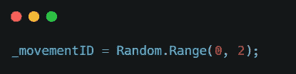

在 **Update()** 中，我们可以用 switch 语句来定义 ID 的移动方式。

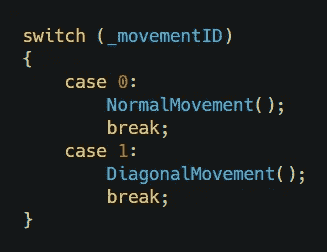

然后我们就可以将原来的运动提取到 **NormalMovement()** 中，新建一个: **DiagonalMovement()** 。

在**对角线移动()**内，我们将有两种移动方式:向左&向右。唯一的区别是在 x 轴上，一个应该是负整数。

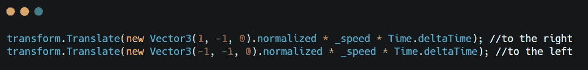

我们可以简单地改变随机 ID 来控制 x 轴。

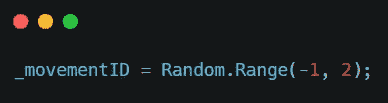

以及 switch 语句上的一些小变化。

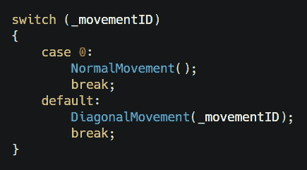

在这个 switch 语句中，1 & -1 将被发送给 **DiagonalMovement()** 方法。意味着我们也需要将 ID 用于我们的方法。

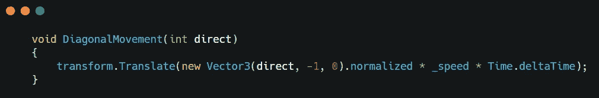

然后，我们需要添加一些代码行，使它在超出边界时飞回来。

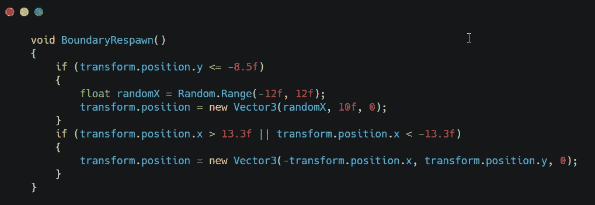

这些线条过去是运动法中的，现在应该是提取为新方法的好时机。
那么我们需要在 **NormalMovement()** 和 **DiagonalMovement()** 中都调用这个方法。

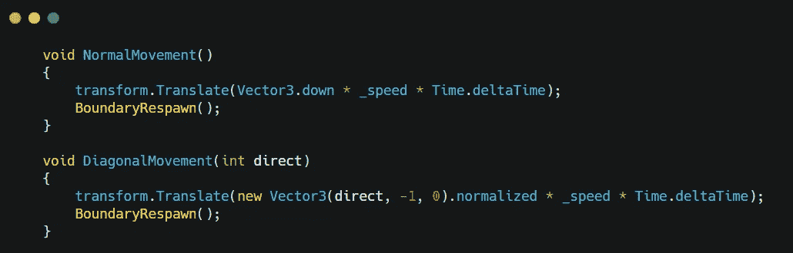

全部完成！现在你的敌人应该更难打了！

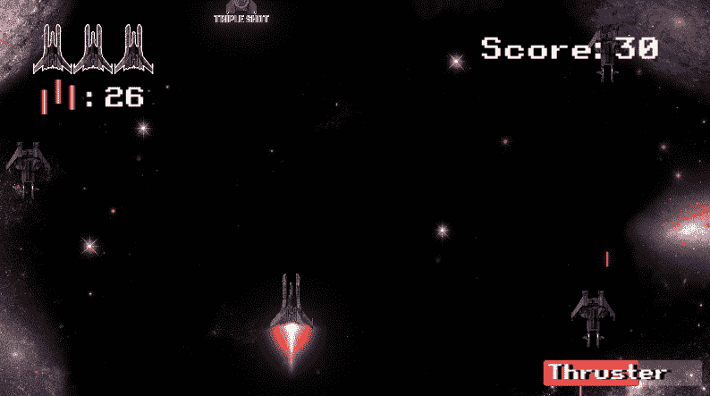

下一步:[新点火启动](https://sj-jason-liu.medium.com/new-firing-powerup-game-dev-series-40-73b6f6dc684c)