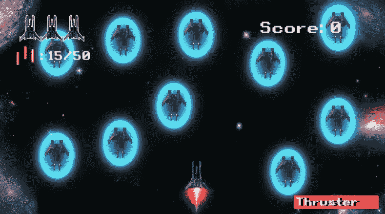
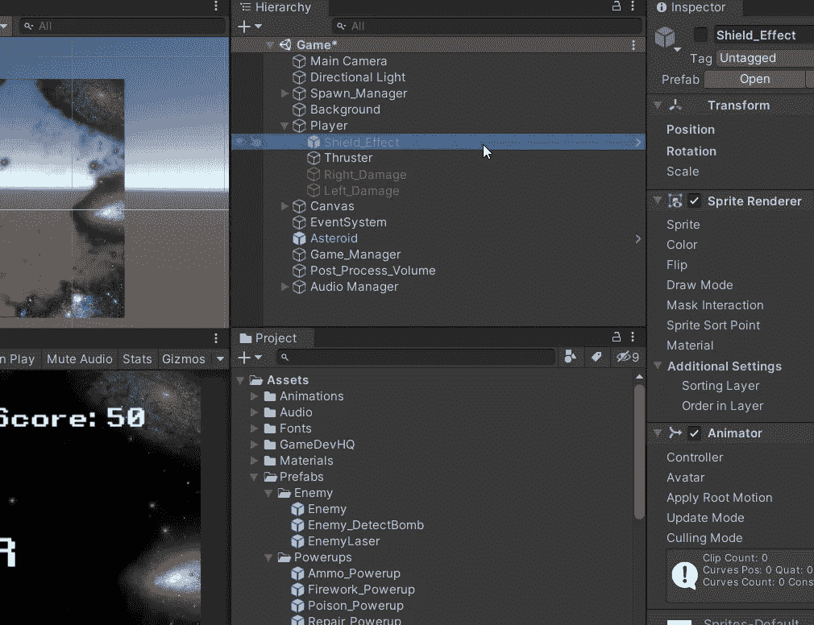
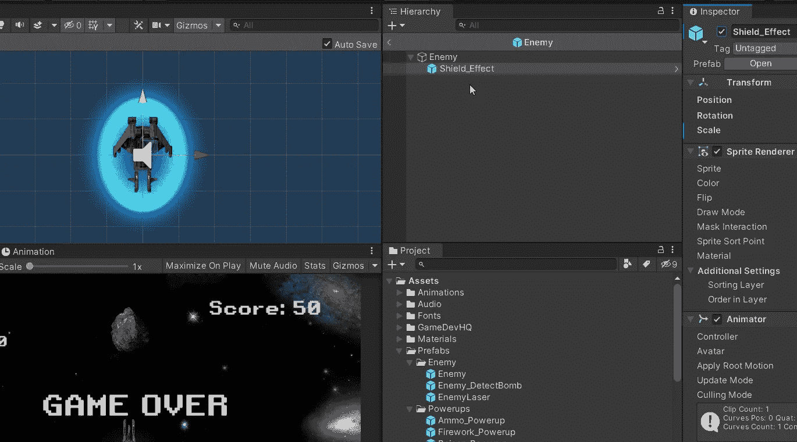
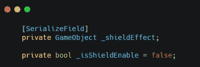
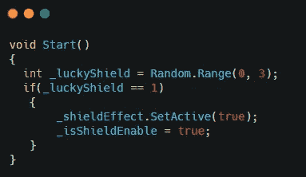
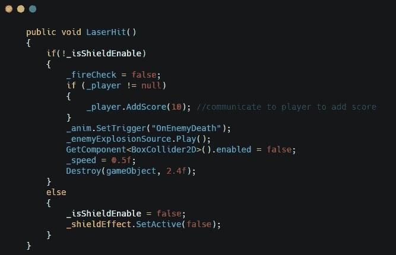
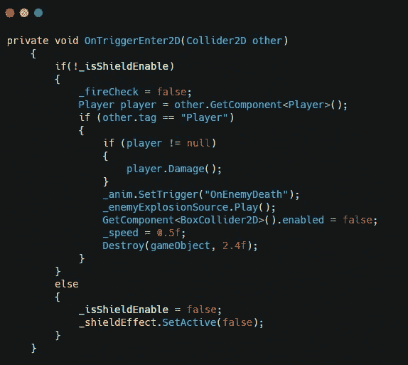
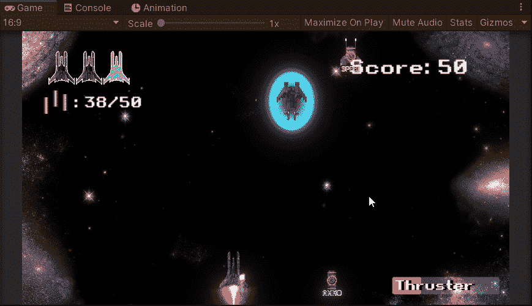

# 敌人有护盾 Buff！-游戏开发系列 46

> 原文：<https://medium.com/nerd-for-tech/enemy-got-shield-buff-game-dev-series-46-5eb9b0f5c27?source=collection_archive---------36----------------------->

目标:对敌人制造 1 次保护盾。

我不干了！

每一次挑战都是一次提高技能以击败游戏的好机会。为了提升挑战等级，给我们的敌人一些 buff 可能是一个好的开始。

在这篇文章中，我们将使我们的敌人随机得到护盾保护。对我们的玩家来说，清除它们变得越来越困难。

## 屏蔽预制件

我们需要做的第一件事是创建一个盾牌预置，我们可以很容易地从玩家那里创建一个。

在我们的玩家里面，有一个盾牌游戏对象，它还不是一个预置。我们可以简单地把它拖到**项目**中作为一个新的预置。

然后我们需要把这个盾牌预制体连接到敌人的预制体上。

我们应该在预置中停用它，然后在脚本中调用它。
有了这个，我们可以在脚本中随机化它。

## 随机屏蔽设置

在这个脚本中，我们需要 2 个变量来使用 shield。

在 **Start()** 中，我们会让随机之神来决定谁应该得到盾牌。

在这个随机规则中，三人中只有一人会得到盾牌。

然后我们还需要调整 2 的方法来启用屏蔽效果。

首先是 **LaserHit()** 。

我们先做屏蔽测试。如果它被护盾保护，那么禁用护盾，这是我们需要的 1 次保护。

在 **OnTriggerEnter2D()** 中使用相同的语句。

全部完成！我们现在就可以玩，看看谁会是那个幸运儿。

接下来:[无畏的敌人](https://sj-jason-liu.medium.com/the-fearless-enemies-game-dev-series-47-ef53d84df979)