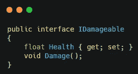
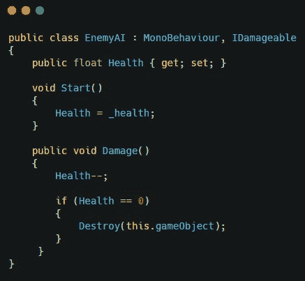
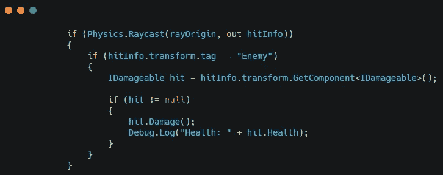
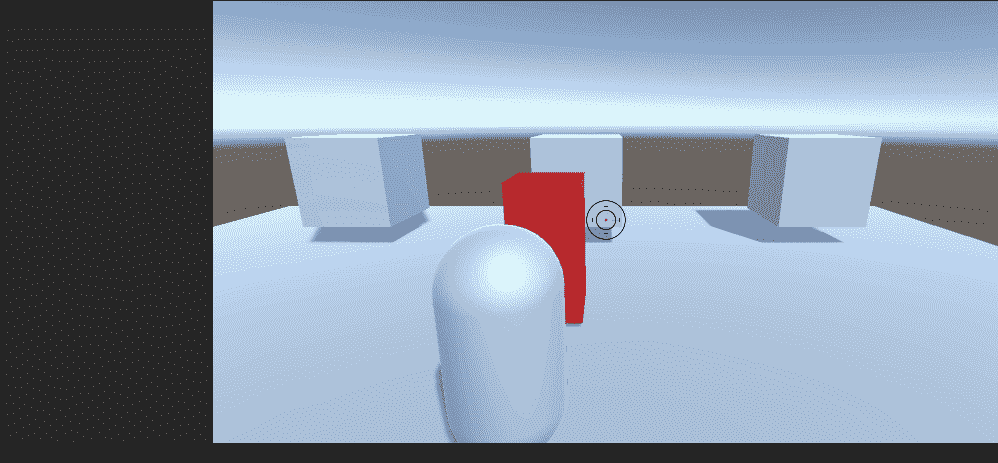

# 在 Unity 中使用接口的敌人医疗系统

> 原文：<https://medium.com/nerd-for-tech/enemy-health-system-using-interfaces-in-unity-10defdab5473?source=collection_archive---------7----------------------->

我正在开发一款第三人称生存射击游戏。我已经安排好了射击机械师和追敌机械师。现在是时候给敌人健康，让他们被打败了。

为此，我创建了一个名为 IDamageable 的接口。这将是最好的工作，因为当我设置它时，它将能够为玩家的健康系统工作。该接口有一个健康变量和一个损坏方法。

现在我给敌人添加了这个接口并实现了属性。我设置的生命值等于敌人的生命值。我创造了这个伤害方法，每次召唤它的时候都会减少一点生命值，如果生命值为零，敌人就会被消灭。

注意:只显示与接口相关的代码

现在我不得不在敌人被击中时调用伤害函数。这是在我设置的拍摄脚本中完成的。当射线发射出去的时候，我在寻找敌人的标记。如果我找到了一个，我会得到一个敌人界面的引用，并调用伤害函数。

这使得敌人的医疗系统开始工作。

