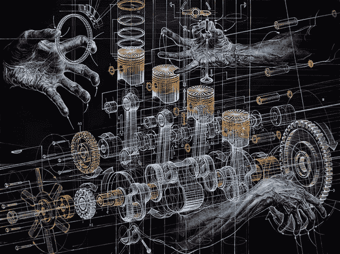

# 工程错觉:一个业内人士对科技行业的看法

> 原文：<https://medium.com/nerd-for-tech/engineering-illusions-an-insiders-take-on-the-tech-industry-23637f5a4247?source=collection_archive---------6----------------------->

## *回顾技术未兑现的承诺和强者对技术的滥用*

thisiscolossal.com

## 介绍

在我们令人窒息的技术狂热中，迫切需要一种小工具来解除我们对技术的奢侈梦想。但愿我们的技术恍惚是一种能量来源；然后，它可以永远为我们的汽车、电话、社交媒体和空中出租车提供动力。关于技术奇迹的详尽故事总是激励着我们的科技事业。技术既有形又可用，但无形又遥远，它触及到我们生活的方方面面，即使我们在等待和谈论它在未来某一天的未知但肯定超越的影响。用它自己的意志使技术变得崇高，我们对它的坚定崇敬庄严地宣布:今天，技术是灵丹妙药；明天，技术就是拯救。

从董事会会议室到国会听证室，从教室到客厅，对科技公司首席执行官的崇拜，对科技行业的庆祝，以及对其每一种产品的疯狂消费。正如人们所相信的那样，今天的技术带来了美好未来的可能性，这种可能性因不断增加的技术增长而丰富。最终的未来总是近在咫尺，钟声将永远敲响，标志着终端技术的解放。那么我们的工作就完成了，乌托邦也就建成了。

1999 年,《连线》杂志的创始执行主编凯文·凯利写了一篇热情洋溢的[预言，说美国人即将迎来涅槃。标题为*咆哮的零*，这篇文章承诺，“好消息是，你很快就会成为百万富翁。坏消息是，其他人也会如此。”凯利预测，通过数字化整合的国际市场，股票市场将持续增长，生活和工作水平将得到提高，充分就业，他将这些成果放在了互联网的祭坛上。事实上，这一技术奇迹将带来一场“超富裕浪潮”，当它席卷大多数人时，富人的富裕生活方式“将成为其他所有人的模板”。因此，“富人在 2000 年拥有的，其他人在 2020 年会拥有的:私人厨师、全职妈妈、六个月的休假。”这篇文章充满了宏伟的主张，最重要的是指出“空气、土壤和水污染将在未来 20 年内大幅降低”，人们将“更晚开始工作，更早退休，更长寿”这只是在公司雇佣高中毕业生并支付他们的大学教育费用之后，因为劳动力将会短缺。](https://www.wired.com/1999/09/zeros/)

站在承诺的未来之上，人们现在可以回顾过去二十年的风景。互联网确实提高了生产率，部分原因是不稳定的合同和零工。由于大多数人的工资继续停滞不前，收入和财富分配继续变得更加集中。1999 年，美国收入最高的 0.1%人群的收入是收入最低的 90%人群的 162 倍。2018 年，它已经膨胀到底层 90%收入的 196 倍，触及大萧条时期的领土。在 20 世纪 60 年代，这个倍数徘徊在 40-50 左右。到 2010 年，美国人的预期寿命增长趋于平稳，甚至在 2014 年[开始下降](https://edition.cnn.com/2019/11/26/health/us-life-expectancy-decline-study/index.html)。[注意到随着互联网时代催生了许多百万富翁和亿万富翁，创造了“巨大的个人财富”，科技高管和投资者比尔·达维多夫在 2014 年宣称，“互联网是人类历史上不平等的最大合法推动者。”](https://www.theatlantic.com/business/archive/2014/01/the-internet-is-the-greatest-legal-facilitator-of-inequality-in-human-history/283422/)

2017 年的一项 CareerBuilder 研究[显示](http://press.careerbuilder.com/2017-08-24-Living-Paycheck-to-Paycheck-is-a-Way-of-Life-for-Majority-of-U-S-Workers-According-to-New-CareerBuilder-Survey)78%的美国人靠薪水生活，至于雇用高中毕业生并为他们支付教育费用的公司，截至 2019 年，大约有 4500 万学生背负着总计 1.6 万亿美元的学生债务。关于蹼状奇迹的好处的预言似乎没有实现，即使那些关于它的纯粹能力超过了大多数预测。这不是第一次技术幻想失败了。

然而，期待技术改善现状是合理的。毕竟，考虑到这些技术的先进能力，人们会认为技术发展和人类条件的普遍改善之间存在着强有力的正相关关系——这是任何人在参加任何科技公司的入职培训后都可以背诵的公开目标。然而，面对巨大的全球性问题，如贫困、饥饿、核风险、环境破坏、气候恶化、民主腐蚀以及极端不平等，我们很难将我们令人印象深刻的技术能力与当前的现实相协调。在对手机、电动汽车、互联网、飞机、基因编辑、机器学习和其他技术成果的永恒庆祝和崇拜之下，存在着一种明显的需求，即渗透到那些按照自己的目的划分科技企业的机构中去。随着技术的地位从简单的手段转变为自我证明的、公理化的目的，两个相关的问题出现了:通过谁的手段，为了什么目的？

我们当代与技术的浪漫只不过是延续了一千多年的漫长而狂热的技术超越梦想。这种狂热从来没有被当时盛行的强国对技术工作的公然滥用所抑制。*工程错觉*从展示中世纪“有用艺术”的历史开始。**第一部分，宗教与技术**，分析了现代科技事业的宗教认识论根源。缠绕着技术藤蔓的宗教之树，为理解我们不懈的技术痴迷提供了一个有利的视角。科技公司的首席执行官们发表拯救世界的宏伟宣言，投资者兜售一款金融管理应用程序改变生活的潜力，或者一款声称能让身体完美的联网健身设备，这些人都与古老的宗教教义有着秘密的联系。

宗教思想，特别是基督教及其基本信条，可能不会在谷歌年会、通用电气商业广告或汽车制造商支持的立法中占据显著位置，但它肯定会继续塑造今天对技术的信念。然而，现代世俗主义包含了对技术的宗教信仰——从人工智能、生物技术到太空探索——根植于对神一样的知识、神的完美和天堂般的升天和逃离的强烈渴望。

今天，这些信念影响着工业发展、经济政策、公共话语、投资理念和国际关系。技术和我们对提升的感知继续编织着我们对未来的梦想，这是一个已有一千多年历史的传统。理解今天对技术的滥用，以及伴随着国家资本主义下强大利益集团所做的华丽承诺，从这里开始。

技术的影响在一定程度上仅仅是操作性的:互联网重塑了国际金融市场，或者汽车改变了城市规划和交通系统的方向。但更重要的是，它是意识形态的:这个被称为技术的六翼天使中的宗教信仰被两个非常世俗的机构吸收并反过来促进它们自己的目的:国家和私人权力。达维多是不正确的。互联网不是人类历史上不平等的最大法律推动者。这将是机构控制和浪费这一原本中立的技术，为自己的目的服务。

第二部分“国家与技术”调查了现代技术企业从中脱颖而出的国家熔炉。国家试图通过技术优势来维持其在世界上的优势，它寻求发展和部署技术主要是为了维持其优势。在这一幕中，为国家权力服务的有用艺术的悠久历史得以重现。一个寻求最佳利用其技术能力来普遍提供技术成果的民主国家必须首先与国家竞争，因为它对我们的技术方向、预算和优先事项有其他想法。例如，虽然保护国家安全的侵略战争限制了“国家”甚至“安全”的定义，但与战争预算不可分割的是长期和昂贵的研发项目的命运，这些项目产生了全球定位系统、计算机处理器和锂离子电池等先进技术。

5G 通信、人工智能、网络安全工具和先进制造技术等新兴技术已经让各国卷入了一场反对盛行的新自由主义国际秩序的技术民族主义竞赛。这些技术将重塑国际经济和政治格局，各国都处于高度戒备状态。无论是哪种政体——民族主义还是自由全球化——国家维持其至高无上地位的原始欲望依然存在。在国家对权力贪得无厌的欲望下，技术变成了影响这一目标的工具，因为技术企业的创造力和奉献精神被引离了声称的人类发展的良性目标，而转向了更严重的国家权力问题。

国家在现代科技事业中起着巨大的作用。研究和开发、原材料提取和采购、财政支持以及不同市场的国际参与只是国家推进技术进步的几个步骤。为这些决定提供信息是国家对其自身权力的主要授权。任何试图理解我们的技术轨迹及其反复破坏的尝试都不能忽视这种原始的必要性。

第三部分，私人权力和技术，回顾了我们的科学和技术工作是如何组织的。公司和金融利益集团等私人机构的经营原则对开发哪些技术以及如何部署这些技术进行了严格的控制。试图调和我们的技术不断无法产生宏伟的未来涅槃的先进状态必须考虑这些机构。如今，硅谷和整个现代科技经济远非天堂，而是面临着所谓的“科技冲击”(tech lash)——对科技公司的普遍不满。加剧不稳定的劳动力市场、侵犯隐私、国家监控、虐待工人和逃税只是列举的几个原因。

在我们技术成就的顶峰，人们会希望看到人类满意和满足的顶点。然而，面对通信、移动技术、农业、自动化、信息管理、交通和其他领域的惊人能力，却出现了日益膨胀的“技术冲击”。在 2018 年[致亚马逊、脸书、谷歌、网飞和苹果首席执行官的伪信](https://www.economist.com/briefing/2018/01/20/the-techlash-against-amazon-facebook-and-google-and-what-they-can-do)中，《经济学人》杂志提出了一些自愿的反垄断补救措施，以平息不断上升的不满情绪。上面写着，“有一缕光。几乎你所有的服务仍然广受消费者欢迎；他们用你的产品来交流、导航、搜索、购物和社交。他们无法想象没有你的生活。”

“无法想象没有你的生活”要么表示不可或缺的价值，要么不可避免的强大。在这两种情况下，仅仅提供无力的、自愿的反垄断解决方案，就忽略了私人权力对科技企业控制的全部范围，以及为什么技术会被肆无忌惮地滥用和痛苦地浪费掉。更广泛的分析是必要的。模糊这一分析的是由商业原则形成的意识形态的浓雾。必须穿透迷雾的是，哦，怎么说来着…一道光。

矛盾的是，随着机构对技术的滥用有增无减，理性的、战术性的使用减少，对技术的坚定信念似乎只会扩大。挑战这些理论揭示了开发和利用我们的技术为人类普遍服务的可能性。总结宗教、国家和私人权力的综合影响，**第四部分，结论**讨论了有助于培育一个强大、民主的科技企业的替代方案。反驳我们的环境对小说和浮华的冲动，这些行为中的许多都是根深蒂固和相当传统的。

理性很难成为我们联合技术活动的特征，这是一种沉浸在机器疯狂和高科技幻觉中的努力。这是长期以来非理性意识形态的不幸结果，这种意识形态在假装最合乎逻辑和理性的人类事业上运作。考虑到当今人类面临的严峻挑战，从根本上重新定位我们的技术努力不仅仅是智力上的自慰，而是重新定位我们的能力以应对当今紧迫问题的关键练习。

注:在本讨论中,“科技企业”是指我们在应用科学和技术部门为生产各种产品所做的累积努力。在这里，“企业”不仅限于商业。虽然硅谷在这里被用来作为整个努力的现代代表，但它仍然只是整个企业的一个子集。在这种情况下，不仅仅是亚马逊、优步和苹果属于科技企业，波音、福特、美国电话电报公司、国防部和其他机构也包括在内，这些机构肯定也与硅谷有互动。

除了一些例外，这里的讨论主要集中在美国。这有几个原因。美国在世界舞台上拥有技术优势。源自美国的跨国公司是地球上最具主导地位的科技实体。尽管存在疯狂猜测其全球衰落的季节性传统，但美国仍然[控制着世界上的大部分财富，并指挥着迄今为止最大的军队(其本身就是科技企业的产物)。最后，即使在国内，技术也主导着这个国家的大部分政治经济，2020 年 7 月，仅五家科技公司](https://academic.oup.com/isq/article-abstract/57/4/817/1817158)[就占了标准普尔 500 指数的 25%。因此，对科技企业的评价从这里开始。](https://www.forbes.com/sites/sergeiklebnikov/2020/07/24/apple-microsoft-amazon-google-and-facebook-make-up-a-record-chunk-of-the-sp-500-heres-why-that-might-be-dangerous/#769aa3ac4f6b)

以美国为中心的分析的最终原因相当简单。这就是为什么这个企业的成员可能会质疑他自己的社区对滥用我们技术能力的电力系统的勤奋和冷静的服务。正如计算机科学家 Drew McDermott 在 1976 年所说的，“如果我们不能批评自己，别人会帮我们解决这个问题。”

***接下来:*** [***第一部分:宗教与科技***](https://techinsider100.medium.com/engineering-illusions-part-i-religion-and-technology-c1c7714bb9de)

*跟着一起上 Twitter*[**@ AP _ prose**](https://twitter.com/ap_prose)**和 Medium at [科技内幕](https://medium.com/u/6ba7067b75dc?source=post_page-----c1c7714bb9de--------------------------------)进行下一期的工程幻！**