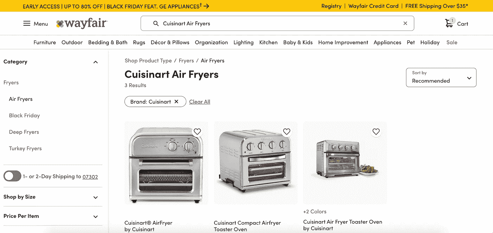
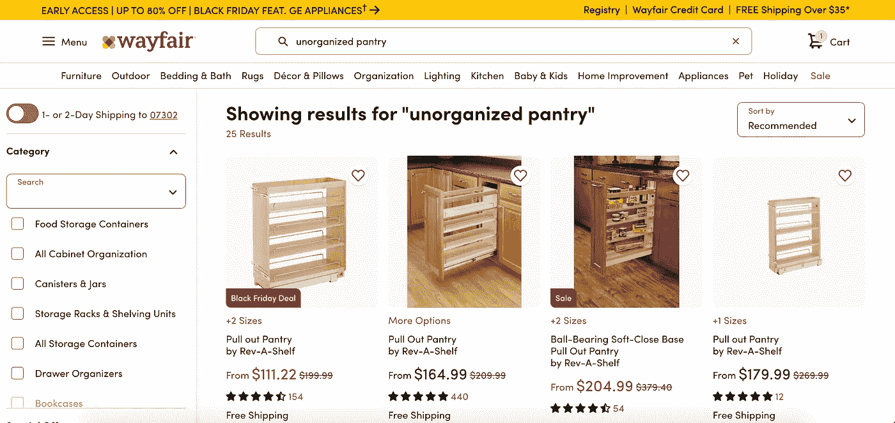
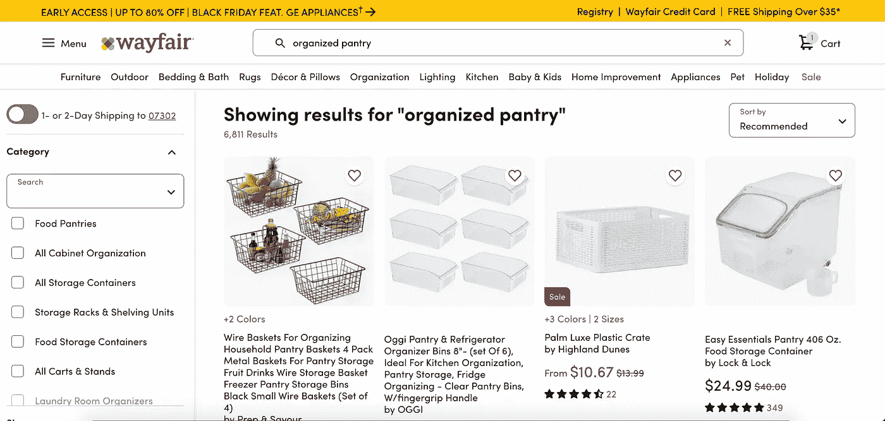
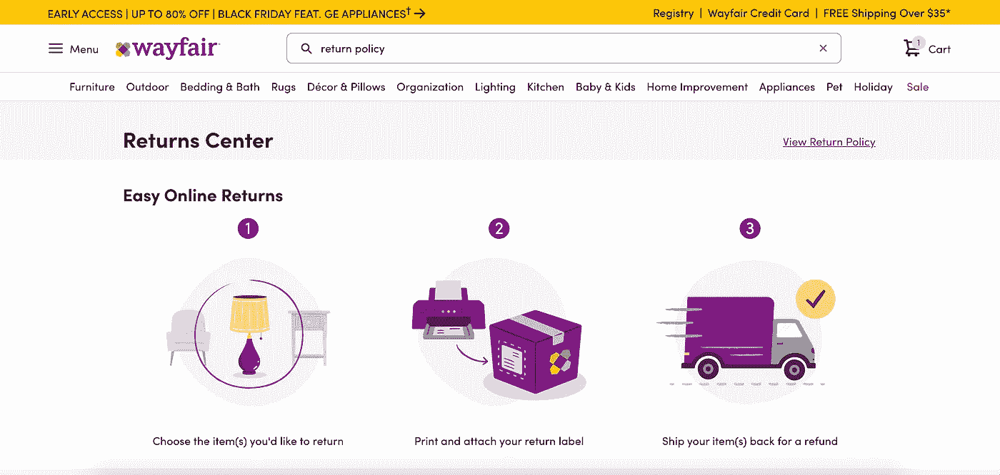
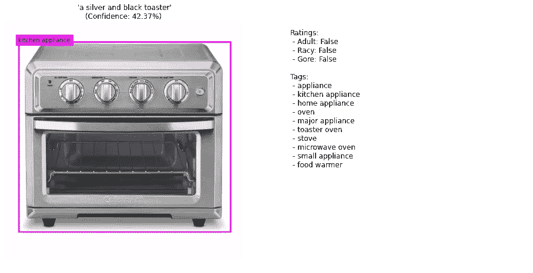
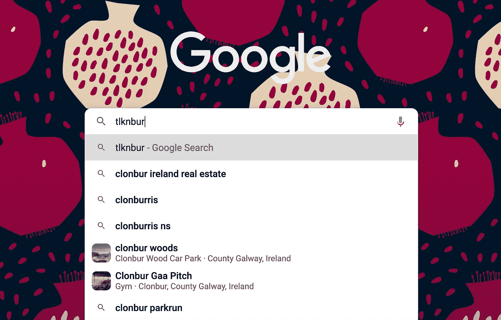

# 使用自然语言处理和计算机视觉增强电子商务文本搜索

> 原文：<https://medium.com/nerd-for-tech/enhancing-text-search-for-e-commerce-and-products-using-nlp-and-computer-vision-3a74962c065?source=collection_archive---------2----------------------->

## 通过增强文本搜索功能来提升产品用户体验

为了在万维网上找到任何东西，用户使用文本搜索框来键入他们的意图。搜索引擎或产品或电子商务网站查询后端并检索相关信息，这种类型的文本检索是搜索引擎的基础。检索最相关的结果或具有高搜索相关性对于产品的良好用户体验至关重要。让我们将我们的用例集中在电子商务应用程序上。

# 搜索工具的类型

有两种类型的搜索工具:

> 元数据搜索
> 
> 全文搜索

在元数据搜索中，搜索工具仅通过从定义的元数据字段中寻找信息来分析部分数据。在电子商务中，这种元数据可以是产品名称、产品关键字、产品标签(兴趣类别),以标记用于动态显示的产品。

在全文搜索中，搜索工具分析每个产品的整个文本数据集，就像详细的产品描述一样。使用 NLP 工具分析全文并为每个产品生成更多的标签，然后在详尽的标签列表上进行元数据搜索也越来越常见。

# 文本搜索在电子商务中的重要性

使用文本搜索框的用户表明他们确切地知道他们想要什么，并且他们有很高的购买意愿。与其他推荐系统提供的产品相比，文本搜索提供的产品的转化率更高。

# 基本的电子商务搜索 UX 问题

根据 [Baymard Institute](https://baymard.com/) 的数据，在美国和欧洲 60 家收入最高的电子商务网站中，最新一轮的研究发现了以下情况:

*   61%的网站要求用户使用网站使用的确切产品类型术语进行搜索，例如，如果网站上使用了“*吹风机*，或者“*多功能打印机*与“*多功能一体打印机*”，则无法返回相关产品，如“*吹风机*
*   46%不支持主题搜索查询，如“*春装*”或“*办公椅*”
*   32%的人甚至不支持最基本单位的符号和缩写，导致用户在搜索*英寸时错过了完全相关的产品，而该网站在其产品数据中使用了*或*。***
*   ***如果用户拼错产品标题中的一个字符，27%不会产生有用的结果***
*   ***25%不支持非产品搜索查询，如“*退货*或“*订单跟踪****

**谷歌、必应(Bing)等顶级搜索引擎和亚马逊(Amazon)等顶级电子商务市场为消费者访问的任何平台或渠道(包括电子商务网站)设置了很高的搜索功能门槛。**

**但是有道理。电子商务产品搜索的成功很大程度上取决于搜索结果的相关性、速度和准确性。品牌如何理解和支持购物者的搜索行为可以创造或破坏顾客体验。**

**为了适应不断变化的消费者搜索和购物习惯，品牌拥有一个能够根据上下文和意图自动持续优化结果的电子商务产品搜索引擎至关重要。**

# **用户搜索类型**

****精确产品搜索:**通过标题搜索特定产品。例如:在 Wayfair 搜索 ***美食艺术空气炸锅*** 会出现 3 个结果，如图所示。**

****

**精确产品搜索**

****产品类型搜索:**搜索产品组或整个类别。例:在 Wayfair 搜索 ***空气炸锅*** ，结果超过 1000 条。**

****

****症状搜索:**通过查询产品必须解决的问题来搜索产品。Wayfair 似乎不支持症状搜索，因为搜索*【无组织食品室】时，问题只导致 25 个结果，而搜索 ***有组织食品室***——解决方案导致超过 6000 个结果。***

****

**症状搜索-问题**

****

**症状搜索—解决方案**

****非产品搜索:**搜索帮助页面、公司信息和其他非产品页面。例如:搜索退货政策会将用户带到 Wayfair 的退货中心页面。**

****

**非产品搜索**

# **使用机器学习和人工智能增强文本搜索**

**解决一些糟糕的文本搜索体验的基本问题是很重要的。任何手动的、过时的和传统的电子商务产品搜索基础设施都不能适应当今更加动态和快节奏的购物者和零售环境。**

## **自然语言处理**

**利用自然语言处理(NLP)，我们可以通过增强产品标签并将其翻译成购物者使用的语言和上下文来增强文本搜索。新增的产品详细信息和 NLP 层可确保用户看到最准确和相关的产品，即使他们搜索的关键词与现场的产品目录描述不匹配。**自然语言处理**是语言学、计算机科学和人工智能的一个分支，涉及计算机和人类语言之间的交互，特别是如何对计算机进行编程以处理和分析大量自然语言数据。以下 Python 代码分析了 Cuisinart 空气油炸锅和烤面包机的产品描述，并使用 NLP 生成产品标签:**

```
**import contractions                # Import contractions library.
import nltk                   # Import Natural Language Tool-Kit.nltk.download('stopwords')             # Download Stopwords.
nltk.download('punkt')
nltk.download('wordnet')from nltk.corpus import stopwords            # Import stopwords.
from nltk.tokenize import word_tokenize, sent_tokenize  # Import Tokenizer.
from nltk.stem.wordnet import WordNetLemmatizer         # Import Lemmatizer.# **An example text with the Cuisinart AirFryer and Toaster Oven product description**text = "You're in luck! The Cuisinart® AirFryer Toaster Oven is now available in a new, space-saving design! Cuisinart’s Compact AirFryer Toaster Oven is big enough to airfry up to 2.5 lb. of food, toast 4 slices of bread or bagel halves, and bake up to a 3 lb. chicken. With all the features of our full-size models, including 6 functions and temperatures up to 450°F, this is an oven that offers multiple menu options and great performance without crowding the countertop! Compact design takes less room on the countertop. Large capacity: Airfries up to 2.5 lb., toasts 4 slices of bread, bakes a 3 lb. chicken. Six functions: Convection Bake, Convection Broil, AirFry, Toast, Bagel, Warm. Adjustable temperature control: Warm to 450°"**
```

```
**def replace_contractions(words):
    """**Replace contractions in string of text**"""
    return contractions.fix(words) # Ex: 'you're' will be converted to 'you are'.
text1 = replace_contractions(text)

"""**Tokenization is** **essentially splitting a phrase, sentence, paragraph, or an entire text document into smaller units**, such as individual words or terms."""
text2 = nltk.word_tokenize(text1) # Tokenization of data**
```

```
**stopwords = stopwords.words('english') # The standard English stop words from NLTK
lemmatizer = WordNetLemmatizer()def to_lowercase(words):
    """**Convert all characters to lowercase from list of tokenized words**"""
    new_words = []
    for word in words:
        new_word = word.lower()
        new_words.append(new_word)
    return new_wordsdef remove_punctuation(words):
    """**Remove punctuation from list of tokenized words**"""
    new_words = []
    for word in words:
        new_word = re.sub(r'[^\w\s]', '', word)
        if new_word != '':
            new_words.append(new_word)
    return new_wordsdef remove_stopwords(words):
    """**Remove stop words from list of tokenized words**"""
    new_words = []
    for word in words:
        if word not in stopwords:
            new_words.append(word)
    return new_wordsdef lemmatize_list(words):
    """**Lemmatization is the process of grouping together the different inflected forms of a word so they can be analyzed as a single item.**"""
    new_words = []
    for word in words:
      new_words.append(lemmatizer.lemmatize(word, pos='v')) # Ex: Lemma for studies is study and Lemma for studying is studying.
    return new_wordsdef normalize(words):
    words = to_lowercase(words)
    words = remove_punctuation(words)
    words = remove_stopwords(words)
    words = lemmatize_list(words)
    return ' '.join(words)
text3= normalize(text2)**
```

```
**from wordcloud import WordCloud # Import WordCloud
import matplotlib.pyplot as plt # Import matplotlibWordCloud().process_text(text3) # Generate WordCloud
wordcloud = WordCloud(background_color='black',
                      width=3000,
                      height=2500
                     ).generate(text3)plt.figure(1,figsize=(12, 12)) # Plot WordCloud
plt.imshow(wordcloud)
plt.axis('off')
plt.show()**
```

****输出:**下面的单词云显示，我们可以为产品生成新的标签，如 toast、oven、cuisinart、bake、airfryer、toaster、design 等等，然后这些标签可以用于增强产品元数据库，从而增强产品文本搜索。**

****

**WordCloud —使用自然语言处理的产品标签**

## **计算机视觉**

**借助计算机视觉，我们可以从数以千计的垂直特定属性及其同义词中，通过基于图像的标签来增强产品信息，从而增强文本搜索。**计算机视觉**是人工智能的一个分支，探索人工智能系统的发展，这些系统可以通过摄像头或分析图像和视频实时“看到”世界。这是因为数字图像本质上只是数字像素值的数组，我们可以使用这些像素值作为特征来训练机器学习模型，这些模型可以对图像进行分类，检测图像中的离散对象，甚至生成基于文本的照片摘要。**

**微软 Azure 包括许多封装了常见人工智能功能的认知服务，包括一些可以帮助构建计算机视觉解决方案的服务。下面是一个 Python 代码，它分析产品图像，并添加可能与产品元数据库中的图像相关联的相关标签，从而增强文本搜索。**

**以下 Python 代码分析了 Cuisinart 空气油炸锅/烤箱的图像，并生成了产品标签:**

```
**# Import the necessary libraries
from azure.cognitiveservices.vision.computervision import ComputerVisionClient
from msrest.authentication import CognitiveServicesCredentials
from python_code import vision
import os# Get the key and end point to your cognitive resource service
cog_key = '**************'
cog_endpoint = 'https://ai-900.cognitiveservices.azure.com/'# Get the path to an image file
image_path = os.path.join('data', 'vision', 'cuisinart.png')# Specify the features we want to analyze
features = ['Description', 'Tags', 'Adult', 'Objects', 'Faces']# Get an analysis from the computer vision service
image_stream = open(image_path, "rb")
analysis = computervision_client.analyze_image_in_stream(image_stream, visual_features=features)# Show the results of analysis (code in helper_scripts/vision.py)
vision.show_image_analysis(image_path, analysis)**
```

****输出:**该模型已经为产品生成了许多标签，如电器、厨房电器、家用电器、烤箱、主要电器、烤面包机、炉子、微波炉、小电器和食物加热器。这些标签可以被添加到产品元数据库中，并且可以进行搜索相关性验证来验证搜索结果的质量。**

****

**用于产品标签的计算机视觉图像分析**

****高级功能:**即使用户使用无意义的关键词进行搜索，谷歌的搜索引擎也会自动补全并给出建议，如下图所示，搜索“tlknbur ”(实际上不是一个单词)仍能检索到一些建议。谷歌的服务器功能强大，可能有足够的带宽来处理这样的查询，但电子商务产品却不能，在这一点上，这一功能对电子商务来说可能是多余的。**

****

> **当电子商务平台准确地提供用户正在搜索的内容时，他们可以提高他们的转化指标，或者激活无摩擦、引人入胜的购物之旅。这最终提高了搜索产生的收入，同时为购物者提供了积极而难忘的用户体验。**