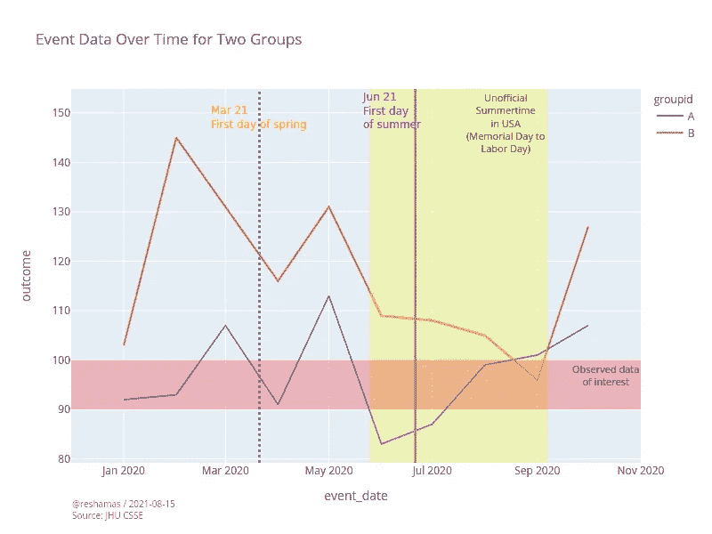
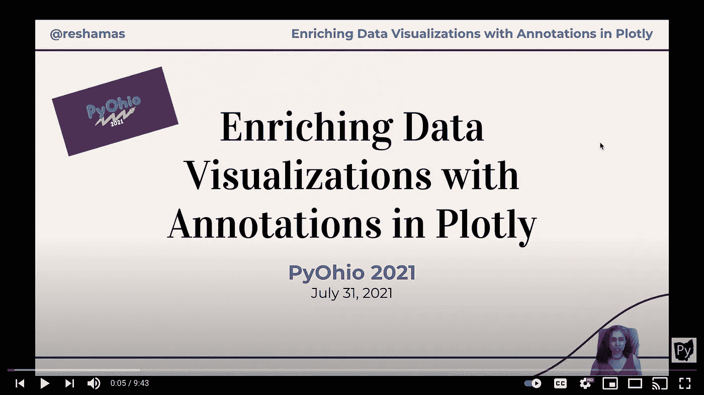

# 使用 Python 在 Plotly 中使用注释丰富数据可视化

> 原文：<https://medium.com/nerd-for-tech/enriching-data-visualizations-with-annotations-in-plotly-using-python-6127ff6e0f80?source=collection_archive---------0----------------------->

## “一图胜千言。”的确是这样，一张**带注释的**图片值得它对数据素养的贡献。



随着编程和计算的进步，数据科学家现在可以进行最先进的可视化，而不需要深入了解 D3 或 Javascript。我们可以使用 python 库 plotly 来完成这个任务！

对于这些例子，我使用的是 Python 版本 3.9 和 [plotly 版本](https://pypi.org/project/plotly/) 5.1.0。

plotly 中注释的视频版本可在 [YouTube](https://youtu.be/D2vsLy85rog) 上获得。



[用 Plotly](https://youtu.be/D2vsLy85rog) 中的注释丰富数据可视化(10 分钟演示)

# 步骤 1:读入样本数据进行可视化

```
import pandas as pdevent_dates = ['2020-01-01', '2020-02-01', '2020-03-01',
               '2020-04-01', '2020-05-01', '2020-06-01', 
               '2020-07-01', '2020-08-01', '2020-09-01', 
               '2020-10-01', '2020-01-01', '2020-02-01', 
               '2020-03-01', '2020-04-01', '2020-05-01', 
               '2020-06-01', '2020-07-01', '2020-08-01', 
               '2020-09-01', '2020-10-01']groupid = ['A', 'A', 'A', 'A', 'A', 'A', 'A', 'A', 'A', 'A',
           'B', 'B', 'B', 'B', 'B', 'B', 'B', 'B', 'B', 'B']outcome = [92,  93, 107,  91, 113,  83,  87,  99, 101, 107, 
           103, 145, 131, 116, 131, 109, 108, 105,  96, 127]data = {'event_date': event_dates,
        'groupid': groupid,
        'outcome': outcome}# create the dataframe from the arrays
df = pd.DataFrame(data)
```

看数据帧，通过采样几行:`df.sample(5)`


# 步骤 2:创建一个基本的两组折线图

```
import plotly.express as pxfig = px.line(df
              , x='event_date'
              , y='outcome'
              , color='groupid' 
              , title = "Event Data Over Time for Two Groups")fig.show()
```

# 第三步:扩展 x 轴范围一点

让我们把 x 轴的左边和右边延伸一点，这样会更清晰，更容易阅读，而且图表不会去边缘。

该参数给出了 x 轴范围的选项:`range_x=[..., ...]`

```
# extend the x-axis rangefig = px.line(df
    , x='event_date'
    , y='outcome'
    , color='groupid'
    , title = "Event Data Over Time for Two Groups”
    , range_x=['2019–12–01', '2020–11–01'],)fig.show()
```

# 步骤 4:添加作者和数据源脚注

这允许我们添加一个脚注注释:`fig.add_annotation(...)`。

```
fig = px.line(df
    , x='event_date'
    , y='outcome'
    , color='groupid'
    , title = "Event Data Over Time for Two Groups"
    , range_x=['2019-12-01', '2020-11-01'],)fig.update_layout(autosize=False, width=800, height=600,)# add today's date
from datetime import date
today = date.today()# HOW TO ADD A FOOTNOTE TO BOTTOM LEFT OF PAGE
fig.add_annotation(
    text = (f"[@reshamas](http://twitter.com/reshamas) / {today}<br>Source: JHU CSSE")
    , showarrow=False
    , x = 0
    , y = -0.15
    , xref='paper'
    , yref='paper' 
    , xanchor='left'
    , yanchor='bottom'
    , xshift=-1
    , yshift=-5
    , font=dict(size=10, color="grey")
    , align="left"
    ,)fig.show()
```

**提示**:根据图形的大小，您可能想要调整`x`和`y`以及`xshift`和`yshift`的上述值。

**提示**:脚注`text`中的`br`表示换行。

# 步骤 5:添加一个带有方框和不透明度的注释

```
fig = px.line(
    df
    , x='event_date'
    , y='outcome'
    , title = "Event Data Over Time for Two Groups"
    , color="groupid"
    , range_x=['2019-12-01', '2020-11-01'],
)
fig.update_layout(
    autosize=False,
    width=800,
    height=600,)# add today's date
from datetime import date
today = date.today()# HOW TO ADD A FOOTNOTE TO BOTTOM LEFT OF PAGE
fig.add_annotation(
    text = (f"[@reshamas](http://twitter.com/reshamas) / {today}<br>Source: JHU CSSE")
    , showarrow=False
    , x = 0
    , y = -0.15
    , xref='paper'
    , yref='paper' 
    , xanchor='left'
    , yanchor='bottom'
    , xshift=-1
    , yshift=-5
    , font=dict(size=10, color="grey")
    , align="left"
    ,
    )# add annotation text with an arrow
fig.add_annotation(
    x='2020-02-01'
    , y=145+1
    , text=f'145 is the<br>the maximum value'
    , yanchor='bottom'
    , showarrow=True
    , arrowhead=1
    , arrowsize=1
    , arrowwidth=2
    , arrowcolor="#636363"
    , ax=-20
    , ay=-30
    , font=dict(size=12, color="purple", family="Courier New, monospace")
    , align="left"
    ,)# add annotation with box, color-filled with opacity option
fig.add_annotation(
    x='2020-05-01'
    , y=135
    , text=f'May<br>Day'
    , yanchor='bottom'
    , showarrow=True
    , arrowhead=1
    , arrowsize=1
    , arrowwidth=2
    , arrowcolor="#636363"
    , ax=-20
    , ay=-30
    , font=dict(size=20, color="green", family="Courier New, monospace")
    , align="left"
    , bordercolor='green'
    , borderwidth=2
    , bgcolor="#CFECEC"
    , opacity=0.8
    ,)fig.show()
```

提示:注释中的文本有许多呈现方式。有字体大小、类型和颜色的选项。可以选择在文本周围添加带有各种格式选项的框。使用`showarrow=True`选项可以显示或隐藏箭头。

**提示**:标注“145 是最大值”的位置可以用坐标来放置，这里是`x='2020-02-01'`和`y=145`。例如，也可以使用`ax=-20`和`ay=-30`移动文本的位置。

**提示**:通过添加`fig.add_annotation`对象，可以在图形上层叠多个标注。

# 步骤 6:添加带有垂直线的注释

```
fig = px.line(
    df
    , x='event_date'
    , y='outcome'
    , title = "Event Data Over Time for Two Groups"
    , color="groupid"
    , range_x=['2019-12-01', '2020-11-01'],
)
fig.update_layout(
    autosize=False,
    width=800,
    height=600,)fig.add_annotation(
    x='2020-03-21'
    , y=145+1
    , text=f'Mar 21<br>First day of spring'
    , yanchor='bottom'
    , showarrow=False
    , arrowhead=1
    , arrowsize=1
    , arrowwidth=2
    , arrowcolor="#636363"
    , ax=-20
    , ay=-30
    , font=dict(size=12, color="orange", family="Sans Serif")
    , align="left"
    ,)fig.add_annotation(
    x='2020-06-21'
    , y=145+1
    , text=f'Jun 21<br>First day of summer'
    , yanchor='bottom'
    , showarrow=False
    , arrowhead=1
    , arrowsize=1
    , arrowwidth=2
    , arrowcolor="#636363"
    , ax=-20
    , ay=-30
    , font=dict(size=12, color="purple", family="Sans Serif")
    , align="left"
    ,)# add vertical lines
fig.update_layout(shapes=
                  [dict(type= 'line',
                        yref= 'paper', y0= 0, y1= 1,
                        xref= 'x', x0='2020-03-21', x1='2020-03-21',
                        line=dict(color="MediumPurple",
                                  width=3,
                                  dash="dot")
                        ),
                  dict(type= 'line',
                        yref= 'paper', y0= 0, y1= 1,
                        xref= 'x', x0='2020-06-21', x1='2020-06-21',
                        line=dict(color="MediumPurple",
                                  width=3,
                                  dash="solid")
                       )
                  ])

fig.show()
```

**提示**:使用这些选项可以调整线型:

```
dash="dot" 
dash="solid"
```

**提示**:可使用`fig.update_layout(shapes=...`添加多条参考线，这些线可作为字典添加。

# 步骤 7:添加垂直和水平矩形突出部分

```
fig = px.line(
    df
    , x='event_date'
    , y='outcome'
    , title = "Event Data Over Time for Two Groups"
    , color="groupid"
    , range_x=['2019-12-01', '2020-11-01'],
)
fig.update_layout(
    autosize=False,
    width=800,
    height=600,)fig.add_annotation(
    x='2020-03-21'
    , y=145+1
    , text=f'Mar 21<br>First day of spring'
    , yanchor='bottom'
    , showarrow=False
    , arrowhead=1
    , arrowsize=1
    , arrowwidth=2
    , arrowcolor="#636363"
    , ax=-20
    , ay=-30
    , font=dict(size=12, color="orange", family="Sans Serif")
    , align="left"
    ,)fig.add_annotation(
    x='2020-06-07'
    , y=145+1
    , text=f'Jun 21<br>First day<br>of summer'
    , yanchor='bottom'
    , showarrow=False
    , arrowhead=1
    , arrowsize=1
    , arrowwidth=2
    , arrowcolor="#636363"
    , ax=-20
    , ay=-30
    , font=dict(size=12, color="purple", family="Sans Serif")
    , align="left"
    ,)# add vertical lines
fig.update_layout(shapes=
                  [dict(type= 'line',
                        yref= 'paper', y0= 0, y1= 1,
                        xref= 'x', x0='2020-03-21', x1='2020-03-21',
                        line=dict(color="MediumPurple",
                                  width=3,
                                  dash="dot")
                        ),
                  dict(type= 'line',
                        yref= 'paper', y0= 0, y1= 1,
                        xref= 'x', x0='2020-06-21', x1='2020-06-21',
                        line=dict(color="MediumPurple",
                                  width=3,
                                  dash="solid")
                       )
                  ])# In United States: 'unofficial' summer is from Memorial Day to Labor Day# Make a vertical highlight section
fig.add_vrect(x0="2020-05-25", x1="2020-09-07", 
              annotation_text="Unofficial<br>Summertime<br>in USA<br>(Memorial Day to<br>Labor Day)", annotation_position="top right",  
              annotation_font_size=11,
              annotation_font_color="Green",
              fillcolor="yellow", opacity=0.25, line_width=0)# Make a horizontal highlight section
fig.add_hrect(y0=90, y1=100, 
              annotation_text="Observed data<br>of interest", annotation_position="top right",  
              annotation_font_size=11,
              annotation_font_color="Black",
              fillcolor="red", opacity=0.25, line_width=0)fig.show() 
```

**提示**:可以通过添加注释段`fig.add_hrect`或`fig.add_vrect`来创建水平和垂直高亮块。对于水平截面，指定在`y`的哪个坐标放置块。垂直高亮块也可以这样做，这里可以指定`x`坐标。使用`fillcolor`选项可以指定高亮矩形部分的颜色。

# 资源

*   [Plotly Python 文档](https://plotly.com/python/)
*   [Plotly 社区论坛](https://community.plotly.com/)