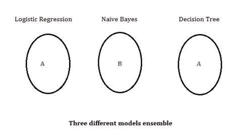
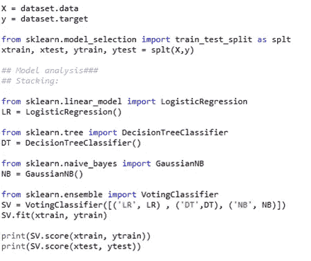

# 集成学习

> 原文：<https://medium.com/nerd-for-tech/ensemble-learning-f93819e0b196?source=collection_archive---------20----------------------->

这是一种处理复杂数据的机器学习技术，如果简单的机器学习算法不能给出令人满意的预测，那么集成技术正被用来建立良好的模型。在这种技术中，我们结合多个模型来预测数据。但是，必须再次明确一条规则，即如果数据非常大且非常复杂，集成技术也无法给出最佳输出。然后机器学习的另一个分支处理这个问题，即**深度学习**。甚至我们可以将相同的集成技术用于深度学习以及多个神经网络，但这不是那么合适或必要的。

系综技术有三种主要的方法。我们尝试这些方法，使我们的模型集合。

堆叠/投票

制袋材料

助推

**堆叠/投票:**

这是处理多种算法最简单的集成方法之一。最终，我们制定了一套独特的算法，并将它们结合起来进行预测。有些作者把这种*叫做堆积*少做*表决*，其余两者的意思差不多。

在这种方法中，本质上我们一起调用多个算法，我们集成所有这些算法，并且机器通过所有这些预测的聚合来自动预测输出。

通过上图，我们可以看到一个算法中集合了三个不同的模型。我们看到，这里的预测将基于多数原则；A 出现的次数更多，因此机器预测 A 作为特定实例的输出。正如我们上面所讨论的，每个算法本质上都不是概率性的，因此默认情况下，硬投票是输出决策的首选。大多数时候我们更喜欢奇数的算法，但在偶数选择的情况下，如果模型给出两类都有 50%的机会，我们发现 scikit 库本质上是贪婪的；因此，它会找到预测速度更快的模型。

为了进一步研究像装袋和助推这样的方法，请参考我的帐户以供参考。

 [## 自助聚集随机森林模型

### 引导聚合也称为打包。这是一个机器学习集成元算法，旨在…

medium.com](/nerd-for-tech/bootstrap-aggregating-and-random-forest-model-9460e235537)  [## 机器学习中的助推

### Boosting 是一种集成机器学习技术，用于通过使用多个弱分类器来建立更强的分类器

medium.com](/nerd-for-tech/boosting-in-machine-learning-438312f8f4e1)