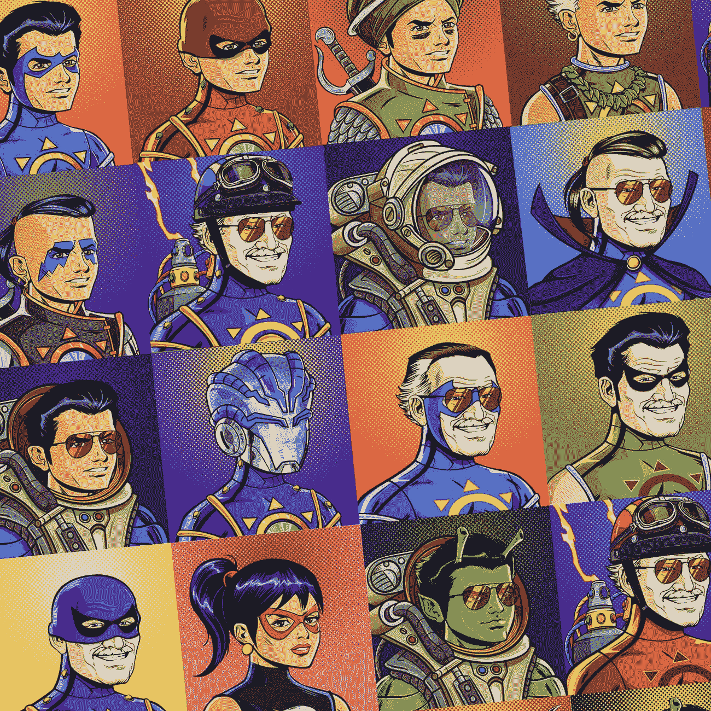

# 进入新查克拉 NFT 系列的区块链世界

> 原文：<https://medium.com/nerd-for-tech/enter-the-world-of-blockchain-with-the-new-chakra-nft-collections-8abacab48f11?source=collection_archive---------5----------------------->

FTs 是目前的新趋势。每个商业平台都在采用这一概念，并以此为基础开展业务。不可替代令牌是基于区块链技术构建的独特数字资产。确保所有权是这项技术的首要核心。这些优点是企业采用这项技术并从中大赚一笔的主要原因。NFTs 的影响正在接管所有可能的商业行业。现在，在超级英雄流派中，特别是在印度，一场新的 NFT 风暴正在以拉朱·拉伊的形式出现，这种现象被称为 [**查克拉 NFT**](https://chakra.beyondlife.club/?fsz=home)，它们将在几天后上市。

**查克拉——印度超级英雄的面孔**

无敌查克拉是印度超级英雄类型的新面孔。这个故事围绕着一个名叫拉朱·拉伊的小男孩展开。故事的完整开端是从他遇到一个改变他一生的事件开始的。他将穿上由他的导师辛格博士开发的纳米技术服装。这套衣服允许 Raju 通过打开他身体的所有脉轮获得超人的力量。凭借这种新的强大力量，Raju 致力于保护孟买免受邪恶势力的侵害。

 [## 探索斯坦·李的查克拉 NFTs |查克拉无敌 NFTs |超越生命

### BeyondLife.club 推出斯坦·李的查克拉无敌官方 NFT 收藏，包括动画、漫画剧照…

查克拉.超越生命.俱乐部](https://chakra.beyondlife.club/) 

**NFT 对无敌查克拉的影响**

脉轮电视节目已经采取了一个更高的步骤，通过引导自己进入 NFT 领域。NFT 已经围绕超级英雄流派很长时间了，它的触角伸得很长，当 NFT 进入印度市场的时候，Chakra NFTs 就形成了。这些独家的印度超级英雄 NFT 有望改变印度数字市场的格局，并以时尚的方式将其放在全球地图上。该系列展示的非功能性食物非常现代，是市场上的新品；艺术朋克，动画视频，战利品箱，宝箱，巨型点唱机，特殊的 bday 资产，等等。

在这个集合中有各种各样的非战斗单位，战利品箱是最令人期待的 NFT。这是一个惊喜的盒子，买家可以从它的 6865 件物品中收到任何类型的未知艺术朋克。有限量版的 NFT 将通过积极的拍卖出售，如漫画生活封面，查克拉 7 权力，和斯坦·李的 Bday 特别 NFT。这些非传染性非典型肺炎数量较少，而且很罕见。因此，这些 NFT 是每个人关注的焦点。除了这些专属的 NFT，买家还可以获得额外的优惠。因此，这是一个前所未有的机会，可以在同一时间同一地点体验一些宏伟而独特的东西。

**最后的想法，**

[**脉轮 NFTs**](https://accounts.beyondlife.club/signup?fsz=home) 即将上线。预计将于 12 月底在一个名为 Beyondlife 的平台上推出。因此，准备好见证一些特别而迷人的东西吧。