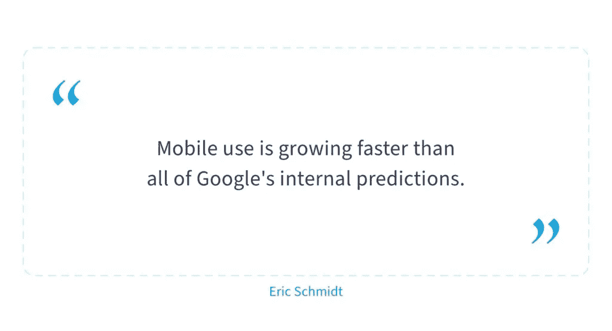
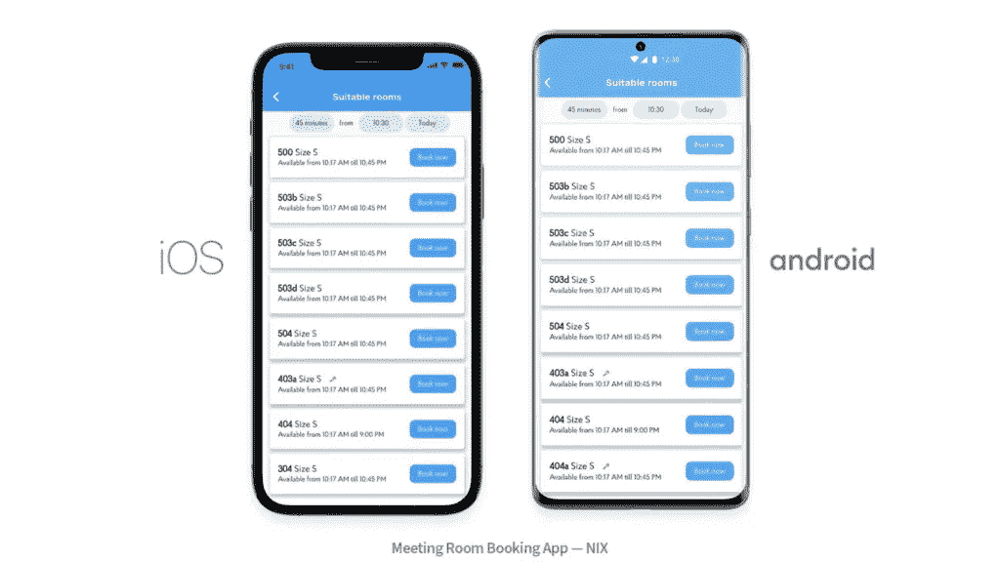
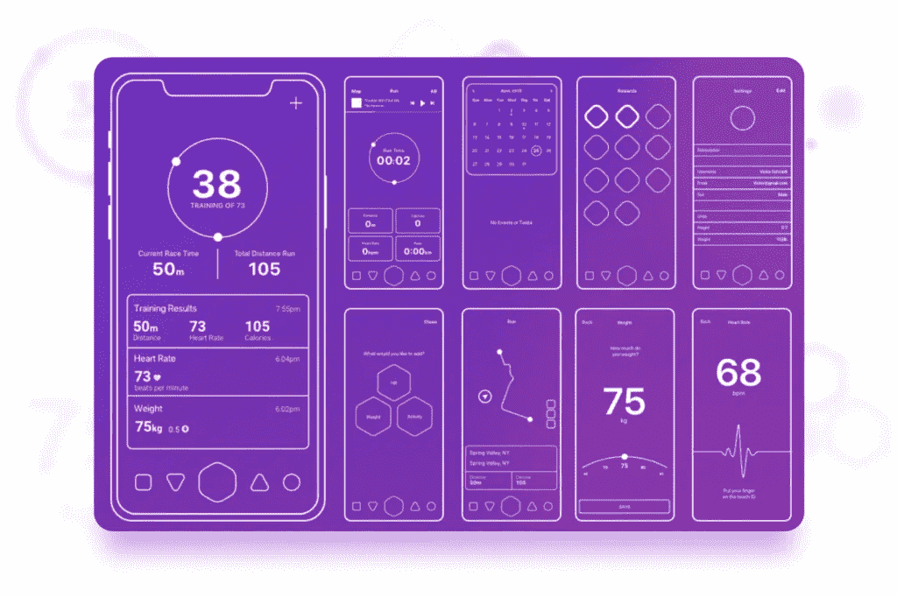

# 企业移动应用程序开发:挑战、阶段和技巧— NIX United

> 原文：<https://medium.com/nerd-for-tech/enterprise-mobile-app-development-challenges-stages-and-tips-nix-united-9b26c2172022?source=collection_archive---------19----------------------->

在降低运营成本的同时优化所有流程方面，企业不会固步自封。我们想谈谈如何为现代企业开发一个企业移动应用程序，这是一个技术解决方案，将有助于这一点和更多。

下面我们将描述在开发这样一个应用程序的过程中你会遇到哪些问题和步骤，以及如何尽可能地保护你的项目。你还会发现一些关于如何开发一个成功的应用程序的有用提示和技巧。

**目录:**

1.  [什么是企业应用？](https://nix-united.com/blog/enterprise-mobile-app-development-types-challenges-stages-and-tips/#what_enterprise_application)
2.  [移动企业应用的类型](https://nix-united.com/blog/enterprise-mobile-app-development-types-challenges-stages-and-tips/#types_mobile_enterprise_applications)
3.  [企业移动应用开发挑战](https://nix-united.com/blog/enterprise-mobile-app-development-types-challenges-stages-and-tips/#challenges)
4.  [开发前需要了解的内容](https://nix-united.com/blog/enterprise-mobile-app-development-types-challenges-stages-and-tips/#know_before_development)
5.  [企业移动应用开发阶段](https://nix-united.com/blog/enterprise-mobile-app-development-types-challenges-stages-and-tips/#stages)
6.  [结论—我们如何提供帮助](https://nix-united.com/blog/enterprise-mobile-app-development-types-challenges-stages-and-tips/#conclusion)

# 什么是企业应用？

企业应用程序是一个软件系统，它使组织能够解决业务问题并满足他们的需求。换句话说，它是一个能够让您的工作更好、更高效的应用程序，因为这些解决方案涵盖了使用企业架构设计的程序，以解决业务/企业固有的大多数任务或问题。此外，它可以嵌入到您现有的系统中，如果您的公司正在进行遗留系统的现代化，这一点尤为重要。

企业移动应用程序开发惠及从员工到企业高管的所有人。工作流程的自动化和人员工作效率的提高是这些应用程序的最大优势。

NIX 专家知道，有时创建这样一个应用程序会有许多复杂性和绊脚石。我们的专家在创建各种复杂性的应用程序方面有着多年的经验，他们将在下面分享这个过程中可能出现的所有陷阱，并尝试为您提供一些如何克服这些陷阱的最佳实践。

# 移动企业应用程序的类型

扩大企业软件的移动访问代表着数字化转型的机遇。组织员工对新的移动企业应用程序或这些应用程序的功能的需求每天都在增长，越来越多的公司认识到了移动方法在企业环境中的优势。

展望未来，企业移动应用程序开发和不同类型的企业软件将呈指数级增长。

# 企业移动应用开发挑战

像任何开发过程一样，企业移动应用程序开发也充满了挑战。好消息是，提前了解这些挑战可以防止它们出现。

**安全。**这是一个有很多谈论和担忧的领域，这是有充分理由的，因为威胁和网络攻击几乎每天都在发生。为了让企业保护机密数据并防止数据泄露，通过在您的移动应用中实施强大的安全级别来保持警惕并防止数据泄露非常重要。

除了企业移动应用程序开发，您可能还对[移动应用程序安全防范威胁的最佳实践感兴趣。](https://nix-united.com/blog/mobile-app-security-how-to-launch-and-maintain-a-secure-app/)

**伸缩性。**在开发应用程序之前，考虑应用程序未来可能的扩展非常重要。管理应用扩展的最佳时机是在问题出现之前。事实上，任何有经验的移动应用程序开发公司都会首先考虑为进步和避免陷阱奠定适当的基础。

**用户体验差。不良 UX 的后果总是意味着工作中的错误和员工培训中的困难。在开发企业移动应用程序时，一个好的 UX 是一个关键因素，因为它使工作变得方便、快捷、高效，并将出现问题的可能性降至最低。**

**API 策略。**移动应用和主要企业系统之间的交互是通过 API 完成的，这就是为什么正确的 API 策略如此重要。值得注意的是正确的 API 策略和工具选择，以确保所有元素都是稳定的，数据传输是安全的。

专业知识和资源。在企业移动应用程序开发领域，经验和资源并不是唯一重要的因素。一个可靠的团队将为你提供一个健壮的开发过程，在这个过程中，作为客户的你不会感到头痛。

如果您正在寻找一个可靠且经验丰富的团队，请联系我们的专家来回答您在企业应用开发环境中关心的问题。

# 开发前需要了解的内容

在进入企业移动应用程序开发和设计阶段之前，有必要注意以下几点:

**商业目标。**当然，首先要做的是准确了解你的公司需要什么产品，你想用 app 达到什么目的。毫无疑问，未来应用程序的成功在很大程度上取决于您在开发它之前如何确定您的目标。

**安全。**是的，我们不会止步于只提一次安全。在不安全的企业应用程序中传输数据意味着将企业信息置于风险之中。因此，安全性应该是防弹的，并且应该适当考虑公司信息的存储、传输和使用。在企业应用程序开发的背景下，这应该是任何企业的头等大事。确保您的软件供应商遵守最新的安全标准。

**选择平台。您未来的发展直接取决于您的应用程序将在哪些平台上运行。此外，公司不太可能需要一个在几年甚至一年后失去相关性的应用程序。**

**提示:**对于企业移动应用程序来说，重要的是适当缩小应用程序的规模，以创建一个优化的轻量级解决方案，缺少冗余功能，专注于核心功能而不受干扰。

**行政管理。**在应用程序开发的主要工作之后，还需要关注公司的培训、管理和 it 政策——所有这些也值得提前考虑和思考。

# 企业移动应用程序开发阶段

企业移动应用处理企业数据库和频繁的数据传输。这意味着企业移动应用程序开发必须考虑高级别的安全性和可伸缩性。

在进入开发阶段之前，让我们先讨论一下安全性的话题。要创建企业移动应用程序开发流程，组织必须应对挑战，并遵循系统或[软件开发生命周期(SDLC)建立的结构。](https://nix-united.com/blog/software-development-life-cycle-nix-approach-to-sdlc/)

**提示:**根据 NIX 的实践，我们建议遵循[移动应用的十大移动控件和设计原则](https://owasp.org/www-project-mobile-top-10/)。

为了在企业移动应用程序中复制商业应用程序的消费者体验，公司必须仔细选择最适合的开发架构。移动应用程序开发架构的三个主要选项是本机、web 架构和混合。每个选项都有其优点和缺点，但决策过程中最重要的方面应该是每个选项如何与您的企业移动应用程序战略保持一致。

此外，测试、构建自动化以及将应用程序集成到企业基础设施中，都有各自的特点。此外，企业应用程序开发在应用程序分发和法律方面也有所不同。这是因为你必须遵守应用市场的政策，比如苹果的[应用商店评估规则。](https://developer.apple.com/app-store/review/guidelines/#legal)企业应用也需要对用户友好。由于企业应用不同于消费者移动应用，因此它们的开发也不同。

在这种情况下，您可能需要专家的建议来确定什么最适合您的项目。[选择合适的软件开发合作伙伴](https://nix-united.com/services/mobile-app-development/)将作为开始开发企业移动应用的起点，这将从头到尾为整个项目定下基调。

现在，我们已经讨论了开发过程中的安全专家这个主题。让我们在这里停下来检查其他发展阶段:

**第一步:写规格和策略。想法、目标、需求——这是一切开始和延续的地方。也不要忘记目标受众。所有这些都应该反映在一个规范文档中，在这个文档中，所有的东西都被清楚地记录下来。**

**第二阶段:选择平台。**如上所述，平台选择是移动应用开发的关键步骤。对比通常的移动应用开发，这里你要选择两个平台，至少是 iOS 和 Android。最有可能的情况是，由于“自带移动设备”的政策，您的员工的设备非常混杂，在创建应用程序时，您应该立即考虑这一点。

第三步:制作一个线框。原型旨在展示应用程序的功能和能力。这个阶段非常重要，因为你有机会看到你的企业移动应用程序在未来可能会是什么样子。您总是可以在开发阶段更改一些东西，并且通过测试一个工作模型，您可以节省开发时间和资源。

**第四步:UI/UX 设计。**显然，企业应用程序用户首先遇到并期望的是用户友好且直观的设计。不管你怎么看，没有这两个组件，酷的功能就失去了。请记住，这个应用程序首先是用于商业，而不是娱乐，这意味着设计团队应该专注于简单性，而不是用不必要的细节使应用程序过载。

**提示:**很多人倾向于迭代设计。这给企业移动应用带来的一个主要好处是能够根据用户反馈在短时间内不断更新应用。

了解更多关于应用程序设计最佳实践的信息。

**第五步:产品开发。对于你的应用来说，这是一个非常重要的阶段。这是项目的一个复杂部分，为了确保结果的质量，值得寻找一个你可以信任的有经验的团队。在这种情况下，您的需求和期望可以被听到并被重新创建。**

**第六步:测试。请记住，你的员工是你最好的测试者。通常应用程序开发公司也有一个 QA 部门——他们会发现并修复所有的 bug。然而，beta 测试有助于最终用户沉浸在一个新的工作工具中。**

**第 7 步:应用发布——持续支持。**恭喜你！你的 app 发布了，但是别忘了及时提供更新，保证 app 的安全稳定运行。还要记住，随着时间的推移和系统的发展，可能需要更多的功能。

首先，这是必备的。当然，您的个人需求会使开发过程更加繁琐和耗时。要找出你的特殊情况下的所有必要步骤，请联系 NIX 专家。

在这里，你可能也会对移动应用开发的[基本阶段](https://nix-united.com/blog/5-essential-stages-of-mobile-app-development/)感兴趣。

# 结论—我们如何提供帮助

创建自己的企业应用程序不仅是对公司竞争力的投资，也是对工作流程的简化。是的，企业移动应用程序开发一开始可能看起来包含许多陷阱，但所有的困难都会带来好处。

如果你仍然没有一个企业应用程序，但已经考虑了很长时间，你应该挖掘到底是什么阻碍了你开发它，并投资于开发。

由于 NIX 一直在开发移动应用程序开发和网络安全方面的专业知识，我们已经知道如何创建一个让您和您的员工满意的应用程序的确切算法。联系我们以解决任何遗留问题，并为您的未来产品建立一个团队。

*原载于 2021 年 6 月 9 日*[*【https://nix-united.com】*](https://nix-united.com/blog/enterprise-mobile-app-development-types-challenges-stages-and-tips/)*。*