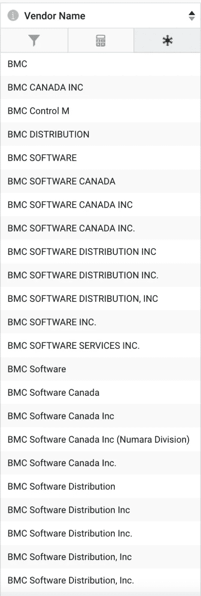
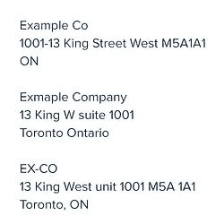

# 主数据管理的实体解析

> 原文：<https://medium.com/nerd-for-tech/entity-resolution-for-master-data-management-5f29f71edde9?source=collection_archive---------19----------------------->

实体解析，也称为记录链接，是从数据中消除真实世界实体歧义的任务。也就是说，它是识别和解决单个实体的多次出现以揭示数据中更清晰的信息画面的过程。这在概念上很简单，但在实践和规模上极难实现，这就是为什么没有很多主数据管理解决方案可用的原因。

> 2019 年，我们组建了 DataLabs 团队来解决这一问题，并为我们的用户提供高性能、灵活、针对其特定用例定制的实体解析工具。

我们的 Namara 平台及其工具套件不断发展，我们的用户除了内部使用的任何数据外，还可以访问超过 250，000 个数据集。面对如此多的数据集，自动化解决数据多样性的过程变得绝对必要。

[一个数据集中的重复记录示例——例如，记录公司名称有很多种不同的方式，因此自动实体解析变得必不可少](https://cdn2.hubspot.net/hubfs/5507284/Screen%20Shot%202019-10-02%20at%2012.11.48%20PM.png)

我们经常会发现需要解析或链接的重复实体，无论是在单个数据源中还是来自多个数据源。一个可靠的实体解析工具对我们的用户来说是至关重要的，这样我们的客户和他们的整个组织就可以获得最精炼和最集中的信息。经过多次尝试和反复(以及一些失败……)之后，我们现在自豪地提供[实体解析](https://www.thinkdataworks.com/products/data-enrichment)作为我们客户的核心丰富服务。

# 为什么有人需要实体解析？

一个典型的数据科学家花费 [80%的时间](https://www.forbes.com/sites/gilpress/2016/03/23/data-preparation-most-time-consuming-least-enjoyable-data-science-task-survey-says/#76e791466f63)在清理和准备数据上。这是一个令人震惊的统计数字。由于产生数据驱动的洞察力需要处理和提炼数据，越来越多的行业正在采用机器学习方法来[提高生产力](https://www.therecord.com/news-story/9593232-waterloo-ai-company-works-with-audi-on-driverless-technology/)。

我们构建了一个内部工具来帮助高效地提炼和管理数据。随着越来越多的数据添加到生态系统中，运营层将这些数据联系在一起的需求变得越来越重要，人类也不可能手动管理这些数据。记录链接有无限的应用，对每个部门都有影响，通过我们当前的客户端部署，我们了解随着数据世界的增长对它的需求。数据是好的，更多的数据是伟大的，但是*连接数据*是从中学习的关键。

# ThinkData 如何解析实体？

对于实体消歧，我们首先对实体类型进行分类(例如，组织、地址等。)并以最适合实体本身的方式预处理数据。数据类型决定了我们如何优化实体中的标记(用于区分输入的字符序列)以及如何分配计算负载。然后，我们将每个特征转换成向量表示，并使用压缩的稀疏矩阵来计算成对相似性，并在图结构上链接重复的实体。

图像中的示例让您了解了科学家在记录单个公司时所面临的差异数据——在单个数据集内或跨多个数据集处理数据时，打字错误、简短形式、遗漏和变化比比皆是。

> 我们没有使用传统的单词嵌入模型，而是设计了自己的嵌入模型，以实现更准确、高效和可扩展的实体解析。

工作负载是使用 Spark 在多个计算节点之间优化分配工作负载，以便用户可以高效地处理大型数据集。

# 大规模连接任意数量来源的数据

随着我们数据种类的增加，我们使用实体解析的数据优化能力也将同步提高。这意味着，数据科学家将拥有一个自动化的解决方案，在数据点之间建立联系，产生强大的主数据记录，从而获得更深入的见解，而不是逐个处理数据集。数据科学家花在准备和处理上的时间越少，他们可以花在实际数据科学上的时间就越多。

# 数据丰富的未来

我们已经实现了我们设定的许多目标，包括在处理脏数据时超越领先的实体解析工具的准确性。然而，这并不意味着我们没有设定新的目标。我们正在努力实现流程的自动化，并创建一个自动化的数据-知识转化渠道。

通过对世界上最大的公共数据目录之一进行培训，我们围绕大多数数据科学家每天面临的真实世界的脏数据环境设计了我们的解决方案。我们不是在一个卫生、合成的环境中构建产品，而是设计工具来快速、有效、大规模地管理和消除数据多样性。

想了解更多关于 [**数据浓缩**](https://www.thinkdataworks.com/products/data-enrichment) ？

[请求咨询我们的数据专家，讨论我们的数据服务以及 ThinkData 的技术如何推进您的项目。如果你有兴趣了解更多，请阅读](https://meetings.hubspot.com/eugene) [**MaRS Discovery District 如何将实体解析应用于安大略省企业**](https://blog.thinkdataworks.com/mars-thinkdata-apply-machine-learning-to-ontario-businesses) 。

*原载于*[***https://blog.thinkdataworks.com***](https://blog.thinkdataworks.com/entity-resolution-for-master-data-management)*。*