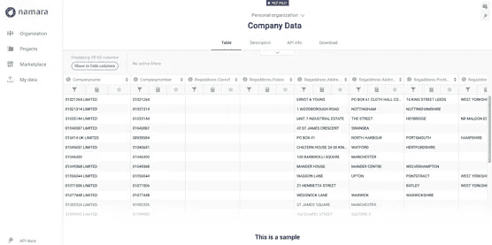
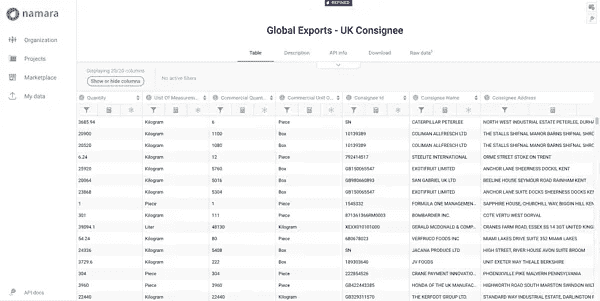
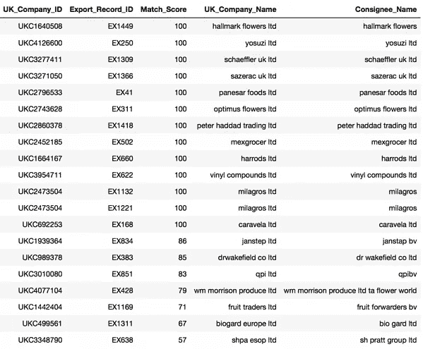
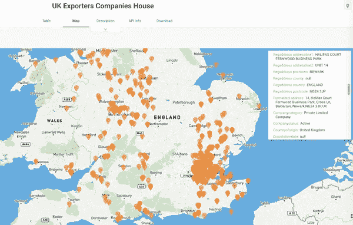

# 实体解析:将贸易数据链接到公司信息

> 原文：<https://medium.com/nerd-for-tech/entity-resolution-linking-trade-data-to-company-information-83848cea0427?source=collection_archive---------16----------------------->

做出明智的商业决策取决于公司有效利用数据的能力。

公司内部数据可以提供很多信息。然而，在一个复杂联系和快速增长的可访问数据海洋的世界中，认为不从[外部数据](https://blog.thinkdataworks.com/how-we-define-external-data)来源中获益就能获得有用和有竞争力的信息是天真的。随着越来越多的数据变得可用，企业正在开发一种新的思维方式。

将外部来源与内部数据相匹配变成了一个[实体解析](https://blog.thinkdataworks.com/entity-resolution-for-master-data-management)和数据关联问题，这是每个行业的企业都在努力回答的问题。在 ThinkData，我们帮助公司发现、管理和利用推动其业务发展的数据。

例如，我们的一个银行客户对获取我们在 [Namara](https://app.namara.io/#/data_sets/464446fb-5bca-46b8-bd84-084005dd5a26) 上提供的新的进出口数据流感兴趣。通过将[外部导入/导出数据](https://blog.thinkdataworks.com/press/thinkdata-announces-partnership-with-geotab)与其内部客户数据关联起来，该银行将能够发现以前不为人知的新客户交易活动，识别真实的资金规模，调查交易趋势，监控增长，绘制客户地图，并最终洞察其业务中以前不透明的部分。所有这些优势都依赖于将银行的内部客户数据链接到由 [ThinkData](https://www.thinkdataworks.com) 提供的外部数据源。

来源: [Unsplash](https://cdn2.hubspot.net/hubfs/5507284/Imported_Blog_Media/frank-mckenna-252014-unsplash.jpg)

## Namara 上的英国公司数据

为了将这个有价值的导出/导入数据馈送链接到银行的内部客户数据，需要第三个外部数据源。这第三个数据源是一个非常有用的英国所有企业的公共存储库，可以链接到外部贸易数据源。这个连接为我们提供了连接银行内部数据的钥匙。该数据集由 ThinkData 收集和整理，可在 [Namara Marketplace](https://marketplace.namara.io/) 上访问。

Namara 平台收集和组织的公司数据样本

英国公司数据集有 55 列约 400 万行公司注册信息，包括基本信息，如[公司名称和地址](https://blog.thinkdataworks.com/press/thinkdata-announces-new-partnership-with-soleadify)。由于一些公司出现在多行中，具有相似的信息，因此需要对数据集进行重复数据删除。在省略了重复的信息之后，我们可以为这个数据集中的每个公司分配一个惟一的 ID，这个 ID 可以在以后连接到导入/导出数据时使用。

## 全球出口数据馈送

让我们考虑一个场景，在这个场景中，我们希望使用出口数据馈送，对英国公司进行过滤，并将这些数据连接到 Namara 上的英国公司信息。首先，我们来看看这个数据集。此数据馈送的一个示例包含 20 个列中的各种交易信息，例如:

*   日期
*   出口商信息(名称、id、地址)
*   收货人信息(姓名、身份证、地址)
*   出口货物的信息(重量、数量、价值等。)
*   等等。

全球出口数据样本被过滤并连接到 Namara 上的英国公司信息

## 结果:将全球出口数据连接到英国公司数据

由于全球出口数据和英国公司数据在某些列中都缺少信息，我们决定使用英国公司数据中的公司名称字段。此外，我们使用出口数据馈送中的收货人姓名(代表参与交易的英国公司)字段来建立连接。

因为这两列总是在两个数据集中填充，所以连接这些数据集的第一次尝试是基于匹配这些非结构化文本字段。

非结构化文本字段可以包含任何内容，不一定是清晰记录的公司名称。

第一步是执行所需的预处理步骤，为匹配管道准备好这些数据集。我们设计并实现了一个[模糊匹配](https://www.quora.com/What-is-fuzzy-matching-How-does-it-work)算法，包括以下步骤:

1.  使用索引算法来提取相似字段的良好子集。这有助于算法的性能，并通过从两个更可能匹配的数据集中选择对来节省时间。
2.  然后通过文本匹配算法处理候选对。我们的方法分解了名称，并考虑了特定名称可能出现的许多不同场景。该算法计算全球出口数据集中的每条记录与其在英国公司数据中最接近的匹配项的匹配分数。
3.  生成的分数反映了匹配的概率，然后用于提取最可能的匹配。
4.  最终结果将是带有额外列的全球出口数据集，该列具有英国公司数据集中相应公司的唯一 ID。

下图显示了 20 个随机选择的记录以及相应的匹配分数。我们可以看到，分数恰当地反映了匹配的置信度，匹配算法对小的错别字和[变化](https://blog.thinkdataworks.com/etl-vs-data-prepation-what-are-the-differences)有很好的容忍度。

带有相应匹配分数的记录样本

基于这个 ID，这两个数据集然后被链接和摄取到 Namara。银行客户可以使用生成的数据集将这些信息与他们自己的内部客户数据合并。

该流程将新的交易级别数据添加到银行的内部数据中，为他们提供关于其当前和潜在客户的有竞争力和有价值的信息；在链接到 Namara 上的对外贸易和公司数据集之前无法获得的信息。这不仅有助于他们了解谁与贸易有联系，他们在哪里，而且还有助于他们进口/出口什么，以及进口/出口多少。

在纳马拉创建的英国出口商公司的地图

## 数据驱动的价值

对于现代公司来说，[数据是开启重大机遇](https://blog.thinkdataworks.com/two-business-principles-to-get-the-most-out-of-data)，更好地了解你的市场，开发高级分析的关键。随着我们走向[人工智能和 ML 驱动的技术](https://blog.thinkdataworks.com/solving-challenges-in-enterprise-ai)，洞察力的质量将反映在所使用的数据的质量上。通过[用外部数据丰富公司内部数据，](https://blog.thinkdataworks.com/get-better-access-to-better-data-through-the-namara-marketplace-1)快速发展的企业正在建立一个管道，可以按需提供可操作的信息，为他们提供发展业务所需的时间和资源。

想了解更多关于 [**er**](https://www.thinkdataworks.com/products/entity-resolution) ？

[**请求咨询**](https://meetings.hubspot.com/eugene?__hstc=82057097.c44170329b0f6a24ca43003f609ef893.1609787358702.1617650602615.1617722232710.147&__hssc=82057097.1.1617722232710&__hsfp=3059880169) 我们的一位数据专家，讨论我们的实体解析工具包以及 [**ThinkData 的技术**](https://www.thinkdataworks.com/) 如何推进您的项目。如果你有兴趣了解更多，请阅读《火星探索区如何将 er 应用于安大略企业》。

*原载于*[*https://blog.thinkdataworks.com*](https://blog.thinkdataworks.com/linking-trade-data-company-information)*。*