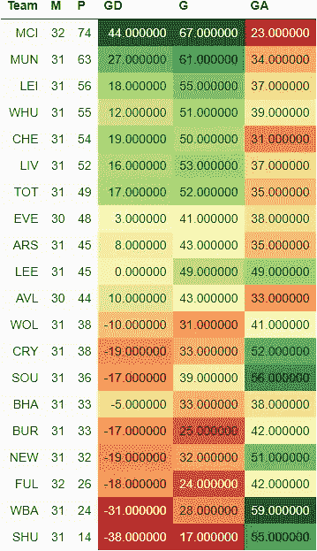
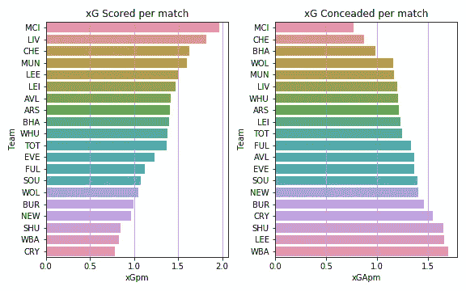
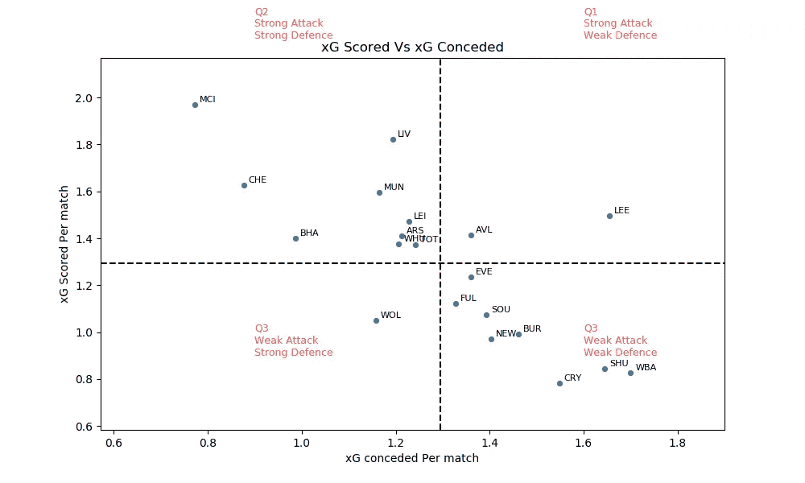
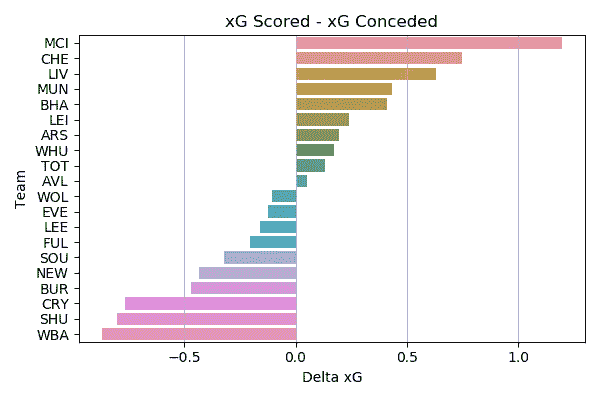
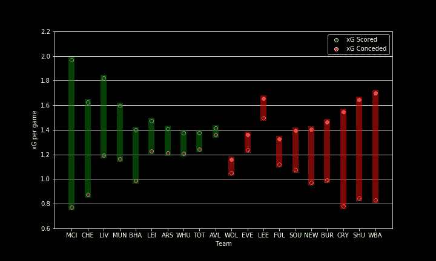
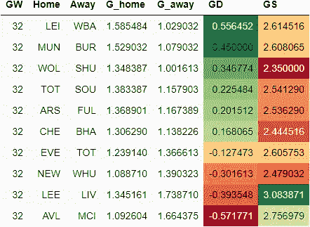
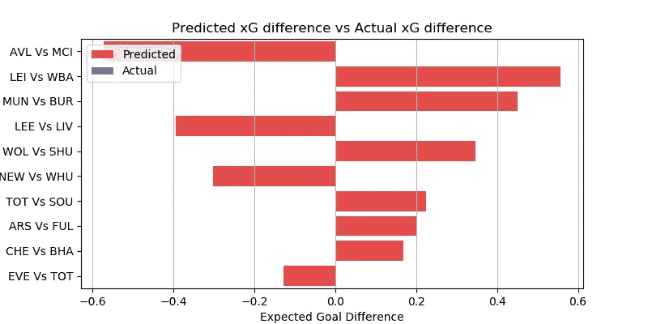
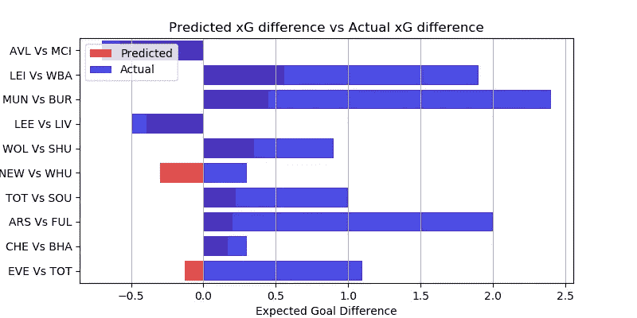

# EPL 分析和 GW 32 预测

> 原文：<https://medium.com/nerd-for-tech/epl-analysis-and-gw-32-prediction-d2930bad217?source=collection_archive---------17----------------------->

## 使用 xG 统计数据预测英超联赛结果的数据驱动尝试

这是我的 EPL 预测系列的一篇文章。你可以看看对第 31 周比赛的预测，以及它与实际表现的对比。

[预期目标或 xG](/@abhijithchandradas/xg-xplained-27b1dbafa943) 是用于预测的参数。如果你对理解预测算法感兴趣，我推荐你去看看[这篇文章，里面有详细的解释](https://towardsdatascience.com/epl-2020-21-season-analysis-and-prediction-5502e20dce26)。

 [## xG 解释！

### 如果你关注足球，你不可能从未遇到过“预期目标”(缩写为 xG)这个术语。xG…

abhijithchandradas.medium.com](https://abhijithchandradas.medium.com/xg-xplained-27b1dbafa943) 

# 截至第 31 周比赛的分析

GW31 后的 EPL 表(图片由作者提供)

在第 31 周的比赛中，尽管库珀早早吃到红牌，利兹联还是结束了曼城的 24 场联赛不败纪录。曼城依然以 74 分高居榜首。他们领先同城对手曼彻斯特联队 11 分，位居第二。

曼联以 1 比 3 击败热刺，将他们推到联赛第 7 名。

莱斯特城和西汉姆联队之间的榜首大战被预测为本周比赛中最激烈的比赛。铁锤帮在比赛中获胜，让狐狸队连续第二次失败。然而，前四名保持不变，铁锤帮将差距缩小到一分。蓝军以 54 分紧随铁锤之后，仅落后一分。

利物浦队在安菲尔德对阵比利亚斯队时拿到了 3 分。红军在热刺对曼联丢分的情况下升至第六位。然而，安切洛蒂的埃弗顿没能利用热刺在与海鸥的平局中丢分的机会。

枪手和孔雀各得 45 分，在赢得各自的比赛后都处于上半区。

莫耶斯所在的维拉本打算进入前四，但现在已经被挤出了上半区，杰克·格里利什的缺席影响了他们的表现。

在积分榜的末尾，刀片队承认了又一次失败，这次是 0-3 输给了枪手。他们实际上已经降级，落后纽卡斯尔联队 18 分，排在第 17 位。距离安全区 8 分的麻雀队在最近两场比赛中连续获胜。与此同时，富勒姆在 18 个位置上，尽管打得很好，却承认了背靠背的失败。

得到 33 分的海鸥和红葡萄酒离危险区还有 7 分。

xG 每场得分和失球(图片由作者提供)

在 31 个比赛周之后，曼城统治了进攻和防守，因为它拥有最高的 xG 得分和最低的 xG 失球率。就 xG 得分而言，红军仍处于第二的位置。紧随其后的是场均得分超过 1.5 xG 的蓝军和红魔。

麻雀队，由于他们在最近两场比赛中的表现，在 xG 得分方面并不是最后一支球队。水晶宫是每场比赛 xG 得分最少的球队。谢菲尔德、纽卡斯尔和伯恩利的场均得分也都低于 1 xG。

曼城场均失球约 0.75 xG，尽管在最近的比赛中丢了几个球，但似乎是最好的防守单位。图切尔的切尔西紧随其后，位居第二。海鸥是另一支每场比赛失球少于 1 xG 的球队。

大多数球队每场比赛承认 1 到 1.5 xG。西布朗、谢菲尔德联队、利兹联和皇宫队未能阻止他们的对手创造进球机会，每场比赛失球超过 1.5 克。

xG 得分 vs xG 失球(图片由作者提供)

根据 xG 得分和 xG 失球，球队可以分为 4 个象限，如上图所示。
水平虚线表示每场比赛的平均 xG 得分。水平虚线上方的球队是强攻方，下方的球队是弱攻方。
垂直虚线显示每场比赛的平均 xG 失球。左边的队伍防守强，右边的队伍防守弱。

Delta xG(图片由作者提供)

曼城在 delta xG 方面遥遥领先于其他球队，xG 得分和 xG 失球之间的差距超过 1。利物浦和切尔西是仅有的另外两支 delta xG 高于 0.5 的球队。另一方面，西布朗在球场的两端苦苦挣扎，进攻最弱，防守漏洞百出。水晶宫、谢联、伯恩利在达美 xG 下排名也很靠后。

Delta xG(图片由作者提供)

利兹联队在每场比赛创造的 xG 中名列前茅。然而，球队的 delta xG 是负的，因为对手发现很容易穿透利兹的防守，这是贝尔萨必须立即研究的问题。
另一方面，狼队是一支防守不错的球队，但由于劳尔·吉米内兹的受伤，他们缺乏攻击力。

布莱顿按照 delta-xG 排名表排在第 5 位，然而他们在排名表中排在第 15 位，因为他们缺乏高质量的前锋。

# 游戏第 32 周预测

在进行预测之前，让我澄清一下，这是一个非常简单的算法，只是基于过去的 xG，所以只能预期基线性能。该算法也不能预测高得分游戏。该模型也没有考虑球队的选择，球员因受伤/停赛而缺席，阵型，战术变化等。

然而，该模型在预测比赛的势头方面表现得相当好。你可以在下面看看实际表现如何与前一周的预测相比较。

 [## EPL 分析和 GW 31 预测

### 使用 xG 统计数据预测英超联赛结果的数据驱动尝试

abhijithchandradas.medium.com](https://abhijithchandradas.medium.com/epl-analysis-and-gw-31-prediction-8f98ff1aefd) 

下表提供了对第 32 周比赛的预测。
GD 的绝对值显示了比赛的竞争力。该值越高，预计匹配越偏向一侧，预测的准确性也越高。GD 值越低，这场比赛就越可能是任何人的游戏。GD 的正值表示主场胜，负值表示客场胜。

预测结果(图片由作者提供)

游戏周 32 没有任何竞争非常激烈(delta xG 小于 0.10)且完全一边倒(delta xG 大于 0.70)的比赛。
曼城和莱斯特有很大的机会在本周末分别对阵维拉和西布朗维奇的比赛中拿到 3 分。

曼联和狼队很有可能赢得主场比赛，而利物浦和西汉姆则有望在客场拿到三分。

热刺和枪手在主场对圣徒和富勒姆有很好的机会。

蓝军可以期待来自桥上海鸥的激烈竞争。然而，该算法预测蓝调会比客队有优势。

第 32 周的比赛对马刺来说是双周比赛。他们与太妃糖的第二场比赛预计将是本周比赛中最激烈的比赛。然而，算法显示穆里尼奥的球队比安切洛蒂的球队略占优势。

Delta xG 预测值(图片由作者提供)

# 更新:预测与实际结果

预测与实际结果(图片由作者提供)

该算法准确预测了比赛周总共 10 场比赛中的 8 场比赛的方向，对于这样一个简单的算法来说这是非常好的。更有趣的是，在预测的 delta-xG 超过 0.2 的匹配中，该算法的准确率为 87.5%。算法不能正确预测的比赛是纽卡斯尔联队和西汉姆联队之间的比赛。这是令人惊讶的胜利，为保级战斗的纽卡斯尔联队对西汉姆联队，这是着眼于第四名的位置。

## 成为会员

我希望你喜欢这篇文章，我强烈推荐 [**注册*中级会员***](https://abhijithchandradas.medium.com/membership) 来阅读更多我写的文章或成千上万其他作者写的各种主题的故事。
[你的会员费直接支持我和你看的其他作家。你还可以完全访问媒体上的每个故事。](https://abhijithchandradas.medium.com/membership)

帕斯卡·米勒在 [Unsplash](https://unsplash.com?utm_source=medium&utm_medium=referral) 上的照片