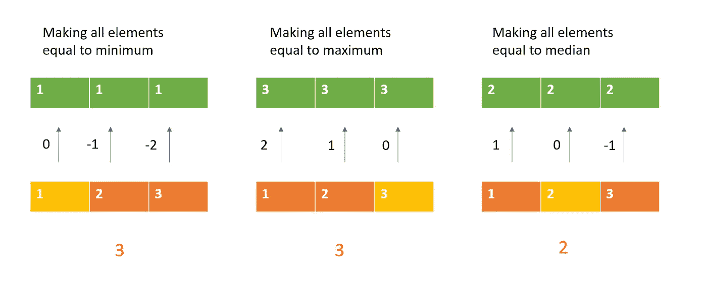

# 相等数组元素—每日挑战可能

> 原文：<https://medium.com/nerd-for-tech/equal-array-elements-daily-challenge-may-d2ddfd3e32ab?source=collection_archive---------19----------------------->


[粘土银行](https://unsplash.com/@claybanks?utm_source=unsplash&utm_medium=referral&utm_content=creditCopyText)在 [Unsplash](https://unsplash.com/s/photos/equal?utm_source=unsplash&utm_medium=referral&utm_content=creditCopyText) 拍摄的照片

今天的问题来自每日 Leetcode 编码挑战赛——五月版。这是一个中等标签的问题。让我们看看问题陈述。

## 462。最小移动到相等数组元素 II

给定一个大小为`n`的整数数组`nums`，返回*使所有数组元素等于*所需的最小移动次数。

在一次移动中，你可以通过`1`增加或减少数组中的一个元素。

## 示例:

```
**Input:** nums = [1,2,3]
**Output:** 2
```

我们可以使所有的数等于一个特殊的数。该特殊号码可以是列表的最大号码，也可以是列表的最小号码。它也可以是列表的中间值。在尝试这些选项时，我们看到中间数总是给出最少的步骤。



使所有数组元素等于中值所需的移动是**向上移动所需的移动，即从左端增加**的数字，和**向下移动所需的移动，即从右端减少**的数字，直到所有数字都相等。

一旦我们决定了中值，我们只需计算目标和当前 num 之间的绝对差值的总和，并得到所有这些差值的总和。这将给出所需的最少步骤。我们不采用平均值，因为[1，0，0，8，6]平均值将导致 16(2+3+3+5+3)步，而中值将采取 14(0+1+1+7+5)步。

## 代码实现:

```
def minMoves2(nums):
    nums.sort()
    target = nums[len(nums)//2]
    res = 0
    for n in nums:
        res += abs(target-n)
    return res
```

## 复杂性分析:

*   时间复杂度:O(N*logN) *用于数组排序。*
*   空间复杂度:O(1)

编码快乐！！