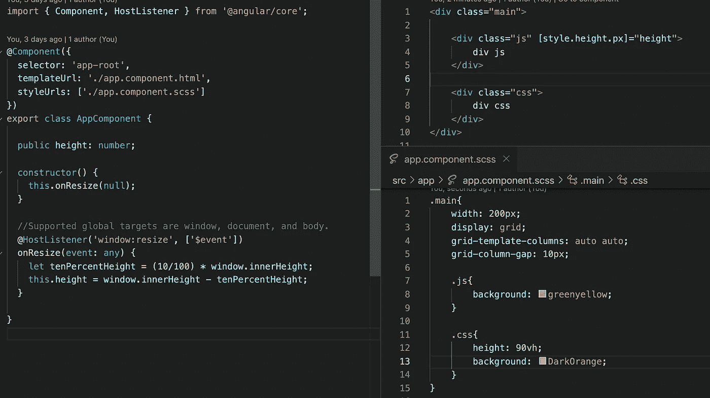

# div 和浏览器窗口大小相等。

> 原文：<https://medium.com/nerd-for-tech/equal-size-of-div-and-window-browser-d88ed46eac68?source=collection_archive---------5----------------------->

有时您需要为 div 和窗口设置相同的高度。我们可以通过使用 JS 或 CSS 来实现。

JS 方法监听组件中的窗口调整事件。每次当用户改变窗口大小时，我们都会得到通知。我们将新的高度值设置为绑定到样式的变量。

CSS 方法在 VH 测量中使用高度属性。VH 和 VW 是用户屏幕总宽度(VW)或高度(VH)的百分比。在这种情况下，尺寸会自动调整到屏幕的大小。

如果你需要仔细看看这个项目[，这里是链接](https://github.com/8Tesla8/dynamic-resize)。

*原载于 2021 年 11 月 19 日*[*【http://tomorrowmeannever.wordpress.com】*](https://tomorrowmeannever.wordpress.com/2021/11/19/equal-size-of-div-and-window-browser/)*。*