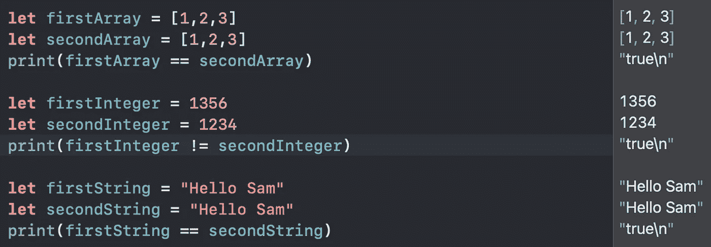
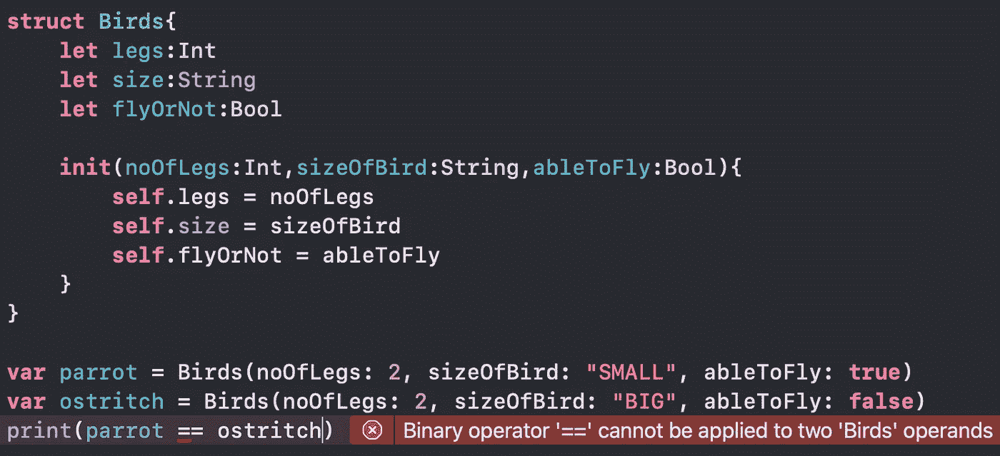
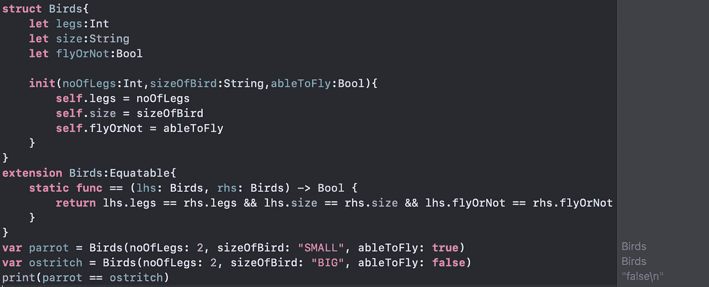
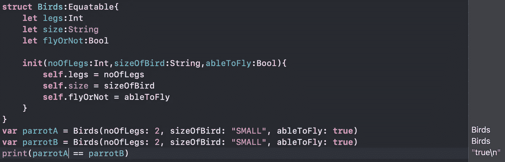
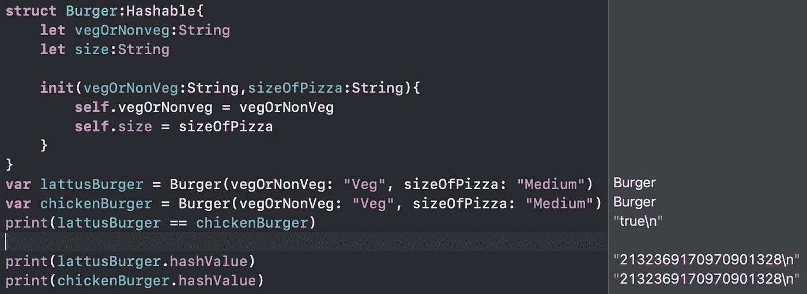
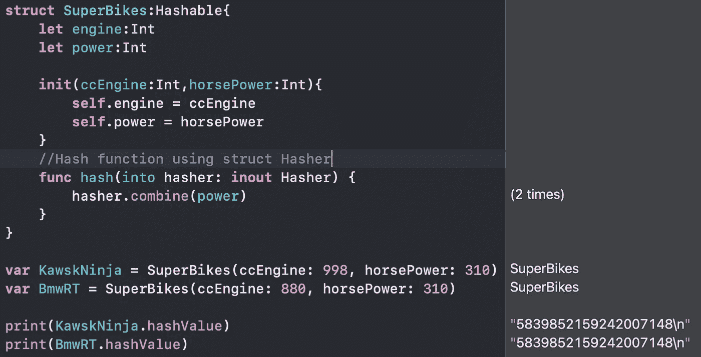
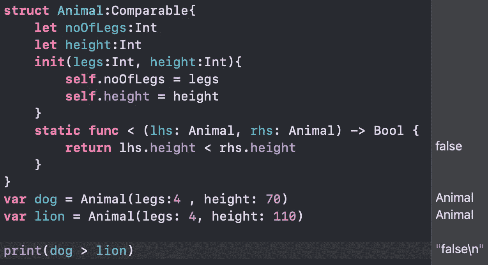

# 等价的、可散列的和可比较的

> 原文：<https://medium.com/nerd-for-tech/equatable-hashable-and-comparable-d782449f6ce8?source=collection_archive---------0----------------------->

仅仅通过遵守一些协议，您就可以完成许多基本任务，这难道不令人惊奇吗？让我们来看看一些基本的协议，今天我们将讨论等价的，可比较的和可散列的协议。

# 等价的

符合**等价**协议的类型可以使用等于运算符(==)比较相等性，或者使用不等于运算符(！idspnonenote)比较不相等性。=).默认情况下，swift 中的许多类型符合公平协议，如整数、字符串、双精度、浮点、数组、双精度。

(本质上默认符合等价协议的类型。)

在第一段中发生了什么，编译器检查第一个数组和第二个数组是否相同，当它们相同时返回 true，但是在第二段中，它检查第一个整数和第二个整数，它们是否不相等，当它们不相同时返回 true。

到目前为止，这已经很清楚了，不是吗？现在让我们来看看如何将这个协议用于自定义类型，如 struct、class、enum。

(检查自定义结构类型的两个实例)

看看这里发生了什么，我们正在检查 **Birds** 类型的 parrot 和鸵鸟实例的相等性，但是编译器却在大喊不能对两个 Birds 类型使用二元运算符==了。那么为什么要这样呢？因为鸟型不符合**等价的**协议。现在让我们实现等价的协议并检查。

(符合公平协议后检查自定义结构类型的两个实例)

在符合等价协议之后，有一个为此协议提供的静态函数，我们编写并检查两个实例的每个属性，并基于条件返回值，作为输出，我们得到 false，因为基于它们的每个属性，它们不相等。

然而，实现等价协议和编写静态函数== 并检查两个实例的每个属性有时会很烦人。

瞧，Swift 4.1 可以为 **Equatable、**合成一致性，它可以自动生成一个 **==** 方法，将一个值中的所有属性与另一个值中的所有属性进行比较，就像上面一样。因此，您现在所要做的就是添加**equivalable**作为您的类型的协议，剩下的工作 Swift 会完成。这样的自动化是不是很棒😁。

(使用等价协议不写静态函数==)

看，这和以前一样，但是我们不需要写静态函数，如果有必要检查一些不同的条件，那么你可以在 **static function ==** 中写这样的条件，这完全取决于你。

# 易消化的

这是从 equatable 继承而来的另一个协议，通过符合该协议，您将获得特定实例的整数类型的哈希值，任何符合 Hashable 的类型也必须符合 Equatable。

**Hashable** 是 Swift 最重要的协议之一，但它经常被忽视。每次创建字典或集合时都会用到它，因为这些类型会创建数据的散列来确定数据应该存储在哪里。

哈希是唯一的字符串或数字，当您想要识别或比较事物而不是比较原始形式的数据时，这非常方便。

一个**哈希值**是一个整数，对于任何两个同等比较的实例都是相同的，让我们以**为例**并取两个相同类型的实例`a`和`b`，如果`a == b`则`a.hashValue == b.hashValue`。反之则不然，两个具有相同哈希值的实例不一定相等，这种情况称为**哈希冲突，**等一下，我会向你们解释这个问题 **✌.**

让我们在这里讨论一下在上面的例子中发生了什么，我们将 hashable 协议的一致性赋予了 **Burger** 类型，因为 hashable 是从 equatable 继承的，swift 编译器检查每个属性，并在我们检查它们是否相等时给我们一个真值。因为它们相等，所以两个实例具有相同的哈希值。为了得到哈希值，你不需要写任何代码，在 hood 编译器后面会计算哈希值并返回给我们。

## swift 4.2 中 Hashable 有哪些改进？

从 swift 4.2 开始，编译器使用一个名为 **SipHash** 的伪随机函数，这是专门设计的，因此攻击者无法提前预测给定对象的哈希值。这就是为什么苹果公司建议“哈希值不能保证在程序的不同执行中是相等的”。不要保存哈希值以供将来执行时使用。。这意味着每次为特定实例生成哈希值时，它都是一个新值。是不是一件很牛逼的事情？😎

虽然，如果你想实现你的散列，例如，如果你的类型有许多属性，但你知道其中一个足以唯一地标识它——你仍然需要实现一个`**hashValue**`方法，使用你认为最好的算法。看看下面的场景。

让我们来讨论一下这里发生了什么，我们已经编写了一个超级摩托车的结构，并创建了两个实例，一个是川崎忍者，另一个是宝马，我们在这里的要求是，我们将只根据它们的功率属性来比较它们的相等性，而不是所有属性。这就是为什么我们实现了**func hash(into Hasher:inout Hasher)()，**在这里，我们专门只组合了 **power** 属性，这样，无论将生成什么哈希值，如果两者的 power 属性相等，它们都将相等。这里我们得到两辆自行车的哈希值相同，因为它们的功率属性匹配。

如果我们不想实现我们的要求，那么我们不必编写 func hash(into Hasher:inout Hasher)()，swift 编译器会在代码后面完成它的工作。让我们检查一下**哈希科利森**。

因此，这里我们得到了两个实例相同的哈希值，但是如果我们检查相等性，它将返回 false，因为它们的每个属性都不相等，这被称为**哈希冲突**。

# **可比**

按照命名约定，使用这个协议，您可以比较您的自定义类型。**可比**协议允许用户使用<、>、< =和> =符合数据类型的运算符。Swift 的大多数内置类型都支持类似于 Int、Float、String 等的**类型，但是如果你希望你的类型符合它们，那么你需要在<、>、< =、> =之间实现，这样 Swift 就可以在这四个操作符之间提供默认实现。让我们举一个例子来明确不理解。**

(类似协议的实际实施)

在上面的例子中，我们已经将 **Comparable** 协议与 **Animal** 类型一致，并且想要根据动物类型的高度来比较它们的实例，因此我们编写了**static func>(lhs:RHS:)**。因为狮子比狗高，所以编译器给我们错误的输出。

类似地，您可以使用，< =, and > =中的任何操作符来比较您的自定义类型的实例。

就这样了，伙计们，谢谢你们和我在一起。希望你明白这些协议。祝你愉快👽。