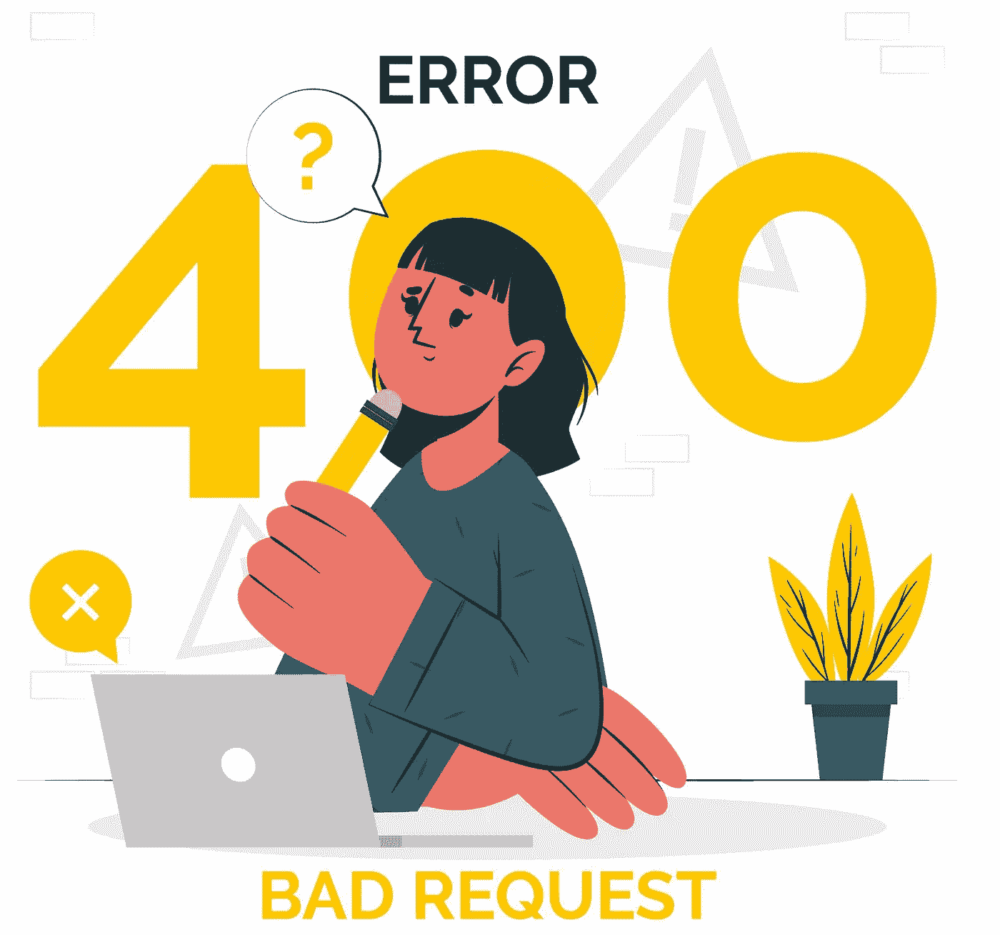
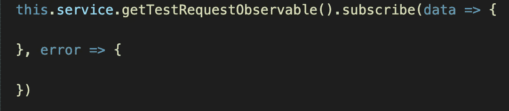
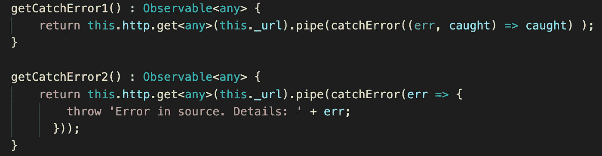
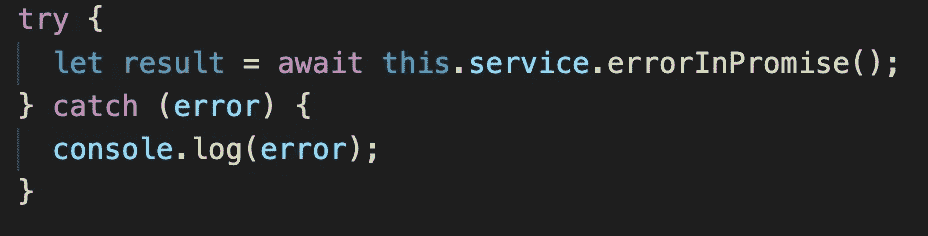
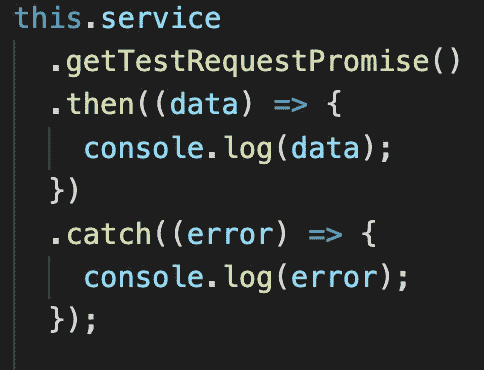
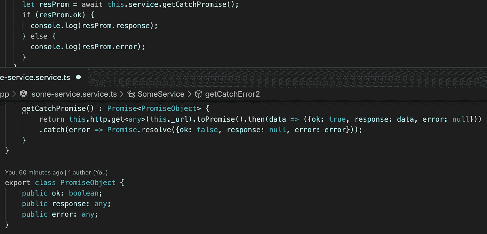

# Observable、Promise 和 Async/await 中的错误处理。

> 原文：<https://medium.com/nerd-for-tech/error-handling-for-http-requests-in-javascript-d38b959b2603?source=collection_archive---------0----------------------->

## JavaScript 中的 HTTP 请求

每个项目都必须发出 HTTP 请求，当然，其中一些请求可能会有错误。我们需要知道如何处理这些错误。

因为我们在讨论 HTTP 请求，所以我需要提到 Observable。

标准的方法是为错误创建一个回调函数。

另一种方法是制作一个管道，并使用 RxJS 库中的 [catchError](https://rxjs.dev/api/operators/catchError) 。此时，我们可以在 catchError 中捕获并处理一个错误，或者用我们的描述抛出一个新的错误。

Try/catch 使用了一种现代的方法——异步/等待。我们只需在 try 块中调用。如果 catch 块出错，我们将处理一个错误，这里没有回调。

Async/await 正在使用 Promise。在 Promise 中，我们还可以使用回调函数来处理错误。

我们可以将回调函数与现代的 async/await 结合起来。从两个世界中得到最好的东西。在 HTTP 方法内部，我们添加了回调函数来处理成功的响应和出错的响应。这些句柄应该返回带有数据或错误的相同对象。有了这些改进，我们可以使用 async/await。

现在，您可以找到满足您需求的最佳解决方案。

如果你需要仔细看看这个项目[，这里是链接](https://github.com/8Tesla8/async-await-error-handling-in-js)。

*原载于 2022 年 4 月 4 日 http://tomorrowmeannever.wordpress.com***。**