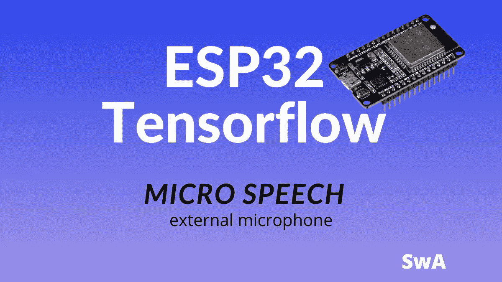

# 带外置麦克风的 ESP32 Tensorflow 微型语音

> 原文：<https://medium.com/nerd-for-tech/esp32-tensorflow-micro-speech-with-the-external-microphone-92e9823ba86d?source=collection_archive---------9----------------------->



本教程涵盖**如何将 Tensorflow micro speech 与 ESP32** 和外置麦克风 I2S 配合使用。换句话说，我们想要定制 Tensorflow micro speech 示例，以便它可以在使用 I2S 协议连接到外部麦克风的 ESP32 上运行。本例中，我们将使用连接到 ESP32 的 INMP441 来捕捉音频。虽然 ESP32-EYE 有内置麦克风，但如果我们想在 ESP32 上使用 Tensorflow micro speech，我们需要一个支持 I2S 的外置麦克风。此外，在本教程中，我们将使用一个自定义模型，以便带有 INMP441 的 ESP32 不仅可以识别是或否单词，还可以识别其他单词。

# 设置编译和运行 Tensorflow micro speech 的环境

在编译和执行微语音代码之前，需要安装和配置环境。

# 安装和配置 ESP-IDF

要安装 ESP-IDF，您有两种不同的选择:

*   遵循 ESP-IDF 指南进行安装。在这种情况下，你必须遵循这个[指南](https://docs.espressif.com/projects/esp-idf/en/latest/esp32/get-started/#get-started-get-prerequisites)。
*   否则，您可以安装 ESP-IDF 作为 PlatformIO 插件，该插件将指导您完成所有步骤

# 克隆 Tensorflow 存储库

下一步是克隆 Tensorflow 存储库，这样我们就可以修改 Tensorflow 微型语音代码，以支持 I2S 外置麦克风，在本例中为 INMP441。要克隆存储库，您可以使用以下命令:

```
git clone https://github.com/tensorflow/tensorflow.git
```

现在你有了源代码，所以我们可以定制代码。在接下来的步骤中，我们将遵循 Tensorflow [Github](https://github.com/tensorflow/tensorflow/tree/master/tensorflow/lite/micro/examples/micro_speech#deploy-to-esp32) 中涵盖的步骤。

# 为 ESP32 准备 Tensorflow 微型演讲

打开命令外壳并生成源代码:

```
make -f tensorflow/lite/micro/tools/make/Makefile TARGET=esp generate_micro_speech_esp_project
```

现在移到以下目录下:

```
tensorflow/lite/micro/tools/make/gen/esp_xtensa-esp32_default/prj/micro_speech
```

这是 Tensorflow 微型语音源代码，我们将对其进行修改，以使用带有 I2S 麦克风的 ESP32。如 Github 中所述，为了支持外部麦克风，有必要修改类`audio_provider.cc`。

# 如何将 ESP32 连接到 I2S INMP411 话筒

现在我们可以将 ESP332 连接到 I2S 的 INMP411:

ESP32 引脚→inmp 411
Vcc→Vdd
GND→GND
33→标清
26 → SCK
25 → WS

# 修改 Tensorflow 以支持外部麦克风

是时候修改类`audio_provider.cc`来支持连接到 ESP32 的 INMP411 了。转到:

```
micro_speech/esp-idf/main/esp
```

打开`audio_provider.cc`,通过添加以下几行来修改它:

```
// I2S Microphone PIN 
#define I2S_WS 25 
#define I2S_SD 33 
#define I2S_SCK 26
```

查找以下行:

```
i2s_pin_config_t pin_config = { 
 .bck_io_num = 26, // IIS_SCLK 
 .ws_io_num = 32, // IIS_LCLK 
 .data_out_num = -1, // IIS_DSIN 
 .data_in_num = 33, // IIS_DOUT 
};
```

并用以下代码行替换它们:

```
i2s_pin_config_t pin_config = { 
  .bck_io_num = I2S_SCK, 
  .ws_io_num = I2S_WS, 
  .data_out_num = -1, 
  .data_in_num = I2S_SD 
};
```

仅此而已。我们现在可以将 ESP32 Tensorflow micro speech 与外置麦克风 INMP411 配合使用。

# 在 ESP32 上测试微语音代码

我们现在可以使用以下命令编译并运行代码:

```
idf.py build idf.py -p /dev/tty.SLAB_USBtoUART flash idf.py --port /dev/tty.SLAB_USBtoUART monitor
```

将端口更换为您电脑中使用的端口。现在，您可以说出是或否，并使用 Tensorflow 和 ESP32 测试语音识别。

**更多资源**:

[如何配合 KNN 使用 ESP32 识别物体](https://www.survivingwithandroid.com/esp32-machine-learning-knn-classifier-tcs3200/)
[如何使用 PlatformIO](https://www.survivingwithandroid.com/run-tensorflow-lite-esp32-platformio/)
[在 ESP32 上编译运行 Tensorflow 如何使用 ESP32-CAM 和 Tensorflow.js 识别物体](https://www.survivingwithandroid.com/esp32-cam-object-detection-tensorflow-js/)

# 如何通过 ESP32 Tensorflow micro speech 使用自定义模型

如果你喜欢使用自定义模型，你必须建立自己的模型并训练它。为此，您可以使用这个 [colab 代码](https://colab.research.google.com/github/tensorflow/tensorflow/blob/master/tensorflow/lite/micro/examples/micro_speech/train/train_micro_speech_model.ipynb)。我们在过去训练了一个模型，它能够识别四个不同的单词:

*   去
*   停止
*   左边的
*   正确

如果你想知道如何做到这一点，你可以阅读我的教程涵盖[如何使用与 Arduino Nano 33 BLE](https://www.survivingwithandroid.com/arduino-machine-learning-edge-impulse-keywords-detection/)tensor flow。在本教程中，我们简单地将这个自定义 Tensorflow lite 模型与 ESP32 一起使用。打开文件`micro_model_settings.cc`,用以下几行替换内容:

```
#include "micro_model_settings.h"  
const char* kCategoryLabels[kCategoryCount] = {     
  "silence",    
  "unknown",    
  "go",    
  "stop",     
  "left",     
  "right", 
};
```

接下来，打开文件`micro_model_settings.h`,寻找下面一行:

```
constexpr int kCategoryCount
```

并替换为:

```
constexpr int kCategoryCount = 6;
```

最后把这个[文件](https://github.com/survivingwithandroid/Arduino-Machine-Learning/blob/master/model.cc)的内容复制到`model.cc.`

仅此而已。重新编译代码并运行它。现在你的 ESP32 可以识别四个不同的单词。

# 包扎

在这篇文章的最后，我们已经介绍了如何使用 ESP32 Tensorflow micro speech。我们已经了解了如何使用 ESP32 Tensorflow micro speech 支持外部麦克风。此外，我们还扩展了 ESP32 示例，使用定制的 Tensorflow lite 模型，以便带有 I2S INMP411 的 ESP32 可以识别几个单词。您可以开发您的自定义 Tensorflow 模型以在您的 ESP32 上运行。

*原载于 2021 年 2 月 9 日*[*【https://www.survivingwithandroid.com】*](https://www.survivingwithandroid.com/esp32-tensorflow-micro-speech-i2s-external-microphone/)*。*