# 数据评估的基本统计

> 原文：<https://medium.com/nerd-for-tech/essential-statistics-for-data-assessment-4f47d9cf03e9?source=collection_archive---------9----------------------->


在本文中，我们将了解用于数据评估的**基本统计数据**，通常也称为**描述性统计数据**。描述性统计提供数据集的简单、定量的摘要，通常与图表相结合。正如我们将很快看到的，它们可以展示集中化的趋势，提供特性可变性的度量，以及更多其他方面。

请注意，还有另一种统计，称为**推断统计**，它试图从生成数据集或从中取样的人口分布中获取信息。这里，我们假设数据覆盖了整个人口，而不是从分布中抽样的子集。

我们将讨论的主题包括:

*   对数字和分类变量进行分类
*   理解均值、中位数和众数
*   了解方差、标准差、百分位数和偏斜度
*   知道如何处理分类变量和混合数据类型
*   使用二元和多元描述性统计。

使用 Python 提供了实际的例子，Python 可能是数据科学中最流行的编程语言。

# **对数字和分类变量进行分类**

描述性统计都是关于**变量**的。您必须知道您所描述的是什么，才能定义相应的描述性统计。

在其他文献中，变量有时被称为**特征**或**属性**。它们的意思都一样:表格数据集中的一列。

在本节中，您将检查两个最重要的变量类型，**数值型**和**分类型**，并学习区分它们。分类变量是*离散的*，通常代表一个项目的分类属性。数值变量是*连续的*，并且是定量描述的。适用于一种变量的描述性统计可能不适用于另一种变量，因此区分它们先于分析。

## **区分数值变量和分类变量**

为了理解这两类变量之间的差异，我将使用美国农业部发布的人口估计数据集的例子。它包含 2010 年至 2018 年美国县一级的估计人口数据。可以从官网获取数据，[https://www . ers . USDA . gov/data-products/county-level-data-sets/download-data/](https://www.ers.usda.gov/data-products/county-level-data-sets/download-data/)。

以下 Python 代码片段加载数据并检查前几行:

```
import pandas as pd
df = pd.read_excel("PopulationEstimates.xls",skiprows=2)
df.head(8)
```

输出是一个超过 140 列的表。下面是显示开始列的屏幕截图:

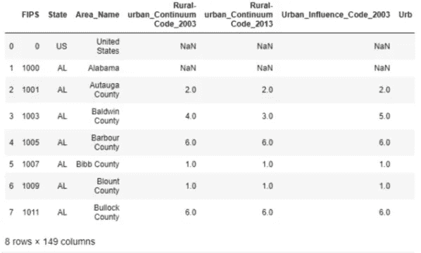

**图 dfad()输出的前 6 列**

在数据集中有一个变量叫做*农村-城市 _ 连续体代码 _2013* 。它接受整数值。这导致熊猫自动解释这个变量；熊猫会自动将其解释为数字。然而，相反，变量实际上是绝对的。

> **你应该永远信任图书馆吗？**
> 
> 不要总是相信 Python 库给你的函数。他们可能是错的，开发者，也就是你，要做最后的决定。

经过一番研究，我们在这个页面上找到了变量描述:[https://www . ers . USDA . gov/data-products/rural-urban-continuum-codes/](https://www.ers.usda.gov/data-products/rural-urban-continuum-codes/)。

根据 2013 年发布的代码标准，*Rural-urban _ Continuum _ Code _ 2013*变量表示一个地区的城市化程度。

农村-城市 _ 连续体代码 _2013 的含义如图 2 所示。

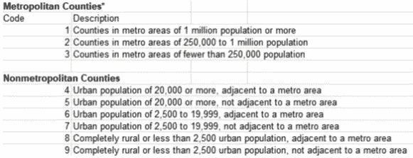

**图 2 -城乡代码解读 _2013**

> **注**
> 
> Pandas 对变量类型进行智能的自动解释，但它经常是错误的。由数据科学家来研究变量类型的确切含义，然后更改它。

许多数据集使用整数来表示分类变量。将它们视为数值可能会导致机器学习等下游任务的严重后果，这主要是因为数值之间的人为*距离*将被引入。

另一方面，数值变量通常具有*直接*的数量意义。例如，R_NET_MIG_2013 表示特定区域 2013 年的净移民率。这个数字变量的直方图给出了美国移民趋势的更具描述性的总结，但是除了简单的计数之外，绘制代码没有什么意义。

让我们用下面的代码片段来查看 2013 年的净移民率:

```
plt.figure(figsize=(8,6))
plt.rcParams.update({'font.size': 22})
plt.hist(df["R_NET_MIG_2013"],bins=np.linspace(np.nanmin(df["R_
NET_MIG_2013"]),np.nanmax(df["R_NET_MIG_2013"]),num=100))
plt.title("Rate of Net Immigration Distribution for All
Records, 2013");
```

结果如下所示。

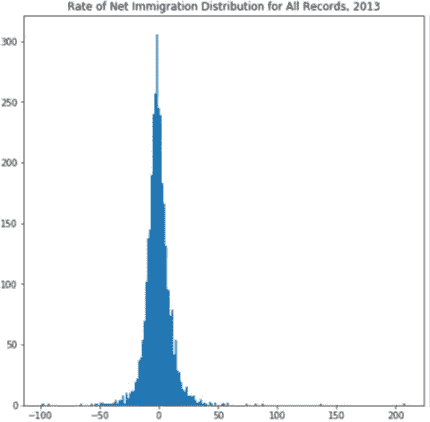

**图 3 -数据集中所有记录的移民率分布**

以下是从图 3 中得出的观察结果:

*   对于分类变量和数值变量，可以引入结构来构造特殊情况。典型的例子是*日期*或*时间*。根据不同的场景，日期和时间可以被视为分类变量，也可以被视为具有半连续结构的数值变量。
*   根据一些规则将数值变量转换成分类变量是很常见的。《城乡法》就是一个典型的例子。这样的转换容易传达第一印象。

既然我们已经学会了如何区分数字变量和分类变量，让我们继续理解统计学的一些基本概念，即均值、中位数和众数。

# 理解均值、中位数和众数

均值、中值和众数描述了*集中趋势*的各个方面。均值和中值仅适用于数值变量，而众数适用于分类变量和数值变量。在这一节中，我们将重点关注数值变量的均值、中值和众数，因为它们的数值交互通常会传递有趣的信息。

## 平均

平均值，或算术平均值测量变量的*加权中心*。让我们用 *n* 来表示条目的总数并作为索引。平均值由以下表达式给出:

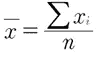

均值受总体中每个条目的值的影响。

我举个例子。以下代码统一生成 1，000 个从 0 到 1 的随机数，绘制它们，并计算它们的平均值:

```
import random
random.seed(2019)
plt.figure(figsize=(8,6))
rvs = [random.random() for _ in range(1000)]
plt.hist(rvs, bins=50)
plt.title("Histogram of Uniformly Distributed RV");
```

生成的直方图如下所示:

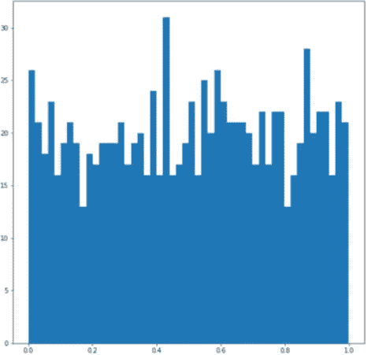

**图 4-0 和 1 之间均匀分布变量的直方图分布**

平均值约为 0.505477，非常接近我们的预期。

## **中位数**

中位数测量变量的未加权中心*。如果条目数为奇数，则中间值取中间值。如果有偶数个条目，则中位数取中间两个条目的平均值。中位数可能不会受到每个条目的值的影响。由于这一特性，中值比平均值更具代表性。我将使用与前面部分相同的条目集作为示例。*

以下代码计算中值:

```
np.median(rvs)
```

结果是 0.5136755026003803。现在，我将把一个条目更改为 1，000，这是数据集中最大可能值的 1，000 倍，并重复计算:

```
rvs[-1]=1000
print(np.mean(rvs))
print(np.median(rvs))
```

结果是 1.5054701085937803 和 0.5154761964872。平均值增加了大约 1，但中位数是稳健的。

均值和中值之间的关系通常很有趣，值得研究。通常，较大的中值和较小的平均值的组合表明在较大值一侧有更多的点，但是也存在极小的值。当中位数小于平均数时，情况正好相反。我们将在后面用一些例子来证明这一点。

**模式**

一组值的众数是一个集合中最常见的元素。在直方图中很明显，它表示峰值。如果分布只有一个模式，我们称之为单峰。两个峰的高度不必相等的分布称为双峰分布。

> **双峰和双峰分布**
> 
> 有时候，双峰的定义是错误的。**双峰**的性质通常是指具有两个模态的性质，根据模态的定义，要求峰的高度相同。然而，术语**双峰分布**通常指具有两个局部极大值的分布。仔细检查您的发行版，并清楚地说明模式。

下面的代码片段演示了分别具有单峰和双峰形状的两种分布:

```
r1 = [random.normalvariate(0.5,0.2) for _ in range(10000)]
r2 = [random.normalvariate(0.2,0.1) for _ in range(5000)]
r3 = [random.normalvariate(0.8,0.2) for _ in range(5000)]fig, axes = plt.subplots(1,2,figsize=(12,5))
axes[0].hist(r1,bins=100)
axes[0].set_title("Unimodal")
axes[1].hist(r2+r3,bins=100)
axes[1].set_title("Bimodal");
```

产生的两个支线剧情如下:

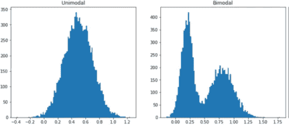

**图 5 -具有一个模式和两个模式的单峰和双峰数据集的直方图**

到目前为止，我们已经讨论了均值、中值和众数，这是数据集的前三个统计值。它们是几乎所有探索性数据分析的开始。

# **了解方差、标准差、四分位数、百分位数和偏斜度**

在上一节中，我们学习了均值、中值和众数。它们都在一定程度上描述了数据集中心部分的属性。在本节中，我们将学习如何描述数据的*传播*行为。

**差异**

使用相同的符号，总体的方差定义如下:

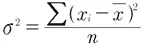

直觉上，元素离平均值越远，方差越大。这里，我用不同的方差绘制了两个数据集的直方图。左侧子图中的一个具有 0.09 的方差，右侧子图中的一个具有 0.009 的方差，即小 10 倍。

下面的代码片段从这两个发行版中生成示例并绘制它们:

```
r1 = [random.normalvariate(0.5,0.3) for _ in range(10000)]
r2 = [random.normalvariate(0.5,0.1) for _ in range(10000)]fig, axes = plt.subplots(1,2,figsize=(12,5))
axes[0].hist(r1,bins=100)
axes[0].set_xlim([-1,2])
axes[0].set_title("Big Variance")
axes[1].hist(r2,bins=100)
axes[1].set_title("Small Variance")
axes[1].set_xlim([-1,2]);
```

结果如下:

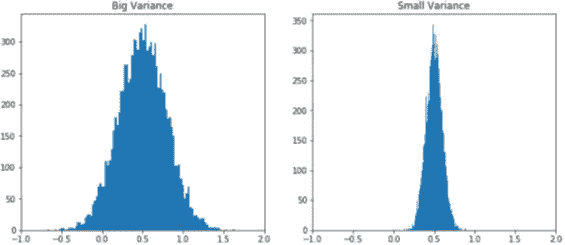

**图 6 -均值为 0.5 的大方差和小方差**

下面的代码片段生成了一个散点图，将更清楚地展示这种差异。 *x* 轴上的变量分布更广:

```
plt.figure(figsize=(8,8))
plt.scatter(r1,r2,alpha=0.2)
plt.xlim(-1,2)
plt.ylim(-1,2)
plt.xlabel("Big Variance Variable")
plt.ylabel("Small Variance Variable")
plt.title("Variables With Different Variances");
```

结果如下所示:

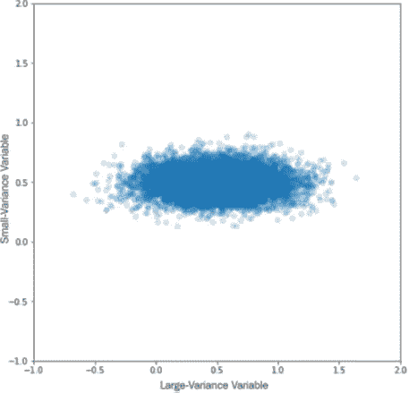

**图 7 -大方差和小方差变量的散点图**

在 *x* 轴上的分布明显大于在 *y* 轴上的分布，这表明了差异大小的差异。一个常见的错误是没有得到正确的范围。默认情况下，Matplotlib 将尝试确定范围。需要用 plt.xlim()之类的代码来强制，否则结果可能会误导。

## **标准偏差**

标准差是方差的平方根。它更常用于测量离差水平，因为它与原始数据具有相同的单位。总体标准差的公式为:

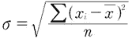

标准偏差在科学制图中极其重要。标准偏差通常与数据一起绘制，代表对可变性的估计。

在这篇文章中，我将使用德克萨斯州 2011 年至 2018 年的净移民率作为例子。在下面的代码片段中，我将首先提取县级数据，将平均值和标准差附加到一个列表中，然后在最后绘制它们。使用 numpy.std()获得标准差，使用 matplotlib.pyplot.errorbar()绘制误差线:

```
dfTX = df[df["State"]=="TX"].tail(-1)YEARS = [year for year in range(2011,2019)]
MEANS = []
STDS = []
for i in range(2011,2019):
    year = "R_NET_MIG_"+str(i)
    MEANS.append(np.mean(dfTX[year]))
    STDS.append(np.std(dfTX[year]))plt.figure(figsize=(10,8))
plt.errorbar(YEARS,MEANS,yerr=STDS)
plt.xlabel("Year")
plt.ylabel("Net Immigration Rate");
```

输出如下图所示:

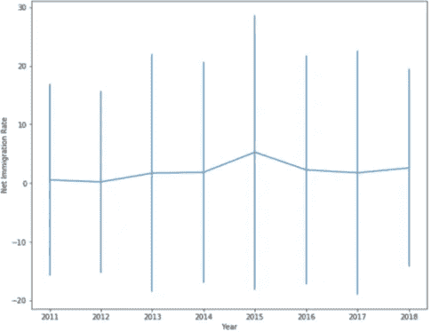

**图 8-2011 年至 2018 年德克萨斯州各县净移民率**

我们可以在*图 8* 中看到，虽然得州的净移民只是略微为正，但是标准差是巨大的。一些县可能有很大的正净比率，而其他县可能会遭受人力资源的损失。

## **四分位数**

四分位数是一种特殊的分位数，它将数据分成许多相等的部分。例如，四分位数将数据分成四等份，1/2 四分位数作为中位数。十分位数和百分位数分别将数据分成 10 和 100 等份。

第一个四分位数，也称为下四分位数 *Q* 1，取的值是所有数据的 25%位于它下面。第二个四分位数是中位数。第三个四分位数， *Q* 3，也被称为上四分位数，所有数值的 25%位于其上。

四分位数可能是最常用的**分位数**，因为它们与称为**箱线图**的统计图相关联。我们用同一套德州净移民数据来研究一下。

NumPy 中的函数是 quantile()，我们指定一个分位数列表作为我们要计算的分位数的参数，如下面的单行代码片段所示:

```
np.quantile(dfTX["R_NET_MIG_2013"],[0.25,0.5,0.75])
```

输出如下所示:

```
plt.figure(figsize=(12,5))
plt.hist(dfTX["R_NET_MIG_2013"],bins=50,alpha=0.6)
for quartile in np.quantile(dfTX["R_NET_
MIG_2013"],[0.25,0.5,0.75]):
    plt.axvline(quartile,linestyle=':',linewidth=4)
```

从下面的输出可以看出，垂直虚线表示三个四分位数:

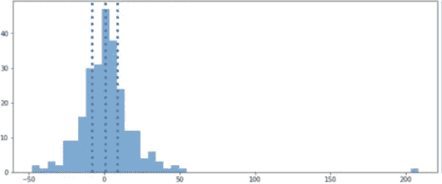

**图 9-2013 年净移民数据的四分位数**

上四分位数和下四分位数恰好保留了中间 50%的数据值。 *Q* 3 — *Q* 1 是指被称为**四分位间距** ( **IQR** )的四分位间距，它在异常值检测中起着重要的作用。我们很快会看到更多的内容。

## **偏斜度**

偏斜度不同于前面小节中讨论的三种可变性度量。它测量数据的走向和数据分布倾斜的程度。偏斜度由以下等式给出:

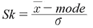

> **偏斜度的各种定义**
> 
> 我们前面定义的偏度，准确的说就是皮尔逊第一偏度系数。它是通过模式定义的，但是偏斜度还有其他的定义。例如，偏斜度可以通过中位数来定义。

偏斜度没有单位。如果均值大于众数，偏度为正，我们说数据向右偏。否则，数据会向左倾斜。

下面是生成两组倾斜数据并绘制它们的代码片段:

```
r1 = [random.normalvariate(0.5,0.4) for _ in range(10000)]
r2 = [random.normalvariate(0.1,0.2) for _ in range(10000)]
r3 = [random.normalvariate(1.1,0.2) for _ in range(10000)]fig, axes = plt.subplots(1,2,figsize=(12,5))
axes[0].hist(r1+r2,bins=100,alpha=0.5)
axes[0].axvline(np.mean(r1+r2), linestyle=':',linewidth=4)
axes[0].set_title("Skewed To Right")
axes[1].hist(r1+r3,bins=100,alpha=0.5)
axes[1].axvline(np.mean(r1+r3),linestyle=':',linewidth=4)
axes[1].set_title("Skewed to Left");
```

垂直虚线表示平均值的位置，如下所示:

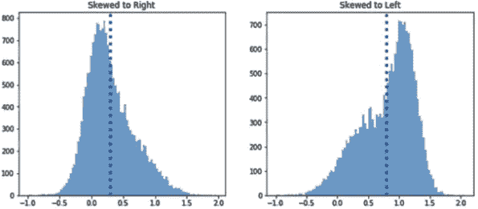

**图 10 -偏斜度演示**

想想收入不平等的问题。假设你有一张不同财富水平的人口直方图。一个更大的值，就像其中的 *x* 轴值表示财富的数量，而 *y* 轴值表示属于某个财富数量范围的人口比例。更大的 x 值意味着更多的财富。y 值越大，意味着越多的人属于这个财富范围。正偏度(图 10 左边的副曲线)意味着，尽管平均收入看起来不错，但这可能是由极少数超级富豪推高的，而大多数人的收入相对较低。负偏度(图 10 右侧的子曲线)表明大多数人的收入可能高于平均值，因此可能有一些非常贫穷的人需要帮助。

## **重新检查异常值检测**

现在让我们用我们所学的知识来重新审视离群点检测问题。

z 分数**也称为**标准分数**，是检测异常值的一个很好的标准。它测量条目和总体均值之间的距离，并考虑总体方差:**

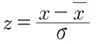

如果基础分布为正态分布，则 z 值大于 3 或小于 0 的情况只有大约 0.27%的概率。即使基础分布不是正态的，切比雪夫定理也保证了一个强索赔，使得总人口的至多 1/( *k^* 2)，其中 *k* 是一个整数，可以落在 *k* 标准差之外。

例如，下面的代码片段生成 10，000 个数据点，它们遵循正态分布:

```
random.seed(2020)
x = [random.normalvariate(1, 0.5) for _ in range(10000)]
plt.figure(figsize=(10,8))
plt.hist(x,bins=100,alpha=0.5);
styles = [":","--","-."]
for i in range(3):
    plt.axvline(np.mean(x) + (i+1)*np.std(x),
        linestyle=styles[i],
        linewidth=4)
    plt.axvline(np.mean(x) - (i+1)*np.std(x),
        linestyle=styles[i],
        linewidth=4)
plt.title("Integer Z values for symmetric distributions");
```

在生成的直方图中，虚线表示 *z* = 1 的位置。虚线表示 *z* = 2 的位置。点划线表示 *z* = 3 的位置；

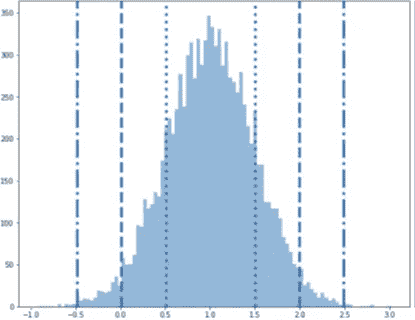

**图 11 -正态分布对称数据的整数 z 值边界**

如果我们改变数据点，分布将会改变，但 z 分数标准将保持有效。正如您在下面的代码片段中看到的，生成的是非对称分布，而不是正态分布:

```
x = [random.normalvariate(1, 0.5) + random.expovariate(2) for _
in range(10000)]
```

这会产生以下输出:


**图 12 -不对称数据的整数 z 值边界**

> **关于极端异常值影响的说明**
> 
> z 得分的一个缺点是平均值本身也会受到极端异常值的影响。中值可以代替平均值来消除这种影响。

我们已经介绍了对数据集中的方差进行建模的几个最重要的统计数据。在下一节中，让我们研究要素的数据类型。

# **知道如何处理分类变量和混合数据类型**

分类变量通常比连续变量具有更简单的结构或描述性统计。在这里，我们介绍频率和比例，并讨论一些有趣的描述性统计例子时，转换连续变量到分类。

我们已经介绍了对数据集中的方差进行建模的几个最重要的统计数据。在下一节中，让我们研究要素的数据类型。

# **知道如何处理分类变量和混合数据类型**

分类变量通常比连续变量具有更简单的结构或描述性统计。在这里，我们介绍频率和比例，并讨论一些有趣的描述性统计例子时，转换连续变量到分类。

## **频率和比例**

当我们讨论分类变量的模式时，我们引入了 Counter，它输出一个字典结构，其键值对是元素计数对。下面是一个计数器的示例:

```
Counter({2.0: 394, 3.0: 369, 6.0: 597, 1.0: 472, 9.0: 425, 7.0:
434, 8.0: 220, 4.0: 217, 5.0: 92})
```

以下代码片段以条形图的形式展示了频率，其中计数的绝对值变得很直观:

```
counter = Counter(df["Rural-urban_Continuum Code_2013"].
dropna())
labels = []
x = []
for key, val in counter.items():
    labels.append(str(key))
    x.append(val)
plt.figure(figsize=(10,8))
plt.bar(labels,x)
plt.title("Bar plot of frequency");
```

这将生成如下所示的条形图:

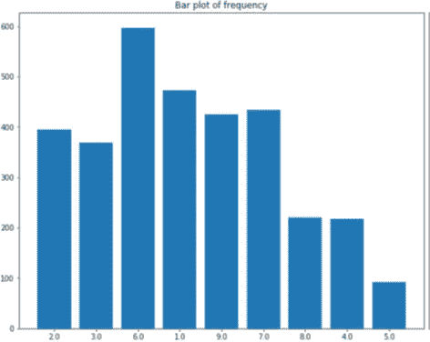

**图 13 -城乡连续体代码柱状图**

为了成比例，只需将每个计数除以计数的总和，如下面的代码片段所示:

```
x = np.array(x)/sum(x)
```

条形图的形状保持不变，但是 *y* 轴刻度发生了变化。为了更好地检查组件的相对大小，我在以下代码片段的帮助下绘制了一个饼图:

```
plt.figure(figsize=(10,10))
plt.pie(x=x,labels=labels,)
plt.title("Pie plot for rural-urban continuum code");
```

这将创建一个漂亮的饼图，如下所示:

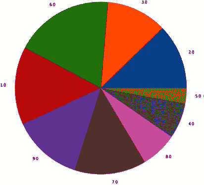

**图 14 -城乡结合部代码饼状图**

很明显，代码 2.0 包含的样本是代码 8.0 的两倍。

与平均值和中位数不同，分类数据确实有一个模式。我们将重复使用相同的数据:

```
Counter(df["Rural-urban_Continuum Code_2013"].dropna())
```

输出如下所示:

```
Counter({2.0: 394, 3.0: 369, 6.0: 597, 1.0: 472, 9.0: 425, 7.0:
434, 8.0: 220, 4.0: 217, 5.0: 92})
```

模式为 6.0。

> **注**
> 
> 这种模式意味着，在美国，城市人口在 2，500 到 19，999 人之间的大都市地区最常见，而不是数字 6.0。

## **将连续变量转化为分类变量**

有时，我们可能需要将连续变量转换成分类变量。我们以寿命为例。80 岁以上的年龄组应该很小。在分类任务中，它们中的每一个都代表一个可以忽略的数据点。如果能将他们分组在一起，那么这个年龄段的个体点的稀疏性引入的噪音就会减少。

执行分类的常用方法是使用分位数。例如，quartiles 会将数据集分成四个部分，每个部分包含相同数量的条目。这避免了诸如数据不平衡的问题。

例如，以下代码显示了净移民率(一个连续变量)分类的临界值:

```
series = df["R_NET_MIG_2013"].dropna()
quantiles = np.quantile(series,[0.2*i for i in range(1,5)])
plt.figure(figsize=(10,8))
plt.hist(series,bins=100,alpha=0.5)
plt.xlim(-50,50)
for i in range(len(quantiles)):
    plt.axvline(quantiles[i],linestyle=":", linewidth=4)
plt.title("Quantiles for net immigration data");
```

正如您在下面的输出中看到的，垂直虚线将数据分成 5 个相等的集合，这很难用肉眼发现。我截断了 *x* 轴来选择-50 和 50 之间的部分。结果如下所示:


**图 15 -净移民率的分位数**

> **关于信息丢失的说明**
> 
> 分类破坏了连续变量中丰富的结构。只有在绝对需要的时候才使用它。

# **使用二元和多元描述性统计**

在这一节中，我们简要地谈谈二元描述统计。双变量描述性统计应用两个变量，而不是一个。我们将关注连续变量的相关性和分类变量的交叉制表。

## **协方差**

单词*协方差*经常被错误地用作*相关性*。然而，有一些基本的区别。协方差通常衡量两个变量的联合可变性，而相关性更关注可变性的强度。相关系数在不同的用例中有几种定义。最常见的描述性统计是皮尔逊相关系数。我们也会用它来描述两个变量的协方差。总体中变量 *x* 和 *y* 的相关系数定义如下:

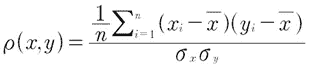

让我们首先检查表达式的符号。当 *x* 大于其均值且 *y* 也大于其自身均值时，系数为正。

另一种情况是当 *x* 和 *y* 分别小于它们的平均值时。乘积求和，然后通过每个变量的标准差得到归一化的*。因此，正系数表示 *x* 和 *y* 共同向同一方向变化。你可以对负系数做类似的论证。*

*在下面的代码片段中，我们选择德克萨斯州各县的净移民率作为数据集，并使用 corr()函数来检查跨年度的相关系数:*

```
*corrs = dfTX[['R_NET_MIG_2011','R_NET_MIG_2012', 'R_NET_
MIG_2013', 'R_NET_MIG_2014', 'R_NET_MIG_2015','R_NET_MIG_2016',
'R_NET_MIG_2017', 'R_NET_MIG_2018']].corr()*
```

*输出是所谓的*相关矩阵*，其对角元素是自相关系数，仅为 1:*

*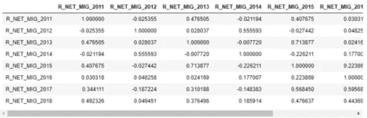*

***图 16 -净移民率的相关矩阵***

*可视化这个矩阵的一个好方法是使用 Seaborn 库中的 heatmap()函数。以下代码片段生成了一个漂亮的热图:*

```
*import seaborn as sns
plt.figure(figsize=(10,8))
plt.rcParams.update({'font.size': 12})
sns.heatmap(corrs,cmap="YlGnBu");*
```

*结果如下:*

*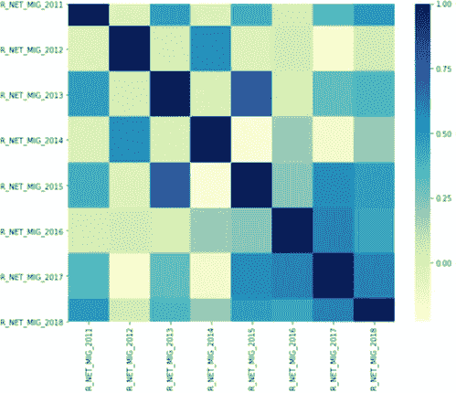*

***图 17 -德克萨斯州净移民率相关矩阵热图***

*我们确实看到了一个有趣的模式，奇数年之间的相关性更强，偶数年之间的相关性也更强。然而，在偶数年和奇数年之间，情况并非如此。也许有一个 2 年的循环模式，相关矩阵的热图正好帮助我们发现了它。*

## ***交叉制表***

*交叉制表可被视为分类变量相关性检测的离散版本。它有助于获得无数的见解，并揭示了下游任务的设计。*

*这里有一个例子。我正在创建一个天气信息列表和另一个高尔夫球手是否去打高尔夫球的决定列表。crosstab()函数生成下表:*

```
*weather = ["rainy","sunny","rainy","windy","windy",
           "sunny","rainy","windy","sunny","rainy",
           "sunny","windy","windy"]
golfing = ["Yes","Yes","No","No","Yes","Yes","No","No",
           "Yes","No","Yes","No","No"]
dfGolf = pd.DataFrame({"weather":weather,"golfing":golfing})
pd.crosstab(dfGolf.weather, dfGolf.golfing, margins=True)*
```

*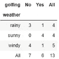*

***图 18 -高尔夫决策交叉列表***

*如您所见，列和行给出了精确的计数，由列名和行名标识。对于要素数量有限的数据集，这是一种检查不平衡或偏差的简便方法。*

*我们可以知道，如果天气晴朗，高尔夫球手会去打高尔夫球，而在雨天或刮风天，他们很少去打高尔夫球。*

# ***总之***

*在本文中，我们解释了什么是描述性统计，以及它们能告诉你什么。您已经了解了如何从数据集中提取信息，并使用描述性统计进行定量判断。希望现在已经很清楚了，理解不同的描述性统计，知道何时使用它们，以及从您的数据中获得它们的实际能力，是数据科学家的工具箱中不可或缺的项目。*

*掌握了这些知识，您可以从统计学的角度加深对数据科学和数据分析的理解，并使用 Python 编程从数据中提取有意义的见解。看看李荣鹏的书[非 STEM 数据分析师的基本统计](https://packt.live/3dTBde4)。*