# Javascript 基础知识:)(第 2 部分)

> 原文：<https://medium.com/nerd-for-tech/essentials-of-javascript-part-2-d7ee900cd57?source=collection_archive---------14----------------------->

**适合生活的好 Javascript】😉🙌**

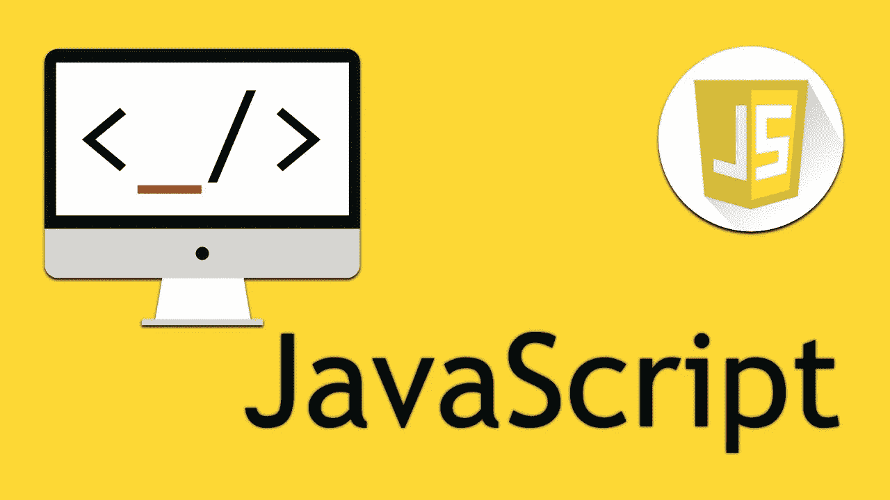

让我们继续学习 Javascript 的旅程。在我的上一篇文章中，我讨论了任何开发人员都应该知道的 Javascript 的基本和最重要的概念和理论。

如果您还没有阅读我之前的 Javascript 文章，请在阅读本文之前点击下面的链接。

 [## Javascript 基础知识:)(第 1 部分)

### 想了解 Javascript 吗？对你来说听起来像抽筋吗？不要担心，从头学起，得到它，然后…

medium.com](/nerd-for-tech/essentials-of-javascript-part1-2b59bc0ec6df) 

在这篇文章中，我将教你 Javascript 最重要的编码概念。

一旦你学会了它，你就可以作为一名开发人员将它应用到你自己的 Javascript 场景中，而不用害怕。

现在让我们开始吧:)

# Javascript 中使用函数的方式

让我们从函数开始。

函数可以用不同的方式声明。

1.  **基本函数语法。**

让我们看看下面的代码段。

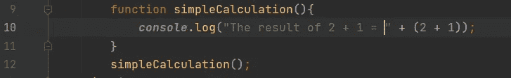

**Javascript 的基本函数声明**

我们声明了一个名为***‘simple calculation’***的函数，用来得到 ***2 + 1*** 的计算。在第 12 行，我们调用函数。

希望答案是 3 …

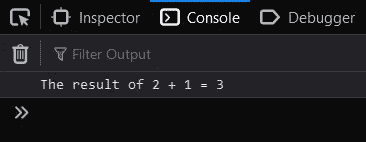

**2+1 的结果**

**2。函数作为对象的属性。**

让我们来看一段代码，它在控制台中显示了一位最受欢迎的 DJ 制作人的全名。

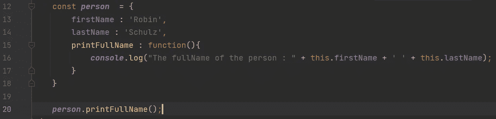

**使用“人”对象中的属性名触发功能。**

我们把一个物体命名为***‘人’。*** 在 person 对象中我们初始化了 3 个属性。前两个属性表示一个人的名和姓，而***【print full name】***属性表示一个函数，它在控制台中显示这个人的全名。

通过在第 20 行使用括号调用 person 对象的***【print full name】***属性，我们可以直接调用它的函数。

Hopefull 是 DJ 制作人的全名。

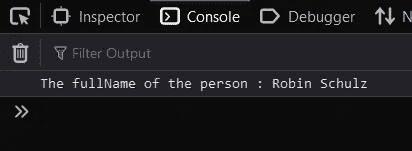

**结果**

**3。用作表达式**

我们可以将函数作为表达式存储在变量中，而不是声明它。

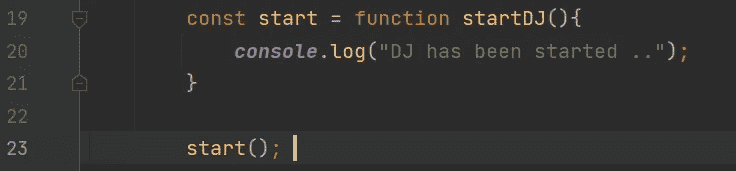

**将函数声明为表达式**

在这里，我们将一个名为***【startDJ】***的函数分配给一个名为***【start】***的常量类型变量，作为一个表达式。

我们可以使用变量名***【start】***调用函数，带括号，如第 23 行所示。

**需要考虑—** 我们不能从函数的名字叫***【startDJ】***来调用函数。我们只能从变量名中调用函数，这就是函数作为表达式的语法。如果你愿意，你可以省略函数名***‘startDJ’***，因为它没有被使用过。

希望能得到我们期待的答案:)

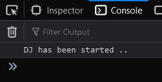

**结果**

**函数声明 VS 函数作为表达式。**

现在你可能会想，我应该用什么方法呢？

是的，我们来澄清一下。:)

如果是关于**函数声明**，当我们在文件的任何地方声明一个函数时，Javascript 总是把它标识为**它在我们文件的顶部。由于这种特殊的行为，我们甚至可以在声明/初始化函数** 之前调用函数 ***。***

在声明之前，让我们试着调用函数 ***【简单计算】*** 。

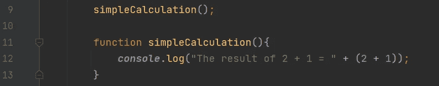

**在声明函数之前调用它，这在 Javascript 中是可能的**

希望我们能像以前一样得到答案。

**结果**

如果是关于作为表达式的函数，Javascript 在函数 ***声明/初始化中将其标识为相同。*** ***(提升)*** 但是我们**在**初始化或者声明之前不能调用那个函数**。**

当我们在声明/初始化函数之前调用函数时，Javascript 将存储函数表达式的**常量类型变量**和**标识为未定义的**。

这是一种特殊的行为。现在让我们试着在声明或初始化之前调用***【startDJ】***函数。

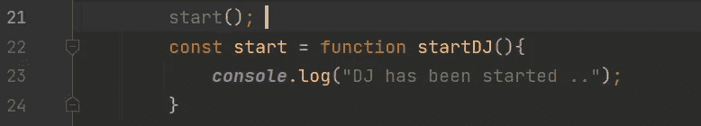

**这在 Javascript 中是不可能的**

希望这是不可能的，我们会得到一个错误。

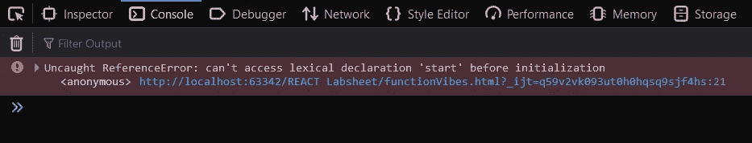

**错误清楚地向我们展示了问题**

所以这就是区别。您可以根据自己的喜好和需求使用任何方法:)

**4。匿名功能**

如果您正在使用 javascript 进行一个 web 开发项目，并且如果您想在按钮或任何元素发生点击事件时触发一个函数，您可以直接**声明一个函数作为 **addEventListner** 函数的参数**。

让我们看看下面的代码段。

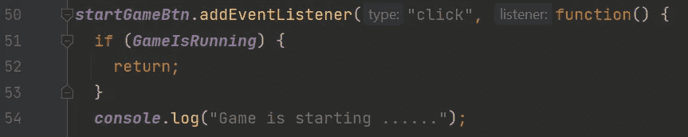

**直接发送一个函数作为点击事件监听器的参数**

这是一段代码，我曾在一个 web 开发项目中使用过，我曾与之互动过。

这个***‘startGameBtn’***是一个常量类型变量，它有一个按钮元素，使用它的 addEventListener，我们传递一个匿名函数作为参数。

如果我们调用一个已经声明的函数，在 addEventListener 中，任何开发人员或任何人都必须检查该函数实际上是在哪里声明的，但现在我们直接将函数作为参数传递，所以没有人需要遵循编码文件来找出该函数实际上是在哪里声明的。

这就是匿名函数的用法。:)

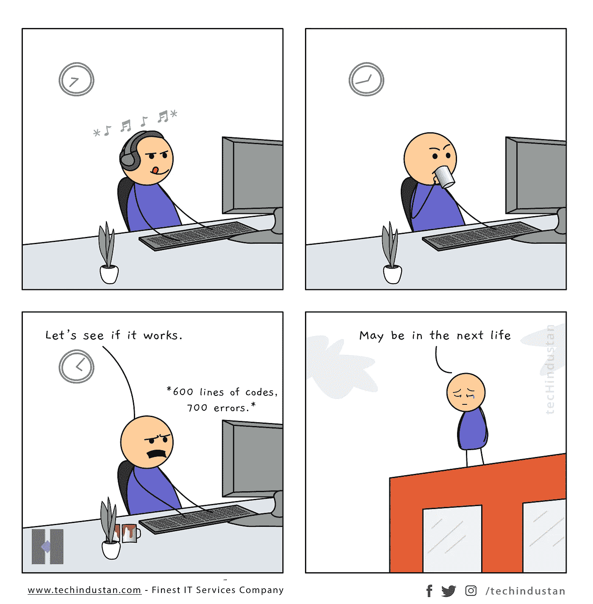

**不要等到最后一次——一个 Javascript 玩笑😉 😄**

# 箭头功能

箭头函数是 Javascript 中声明函数的另一种方式。它有一个特殊的语法，可以简化普通函数的语法。

箭头函数有几个优点，让我们试着用例子一个一个地把它们弄清楚。

箭头函数节省了一些代码，也节省了一些写代码的时间。

**1。箭头函数语法**

让我们来看一个 arrow 函数，它用于获得作为参数传递给该函数的两个数字的总和。

**箭头函数的基本语法——它简化了普通函数的语法**

这是箭头函数的语法。:)

我们必须声明一个变量，以便将一个箭头函数指定为表达式。我们使用 parentesis 来传递参数，并使用=> symble 作为箭头函数的语法。

现在让我们调用这个函数并将它的返回值赋给一个变量，以便控制台记录结果。

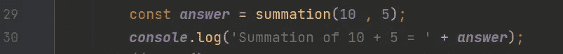

**调用函数并获取其返回值，并以有意义的方式将其记录到控制台中。**

希望我们能得到 10 + 5 等于 15 的答案。

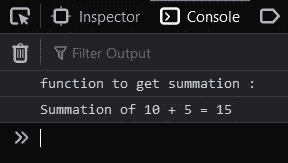

**结果**

**2。带有一个参数的箭头函数。**

现在让我们举一个不同的例子，这个例子用来确定一个特定的数是正数还是负数。

**只有一个参数的箭头函数**

由于我们只传递一个数字作为参数，我们可以简单地省略箭头函数的**参数，这是使用箭头函数的优点之一。:)**

让我们通过传递一个正数作为参数来调用这个函数，得到结果为***‘真’。***

**调用箭头函数，将返回值赋给一个变量，并记录到控制台**

希望 5 是正数，答案是***‘真’。***

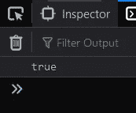

**结果**

**3。没有卷曲铜焊的箭头函数。**

由于我们讨论的最后一个函数只有一个 return 语句，我们可以简单地放弃这个函数，我们可以在一行中写完整的函数声明，甚至可以省略 return 关键字，这是一个很好的例子:)

让我们相应地重写 ***【正】*** 函数。:)

**具有一个返回语句的 Arrow 函数的最简单语法。**

现在我们可以简化更多的箭头功能:)

感谢 Javascript 的语法，我们可以在节省编码时间的同时简化更多的代码:)

不要让 bug 存在于你的代码中，如果你不一个一个地解决更小的 bug，你永远不知道 bug 什么时候会变大——这是一个 Javascript 的笑话😉😄

# “设置超时”功能

***【setTimeout】***函数是一个全局函数，可用于为我们在文件中使用的窗口或代码段全局设置超时。

您已经在我的上一篇文章中看到了这个函数。

在那里，你可以看到我用它来解释 Javascript 的异步行为，并向你展示 Javascript 是一种单一线程语言。

现在让我们在 window 对象中使用一个 setTimeout 函数来设置一个 2 秒的超时时间，以便在两秒钟过后获得一个日志消息。

**旁注—** window 对象代表浏览器的窗口。当我们在浏览器中打开一个标签时，它就是窗口。

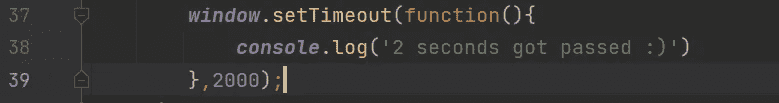

**设置超时功能，创建 2 秒超时**

一旦浏览器的窗口/标签打开，希望我们能够在两秒钟后在浏览器的控制台**看到日志消息。**

**结果**

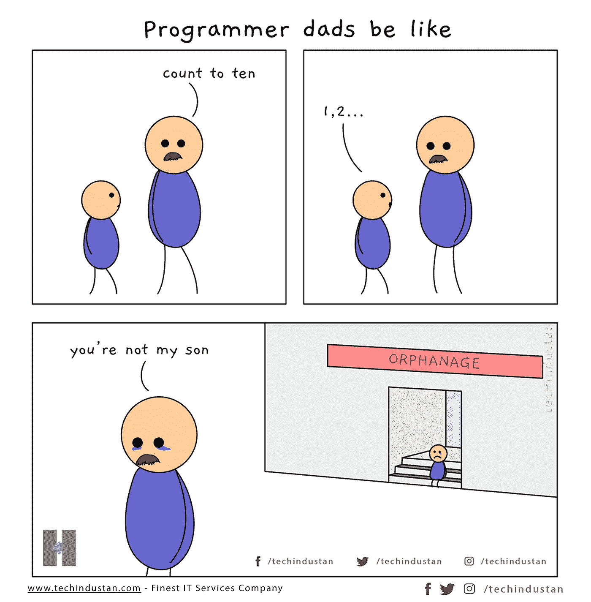

**千万不要把你开发者的生活套用到你的现实生活中。—一个侧面的 Javascript 笑话😉😄**

# 回调函数

回调函数是一个能够从函数本身返回到我们调用它的地方的函数。

当我们调用一个特定的函数时，我们可以将函数作为参数传递给函数调用，在函数内部，我们可以回调内部函数，并在函数内部做一些事情。

在你感到困惑之前，让我们看看下面的代码示例，让我们了解一下什么是回调函数:)这很简单。

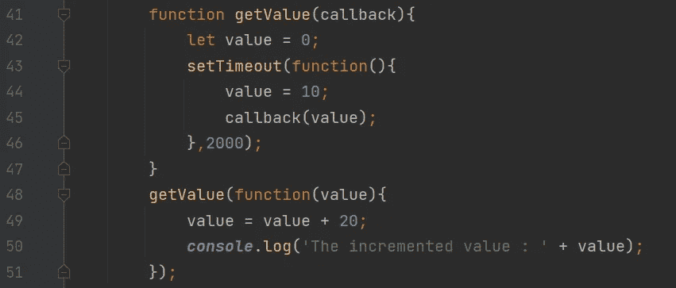

**回调函数并调用该函数，同时传递一个函数作为帮助回调功能的参数。**

**本项目的目标**

我们使用这个代码段来调用一个函数，在 2 秒后从那个函数中获取一个值，一旦我们调用了那个函数。

一旦我们从函数中获得了一个值，我们希望给这个值增加 20，并在控制台中记录这个值。

**记住—*****【getValue】***函数的调用发生在第 48 行。

**先来了解一下这个回调函数。**

在***【getValue】***函数中，我们有一个名为***【callback】***的变量作为参数放在卷笔刀里面。**(看第 41 行)**

你可以随意命名这个参数，但是在这个例子中，为了便于理解回调函数，我将这个属性命名为 ***【回调】*** 。

使用这个***‘回调’***，我们可以回调函数调用，我们在第 48 行调用函数，使用***‘回调’***关键字我们也可以传递一个参数。在本例中，我将***【value】***变量传递给第 45 行的回调函数，因为第 48 行的内部函数只要求一个参数。

所以***‘回调’***变量作为函数工作。

在第 48 行，由于我们将一个函数作为参数传递，在***【getValue】***函数中第 45 行的***【callback(value)】***能够回调在第 48 行充当参数的函数，并且该函数接受一个变量作为***【value】。***

在第 49 行，另一个 20 将被添加到那个 ***【值】*** 变量中，在第 50 行被执行后，我们将能够在控制台上看到日志消息，更新后的值为 30。

希望您能够得到如下输出。:)

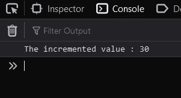

**结果**

现在希望回调函数对你来说超级清楚:)

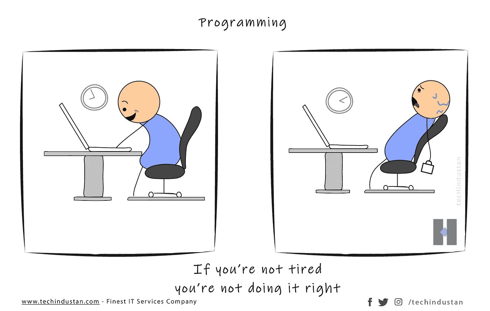

不要害怕编程的疲劳——一个 Javascript 的小笑话😉😄

# Javascript 中的承诺。

承诺也是回调函数。

Javascript 中的承诺和我们在现实生活中对某人的承诺是一样的。如果我们真的能让这个承诺成为可能，我们就能实现它，但如果不能，我们就可以忽略它😉

使用承诺，我们可以在 Javascript 中创建一个承诺。如果一个开发者的特定需求在一个功能中成为可能，他/她将能够回调并生成一个功能。如果没有成为可能，他/她可以做点别的。

现在让我们来理解 Javascript 的承诺是如何工作的。

既然您已经了解了什么是回调函数，那么理解这个 Promise 函数就很容易了，因为唯一的区别是语法和额外的功能。

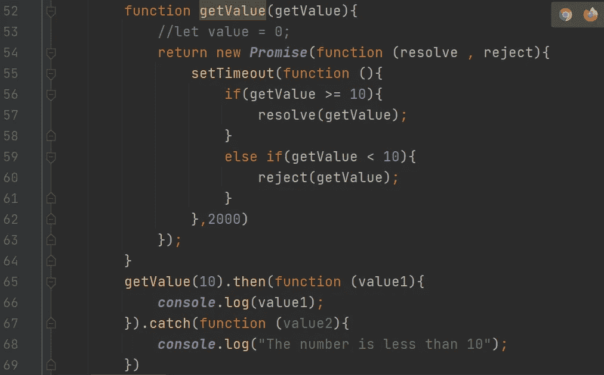

在函数中返回一个承诺，并且永远记住承诺也是一个回调函数。

**本项目目标**

将一个数字作为参数发送给一个函数，如果该数字≥ 10，我们直接控制台记录该数字，如果是< 10 , we console log as “The number is less than 10”.

**，让我们来理解这个承诺函数**

在第 65 行，我们调用“getValue”函数，并发送 10 作为参数。

一旦函数开始执行，并且返回的 promise 函数内发生 2 秒钟的超时，if 语句将开始执行。

根据从第 56 行开始的 if 条件块，如果输入的数字(' getValue '变量)≥ 10，将调用 **resolve** 方法，如果输入的数字(' getValue '变量)为< 10，将调用 **reject** 方法。

因为在我们的例子中输入的数字是 10，并且≥ 10，所以我们称之为***‘resolve’***方法。resolve 方法将回调到第 65 行的***‘then’***块。

***‘then’***块传递一个函数作为参数，当我们回调***‘resolve’***方法时，该函数将控制台记录传递的值。(在第 57 行)

如果输入的数字是< 10 , then it will call the ***，【reject】***方法和 reject 方法将通过接收输入的数字作为参数回调到 **catch 块**。在 catch 块中，它将控制台记录一条消息为***‘数字小于 10’。***

这就是 Javascript 中的承诺:)我希望现在你已经很清楚 Javascript 中的承诺是如何工作的了。

Javascript 语法是如此特别——一个侧面的 Javascript 笑话😉😄

# Javascript 中的 Async 和 await 关键字。

Async 和 await 关键字是 Javascript 中承诺和回调函数的语法提示。

Async 和 await 使我们编写承诺和回调变得容易，这也使我们更容易处理承诺。

这是调用回调函数并处理其结果的另一种方法。

我们使用 Async 关键字来声明一个 Async 函数，并使用 await 关键字在执行行中保持等待，直到函数发生回调。

异步函数是指异步的函数。在异步函数中，所有的执行都是异步发生的(下一个代码段不会等到前一个代码段完成它的执行。)

从上一篇文章中，我们已经了解到 Javascript 是一种异步语言。那么为什么我们需要用一个关键字专门声明一个函数是异步的呢？

**答案—** 我们必须使用这个关键字，以达到使用***【await】***关键字同步执行该功能的目的。我们不能在没有***【async】***关键字的函数中使用***【await】***关键字。一旦我们使用***‘await’***关键字同步执行了函数，下一行将不会开始，直到前一行执行完。

让我们通过调用我们在上一主题中使用的相同的 Promise 函数来尝试理解所有这些是如何工作的。 **(getValue()函数)**

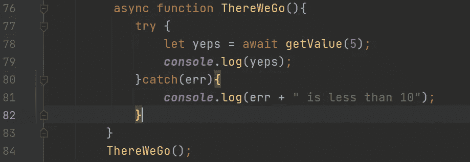

**带 await 关键字的异步函数**

我们在第 84 行调用了***‘ThereWeGo’***异步函数，一旦我们执行了第 78 行，它就会一直等到***‘getValue’***函数进行回调。一旦它返回一个值，该值将被赋给***【yeps】***变量，在执行完第 79 行后，我们将能够在控制台看到它的值。

在这个例子中，因为我们传递的是小于 10 的 5，所以它会抛出一个异常。为了处理该异常并获得由***【reject】***方法传递的值，我们必须使用 **try catch 块**覆盖整个异步***【ThereWeGo】***函数，我们可以登录到控制台，显示输入的数字 5 小于 10 的消息，如上图所示。

因此，当您使用带有 await 关键字的异步函数时，在处理回调函数时，最好使用 try 和 catch 块。

现在我希望你非常清楚如何使用 async 和 await 关键字。:)

# 结论

在本文中，我们详细了解了 Javascript 中最重要的编程内容。

在结束这篇文章之前，让我们回顾一下通过这篇文章我们学到的东西。

1.  Javascript 中使用函数的方式。
2.  Javascript 中的箭头函数。
3.  “setTimeout”函数。
4.  使用回调函数。
5.  在 Javascript 中使用承诺。
6.  Async 和 await 关键字作为处理回调函数的语法指导。

我希望你真的喜欢这篇文章，也希望你作为一名开发人员获得了关于 Javascript 的知识。

我总是建议你对 Javascript 和我在本文中教给你的东西做更多的研究。

为了成为一名优秀的 web 开发人员，请确保自己坚持练习 Javascript 语法。:)

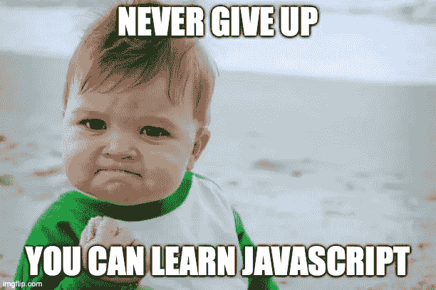

**这不是玩笑😄😌**

我希望将这篇文章延续到另一篇文章中，我希望教你关于使用变量的**，以及在 Javascript 中使用 Let 和 Const 关键字代替 Var 关键字的重要性。**

除了教你关于变量的东西，我还希望教你关于 Javascript 中的 **DOM、Java VS Javascript、闭包** **等等。**

有什么建议吗？你知道该怎么做吗😉

在我的下一篇 Javascript 文章中再见:)

在那之前，

***用 Javascript 快乐编程。😄🙌***

谢谢大家！