# Javascript 基础知识(第 3 部分)

> 原文：<https://medium.com/nerd-for-tech/essentials-of-javascript-part-3-c922d0cc8d87?source=collection_archive---------19----------------------->

Javascript 中三重宝石的故事——Let、Const、Var😉🔥

**Javascript 在运行时在浏览器的 Javascript 引擎中执行。**

让我们深入了解每个开发人员都应该知道的 Javascript 的更重要的方面和概念:)

如果你想从学习 Javascript 中获得最大收益，我强烈建议你去看看我以前写的关于 Javascript 的文章。

在开始阅读本文之前，请确保从它们那里掌握知识。

查看下面的链接。

 [## Javascript 基础知识:)(第 1 部分)

### 想了解 Javascript 吗？对你来说听起来像抽筋吗？不要担心，从头学起，得到它，然后…

medium.com](/nerd-for-tech/essentials-of-javascript-part1-2b59bc0ec6df)  [## Javascript 基础知识:)(第 2 部分)

### 生活中的好 Javascript😉🙌

medium.com](/nerd-for-tech/essentials-of-javascript-part-2-d7ee900cd57) 

现在让我们直接进入我想让你知道的事情😄

# Javascript 中的变量声明

**什么是变量？🤔**

正如你已经知道的，变量是内存中的一个存储单元，用来存储一些数据。在每种编程语言中，变量都是用来存储数据的。

**变量是如何声明的？🤔**

在其他编程语言如***【Java、C、Python 等】*** 中，它们都有前提数据类型。这意味着，为了声明一个变量，我们必须给出该变量的数据类型 ***(我们希望存储在该变量中的数据类型)*** 如整数、双精度、字符串等等。

当谈到 Javascript 时，关于变量声明的情况就不同了。

由于 Javascript 是一种动态编程语言，并且在运行时执行，变量的数据类型也在执行时被识别。开发人员和用户不需要通过给出变量的类型来明确定义变量。一旦变量被初始化，Javascript 将自动识别它的类型。**(一旦赋值)**

这是一个令人敬畏的 Javascript 行为。😃🤘

当一种编程语言变得动态时，它有许多优点。

# **变量声明使用' *Var，Let 和 Const* '**

所以 Javascript 中的变量是我们存储数据的数据容器。

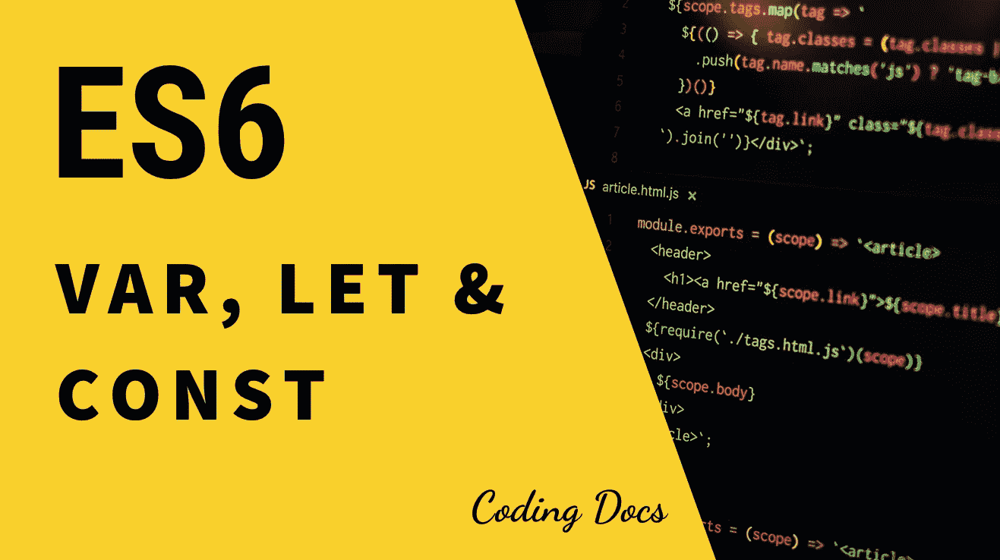

**ES6 是最新的 Javascript 版本。**

现在让我们来看看下面的一段代码，了解一下如何声明变量。

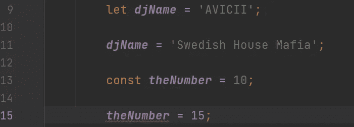

**用' let '声明变量，用' const '声明常量。**

在 Javascript 中我们根据最新的 Javascript 版本使用***【let】***和***【const】***关键字声明变量， **ES6。**

在这里的**第 9 行**处，我们使用***‘let’***关键字声明了一个变量来存储一位最著名、最具乐器感的瑞典 DJ 制作人的名字。

正如我们已经讨论过的，Javascript 将***‘DJ name’***理解为一个字符串类型，因为我们将生产者的名字指定为一个**字符串**值。

**在第 11 行**，我们把名字改成了一个不同的瑞典生产商的名字，我们肯定能做到。一旦我们在第 9 行声明了变量**，Javascript 就全局地将它标识为一个变量，我们可以稍后存储不同的数据。**

**旁注—** 在第 11 行，我们不仅可以分配一个字符串值，还可以分配任何类型的数据，因为这个 Javascript 是一种动态语言。😊🔥

这就是' ***的力量让'*** 关键词。

现在让我们弄清楚***【const】***关键字是怎么回事。

***【const】***关键字用于存储常量。常量意味着，一旦我们给一个常量赋值，我们就不能在程序的任何地方改变它的值。

**在第 13 行**处，我们使用***【const】***关键字声明了一个名为*【the number】*的变量来存储一个**整数**类型的数字。正如您在第 15 行中看到的，我们不能更改变量的值，我们可以看到 IDE 也用红线显示了它。

开发人员很少使用常量，因为他们**确实需要**改变变量的数据来完成他们的需求。

现在我们知道了' ***Let'*** 和' ***Const'*** 是怎么回事了。

请记住，在 Javascript 或任何其他编程语言中，当涉及到变量声明时，都有一些命名约定要遵循。为了掌握这些变量命名惯例，我建议您查看下面的链接，命名变量总是由您决定:)

 [## JavaScript 命名约定- RWieruch

### 一个 JavaScript 命名约定的示例介绍——这给了你命名的常识…

www.robinwieruch.de](https://www.robinwieruch.de/javascript-naming-conventions) 

**一个侧面的 Javascript 笑话😉😃**

# “var”关键字

***【var】***关键字也用于在 Javascript 中声明变量。

***【var】***关键字也与***【let】***关键字相同。我们还可以使用***【var】***关键字声明可变变量**(值可以改变)**。

现在你可能会想为什么我们在 Javascript 中有两种不同的方法来声明变量？🤔

让我们把它弄清楚😄🤘

根据旧的 Javascript 版本 **(ES5 及以下)**，‘***var’***是唯一的关键字，用于声明变量。甚至没有***【const】***关键字来声明常量。

由于***【var】***关键字会在程序中产生错误，并且容易出错，因此需要对 Javascript 中的变量声明进行优化。

在 2015 年，我们已经在我的第一篇 Javascript 文章的历史部分讨论过的下一个 Javascript 版本，作为 ES6 引入**，它不仅包括对变量声明的优化，还包括对整个 Javascript 的优化。**

**Es6** 是我们使用的最新 Javascript 版本，它引入了***【let】***和***【const】***关键字作为变量声明约定的优化。

***【var】***关键字已经不再使用，但它仍然存在，并且永远记住只使用*和***【const】***关键字，因为它是**而不是**容易导致代码出错的关键字。:)*

# *“var”有多容易出错？🤔*

*甚至***【var】***和***【let】***听起来行为一样，其实**不一样。***

***在*‘var’*中，是全局范围**。这意味着，如果我们用***【var】***来声明一个变量，它是全局可用的。*

***在*‘let’*中，是块作用域**。这意味着，如果我们在一个函数或者任何东西里面使用***【let】***来声明一个变量，那么它只在那个函数或者那个特定的东西里面可用。所以为了在代码中的任何地方使用这种变量，我们必须全局声明它**(在你的文件中声明它为 top)。***

1.  ***如何识别块范围？🤔***

*对于循环、函数、if 条件、对象等等，我们使用 curly brazzers {} in，**。**卷曲的 brazzers {}代表块范围。它代表任何事物的范围。**(循环、函数、if 条件等。)***

*让我们来看看下面的代码段。*

*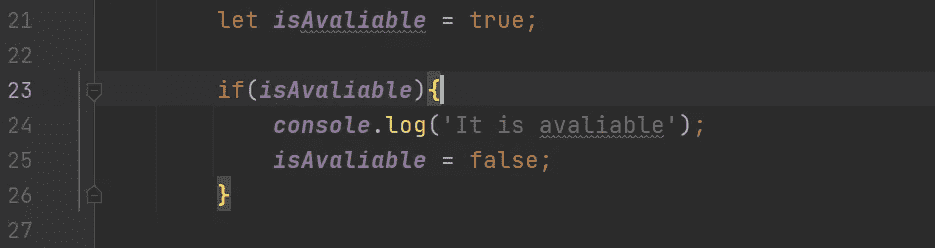*

***代表区块范围。***

*以上**的卷曲钎料如果符合**条件，则显示其范围。***【if 条件】*** 的范围是块本身的范围。现在你知道什么是示波器了。*

*让我们了解一下***‘let’***是如何充当 block 作用域的。*

*让我们看看下面的代码段，它代表了一个 DJ 制作人的名字和他的音乐类型。*

**

***表示‘let’是块作用域。***

*在这里的第 9 行处，我们声明了一个存储 DJ 制作人名字的变量。**(我们发起)***

*因为我们在文件中对其进行了全局声明，所以***【DJ name】***变量将可以全局使用。*

***在第 12 行**，我们使用***‘let’***声明了一个变量，它存储了那个制作人的主要音乐流派。因为那个变量是在***【show genre】***函数中声明的，所以它的作用域被阻塞了，这意味着***【genre】***变量只能在那个函数中使用。*

*所以在第 16 行，如果我们试图记录变量 ***【流派】*** 的值，我们将不能这样做，因为它只在函数**(块范围)内可用。***

*如果我们将**第 16** 行设为非注释，并且如果我们执行了该文件，我们将得到一个错误，如下图所示。*

*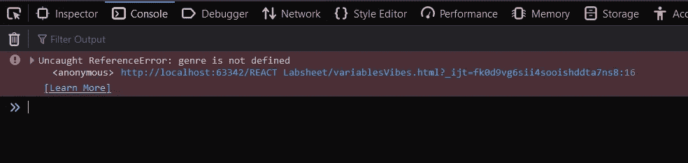*

***“流派”变量不可全局使用。***

*是的， ***【流派】*** 没有全局定义，所以这个错误是有意义的:)*

***2。*‘var’*没有优化。***

*让我展示一下***【let】***关键字是如何优于***【var】***关键字的。*

*看看下面的代码段。*

*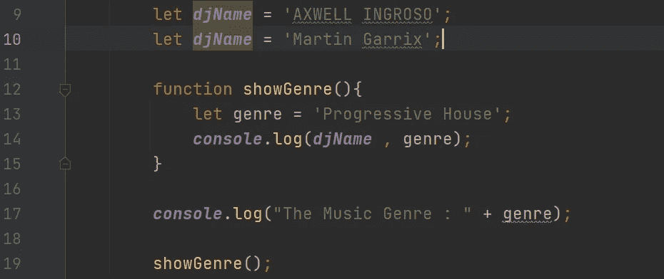*

*' let '不允许开发者重新声明一个变量。*

*我使用了相同的代码段，在第 10 行的**处，我重新声明了***【DJ name】***变量，如果我们执行这个文件，我们会得到一个错误提示，我们之前已经声明了***【DJ name】***变量。***

*感谢 ES6 的特性和它的*关键字，我们可以跟踪错误。**

**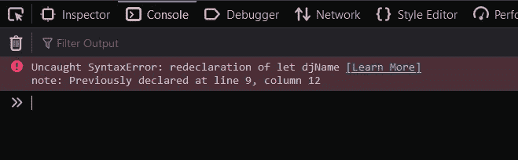**

****是，提示错误警告****

**是的，我们已经在 9 号线声明了。**

**现在让我们尝试使用***【var】***关键字做同样的事情。**(变量声明使用‘var’)****

**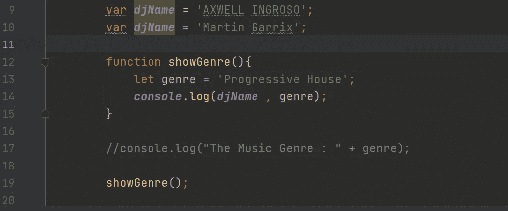**

****使用“var”重新声明变量****

**现在使用***【var】***关键字声明了***【DJ name】***变量，我已经使用***【var】***关键字在第 10 行重新声明了**。****

**现在让我们执行文件，看看输出。**

**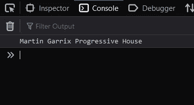**

**输出直接记录到控制台中。**

**现在我们可以看到，我们通常有输出，但这不可能发生。***【var】***没有帮助我们知道我们重新声明了变量。**

**所以这是代表***【var】***没有优化的证据。**

****需要考虑—** 在一个真实的场景中，想象你在整个程序中使用了***【var】***，如果你在代码中的某个地方错误地重新声明了一个变量，然后你使用该变量获得了一个有用的输出，你将会得到一个非常意外和错误的结果。所以永远记住不要使用***【var】***进行变量声明。**

****3。“var”很容易出错。****

**我们了解到***【var’***是**全局范围**，我们可以在代码中的任何地方访问使用***【var’***关键字声明的任何变量。**

**让我们看一个不同的例子如下。**

**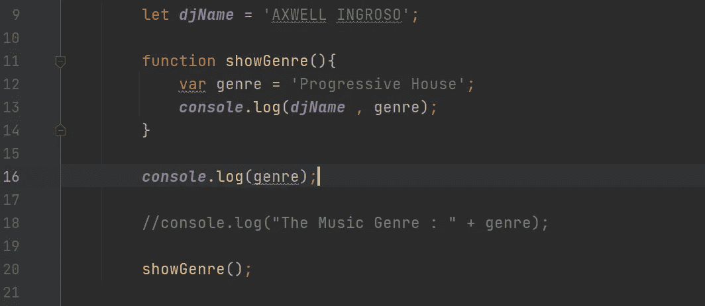**

****属于函数范围(在函数中声明)的“var”变量也不能被全局访问。****

**在这个例子中，我们试图记录***【genre】***的值，因为它是全局可用的，尽管它是在函数中声明的。**(该功能是对自身的封锁范围)****

**让我们执行文件，看看答案。**

**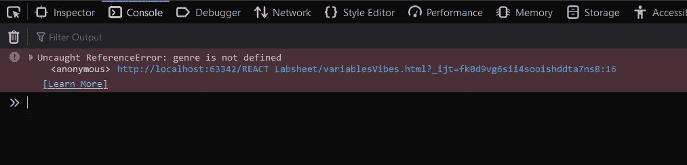**

****是，因为它是比“块范围”更大的函数范围****

**我们得到一个错误，根据该错误，我们仍然无法访问 ***【流派】*** 关键字，即使它是全球可用的。**

**这听起来很奇怪，但是不要担心，让我们看看另一个例子。**

**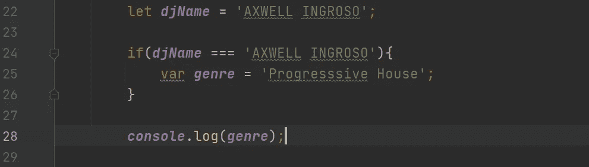**

****“流派”可以全局访问，因为它是在 if 条件(块范围)内声明的****

**在这组代码中，我在一个**if condition**中声明了变量***‘genre’***，并且我试图将它的值记录到控制台的**第 28 行**处。因为它是全局标识的，所以我们的期望是在控制台上看到值。**

**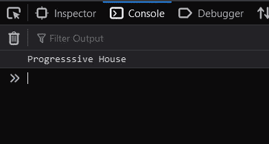**

****预期结果****

**正如我们所料，我们可以看到特定的 DJ 制作人的风格。**

**但是当它在函数中声明时，为什么我们不能访问它呢？🤔**

**有意义的是，即使两个函数和 if 条件都在自身的**块范围**内，我们也不能从外部访问在函数内部声明的***【var】***变量，但是我们可以访问在 **if 条件**和任何其他块范围内声明的***【var】***变量。**

**像怀斯一样，我可以举很多例子来说明***【var】***关键词有多容易出错，但是我不需要，因为现在我们已经有足够的证据来证明了。**

**所以，**

*****【var】*确实容易出错。🙃🎈****

****4。var 已经不再使用了。****

**既然***【var】***关键字会产生很多问题，既然最新的 Javascript 版本已经引入了*和***【const】***关键字，我们应该放弃***【var】***关键字，我们可以使用*和**来编写更可靠的代码******

******

***再见了，我们亲爱的老朋友，你是一颗宝石，但你有点笨拙😞😌***

# ***现在，让我们使用“let”和“const”使我们的功能变得清晰明了。***

***由于**‘AVICII’**是我最喜欢的艺术家，让我们试着只使用***‘let’***和***‘const’***关键字，将他的名字和他的音乐流派一起登录到控制台。***

**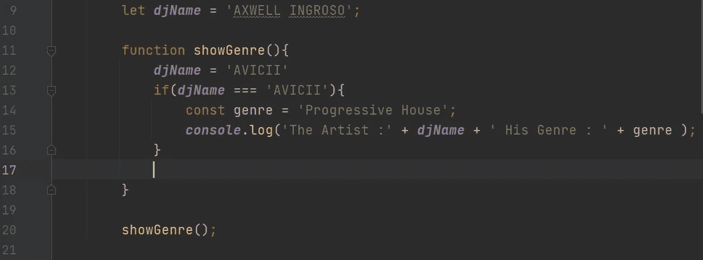**

****使用‘let’和‘const’的变量声明****

**现在让我们来看看这个程序的预期结果。**

**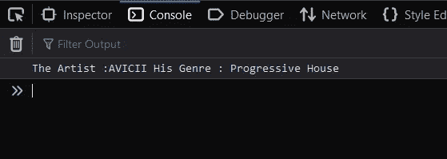**

**我们的预期结果:)**

**希望我们能得到答案。**

****现在我们已经完成了对“var”、“let”和“const”关键字的操作。😀😌****

**我希望现在你明白了使用 ***【让】*** 和 ***【常数】*** 而不是***【var】***的重要性。**

# **为什么‘var’还存在？🤔**

**你可能想知道为什么它仍然是可用的，即使它没有被使用？🤨**

**是的，是有原因的。**

*****【var】***关键字是自 Javascript 诞生之日起就存在的关键字。所以那个时代的网络开发也是使用 Javascript 的。**

**在 **ES6** 问世之前，开发者使用***【var】***来声明变量，他们已经用***【var】***开发了数百万个 web 项目和 web 应用。**

**由于那些旧的 web 应用和 web 逻辑仍然在运行，如果 Google 团队或其他浏览器供应商团队停止在其 Javascript 引擎中支持***【var】***关键字，那些遍布全球的 web 逻辑、**万维网(WWW)** 将停止工作，那将是一个更大的灾难。**

**这就是为什么在 Javascript 中***【var】***仍然存在而我们不再使用***【var】***的主要原因。**

**另一方面，既然 ES6 只是对现有 Javascript 的升级，那么*和***【const】***没有踢掉***【var】***就很有意义，因为升级并不意味着砍掉旧版本的功能。***

# **包裹**

**在本文中，我们讨论了在 Javascript 中用来声明变量的关键字***【var】******【let】******【const】***。**

**我们明白了使用***【let】***和*【const】*关键字而不是***【var】***关键字的重要性。**

**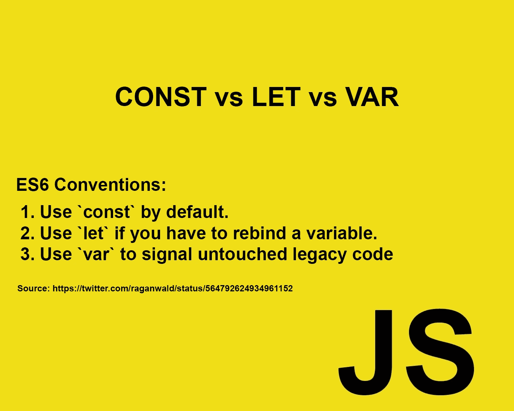**

****对使用“var”关键字声明的变量不进行处理。😇😃****

**我希望你喜欢这篇文章，也希望你获得了关于 Javascript 的知识。**

**请继续关注更多的 Javascript 或其他相关文章。我肯定会教你我在以前的文章中承诺的事情。**

****敬请期待& &用 Javascript 快乐编程。😀🔥🤘****

**谢谢大家！**