# Javascript 基础知识(第 4 部分)😃🔥

> 原文：<https://medium.com/nerd-for-tech/essentials-of-javascript-part-4-ac54110f5c55?source=collection_archive---------23----------------------->

console.log("Hello World ")😉

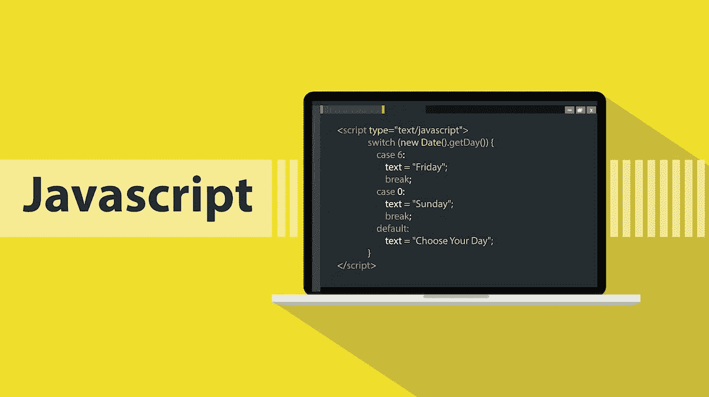

**一个简单的 Javascript 编码**

让我们深入了解每个开发人员都必须知道的 Javascript 的更多、最重要的方面。

为了最大限度地学习 Javascript，请在阅读本文之前查看我以前的 Javascript 文章。

请点击下面的链接来阅读这些文章。

 [## Javascript 基础知识:)(第 1 部分)

### 想了解 Javascript 吗？对你来说听起来像抽筋吗？不要担心，从头学起，得到它，然后…

medium.com](/nerd-for-tech/essentials-of-javascript-part1-2b59bc0ec6df)  [## Javascript 基础知识:)(第 2 部分)

### 生活中的好 Javascript😉🙌

medium.com](/nerd-for-tech/essentials-of-javascript-part-2-d7ee900cd57)  [## Javascript 基础知识(第 3 部分)

### Javascript 中三重宝石的故事— Let、Const、Var😉🔥

medium.com](/nerd-for-tech/essentials-of-javascript-part-3-c922d0cc8d87) 

现在让我们了解 Javascript 的其他最重要的方面是什么。

# Javascript 中的 DOM

DOM 代表文档对象模型。

文档对象模型是使用 HTML 编写的网页内容的另一种表示。

Javascript 不能通过 HTML 表示理解网页/ web 文档的结构。

一旦网页在运行时被执行，DOM 就在浏览器中被创建，并且它以更有意义的方式表示网页的结构，听起来像使用节点的树形结构(对象的树)。当涉及到 DOM 时，网页的每个元素最终都会变成节点。

一旦执行了一个网页，Javascript 就只能在浏览器中使用 DOM 来理解文档，以便对网页的属性进行操作。

让我们用一个编码例子来理解 DOM 的表示。

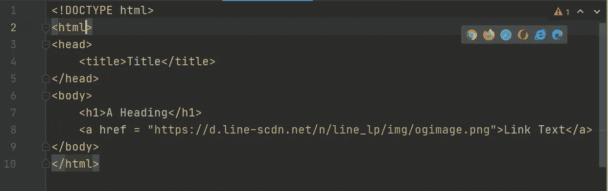

**一个使用 HTML 标记语言的网页创建示例，它只是一个文本表示**

这是 Javascript 无法识别的 html 表示，在浏览器中，该网页将被表示为 Javascript 能够理解的 DOM。

稍后，我们/ Javascript 将能够通过使用 DOM 来操纵这些属性。

让我们看看这个 web 文档的 DOM 表示。

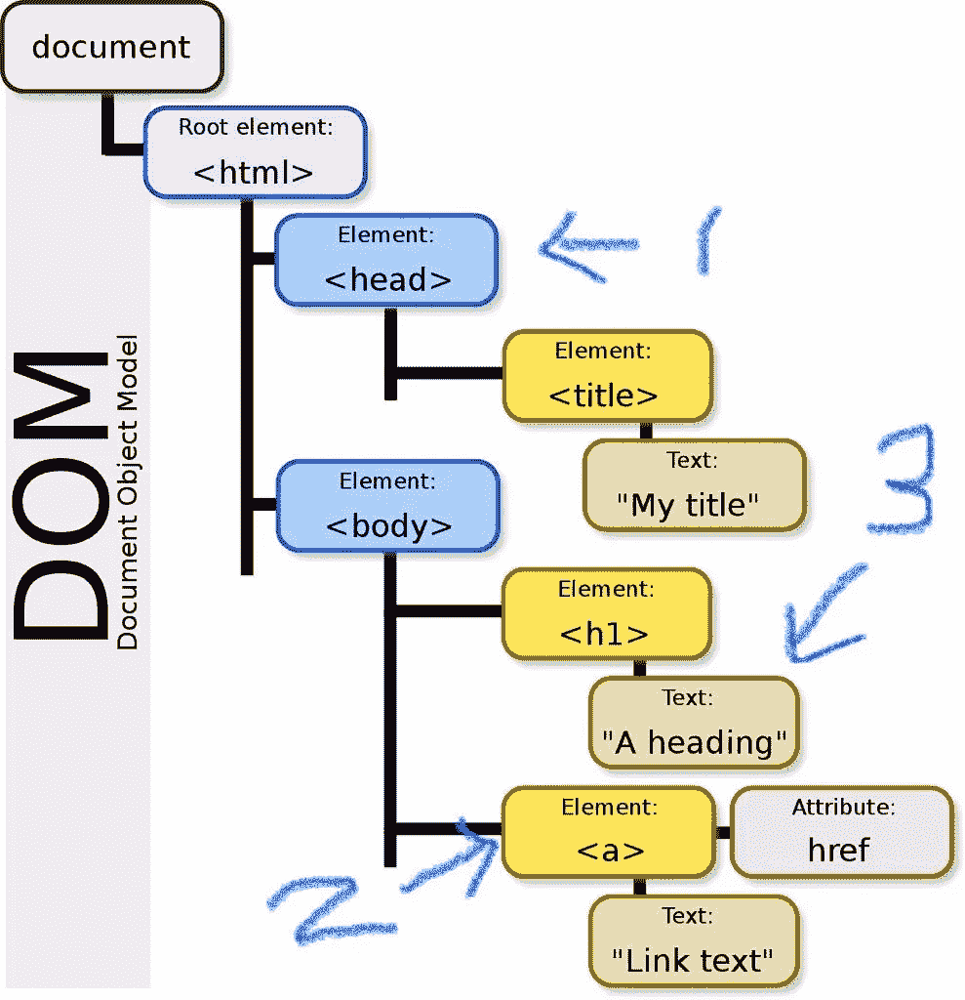

**代码段的文档对象模型。**

在这里，我们可以看到该 web 文档的树形结构。所有的元素都被标识为节点，并且所有的节点都被连接起来，这代表了一个树形结构。

这是文档对象模型的一个很好的例子。

节点有三种类型。根据我在图中所做的编号，

1-是一个元素节点

2-是属性节点

3-是文本节点

因此，根据上面的 DOM，您可以清楚地识别节点及其类型。

现在让我们来看看 MDN 文档提供的官方定义，这是开发人员主要参考的:)

> 文档对象模型(DOM)代表相同的文档，因此它可以被操作。DOM 是网页的面向对象表示，可以用 JavaScript 等脚本语言修改。 ***— MDN 网络文档***

为了获得更多关于 DOM 的知识，请参考他们的文档。

[点击这里](https://developer.mozilla.org/en-US/docs/Web/API/Document_Object_Model/Introduction)

最后，我们可以说文档对象模型将赋予 Javascript 以下权力，Javascript 将能够通过使用这些权力使网页更加动态。

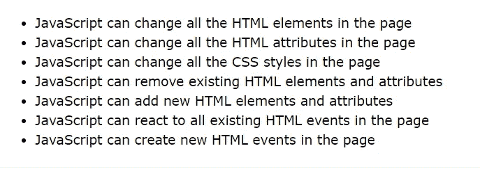

【Javascript 引用 DOM 能做什么，图片来源—[**W3Schools.com**](https://www.w3schools.com/js/js_htmldom.asp)

现在你知道什么是文档对象模型，它对 Javascript 很重要。:)

**你会成功的，永不放弃——一个 Javascript 笑话😉😝**

# Javascript VS Java

我们已经知道什么是 Javascript，我们也已经从以前的文章中学到了一些关于 Javascript 的历史。

Java 是一种强类型编程语言，不仅用于 web 开发，也用于许多其他需求。它通常与面向对象的概念一起使用。

Java 和 Javascript 根本不是类似的编程语言。它们是完全独立的编程语言，具有不同的语法和原理。

唯一的相似之处就像他们名字的发音。

**Java VS Javascript**

让我们来看看 Javascript 和 Java 之间的一些区别。

1.  Javascript 在浏览器中运行，但 Java 不在浏览器中运行。浏览器根本不支持。
2.  Javascript 是一种常用的编程语言，但 Java 是一种强类型编程语言。
3.  Javascript 是面向对象的脚本语言，但 Java 是面向对象的编程语言。
4.  Javascript 应用程序总是运行在浏览器上，而 Java 应用程序和程序运行在 Java 虚拟机上。需要将 JDK 和 JRE 安装到用于运行和开发 Java 应用程序的机器上。
5.  Javascript 仅被解释为脚本语言或纯文本，但 Java 程序被编译和解释为编程语言。
6.  正如我之前提到的，Javascript 主要用于 web 开发，但是 Java 可以用于各种任务。
7.  大多数浏览器都支持 Javascript，大多数操作系统都支持 Java。

现在你对这两种语言之间的区别有了很好的了解，现在你明白了 Java 和 Javascript 是两种不同的编程语言，分属于两种不同的船。

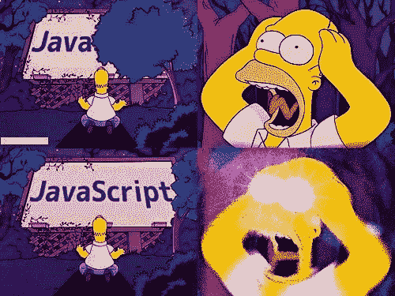

在这个阶段，你根本不需要担心 Javascript，因为你已经快完成了。😉😛

# 在 Javascript 中提升

提升是 Javascript 的一个特性。

**什么是吊装？**

一旦一个文档在浏览器中被执行，Javascript 就会识别出文档中所有的变量 declration，所有这些变量 declration 都会被取出并放在文件的顶部。

因此，我们将能够在代码中的任何地方访问这些变量，不管它们是在哪里声明的。

让我们从一个编码示例来理解它是如何工作的

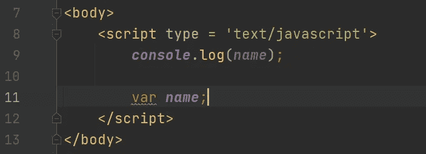

**在声明之前尝试控制台记录“名称”**

在这里的**第 11 行**，我们声明了一个名为**‘name’**的变量，并尝试将该变量记录到控制台的第 9 行**中。**

输出会是什么？

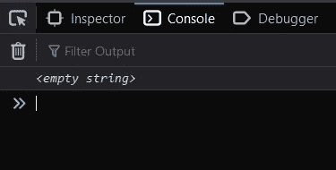

**输出**

根据输出，我们可以理解 Javascript 识别了**‘name’**变量，并且它识别出我们没有给该变量赋值。

因此，我们可以访问该变量，即使该变量是在 console.log 语句之后声明的。

当文件在浏览器中执行时，Javascript 只是识别变量声明，并将其从文档中取出，放在文件的顶部，我们希望可以访问该变量。

**需要考虑—** 变量的值不会被取出并放入 top 中，而只是变量的 declrations 会被取出并放入 top 中。

现在让我们再走一步，理解吊装。看看下面的代码段。

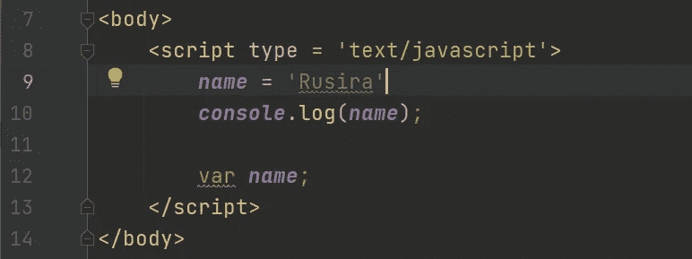

**感谢提升功能，我们可以为“名称”变量赋值**

现在我们试着给文件顶部的变量赋值，让我们看看它的输出。

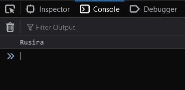

**输出**

根据吊装特征，我们可以看到**【名称】**变量的值。

Javascript 将抓取并把**‘name’**变量放到文件的顶部，因此，我们可以给这个变量赋值，也可以把它记录到控制台中。

**需要考虑—** 提升特性不仅仅是变量的原因，它对文档中的函数也很重要。

现在让我们考虑一下 Javascript 中函数的选择原因。

让我们声明一个命名函数，并在声明该函数之前尝试控制台记录它的返回值。

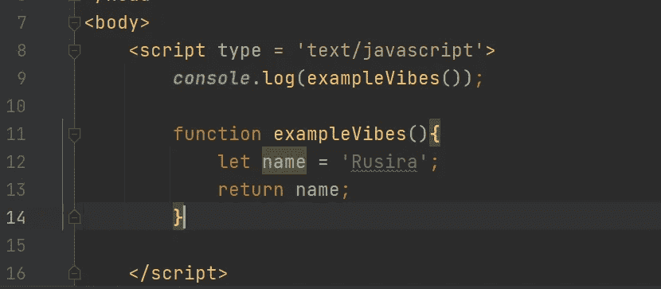

**试图在声明名称函数之前访问它**

你觉得怎么样？这将是有效的代码段吗？让我们来看看输出。

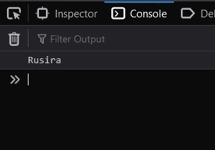

**输出**

是的，我们可以看到这个命名函数的返回值。

所有这些都是有意义的，Javascript 确实把命名的函数放到了文件的顶部，就像它对变量做的一样。:)

由于命名函数也被放在文件的顶部，这多少会降低执行文件的性能，我们可以通过在 Javascript 文件中使用匿名函数来避免这种情况。

Javascript 不会对匿名函数执行提升。

让我们来理解它是如何发生的。

请务必查看我以前的文章，以便了解什么是匿名函数:)

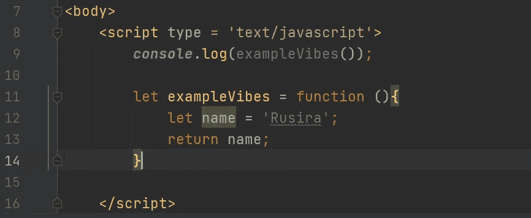

试图在声明匿名函数之前访问它。

这是匿名函数的语法，它没有名字，它只是被赋值给一个变量，通过()使用这个变量名，我们可以调用这个函数。

现在让我们看看输出

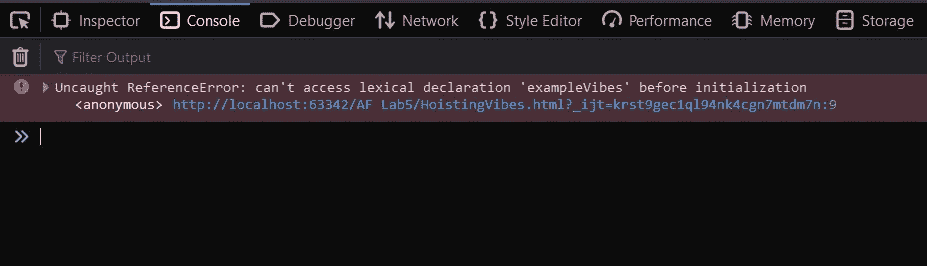

**匿名功能不会被挂起**

因此，根据输出中显示的错误，该函数未被识别，所有有意义的是，Javascript 不提升匿名函数，它节省了一些执行时间。

现在我希望你对 Javascript 的这个特殊提升特性非常清楚:)

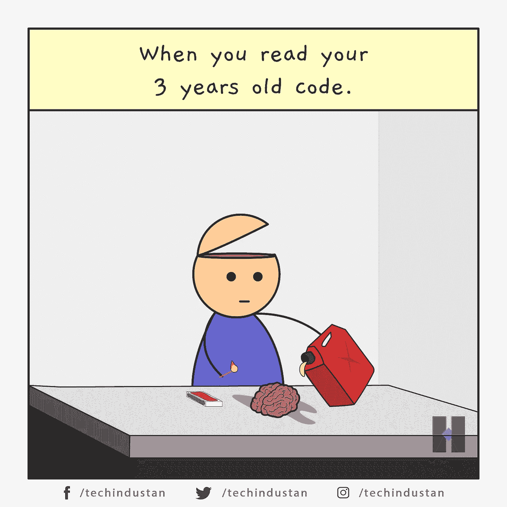

**Javascript 发展如此之快，继续练习语法——一个 Javascript 的小笑话😉😝**

# Javascript 中的闭包

闭包就是在函数内部声明函数。

函数内部的函数能够使用其母函数的属性和方法。

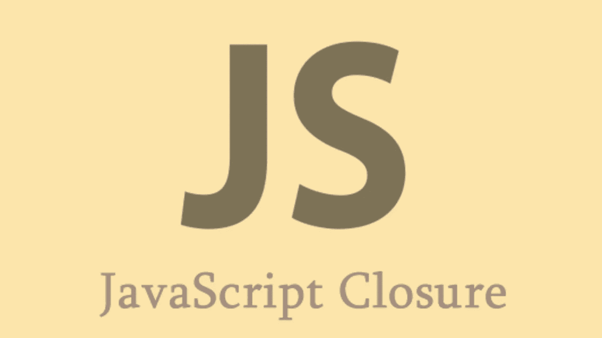

**Javascript 闭包——函数内部的函数**

我们通过一个编码的例子来了解一下。

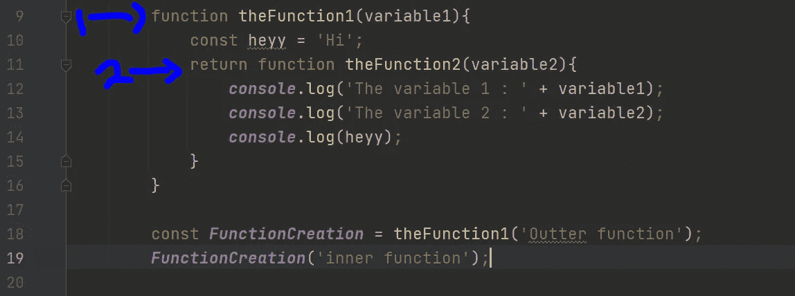

**外部功能和内部功能**

在这个程序中，你可以看到**‘函数 2’**函数在**‘函数 1’**函数中。我们在**‘the function 1’**函数中返回**‘the function 2’**函数。

当我们看到函数在函数内部时，我们可以说它是**【闭包】**

根据我用蓝色做的编号，

1 —这是外部函数

2 —这是内部函数

现在让我们看看它在控制台上的输出。

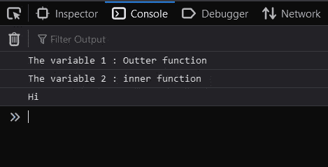

**输出**

在**第 18** 行，我们调用外部函数**(‘函数 1’)**，我们得到一个函数作为变量**‘函数创建’**的返回值，并使用那个变量，在**第 19** 行，我们调用内部函数**(‘函数 2’)**。

根据输出，我们可以清楚地看到，innerFunction 也可以访问 outerFunction 的参数和变量**‘heyy’**。

这是 Javascript 中闭包的特性。

现在让我们看看 MDN 文档给出的官方定义。

> 一个**闭包**是一个函数的组合，该函数被捆绑在一起(被封闭)并引用其周围的状态(**词法环境**)。换句话说，闭包允许您从内部函数访问外部函数的范围。在 JavaScript 中，闭包是在每次创建函数时创建的。”— [MDN 文档](https://developer.mozilla.org/en-US/docs/Web/JavaScript/Closures)

现在你知道 Javascript 中什么是闭包了。

**版本控制太可怕了——一个侧面的 Javascript 笑话**😛

# 原型

原型是我们在 Javascript 中创建的每个对象的特殊属性。

原型对象可以被称为**‘回退对象’**，因为如果我们在一个对象中搜索某个属性，而该属性实际上不在该对象中，它总是不会失败的。如果 Javascript identify as 某个属性不存在，它将搜索它在 prototype 属性中是否可用。

这就像一个链条。这意味着每个 protype 属性都有它的嵌套原型，Javascript 将进入所有嵌套原型直到找到那个属性。

因此，只有当属性不在任何嵌套的原型中时，它才会失败。

让我们来看看这个**‘prototype’**属性，我们使用一个**结构函数**来观察它的运行。

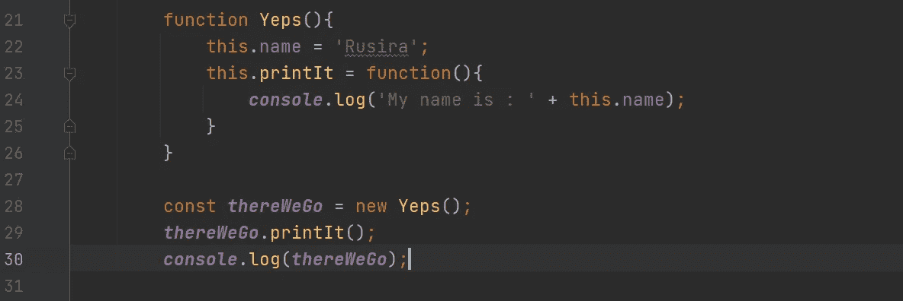

**从命名函数创建对象**

根据这个代码段，我们创建了这个结构函数的一个对象，并在调用函数的 printIt 方法的同时，将该对象登录到控制台的第 30 行。

让我们来看看输出。

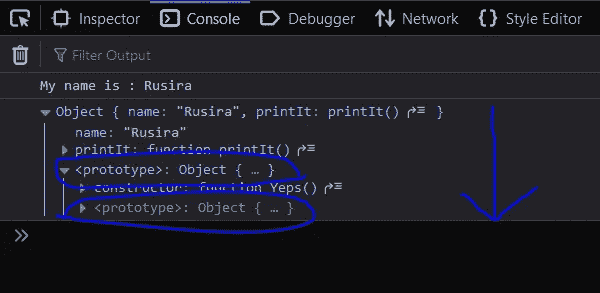

**原型链接**

根据输出，我们可以看到**‘Yeps’**函数对象，在该对象内部，我们可以看到 proto type 属性的存在，在该对象内部，我们可以再次看到 prototype 属性，就像 wise this hapends 一样以嵌套的方式出现。

您可以看到，我已经用蓝色圈出了原型属性。

**在对象的原型内部声明属性。**

现在让我们将一个变量放入 prototype 属性中。看看下面的代码段。

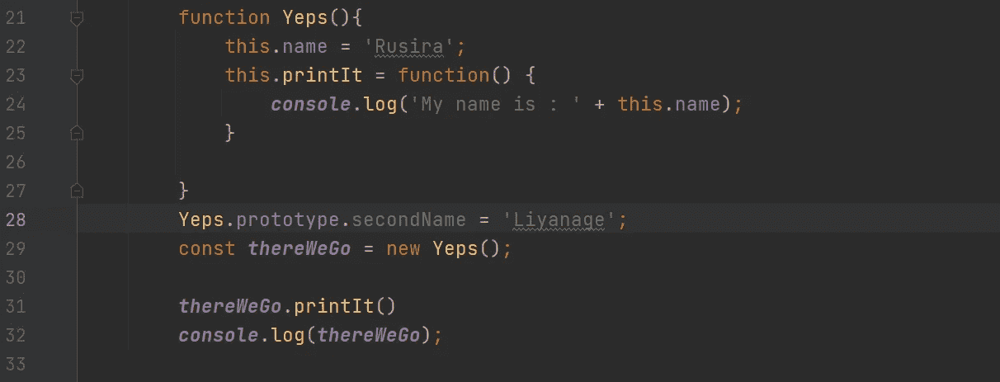

**在“原型”属性内声明变量**

**在第 28** 行，我们将**‘second name’**变量放入显示我名字的原型属性中。现在我们来看看输出。

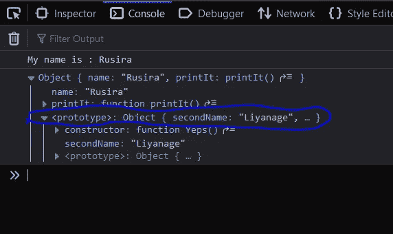

**‘second name’变量只存在于‘Prototype’属性中**

现在，最近声明的变量不像往常一样可用。我们只有在扩展 protype 属性时才能看到它，因为我们在该对象的 prototype 属性中声明了**‘second name’**变量。

像 wise 一样，我们也可以在任何嵌套的原型属性中声明任何内容。

原型的主要优点是，它允许您轻松地为特定对象的所有实例定义方法。

现在我希望你非常清楚 Javascript 中的原型:)

# 使用严格的关键字

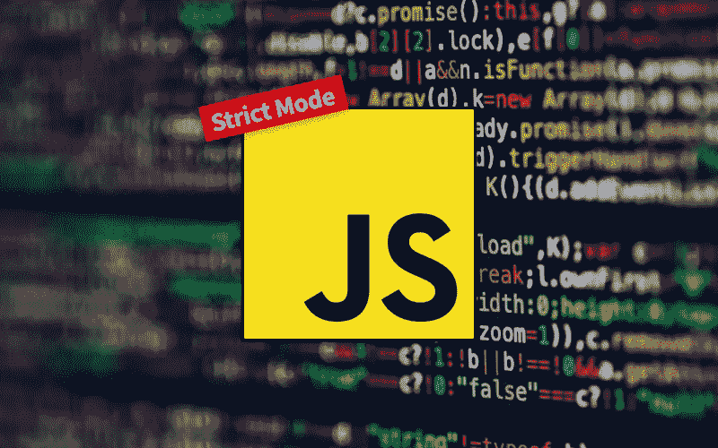

**Javascript 中的严格模式**

**Javascript 是一种宽容的语言，它意味着什么？**

这意味着即使我们犯了一些语法错误，Javascript 也不会介意，它会自动解决错误，并在代码段执行后向我们显示预期的结果。

**‘use Strict’**关键字将关闭宽容特性，而**‘use Strict’**关键字将打开 Javascript 中的**严格模式**。

当我们处于严格模式时，如果代码中有任何错误，一旦代码段被执行，Javascript 肯定会向我们提示错误。

当我们处于严格模式时，我们也有能力做一些严格的事情。

让我们用一个编码例子来理解**‘使用严格’**。

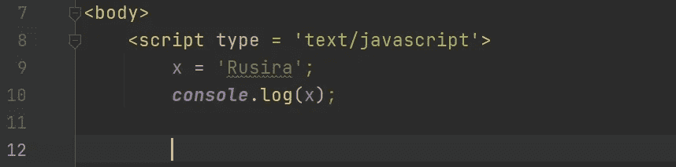

**直接给变量赋值而不声明。**

这是说明 Javascript 是一种宽容的语言的最好例子。我们还没有声明**‘x’**变量，但是我们可以在控制台上看到它的值，如下图所示。

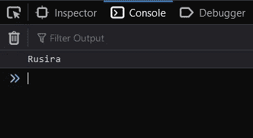

**输出**

现在让我们使用**‘使用严格’**关键字进入严格模式。

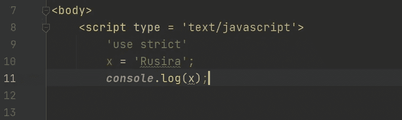

**Javascript 中的严格模式**

现在会发生什么？让我们来看看输出。

**严格模式会扼杀 Javascript 的宽容品质**

根据输出和他们给我们显示的错误，我们实际上在代码中给变量赋值之前没有对变量进行十进制化。所以严格模式扼杀了 Javascript 的宽容行为。

严格模式有几个限制，为了理解它们，请查看 W3school 网站关于**‘使用严格’**关键字的解释。查看下面的链接。

[https://www . w3schools . com/js/js _ strict . ASP #:~:text = The % 20% 22 use % 20 strict % 22% 20 directive % 20 was，for % 20 example % 2C % 20 use % 20 undeclared % 20 variables](https://www.w3schools.com/js/js_strict.asp#:~:text=The%20%22use%20strict%22%20directive%20was,for%20example%2C%20use%20undeclared%20variables)。

这基本上就是**‘用严’**的内容，让我们查阅一下开发者参考最多的 MDN 文档，以便掌握关于**‘用严’**的官方信息。查看下面的链接

 [## 严格模式- JavaScript | MDN

### ECMAScript 5 中引入的 JavaScript 的严格模式是一种选择 JavaScript 的受限变体的方式，因此…

developer.mozilla.org](https://developer.mozilla.org/en-US/docs/Web/JavaScript/Reference/Strict_mode) 

**‘使用严格’**是关于在 Javascript 中使用严格模式的，现在我希望你对它非常清楚。:)

一个次要的笑话😉😛

# Getters 和 Setters

谈到 Javascript 中的面向对象编程，Getters 和 Setters 是它的主要部分。

**什么是吸气剂？**

Getters 用于返回一些赋值给变量的值。

**什么是 Setters？**

设置器用来给变量赋值。

**getter 和 setter**不仅在 Javascript 中使用，也在其他面向对象的编程语言中使用。

让我们使用一个编码示例来简单理解它们的语法。

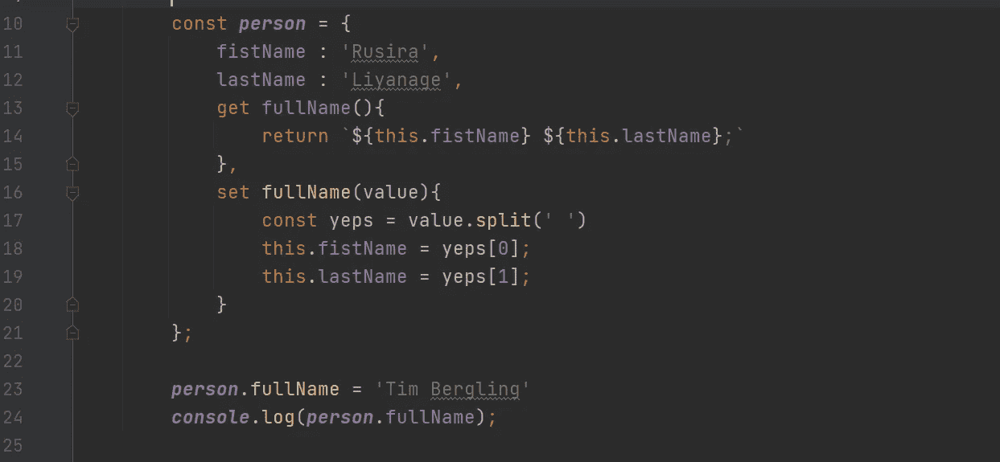

**获取数据的获取器和分配数据的设置器**

在这个代码示例中，我们尝试使用名为**‘person’**的对象将一个人的全名记录到控制台中

在第 13 行你可以看到**‘get’**关键字。它用于在 Javascript 中定义一个 **getter** 。

**在第 16 行**可以看到**‘set’**关键字。它用于在 Javascript 中定义一个 **setter** 。

通过使用**‘get’**，我们定义了一个名为**‘full name’**的 getter，它返回一个人的全名。

通过使用**‘set’**，我们定义了一个名为**‘full name’**的 setter，它将值依次分配给**‘first name’**和**‘last name’**属性。参数**‘值’**用于传递一个人的全名，使用 **split()** 方法我们可以将该字符串分成两部分。

**第 23 行**清楚地告诉你，如何调用一个 setter，因为 getters 返回一些东西，我们控制台记录那个值到控制台**的第 24 行。**

现在让我们看一下 MDN 文档中关于**getter 和 setter**的官方文档，请务必也参考它们。

 [## getter - JavaScript | MDN

### get 语法将一个对象属性绑定到一个函数，在查找该属性时将调用该函数。的名字…

developer.mozilla.org](https://developer.mozilla.org/en-US/docs/Web/JavaScript/Reference/Functions/get)  [## setter - JavaScript | MDN

### set 语法将对象属性绑定到试图设置该属性时要调用的函数。的…

developer.mozilla.org](https://developer.mozilla.org/en-US/docs/Web/JavaScript/Reference/Functions/set) 

现在你知道什么是 Getters 和 Setters 了。:)

开发人员的想法就像一个侧面的 Javascript 笑话😉😝

# 工厂函数与构造函数

这是定义函数的两种方式，工厂函数只是用来调用的，而构造函数是用来从它们创建对象的。

让我们来看看**工厂函数的语法。**

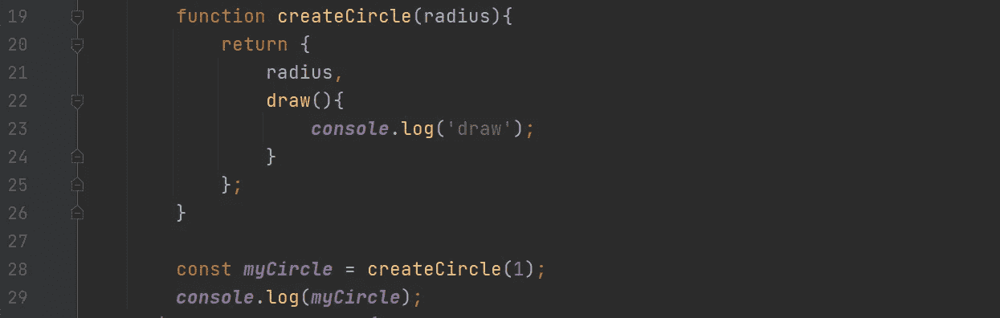

**工厂函数的语法**

这是工厂函数的语法。

这个**‘create circle’**函数返回一个对象，同时获取一个圆的半径作为参数。

我们在第 28 行直接调用这个函数**，同时将圆的半径作为参数传递。(参数)这清楚地显示了创建工厂函数对象的语法。**

通常在工厂函数中，当定义函数名称时，**该名称的起始字母**将是一个简单的字母**。**

现在让我们来看看**构造函数的语法。**

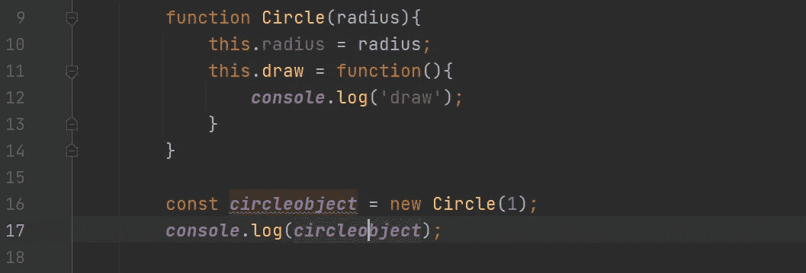

**构造函数的语法**

在这个构造函数中，你可以清楚地看到名字**‘Circle’**的起始单词是以一个**大写字母**开始的。你必须使用函数的首字母作为大写，这是构造函数的特殊语法。

**在第 16 行**，我们从那个函数创建了一个对象，从构造函数创建对象的特点是，我们使用**‘new’**关键字。

通过使用**‘new’**关键字，我们把那个**‘Circle’**函数变成一个对象，并把它保存在你的头脑中:)

**有什么区别？**

在工厂函数中，我们直接调用那个函数，但是在构造函数中，我们从它们创建一个对象。

**选什么？**

现在你可能会想，使用 Javascript 函数的最佳方式是什么，这要视情况而定。你可以使用任何技术，但缝到一个方法，并完成你所有的东西:)

我希望你清楚这些函数类型之间的区别。:)

# 包裹

在本文中，我们讨论了很多关于 Javascript 最重要的方面。

在我们结束这篇文章之前，让我们回顾一下通过这篇文章我们学到的东西。

1.  Javascript 中的 DOM
2.  Javascript VS Java
3.  提升
4.  Cloursure
5.  原型
6.  使用严格的关键字
7.  Getters 和 Setters
8.  工厂函数与构造函数

我希望你喜欢我的文章，我总是说，为了成为一名高级开发人员，尝试自己编写 Javascript。

有什么建议或不清楚的地方吗？你知道该怎么做吗😉

注意安全，在网上学习一切，相信我，你会成长的😌❤️

请继续关注更多关于软件工程、编程、Javascript 和任何与信息技术相关的文章。

在我的下一篇博文中再见，在那之前，

用 Javascript 快乐编程😃👌

谢谢大家！