# Javascript 基础知识:)(第 1 部分)

> 原文：<https://medium.com/nerd-for-tech/essentials-of-javascript-part1-2b59bc0ec6df?source=collection_archive---------9----------------------->

想了解 Javascript 吗？对你来说听起来像抽筋吗？不要担心，从头开始学习，掌握它，喜欢用 Javascript 开发。你得到了这个:)

**Javascript 和简单编码的样子**

# Javascript 是什么？

Javascript 是当今最流行和广泛使用的编程语言之一，用于开发 web /移动应用程序、实时网络应用程序、命令行工具、游戏等。

Javascript 是一种在运行时编译的**动态**、**弱类型**编程语言。它既可以在浏览器端执行，也可以直接在任何机器(主机环境)上执行。

**动态—** Javascript 是一个非常动态的东西。在程序运行时，可以修改变量类型，向现有对象添加新方法和属性。这种动态行为是 Javascript 的特性，而其他大多数语言都是静态的，这与 Javascript 的确切用法产生了共鸣。Javascript 代码只有在执行时才会被评估。

**弱类型化—** Javascript 理解程序中的数据类型，用户不需要显式定义任何变量的类型。举个例子，如果我们初始化一个像 **let b = 'Yeps Yeps'** 这样的变量，javascript 会将*变量 b* 理解为一个字符串类型，如果一个变量被定义为 **a = 12** ，javascript 会将*变量 a* 的类型理解为一个整数。数据类型由 Javascript 假设，稍后我们也可以改变变量 **a** 和 **b** 的初始化。

Javascript 的创建是为了使网页更具动态性和反应性，从而实现和提升网络服务的用户友好性。使用 HTML 和 CSS 创建和设计的静态页面不足以使网页更具交互性和吸引力，这就是 Javascript 出现的原因。

根据我们使用 Javascript 的方式，作为简单而不使用任何框架的标准语言，Javascript 也可以称为 ***Vanila Javascript。记住这一点:)***

这基本上就是 Javascript:)

现在，让我们来看看全球公认和理解的 Javascript 的一些定义。

> **" JavaScript**([/ˈdʒɑːvəˌskrɪpt/](https://en.wikipedia.org/wiki/Help:IPA/English))，[【8】](https://en.wikipedia.org/wiki/JavaScript#cite_note-8)通常简称为 **JS** ，是一种符合 [ECMAScript](https://en.wikipedia.org/wiki/ECMAScript) 规范的[编程语言](https://en.wikipedia.org/wiki/Programming_language)。[【9】](https://en.wikipedia.org/wiki/JavaScript#cite_note-tc39-9)JavaScript 是[高级](https://en.wikipedia.org/wiki/High-level_programming_language)，往往是[即时编译](https://en.wikipedia.org/wiki/Just-in-time_compilation)，多范式。它有[花括号语法](https://en.wikipedia.org/wiki/List_of_programming_languages_by_type#Curly-bracket_languages)、[动态类型](https://en.wikipedia.org/wiki/Dynamic_typing)、[基于原型的](https://en.wikipedia.org/wiki/Prototype-based_programming)、[面向对象的](https://en.wikipedia.org/wiki/Object-oriented_programming)、[一级函数](https://en.wikipedia.org/wiki/First-class_function) [***—维基百科。*T34**](https://en.wikipedia.org/wiki/JavaScript)
> 
> **“JavaScript**(**JS**)是一种轻量级的，解释型的，或者说[即时型](https://en.wikipedia.org/wiki/Just-in-time_compilation)编译型的编程语言，具有[一流的功能](https://developer.mozilla.org/en-US/docs/Glossary/First-class_Function)。虽然它作为网页脚本语言最为人所知，但是许多非浏览器环境也使用它，比如 Apache CouchDB 和 Adobe Acrobat。JavaScript 是一种基于[原型的](https://developer.mozilla.org/en-US/docs/Glossary/Prototype-based_programming)、多范例、单线程的动态语言，支持面向对象、命令式和声明式(例如函数式编程)风格。阅读更多关于 JavaScript 的[。”](https://developer.mozilla.org/en-US/docs/Web/JavaScript/About_JavaScript) [***— MDN 网络文档。***](https://developer.mozilla.org/en-US/docs/Web/JavaScript)

# Javascript 是如何执行的？

Javascript 有两种执行方式。

1.  通过浏览器的 Javascript 运行时环境。
2.  在本地机器中。

浏览器上是怎么发生的？

*   大多数浏览器都内置了特定的 Javascript 引擎。
*   **作为第一步**，Javascript 引擎在浏览器中执行时解析、读取并理解 Javascript 代码。
*   **第二步**，代码将被转换成机器代码，帮助机器快速运行，因为机器语言是机器(pc)直接理解的。
*   **作为第三步**，代码将被执行，我们将能够在浏览器中看到我们程序的效果/结果:)

***大多数流行浏览器的 Javascript 引擎。***

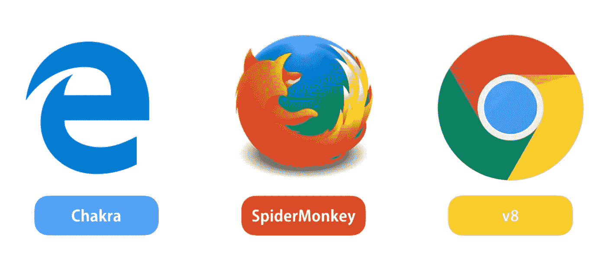

**广泛使用的浏览器的 Javascript 引擎。**

**如何在本地机器上运行？**

*   Javascript 程序可以在节点服务器中随时执行。
*   现在你可能会问自己，节点是什么？node 是一个 javascript 运行时环境，使用可以随时安装在任何 pc 上的 node 服务器，我们可以简单地执行任何 Vanila JavaScript 程序。
*   如果你想深入学习 node，一定要投入到专门的课程中:)如果你对后端开发非常感兴趣，那里会有很多有趣的东西。

# Javascript 的简史(必须知道😉)

*   1995 年，Netascape 推出了“LiveScript ”,后来被称为“Javascript”
*   1996 年，微软在 internet explorer 中也推出了自己的 Javascript 版本。与第一版语法相同，但也有一些不同。

回到那个时代，Javascript 还没有得到很好的优化，使用 Javascript / LiveScript 还做不了多少事情。它只是用于垃圾邮件，弹出窗口，恼人的覆盖等。

那个时代的主要问题是，开发者/用户必须为不同的浏览器编写不同的脚本。

*   为了解决这些问题，1996 年底，Javascript 编程语言被提交给 ECMA 委员会，以使 Javascript 标准化。
*   标准化过程发生在 1997 年至 2005 年和 2006 年至 2011 年之间，微软也参与了标准化。

所以现在我们终于有了标准化的 Javascript 感谢 [**ECMA 国际组织**](http://www.ecma-international.org/) **，**它可以在任何浏览器中执行和开发，无需任何特定的脚本。

*   该组织还向 evlove 陈述了一种叫做 ECMAScript 的语言，Javascript 是 ECMAscript 最著名的实现。
*   浏览器供应商(Google 和 Crome，Mozila 和 FireFox)在他们的 JS 引擎中实现了这个 ECMAStandard。
*   每个浏览器都有自己的 Javascript 引擎，支持根据 ECMA 规范执行 Javascript。

因此，当谈到 2015 年时，JavaScript 显示了一个重大的变革，一个有很多具体变化的全新版本，这是我们从 2015 年到现在一直使用的全新版本。根据 ECMA 的规范，这个最新的 Javascript 版本被称为 **ES6。**

**由 ECMA 国际组织引入并管理的最新版本 ES6。**

所以，这就是你需要知道的关于 Javascript 的全部历史:)

# Javascript 是同步语言还是异步语言？

到目前为止，我们已经对 Javascript 有了很好的了解，现在是时候进入更多关于 Javascript 的技术层面了。是时候了解 Javascript 是以同步方式还是异步方式运行了:)

你怎么想呢?….

在理解之前，让我们试着弄清楚编程语言的同步行为和异步行为是什么意思？

如果一种编程语言表现为同步的，这意味着当一个编程代码段被执行时，一个特定的代码段会等待，直到先前执行的代码段完成它的执行。

如果一种编程语言表现为异步的，这意味着当一个编程代码段被执行时，一个特定的代码段不会等到先前执行的代码段完成它的执行。

***那么，Javascript 的行为是同步的还是异步的？***

让我们使用一个编程示例来解决这个问题。

请看下面这段代码。

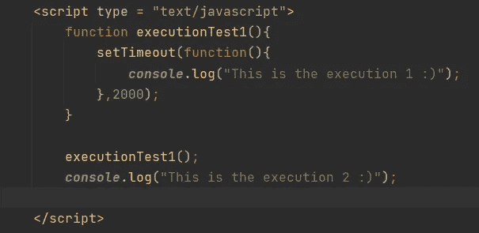

**我们在窗口中调用 console.log()之前的“exectionTest1()”函数。**

在这个小 Javascript 程序中，我们定义了一个名为***“execution test1”***的函数。在函数内部，也定义了 setTimeout 函数，在该函数内部，我们控制台记录字符串，**'这是执行 1 :)'**

在我们声明了***【execution test 1】***函数之后，我们调用它，一旦我们调用它，浏览器支持的超时函数就被执行，一旦 2 秒过去，字符串，*'****This is execution 1:)'***应该被打印出来。除了在控制台日志中显示该字符串，这是 executionTest1()函数的结尾，作为下一步，应该执行程序结尾的最后一条控制台日志语句，我们将能够看到字符串***‘这是执行 2:’***作为下一条和最后一条。

根据我们的预期和我们看到的程序执行情况，输出应该如下所示

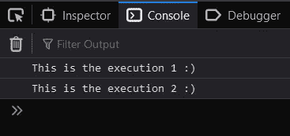

**我们的期望**

**无论如何，这不是我们真正得到的结果:(**

下面我们来看看真实的输出。

**我们得到的真实正确的输出**

根据我们得到的实际输出，所有有意义的是，即使 executionTest1()函数首先执行，在函数执行完成之前，函数外部的最后一个控制台日志语句也已执行。所以 Javascript 不会等到第一次执行完成，因为它在一个用于创建超时的 setTimeout 函数上。

从这个例子中我们可以得出，

Javascript 是一种异步编程语言。:)

Javascript 的异步行为是一个重要的方面，其他大多数编程语言都有同步行为。

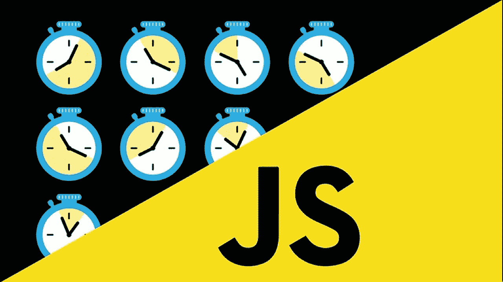

在 Javascript 中等待永远不会发生

# Javascript 是一种单线程编程语言

Javascript 一次可以执行一段代码，这就是 Javascript 中的单线程。Javascript 引擎只有一个线程，包括调用堆栈和内存堆。

因为 Javascript 是单线程的，它不能同时执行多个代码段，所以它应该有一个同步的行为。

根据同步的行为，我们知道它会等到之前执行的代码集完成，但是根据本文的最后一部分，我们知道 ***Javascript 是一种异步编程语言。*(永不等待)**

我知道现在这对你来说有点尴尬，但正如我一直说的，不要担心，让我们来解决这个问题:)

这是 Javascript 的特殊行为，即使它是单线程的，也不是同步的。那么它是如何一次执行一个程序中的很多代码段的呢？正如我们在本主题的最后一部分已经看到的。

是的，由于浏览器中 Javascript 引擎的可靠性和优化，这种异步行为已经成为现实。在浏览器的 JS 引擎中有一个谦虚技术的背后。

让我们看看 Javascript 引擎是如何做到这一点的。

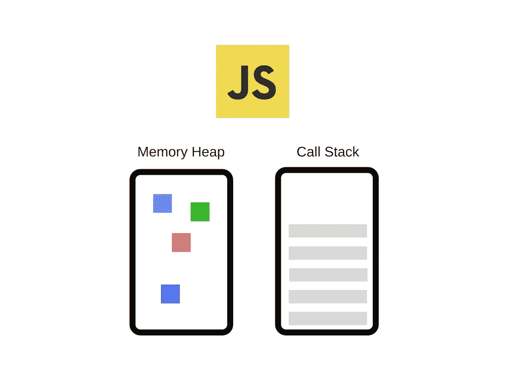

**Javascript 引擎中的内存堆和调用栈**

Javascript 引擎是三个不同部分的集合。

1.  调用栈
2.  Web API
3.  回调队列。

看看下面这张图。

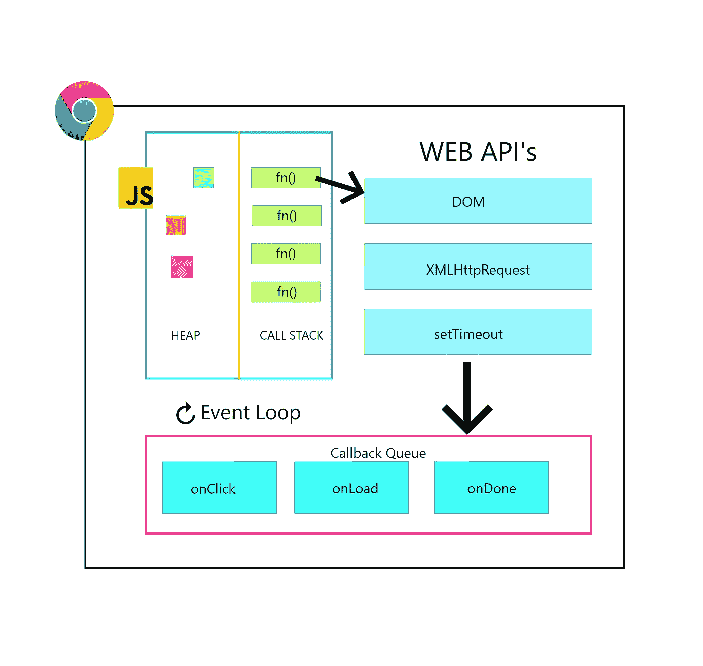

Javascript 引擎及其调用栈、Web API 和回调队列。

为了理解 Javascript 引擎是如何一次执行几行代码的，让我们看看下面的例子。

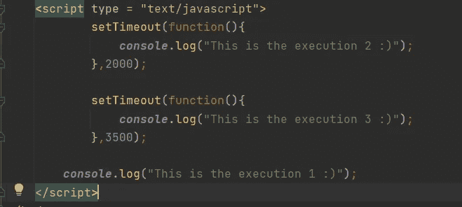

**一个有两个 setTimeout 函数和一个简单控制台日志的程序。**

现在我们已经知道，Javascript 是异步的，当这两个 setTimeout 函数都被执行时，当超时发生时，最后一个控制台日志将被执行，其他控制台日志也将被顺序执行。

让我们看看我们的预期和实际输出，如下图所示。

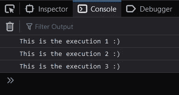

**感谢 Javascript 引擎的功能**

这就是我们想要的结果。🙂

那么 Javascript 引擎如何处理这类程序呢？让我们在几个步骤之内理解它。确保你已经在脑海中勾勒出了 Javascript 引擎内部的视图。(Crome 的 V8 one——看上图)

**步骤 1 —** Javascript 引擎将从上到下查看代码，并识别上面程序中的每个编码元素。

**步骤 2 —** 第一个***【setTimeout】****函数*** 将被取到 **WEB API** 中并开始执行。**

**Step3 —** 第二个***【setTimeOut】函数*** 将被取到 **WEB API** 中并开始执行。

**步骤 4 —** 最后一个 ***“控制台日志”语句*** 将被提取到**调用堆栈**中并开始执行，由于它是立即执行的，我们将能够看到第一个输出为**‘这是执行 1:’**。一旦它的执行完成，它将从**调用堆栈中删除。**

**Step5 —** 一旦第一个取出的 setTimeout 函数在 **WEB API** 中完成，它将被推入回调队列。

**Step6 —** 一旦它进入回调队列，它也将被推入**调用栈**，一旦它在**调用栈**中可用，我们将能够看到它的输出为，**'这是执行 2:'**

**步骤 7 —** 一旦第二次取出的 setTimeout 函数在 **WEB API** 中完成，它也会被推入**回调队列**中**。**

**步骤 8 —** 与步骤 6 相同，输出将从回调队列进入**调用堆栈，我们将能够看到最后的输出为**‘这是执行 3:’****

**记住—** 一旦一个执行从**调用栈**中执行出来，它将同时从**调用栈**中删除，如上面第 4 步。

这就是为什么，Javascript 引擎通过使用它自己的 ***技术，表现得像是在做 ***多线程*** 。*** 引擎总是将 setTimeout 函数或包含 setTimeout 函数的函数放入 **WEB API** 中，同时其他执行将在**调用栈中发生。**

我希望你非常清楚 Javascript 是如何做到这一点的，因为 ***是一种单线程编程语言。*:)**

如果有不清楚的地方，请务必在评论区告诉我:)

# 什么是 Javascript 框架？

Javascript Framework 是 Vanila Javascript 工具和库的集合，它们被配置为协同工作，以帮助开发人员更快、更容易地创建动态、有吸引力的 web 应用程序。

Javascript 初学者可以很容易地理解 web 应用程序是如何创建的，以及如何使用核心逻辑，使用 Javascript 框架使 web 应用程序更具动态性和吸引力。

如果您正在考虑使用 Javascript 框架开发非常实用且有吸引力的 web 应用程序，我建议您首先了解 Vanila Javascript 的基础知识。理解 Vanila Javascript 的核心逻辑和概念是使用 Javascript 框架进行 web 开发的第一步。

在我的下一篇文章中，我将教你一些每个开发人员都必须知道的 Vanila Javascript 的编码概念。所以请继续关注我的下一篇 Javascript 文章。:)

**业界主要使用的 Javascript 框架有哪些？**

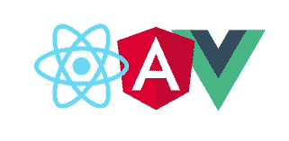

**反应角和 vue**

如上图所示，React、Angular 和 Vue Js 是当今最常用和最流行的 Javascript 框架。

**反应过来**

React 是全球公认的最流行的 Javascript 框架，是由在 ***脸书公司*** 工作的一位名叫 ***乔丹·沃克*** 的工程师发明的。React 作为脸书公司的一个项目出现在业界，因为发明者是他们的合作伙伴。

React 不仅仅是一个人表演的结果，react 有一个专门的团队，他们一起工作来保持这个框架。为了了解它，请务必查看此链接— [团队(反应)](https://reactjs.org/community/team.html#:~:text=React%20was%20originally%20created%20by%20Jordan%20Walke.)

React 允许开发人员创建大型 web 应用程序，并且无需重新加载 react 页面，就可以更改它的数据。关于 web 应用程序的开发，React 的主要目标是快速、可伸缩和可靠。

**需要考虑—** *React 不是一个框架，它是一个库，它之所以被称为框架，是因为它像框架一样帮助开发人员制作 web 应用程序。所以把它记在你的脑海里，并把它当成一个“图书馆”:)*

**棱角分明的**

> Angular 是一个使用 HTML 和 TypeScript 构建单页面客户端应用程序的平台和框架。Angular 是用打字稿写的。它将核心和可选功能实现为一组类型脚本库，您可以将其导入到您的应用程序中。”— [*棱角分明官方定义*](https://angular.io/guide/architecture)

如果有多个开发人员在一个 web 开发项目中一起工作，Angular 是最合适的，因为他们可以为他们的项目使用一个 [GIT](https://github.com/) 存储库，并在该存储库上工作以集成最终的 web 应用程序。

**Vue JS**

Vue 是最适合初学者入门的框架，因为对逻辑和东西的理解比 Javascript 的其他框架稍微容易一些。

**其他 Javascript 框架**

除了这三个广泛使用的框架之外，还有很多 Javascript 框架可用，其中大多数并不流行，但也有人使用:)

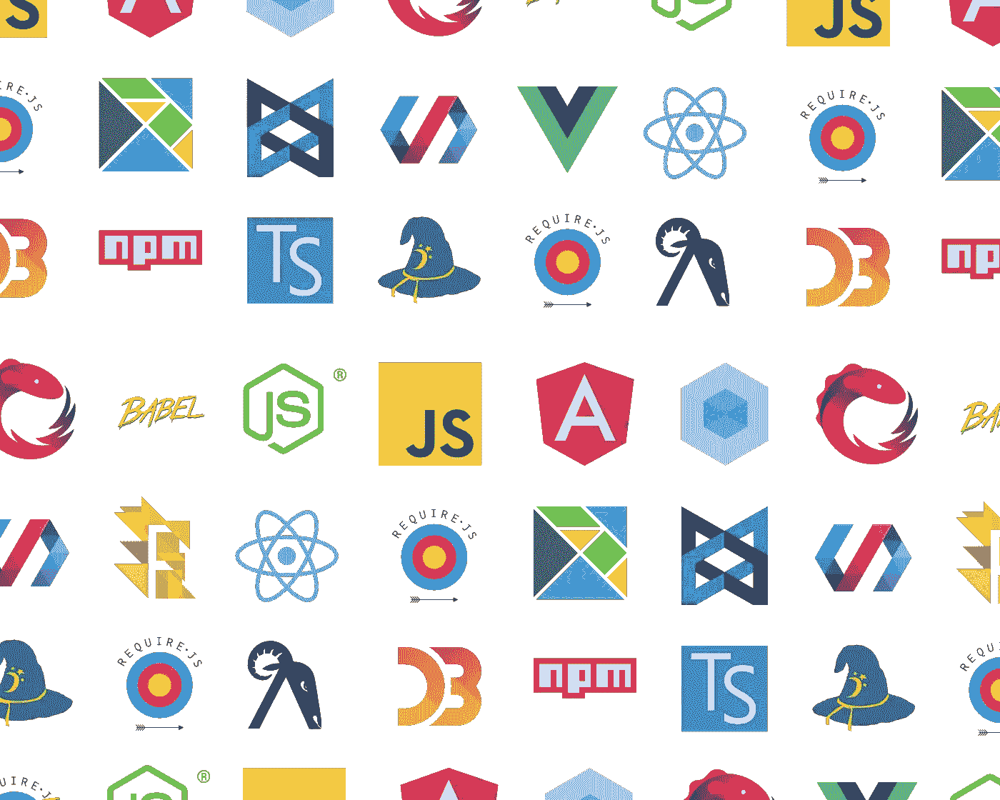

**Javascript 框架**

# 什么是 Javascript 库？

Javascript 库是预定义代码段的集合，它为程序提供功能。我们可以使用 Javascript 库来完成我们的 Javascript 程序/代码中需要的一些需求。

***我们来看一些例子。***

1.  我认为你需要验证一个电子邮件地址，为此我们可以使用预定义的名为***‘email-validator’***的 Liabary，如下图所示。

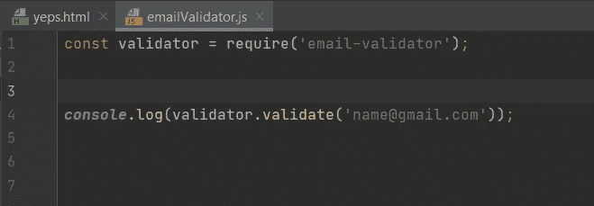

**返回 true，因为电子邮件地址是正确的**

2.React 是一个库。

React 是一个库，尽管它就像一个框架，但在当今的 web 开发中却被广泛使用。

在每个 react 项目中，我们在***【index . js】***文件中使用‘React’作为库，如下图所示。

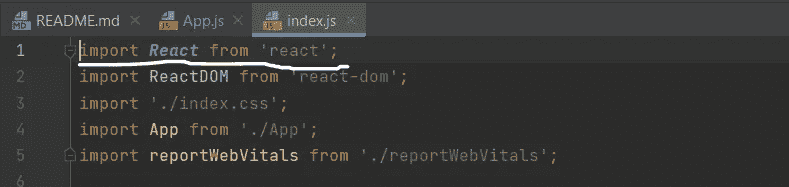

**React 项目的 index.js 文件**

所以这些库提供了可重用性:)

为了找到更多的 Javascript 库，我推荐你查看这个[链接](https://getflywheel.com/layout/best-javascript-libraries-frameworks-2020/#libraries)。有这么多有用的 Javascript 库可供您尝试:)。

# 图书馆与框架

现在我们知道了 Javascript 中什么是库，什么是框架。

让我们试着推导出 Javascript 中库和框架的区别。

我们举个例子。

为了建造房子，我们可以使用很多工具，如锤子、混凝土搅拌机、无绳电钻、摇枕等等。

这些工具就像库，在我们的代码中，我们使用库来组成代码，以完成一些需求。

**房屋开发使用的工具**

房子的结构就像一个框架，房子的结构有助于按照房主的要求装修房子。我们可以增加门，我们可以建造更多的墙，以后我们可以增加夹层等等。房子的结构是为居住的人建造一个真正的房子的平台。

**房子的结构**

框架是帮助开发人员开发动态和有用的 web 应用程序的结构，开发人员可以调用库来完成他们开发的一些需求，而框架是他们的结构。

**你应该知道的事情，**

库就像是给开发者更多自由的东西。这就像我们呆在家里，我们可以在家里做任何我们想做的事情。我们可以把衣服放在任何地方，我们可以坐在任何地方，我们可以把包和东西放在任何地方等等。

就框架而言，它没有给开发者图书馆给的那种自由。框架对开发者有限制。就像我们呆在学校里一样。在学校里，我们必须按照老师和校长的规章制度行事。

框架是一种结构，开发者必须遵循框架的规则和语法，否则 web 应用程序可能无法问世。😛😁

所有这些对于**控制反转都是有意义的。**

看下图。

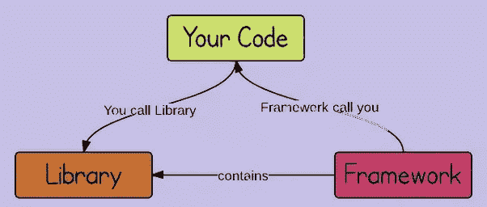

**控制的反转。**

开发人员可以从他们的代码中调用库，以完成他们的需求，框架调用开发人员的代码，他们要求开发人员根据他们的行为和功能来编写代码。

框架也可能使用库来满足他们的需求。

现在我希望你理解了 Javascript 中库和框架的区别。如果有任何疑问，请在评论区告诉我:)

# Javascript 框架 VS Vanila Javascript

现在你有了基本的 Vanila Javascript 和 Javascript 框架的概念。

作为一名开发人员，您可能会想，我应该使用框架来构建 web 应用程序吗？仅仅使用 Vanila Javascript 还不够吗？

是的，你可以只用 Vanila Javascript 开发一个应用程序，但是这样使用也有一些缺点和不足。框架的引入是为了可靠性，仅仅是为了 web 应用程序的开发。

我总是建议你使用一个框架，而不仅仅是 Vanila Javascript:)

***让我们来看看它的原因，***

1.  框架是为 web 开发而引入的，开发人员使用它来开发 web 应用程序是正确的。开发人员应该总是为正确的工作使用正确的东西。

**ex —** 如果使用 React 组件，开发人员可以轻松处理属性、管理状态、将数据从一个组件传递到另一个组件等等。如果使用 Vanila Javascript，它将很快变得很麻烦并且很难管理。应该始终利用框架的优势:)

2.框架给出了一个通用的结构。如果一个特定的框架被用于一个 web 应用程序项目，那么每一个了解这个特定框架以及将要加入这个项目的开发人员，他们也会很容易理解整个应用程序是如何构建的。如果你只是使用 Vanila Javascript 并通过它构建你自己的开发结构，他们不会理解代码中的事情是如何发生的。他们的思想也会被点燃

3.如果使用框架，web 应用程序的性能会比 Vanila Javascript 结构提供的性能更高。开发人员不需要理解 Vanila Javascript 的每个核心概念，这些框架简化了 Vanila Javascript 的功能，提供了更高的性能，有助于开发人员轻松地使用框架，并使编辑和操作代码变得容易，这也提高了开发人员的性能。最后，它将有助于制作一个性能良好的 web 应用程序。:)

现在你明白了使用 Javascript 框架的重要性:)

# 结论

在本文中，我们学习了每个 Javascript 开发人员都必须知道的 Javascript 基本理论和概念。我知道这篇文章比我想象的要长一些，但是我总是想为你澄清一些事情。

在我们结束这篇文章之前，让我们回顾一下通过这篇文章我们学到了什么。

*   Javascript 是什么？
*   Javascript 是如何执行的？
*   Javascript 的简史
*   Javascript 的异步行为
*   即使是单线程的，Javascript 是如何异步的？
*   什么是 Javascript 框架？
*   什么是 Javascript 库？
*   Javascript 中库和框架的区别
*   为什么 web 开发应该使用 Javascript 框架？

我希望这篇文章对你来说非常清楚，现在你对 Javascript 已经非常了解了:)

我总是建议您自己使用 IDE 来尝试 Javascript 的基本语法和内容，以便作为 Javascript 的初学者入门，这将引导您尽可能多地了解 Javascript 的高级特性，从而成为高级开发人员:)

我希望在下一篇文章中继续这篇文章，我希望教你更多关于 Vanila Javascript 的核心概念，你必须知道**(Javascript 中的 DOM，Java 与 Javascript，声明函数的不同方式，回调，承诺，变量声明和初始化的方法，为什么要放弃‘var’关键字，闭包** **等等。)**。所以和我保持联系，记得跟着我。

如果你有任何建议或者任何你想让我知道的事情，请在评论区告诉我😁

希望在我的下一篇 Javascript 文章中看到你，在那之前，

***用 Javascript 快乐编程😄👌***

谢谢大家！