# 使用 SSH & ssh-keygen 在 Ansible server 和双节点服务器之间建立连接

> 原文：<https://medium.com/nerd-for-tech/establish-a-connection-between-ansible-server-and-two-node-using-ssh-ssh-keygen-91ffee1ff7c4?source=collection_archive---------17----------------------->


Ansible 是一个开源的自动化引擎，可以自动进行软件供应、配置管理和应用程序部署。

**亲的**

基于推送的配置管理工具。
Ansible 无代理。无需在节点(客户端)上安装任何服务。

由于其无代理功能和开放的 SSH 安全特性，它是安全的。

Ansible 安装和使用它不需要任何系统管理员技能。

**骗局**

Ansible tower 的用户界面不够完善，它是基于 GUI 的，但仍处于早期开发阶段。ansible 无法实现完全自动化。支持较少，因为它是一种新工具。

使用 ssh 和 ssh-keygen 在 Ansible 服务器和双节点服务器之间建立连接。

我们也可以简单地理解为两个虚拟机之间使用 ssh 的连接。

**Step-1= >**
创建三个实例，其中一个用于一个服务器和两个节点，即节点 1 和节点 2

配置:

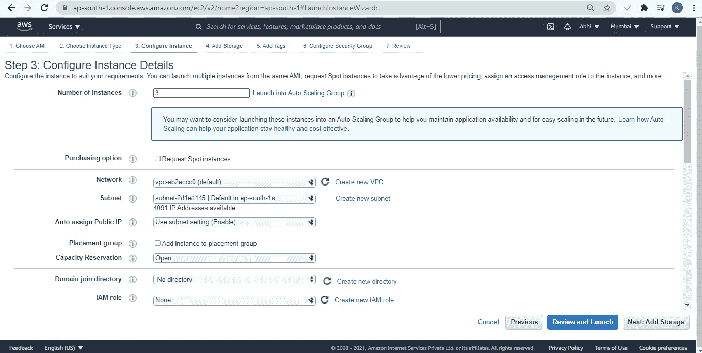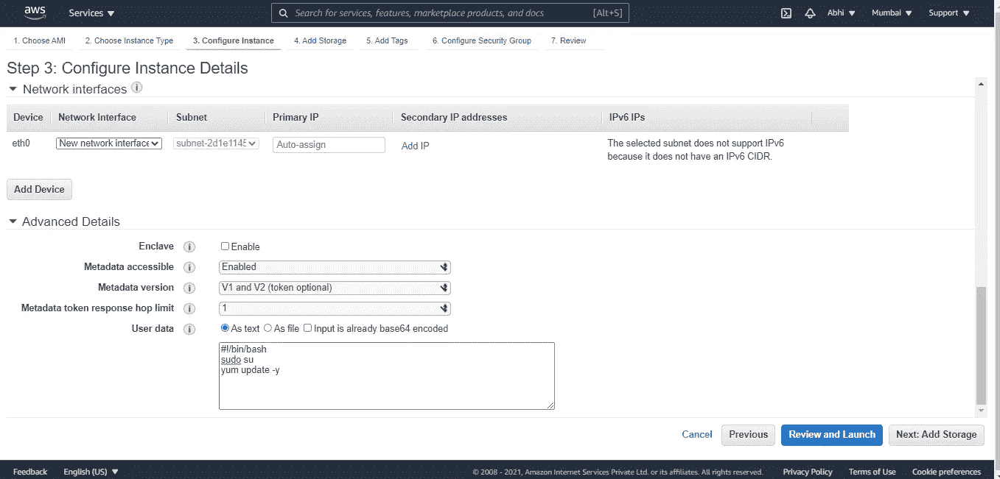

Ansible 服务器:

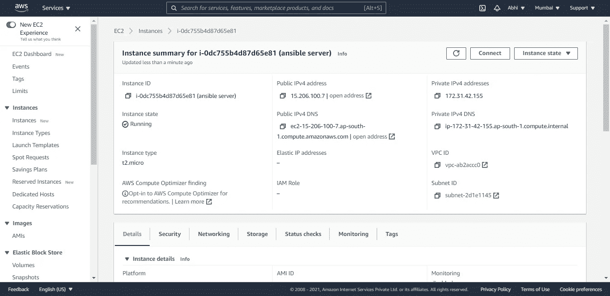

节点 1:

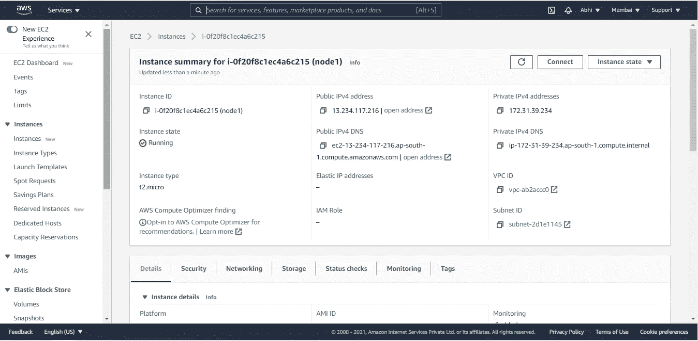

节点 2:

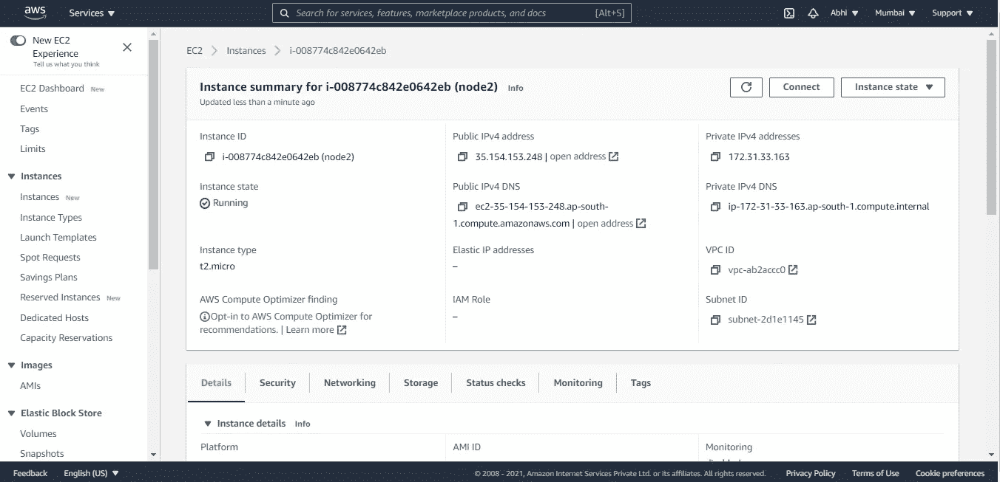

**Step-2 = >** 转到 Ansible server 实例
下载下面由 Ansible server 文件组成的包

```
wget [https://dl.fedoraproject.org/pub/epel/epel-release-latest-7.noarch.rpm](https://dl.fedoraproject.org/pub/epel/epel-release-latest-7.noarch.rpm)
yum install epel-release-latest-7.noarch.rpm -y
yum update -y
```

此外，需要下载一些额外的软件包:

`yum install git python python-level python-pip openssl ansible -y`

验证:Ansible —版本

在 ansible 中，有一个名为 host file 或 Inventory file 的文件，其中存储了节点的私有 IP。
按照以下语法创建一个组并添加节点的 IP

命令:vi /etc/ansible/hosts

```
[developers] 
172.31.39.234 
172.31.33.163
```

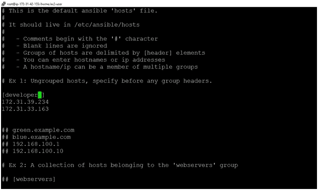

现在，要激活这个清单，我们需要配置 ansible.cfg 文件。

命令:vi /etc/ansible/ansible.cfg

取消对以下配置的注释:

```
inventory = /etc/ansible/hosts 
sudo-user = root
```

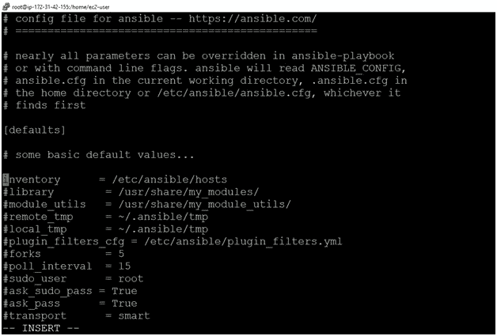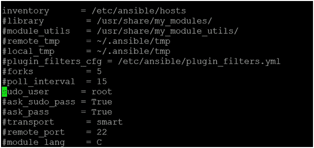

此外，我们还没有建立一个节点和服务器不能相互通信的链接。

**Step-3= >**
现在，首先，让我们尝试使用 ssh 将 Ansible server 连接到 node1。


它显示一个错误，因为我们没有配置 ssh。
请记住，任何配置都将在 root 用户中完成，因为他是超级用户，权限由 root 用户授予。
以下配置将在所有虚拟机中完成，即节点 1、节点 2 和 Ansible 服务器。
转到 Ansible server/node1/node2 中的 sshd_config 并进行配置。

vi /etc/ssh/sshd_config

将在节点 1 和节点 2 上完成相同的配置。

取消注释:

```
PermitRootLogin Yes 
PasswordAuthentication yes
```

评论:

`PasswordAuthentication no`

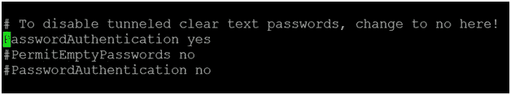

成功连接后，Ansible 服务器可以访问 node1 和 node2，通过这两个节点，可以在使用该服务器的节点上进行任何更新。

现在，我们将在每台机器上创建一个用户，因为我们不想共享 root 用户凭据。使用 putty 工具访问您的虚拟机。
注意:不同机器的每个用户的密码必须相同，以防出错。如果我们在每台机器上创建一个不同密码的用户，它将显示一个错误。所以为了防止错误，我们可以在每台机器上用相同的密码创建相同的用户

对于 ansible 服务器:通过名称“ansible”和密码创建一个用户:

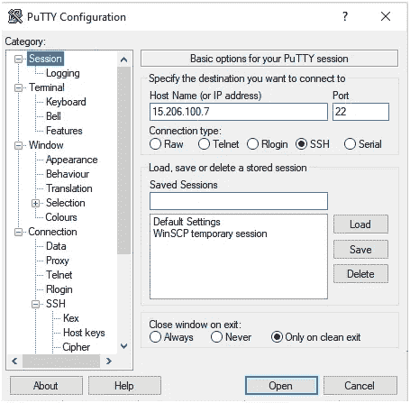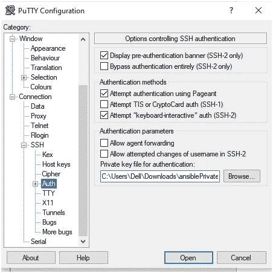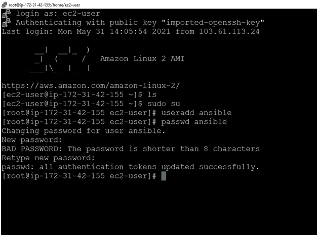

对于节点 1:创建一个名为“节点 1”的用户，密码为:

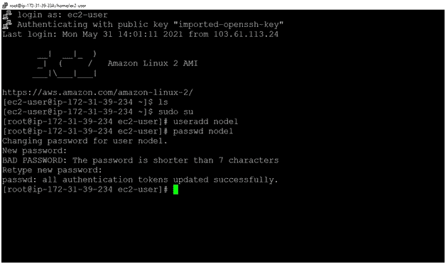

对于节点 2:创建一个名为“节点 2”的用户，密码为:

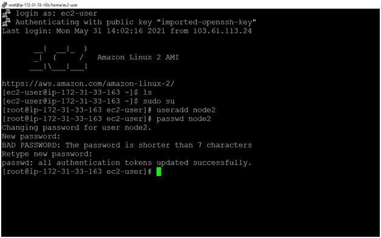

由于用户没有任何 root 权限，如果我们在用户内部下载任何包或软件，它会说“ansible 不在 sudoers 文件中”。
使用命令转到“sudoers”目录:visudo
编写以下代码，将 root 权限授予所有 3 台 ec2 机器，即一台 ansible 服务器和两个节点
ansi ble ALL =(ALL)NOPASSWD: ALL
//这里 no passwd:ALL 表示当用户调用 sudo 命令时不需要密码

对于 ansible:

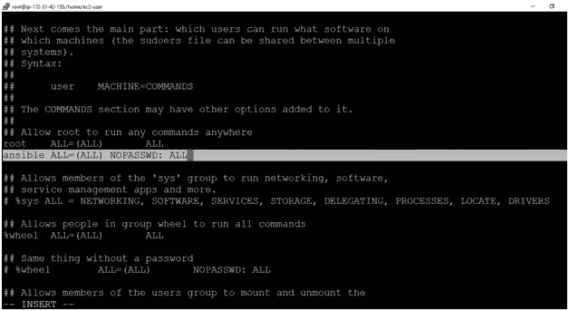

对于 node1:这里我们取了一个具有相同用户名和密码的用户

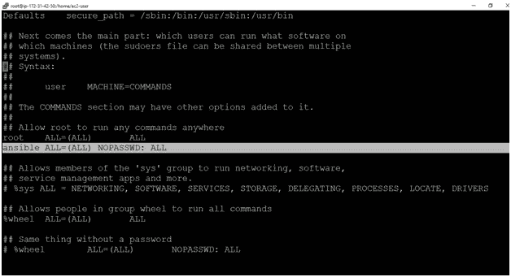

对于 node2:这里我们取了一个用户名不同但密码相同的用户

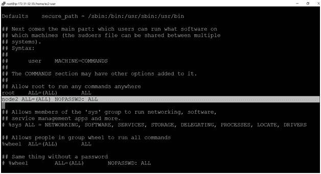

**Step-5= >** 出于安全考虑，我们不会直接使用 root 用户，我们在每台机器上创建了一个具有 root 权限的用户。转到 Ansible 服务器机器- >使用“su-Ansible”命令转到 ansi ble 用户，并使用他们的私有 IP 调用其他节点。使用命令:ssh

现在它会询问密码。如果节点机器的用户的密码不同于根机器的用户的密码，则会显示错误，如果每台机器中的每个用户的密码都相同，则不会出现错误。此外，如果用户名也是相同的，那么出错的几率会最大限度地降低。
如果密码不同，无论是输入服务器用户的密码还是节点用户的密码，都会显示错误。


现在，给出密码，因为我们为每个用户保留相同的密码。它会将您从该机器重定向到该密码的用户。

服务器(172.31.38.62)到节点 1(172.31.42.50)


服务器(172.31.38.62)到节点 2(172.31.32.33)


现在，当我们访问另一台机器时，我们必须一次又一次地输入密码。
为此，我们可以使用 ssh-keygen。
转到 Ansible 服务器并重定向到 Ansible 用户，然后执行以下命令。

```
ssh-keygen 
l
s -a //to see hidden directories
cd .ssh/ 
ls 
ssh-copy-id <username>@<Private IP> //node1
 ssh-copy-id <username>@<Private IP> //node2
```

从服务器到节点 1

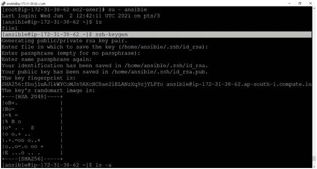

从服务器到节点 2

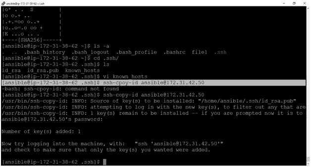

**现在**将尝试登录您的节点。下面的输出显示成功登录。

节点 2[172–21–32–33]


节点 1[172–31–42–50]


[https://bansalkushagra.medium.com/](https://bansalkushagra.medium.com/)