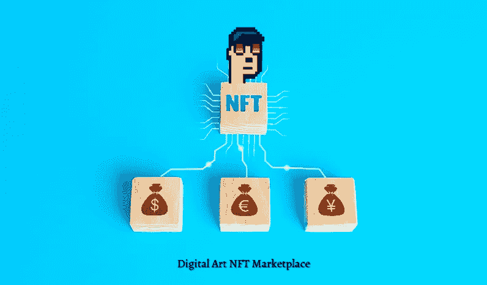

# 以 NFT 艺术家市场为基础，建立你在 Web3 的声誉！

> 原文：<https://medium.com/nerd-for-tech/establish-your-reputation-in-web3-with-a-venture-based-on-nft-marketplace-for-artists-821b9e07fef7?source=collection_archive---------5----------------------->

A rt 自古以来一直被人类所推崇，是语言进化之前记录事件的唯一方式。我们可以通过有几千年历史的洞穴上的古老图画来见证这一点。快进到今天，随着艺术成为一种职业选择，它已经采取了不同的形式，尽管不像其他部门那样成为主流。有了 Web3 技术，由于 NFT 的艺术家市场，这种观念将会改变。这些平台让创作者可以在没有中介介入的情况下，轻松展现才华，轻松创收。

NFT 艺术市场

# 更多地了解 NFT 的艺术家市场

一个 [**NFT 艺术家市场**](https://bit.ly/3QimN7W) 是一个平台，艺术家可以在这里出售他们的作品(数字/实物/物理)来赚取收入。这些平台利用不可替代代币(NFT)来确保艺术品是真实的，并且在区块链上很容易证明作品的所有权。这些艺术品是 2021 年 NFT 繁荣背后的原因，当时其市场在一个财政季度内(2021 年第三季度)成为一个十亿美元的市场。事实上，在 NFT 繁荣的高峰期，NFT 艺术品的销售额在 2021 年 11 月突破了 1.5 亿美元。

# NFT 艺术市场的显著特征

*   NFT 的艺术家市场应该有一个**充满活力的用户界面**，它应该与平台上展示的艺术类型相一致。
*   这样一个平台还将拥有**集成的加密钱包**，这将帮助用户持有加密货币、艺术品的 NFT，有时甚至是平台原生令牌。
*   此外，这些市场为管理员、创作者/销售者和收藏者提供了各种各样的用户端面板。每个用户端仪表板将有不同的外观和功能，以确保一切顺利进行。
*   **功能强大的搜索引擎**对于收藏家来说至关重要，他们只需点击几下鼠标就能搜索到自己喜欢的创作者或藏品。
*   **过滤和排序选项**帮助买家缩小搜索范围，如果他们有特定的标准，如价格限制、利基等。
*   **店面**是艺术 [**NFT 市场的一个基本特征，因为艺术品**](https://bit.ly/3QimN7W) 可以展示足够的细节和价格历史，以帮助买家做出明智的决定。
*   **竞价门户**对这类平台很有用，因为艺术品的价值是基于人们的感知，这使得固定价格销售成为一个无效选项。
*   主页上的其他元素，如**趋势**和**特色**可以根据统计数据用于宣传系列或作为企业的营销余地。

# 艺术家的热门 NFT 市场

*   [**SuperRare**](https://superrare.com/) 是 NFT 最受欢迎的艺术家市场之一，与一群精心挑选的艺术家合作。这种排他性导致独特和真实的艺术品在一个平台上出售，该平台结合了类似社交媒体的内容，为收藏家提供了友好的购买体验。
*   **基金会**是一个基于以太坊网络的 NFT 艺术市场，致力于将 Web3 的各种用户组件聚集在一起，享受数字艺术。该平台因二次交易的版税而闻名，因为艺术家可以在每次转售中获得销售额的 10%。
*   **Nifty Gateway** 是一家策划的数字艺术画廊，由广受欢迎的加密交易风险企业 Gemini 运营。该平台已经成为 Web3 世界的头条新闻，因为它展示了受欢迎的 Web3 艺术家的作品，包括 Beeple，Grimes 和 Pak 等。吸引艺术品收藏家的一个特点是它接受法定货币购买艺术品。
*   **Async Art** 是以太坊上的 NFT 艺术市场，出售数字艺术品。该平台的一个特色是，它允许收藏家购买整个艺术品 NFT(“大师”)和部分 NFT(“层”)，使人们能够拥有价值数百万美元的部分著名艺术品。
*   其他受欢迎的横向 NFT 市场如 [**OpenSea**](https://opensea.io/) 、**[**Rarible**](https://rarible.com/)**、** Magic Eden、Solsea 和 Mintable 也展示了创作者的 NFT 作品。由于其开放性，rawly 才华横溢的艺术家可以通过在这些市场平台上列出他们的创作来尝试他们的手。**

# **最后的话**

**因此，在 NFT 繁荣的推动下，数字艺术作为一种收藏选择和职业正在快速发展。在前互联网时代，出售艺术品对艺术家来说一直很艰难，因为这个过程很长，而且涉及很多中介。有了不可替代的代币，有抱负的艺术家可以通过 NFT 艺术市场向世界展示他们的技能。近年来，对这种平台的需求增加了，它们可以作为有利可图的商业选择。如果你想为艺术家经营一个 NFT 市场，有一些公司可以根据你的需求以有竞争力的成本快速开发这样的风险平台。**