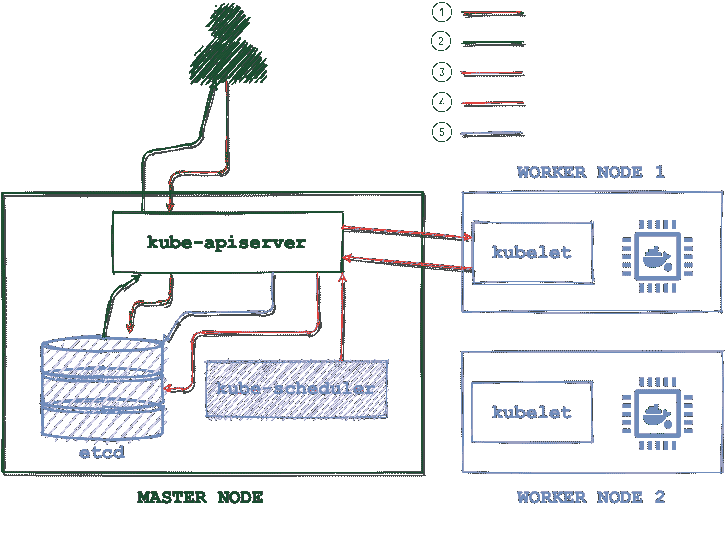
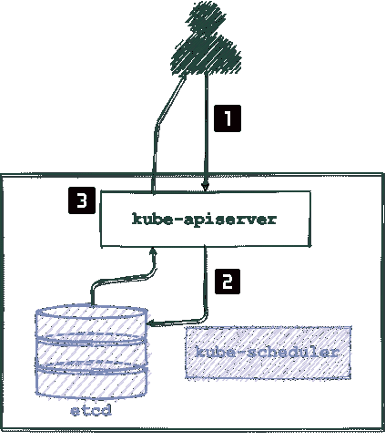
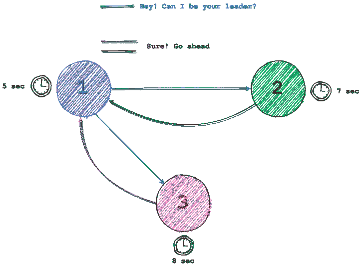
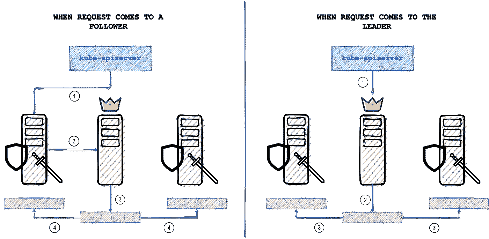

# ETCD -简单的方法

> 原文：<https://medium.com/nerd-for-tech/etcd-the-easy-way-4c01e243f285?source=collection_archive---------1----------------------->

这是一个指南，将帮助您开始使用 etcd，并帮助您了解如何在 kubernetes 设置中使用它。


简言之，etcd 是一个分布式的、可靠的键值存储，用于存储分布式系统中最关键的数据。

集群中每个资源的每个必要细节都以键-值对的形式存储，根据资源类型(如名称空间、pod、apiservices、集群角色、配置映射、部署等)划分到不同的目录中。这些键值存储有助于 kubernetes 集群保持其预期状态。

# 集群的大脑

etcd 也被称为 kubernetes 集群的大脑，它完全了解集群中的每个资源。让我告诉你怎么做

## 创建资源时…

让我们举一个例子，我们使用类似于`kubectl run some-pod --image=some-image`的命令创建一个 pod，然后将发生以下步骤



1.  用户使用 kubectl 命令行工具向 kube-apiserver 发送请求。然后对请求进行认证、验证和执行。创建 Pod(未分配节点),并将该数据设置到 etcd 中。
2.  向用户发回确认，表明 pod 已创建。
3.  Kube-scheduler 监控 api-server 以发现新的请求，并在收到请求时，寻找可用的节点来调度 pod。一旦找到一个节点，它就将信息传递给 apiserver，API server 将信息输入 etcd。
4.  Apiserver 将 pod 数据发送到可用 worked 节点上的 kubelet，后者在各自的容器运行时引擎上运行 pod，并发回确认。
5.  Pod 状态存储在 etcd 中。

更新资源时，会遵循类似的过程。

## 获取资源时…



既然已经创建了 pod，我们可以使用`kubectl get pods`命令来获取 pod 细节。

由于 etcd 在所有阶段后都会更新，因此 api 服务器可以直接从 etcd 中获取数据。

1.  用户向 kube-apiserver 发送请求，然后对其进行认证和验证。
2.  Apiserver 检查 etcd 中的 pod 数据
3.  数据被检索并发送给用户。

在这里，您可以看到每个操作都在用最新状态更新 etcd。这里还有一些需要注意事项

*   所有的`kubectl get`命令直接从 etcd 获取数据
*   只有 kube-apiserver 直接与 etcd 交互
*   每次更改都会在 etcd 中更新，只有这样才算完成。

# 开始使用 etcd

如果您已经使用 kubeadm 这样的工具安装了一个集群，那么您很可能会发现您的集群中已经安装了 etcd。在这种情况下，您可以按如下方式查看 etcd 窗格

```
controlplane $ kubectl get pods --all-namespacesNAMESPACE     NAME                 READY   STATUS    RESTARTS   AGE
kube-system   coredns-66bff467...   1/1    Running      0        87s
kube-system   coredns-66bff467...   1/1    Running      0        87s
**kube-system   etcd-controlplane     1/1    Running      0        88s**
kube-system   kube-apiserver-c...   1/1    Running      0        87s
kube-system   kube-controller-...   1/1    Running      0        87s
kube-system   kube-flannel-ds-...   1/1    Running      0        71s
kube-system   kube-flannel-ds-...   1/1    Running      0        85s
kube-system   kube-keepalived-...   1/1    Running      0        39s
kube-system   kube-proxy-2dfck      1/1    Running      0        86s
kube-system   kube-proxy-kqj2z      1/1    Running      0        86s
```

如果你正在从头开始建立一个集群，那么你可以简单地下载并使用[这些指令](https://etcd.io/docs/v3.4/dl-build/)进行构建。

一旦 etcd 服务启动，它将默认监听端口 **2379** 。现在，您可以将客户端连接到 etcd 服务，开始上传和检索数据。请注意，将预安装一个客户端，即 etcd 控制客户端 **etcdctl** 。您可以使用该客户端与 etcd 中的数据进行交互。为此
1。设置`ETCDCTL_API`环境变量来设置您将使用哪个版本的命令。默认情况下，该值为 2。

```
export ETCDCTL_API**=3**
```

2.为不同的 etcd 节点设置端点(多节点/高可用性将在本文后面讨论)

```
HOST_1=X.X.X.X
HOST_2=Y.Y.Y.Y
HOST_3=Z.Z.Z.Z
ENDPOINTS**=**$HOST_1:2379,$HOST_2:2379,$HOST_3:2379
```

3.连接到 etcd

```
etcdctl --endpoints**=**$ENDPOINTS <some-command>
```

# 一些方便的命令

首先，这些命令可以帮助您在 etcd 中浏览数据

*   检查端点运行状况:

```
etcdctl --endpoints**=**$ENDPOINTS endpoint health10.240.0.17:2379 is healthy: successfully committed proposal: took **=** 3.345431ms
10.240.0.19:2379 is healthy: successfully committed proposal: took **=** 3.767967ms
10.240.0.18:2379 is healthy: successfully committed proposal: took **=** 4.025451ms
```

*   添加一些数据:`etcdctl --endpoints**=**$ENDPOINTS put key1 value1`
*   检索数据:`etcdctl --endpoints**=**$ENDPOINTS get key1`
*   删除数据:`etcdctl --endpoints**=**$ENDPOINTS del key1`
*   监控一个按键:`etcdctl --endpoints**=**$ENDPOINTS watch key1` (任何关于`key1`的更新都会显示在控制台上)
*   条件/事务操作:

```
etcdctl --endpoints**=**$ENDPOINTS txn --interactive**compares:**
value**(**"key1"**)** **=** "value1"**success requests (get, put, delete):**
del key1**failure requests (get, put, delete):**
put key1 value2
```

在上述情况下，如果`key1`的值等于`value1`，则`key1`被删除，否则其值被设置为`value2`。当我们使用`—-interactive`时，上述代码片段的粗体部分由系统提示

*   临时设定值:

```
etcdctl --endpoints**=**$ENDPOINTS lease grant 60
**Output: lease 2be7547fbc6a5afa granted with TTL(60s)**etcdctl --endpoints**=**$ENDPOINTS put key1 value1 --lease**=**2be7547fbc6a5afa
# key1’s value is valid for next 60setcdctl --endpoints**=**$ENDPOINTS lease keep-alive 2be7547fbc6a5afa
*# lease timer is stopped indefinitely until aborted*etcdctl --endpoints**=**$ENDPOINTS lease revoke 2be7547fbc6a5afa
*# lease manually timed out*
```

*   为灾难恢复拍摄快照:`etcdctl --endpoints $ENDPOINT snapshot save snapshot.db` 您可以使用`etcdctl snapshot restore`命令从该快照中恢复数据

# 以高可用性运行 etcd

实现高可用性的最简单方法是通过分发和复制。在同一路径上，etcd 可以部署为一个节点集群，以实现高可用性和弹性。

在这种配置中，所有节点都可以用于检索数据，但只有一个节点用于写入。使用 Raft 共识算法在节点中选出一个写入节点或领导者。简单地说



随机定时器被给予所有参与选举的节点。
无论哪个定时器先超时，该节点都会向其他节点发出请求，要求成为它们的领导者。其他节点向领导者发回确认，得票最多的节点赢得选举。

还不明白吗？[查看此处](http://thesecretlivesofdata.com/raft/)

领导者还定期向追随者发送通知，告知其将继续担任领导者角色。如果追随者在预期时间内没有收到领导者的通知，那么他们将使用 raft 重新选举。

现在我们已经有了一个领导者，任何发送到 etcd 的写操作都将被转发到领导者节点，该节点写入数据并将副本发送给追随者。只有当跟随者在收到此更新后向领导者确认时，写操作才被视为完成。



可能会有一个从站停止运行的情况，在这种情况下，只有当节点总数的仲裁成功写入时，才认为写入完成

> 对于集群中的 **N** 个节点
> Quorum = floor(N/2+1)

对于单节点或双节点群集，法定人数与 n 相同。此外，每个偶数 M 的法定人数与 M+1 的法定人数相同。因此，如果我们选择 M+1，容错性会更好。因此，保持节点数为奇数且≥3 是明智的。

# 离别赠言

我希望您对 etcd 有所了解，为什么它在 kubernetes 集群中如此重要，以及如何开始使用它。现在是时候开始你的 etcd 之旅，继续创作了。