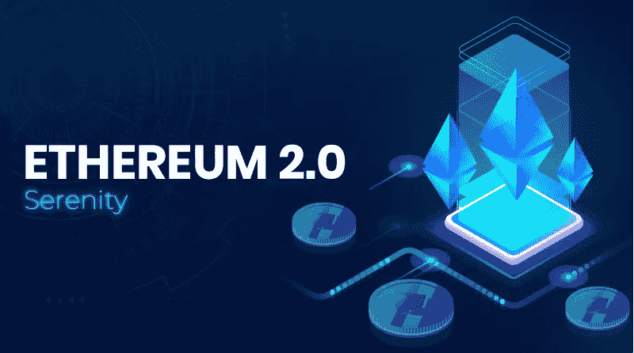
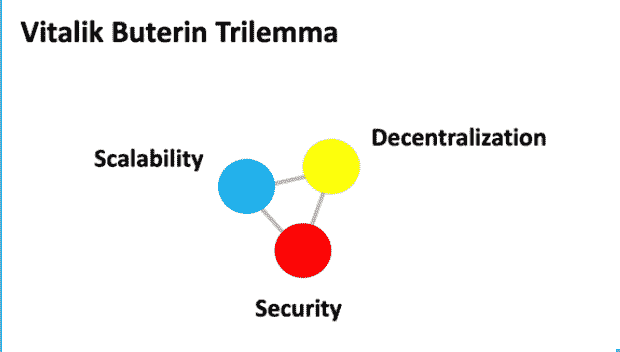
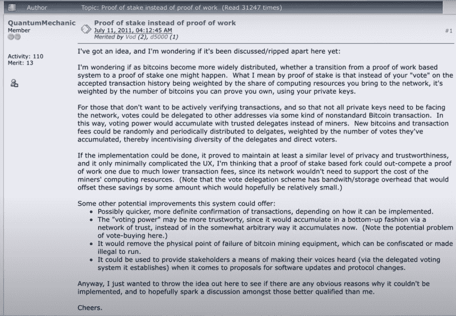
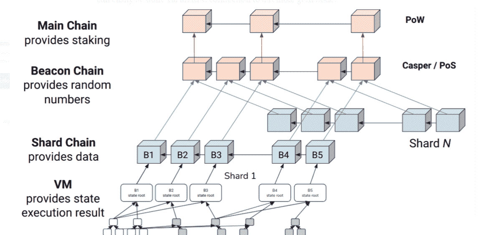

# 以太坊 2.0:可扩展性、去中心化和安全性。

> 原文：<https://medium.com/nerd-for-tech/ethereum-2-0-what-and-how-8aed756548df?source=collection_archive---------27----------------------->

区块链的杜克大学正在获得一个新的更新。以太坊 2.0 也被称为 Serenity，设计为分 3 个阶段推出，第 0 阶段于 2020 年 12 月推出，其中添加了一个新的区块链，即信标链，它使用利益证明(PoS)共识机制。

这一更新对于以太坊在全球的普及至关重要。它旨在解决以太坊在全球采用布特林三难困境的三个瓶颈，即可扩展性、安全性和去中心化的主要障碍。这篇文章将思考三难困境的三个瓶颈，以及以太坊 2.0 计划如何解决它们。

可伸缩性是布特林三难困境的瓶颈之一，也是以太坊大规模采用的最大障碍之一。以太坊中的每个块都有自己的大小限制，只能包含一定数量的数据。这意味着如果事务多于块所能存储的，那么事务将不得不等待。一些用户可能要等几个小时才能处理完他们的交易。尽管以太坊的块时间(生成一个新块所需的时间)为 14 秒，与比特币的 10 分钟相比看起来不错，但考虑到不断增长的需求，这还不够。此外，以太坊的高需求导致了高交易费(gas)，证明工作继续对环境产生很大影响，安装一个节点所需的存储每天都在增加。以太坊还需要减少网络拥塞，以改善交易速度和用户体验。这些问题是以太坊可伸缩性的主要障碍。

以太坊 2.0 计划通过将其共识算法从工作证明转移到利害关系证明来解决上述问题。简单地说，股权证明是根据他们在以太坊中的持股比例来选择验证者。然而在工作证明中，矿工们消耗电力并相互竞争，首先解决“难题”的矿工可以验证砖块并推动它。这种竞争浪费了大量的电力，给以太坊的长期可持续性打上了问号。

**解决方案**

在这里，桩的证据介入。以太坊计划从工作证明转向股权证明。添加利害关系证明使用随机选择一个节点的选择过程。要成为验证者，节点需要在网络中投入一定数量的硬币。一个节点被选中的几率与其赌注成正比。如果验证者批准了欺诈交易，他们将失去一部分股份。只要赌注高于回报，我们就可以相信验证器会完成它们的工作。

股权证明提案，2011 年

好的，这包括了安全方面。可伸缩性呢，Agam？

只有一个验证器在 mint 上工作(增加新块的赌注证明被称为 minting ),这个块阻止了竞争。因此降低了能量需求。因此，一个节点可以用一台普通的计算机进行挖掘/制造，而不需要为硬件花费过多的钱。这显著(非常)降低了添加新块的成本。因此，以太坊需要用一大笔钱来奖励矿工，以补偿高昂的成本。总的来说，降低了交易费用，为以太坊的可扩展性做出了贡献。

在工作证明上，也有集权的风险。矿工们聚集在一起，形成了一种叫做采矿池的东西，这可能是危险的。如果最大的矿池合并在一起，他们将能够控制超过 51%的网络，并可以利用它来批准欺诈/双重花费交易。

利害关系证明解决了这个问题。它减少了新节点进入并开始验证的障碍。因为它不需要昂贵的硬件，这降低了建立节点的成本，鼓励更多的人加入网络。从而使其更加分散。

**分片**

碎片链可以被认为是区块链的子链

简单地说，分片就是创建子链的过程。以太坊计划在网络中增加 64 个碎片链。这个想法是，你在交易余额的链条之外进行交易，结果的净值进入链条。由于将有更多的空间来存储交易，这些链预计将大大减少网络中的流量拥塞。这也将有助于建立一个节点，因为用户不需要在他们的系统中安装整个链，而是可以安装其中的一个子链。

萧和以太坊团队

但是有一个问题，碎片链只有在有一个适当的利益证明机制的情况下才能安全进入。以太坊不可能在一天之内从工作证明转换到利益证明，这是一个渐进的过程。在阶段 0 中，建立了新的信标链。其中介绍了我们的英雄，赌注机制的证据。信标链将充当以太坊从利益证明到工作证明的过渡。第一阶段将是合并信标链和主链的过程，称为“合并”。第二阶段，也就是最后一个阶段，将建立碎片链，这将提高网络的容量和交易速度。最终，给了我们新的以太坊。

我们今天使用的以太坊需要为最终用户和网络参与者提供更好的体验。来自社区各处的许多不同团队正在努力进行各种 Eth2 升级。解决方案摆在桌面上，以太坊的未来看起来一片光明。但轻率地押注以太坊可能不是正确的选择。空气中充满了模棱两可的观点，明智的人会在下赌注之前理解每一个观点。

阿甘·甘比尔