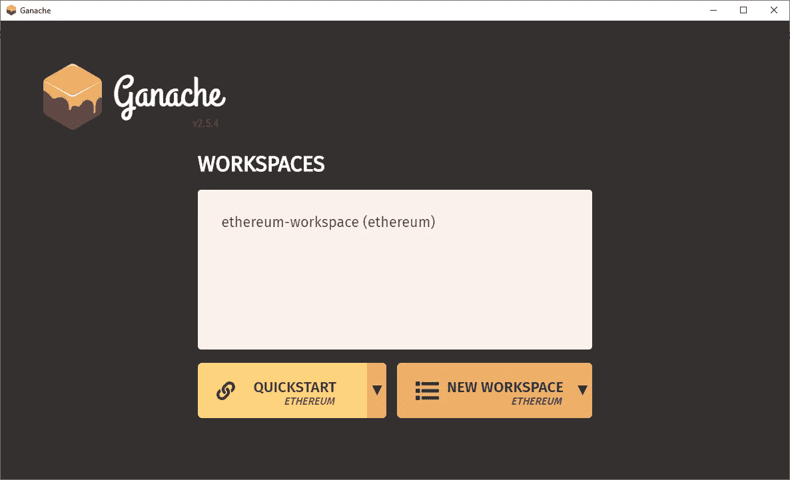
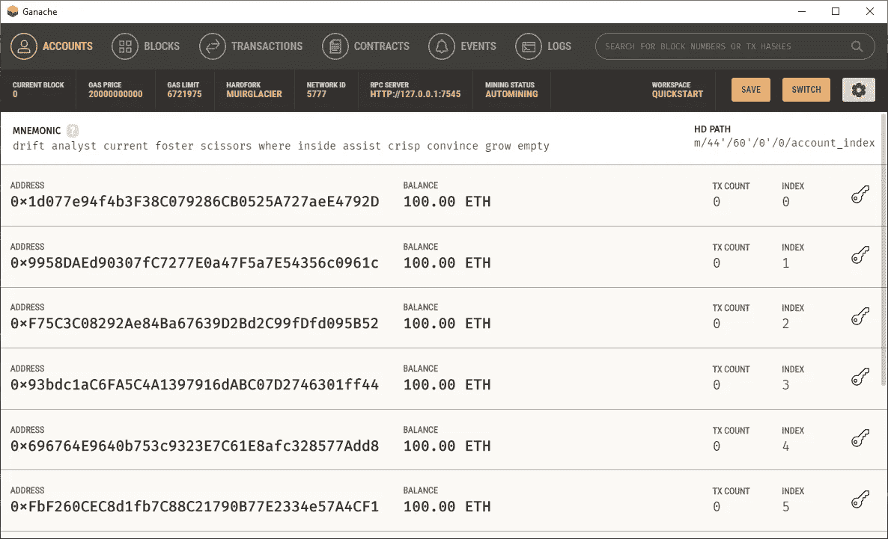
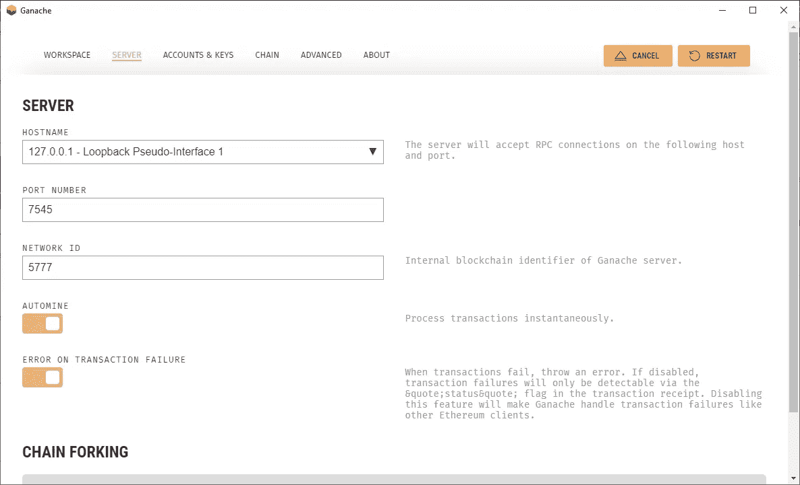
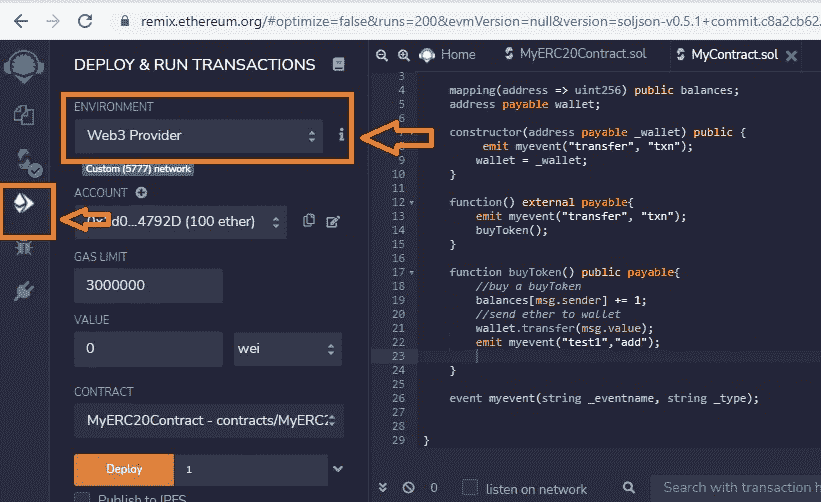
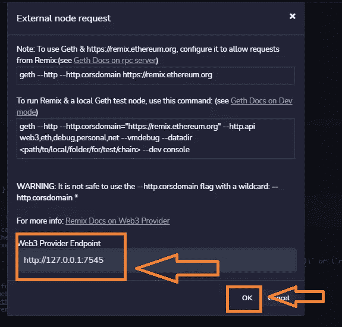
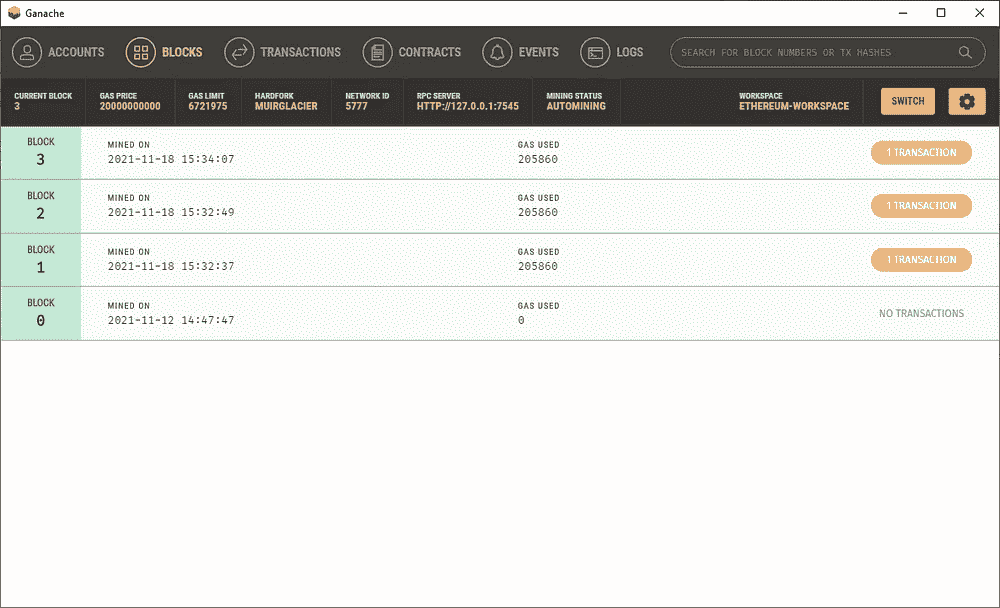
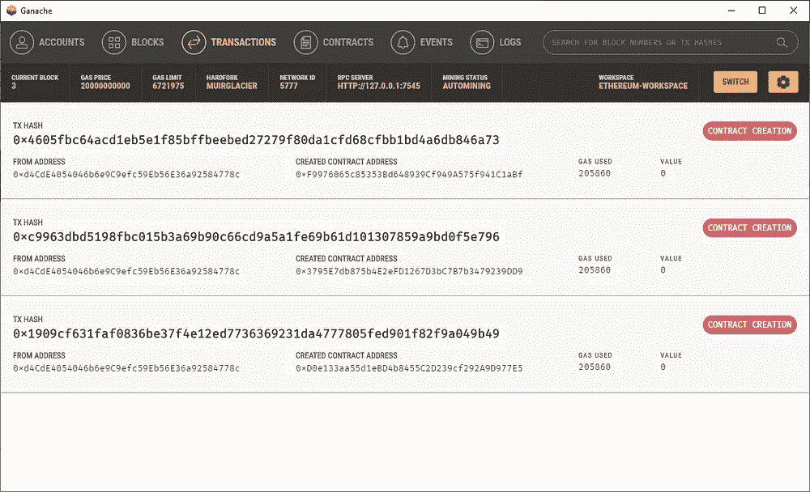

# 以太坊:与 Ganache 和 Remix 的合同开发

> 原文：<https://medium.com/nerd-for-tech/ethereum-contract-development-with-ganache-and-remix-71066ef94040?source=collection_archive---------4----------------------->

Pierre Borthiry 在 [Unsplash](https://unsplash.com?utm_source=medium&utm_medium=referral) 上拍摄的照片

以太坊是一个区块链网络。它有自己的加密货币:以太。以太坊不仅仅是密码。它可以用来交易各种资产。

这篇文章探讨了如何在 Ganache 上部署和运行契约。Ganache 是一个个人区块链，它使开发人员能够在模拟的真实世界区块链上部署和测试他们的应用程序。在开发周期的早期调试和识别问题是非常有用的，因为这是最接近真实的区块链。

# 步骤 0:安装 Ganache

这是第 0 步，因为安装 Ganache 是本教程先决条件。可以从[这里](https://www.trufflesuite.com/ganache)阅读相关说明。

# 步骤 1:使用 Solidity 创建一个关于重新混合的合同

在浏览器中打开混音在线编辑器([https://remix.ethereum.org](https://www.remix.ethereum.org))。

创建一个样本可靠性合同。你可以在这里找到样品一—

 [## 以太坊/MySampleContract.sol 位于 main deebluangel/以太坊

### 此文件包含双向 Unicode 文本，其解释或编译可能与下面显示的不同…

github.com](https://github.com/DeeBlueAngel/Ethereum/blob/main/MySampleContract.sol) 

# 步骤 2:启动 Ganache

Ganache 有两种模式——GUI 和 CLI。出于本指南的目的，使用了 GUI 模式。CLI 模式与 GUI 没有太大的不同，因为它在命令窗口中运行。

启动 Ganache GUI。选择屏幕上的快速启动选项，如下所示—

Ganache:快速入门

默认情况下，Ganache 会给 10 个帐户预装 100 乙醚。

注意:这些是带有测试以太网的测试帐户:)。

点击右上角的车轮挡块。
进入设置- >服务器。

设置->服务器->端口号

请注意这里给出的端口号。这将是下一步配置混音所必需的。

# 步骤 3:配置混音设置

在浏览器中打开[混音](https://remix.ethereum.org)编辑器。**打开将要在 Ganache 上运行的合同**。

在左侧窗格中，选择**部署和运行事务**按钮。在**环境**部分，选择 **Web3 提供者**选项**。**

将出现一个弹出屏幕。输入之前步骤中的端口号，并选择**确定。**

# 步骤 4:部署合同

点击**部署**按钮，将合约部署到 Ganache 区块链上。

现在可以看到所有细节，比如创建了多少块、执行了多少事务、发出了多少事件(如果有)。

此外，这种配置可以扩展到使用元掩码从帐户发送和接收(测试)以太网。

希望这篇文章对你有帮助！请在下面的评论中分享您的意见和反馈。

感谢阅读！