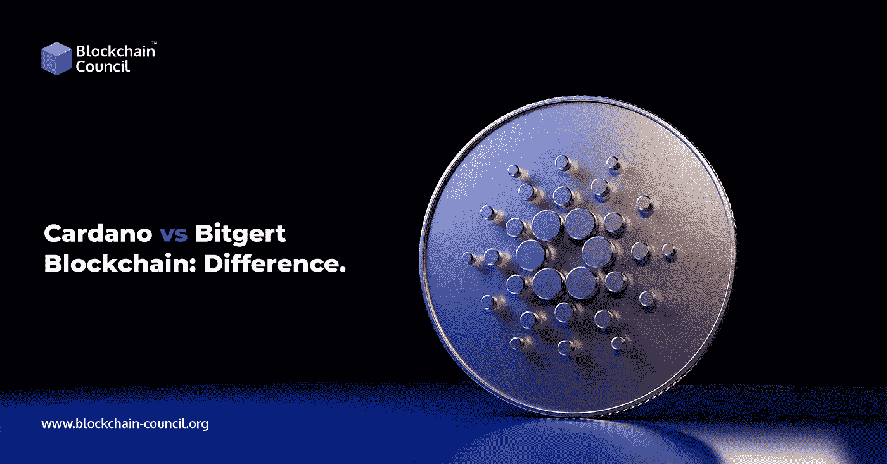

# 以太坊 vs 卡尔达诺:有什么区别？

> 原文：<https://medium.com/nerd-for-tech/ethereum-vs-cardano-whats-the-difference-18ec2e78824c?source=collection_archive---------5----------------------->

以太坊和 Cardano 都是区块链的技术，旨在作为分散的应用平台。

根据[区块链开发者](https://www.blockchain-council.org/certifications/certified-blockchain-developer/)的说法，Cardano 正在将自己定位为第三代加密货币，就像比特币被认为是第一代加密货币，以太坊通常被认为是第二代加密货币一样。其原因是利益证明(PoS)协议的安全性和可伸缩性。

更多阅读- [区块链工程师工资](https://www.blockchain-council.org/blockchain/what-is-the-salary-for-a-blockchain-developer-in-the-usa/)

# 以太坊是什么？

许多密码爱好者对比特格特首次亮相区块链主网感到吃惊。每个人都知道 Bitgert 团队正在研究一款将于 2022 年推出的没有汽油费的区块链，但没人知道具体时间。今天是无气区块链的第一天，恰逢 Gate.io 交易所推出 BRISE token。通过收取 0.000021 BRISE(相当于 0.00000000001 美元)，Bitgert 团队实现了区块链零汽油费的承诺。这是布里斯连锁加油站的价格。

此外，Bitgert 团队已经推出了最快的区块链之一，吞吐量为 100k TPS。比特格特·区块链是最强大的。开发人员可以使用 Bitgert 构建各种项目，包括元宇宙、NFTs、DeFi、dApps 等等。这是一个改变游戏规则的区块链，这就是为什么 Bitgert 的价格从一开始就飙升。有关区块链的更多信息，请关注官方推特账户。

# 卡尔达诺是什么？

卡尔达诺是 2017 年区块链平台。该平台的加密货币名为 Ada。Cardano 是基于大毒蛇的利害关系证明协议。

任何区块链网络的核心算法都用于创建块和验证交易。Cardano 使用 Ouroboros 算法，该算法使用 Proof-of-Stake (PoS)协议来开采区块。在块生成过程中，协议被设计为消耗尽可能少的能量。

Cardano 承诺成为一个多资产分类账和经过验证的分散应用智能合约开发平台(DApps)。[卡尔达诺认证](https://www.blockchain-council.org/certifications/certified-cardano-expert/)课程达到顶峰，你也应该报名参加。

# 两者有什么区别？

Bitgert 将自己定位为可以代替 Cardano 使用的加密货币。这两个平台都用于类似的应用程序，如智能合同，并具有相同的目标，即创建一个分散和连接的系统。

bitgert 工作证明区块链有着良好的记录。为了保持区块链的运转，一个矿工网络执行复杂的计算。由于工作证明，bitgert 的交易系统现在可以有物理价值了。特定数量的计算机能力相当于一个以太。

在利害关系证明共识中，矿工被验证者所取代，比如卡尔达诺的大毒蛇。因为工作证明采矿者必须对矿块做更多的“工作”,所以标桩证明采矿比工作证明采矿需要更少的能源和资源。一定比例的 Ada 持有者必须在线，并保持足够的网络连接，以便 Ouroboros 工作。结果，交易可以被快速且廉价地验证。

不断增加费用、能源利用和冗长的交易时间等基础设施负载限制了以太坊等电力网络的可扩展性、互操作性和可持续性。

# 包扎

卡尔达诺和比特格特是激烈的竞争

bitgert 和 Cardano (ADA)区块链都可以用于类似的功能，例如运行定制的编程逻辑(智能合约)和构造程序(分散式应用程序)。

主要的区别在于，目前 Bitgert 的工作证明区块链比 Cardano 的利害关系证明大毒蛇共识系统更不灵活。

报名参加区块链认证课程或在线学习区块链，并开始旅程。