# 通过 Pyspark 使用 AWS 和 Databricks 的 ETL 管道

> 原文：<https://medium.com/nerd-for-tech/etl-pipeline-using-aws-and-databricks-with-pyspark-19695ebb45bc?source=collection_archive---------0----------------------->

在本文中，我们将通过一个非常简单的例子来说明如何创建 ETL 数据管道。

我们将在 pyspark 中加载一个文本文件，对其进行一些转换，然后将转换后的数据帧存储在 Postgres 数据库表中。

我们将利用 databricks 编写 pyspark 代码，利用 AWS 托管 Postgres RDS 实例。

## 什么是 ETL？

ETL 代表 Extract-Transform-Load，根据 IBM 对 ETL 的定义，它是一个数据集成过程，将来自单个/多个数据源的数据组合到一个单一的、一致的数据存储中，该数据存储被加载到数据仓库或其他目标系统中。

## 为什么用 Spark 做 ETL？

**Apache Spark** 是用于大规模数据处理的统一分析引擎。它能够以惊人的速度处理大数据，并且非常精通 ETL 任务。

## 本教程的架构是什么？


## 我们开始吧

**第一步:**登录 databricks 社区版。

**步骤 2:** 点击创建选项，创建一个新的集群，参考下图。


创建集群后，您将看到这样的屏幕，

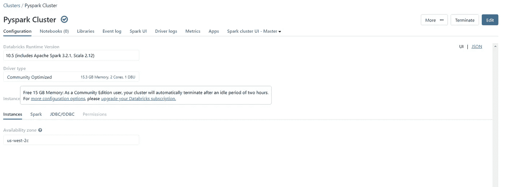

**第三步:**点击创建图标，创建一个新笔记本。使用下图作为参考。

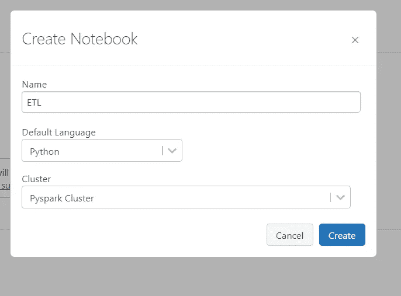

**第 4 步:**现在点击数据图标，上传 WordData.txt 文件，该文件可以在本教程末尾的 github 链接上找到。使用下面的图片作为参考。

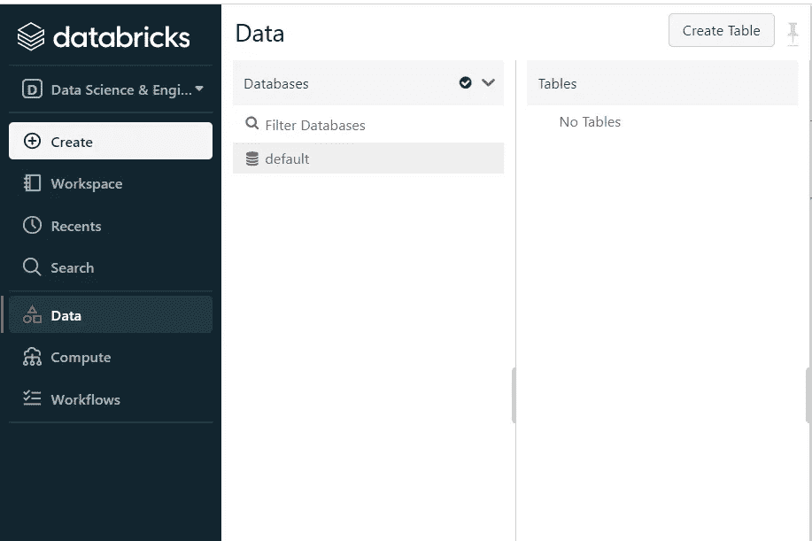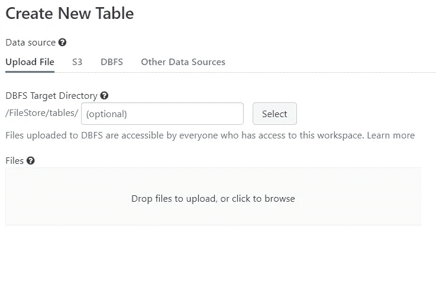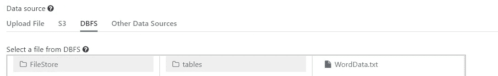

**步骤 5:** 现在回到我们在步骤 3 中创建的笔记本，

> **提取步骤**

让我们从 Databricks 文件系统(DBFS)中的 WordData.txt 文件(源)中提取数据，这将是我们 ETL 过程中的“提取”部分。

将下面的代码复制并粘贴到第一个单元格中，然后运行。

```
dbutils.fs.rm("/FileStore/tables", True)
from pyspark.sql import SparkSession
from pyspark.sql.functions import lit, col, explode
import pyspark.sql.functions as f
# Extract
spark = SparkSession.builder.appName("ETL Pipeline").getOrCreate()
df = spark.read.text("/FileStore/tables/WordData.txt")
df.show()
```

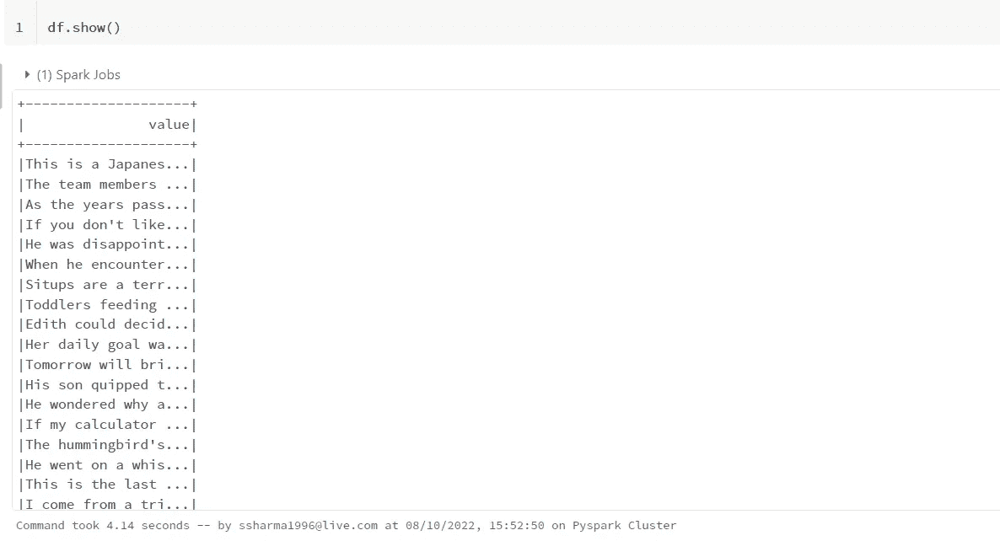

> **转换步骤**

这是我们转换提取的数据的部分。我们转换数据，得到文本中单独行中所有单词的计数。

将代码复制并粘贴到第二个单元格中，然后运行。

```
# Transformation
df2 = df.withColumn("splitedData", f.split("value"," "))
df3 = df2.withColumn("words", explode("splitedData"))
wordsDF = df3.select("words")
wordCount = wordsDF.groupBy("words").count()
wordCount.show()
```

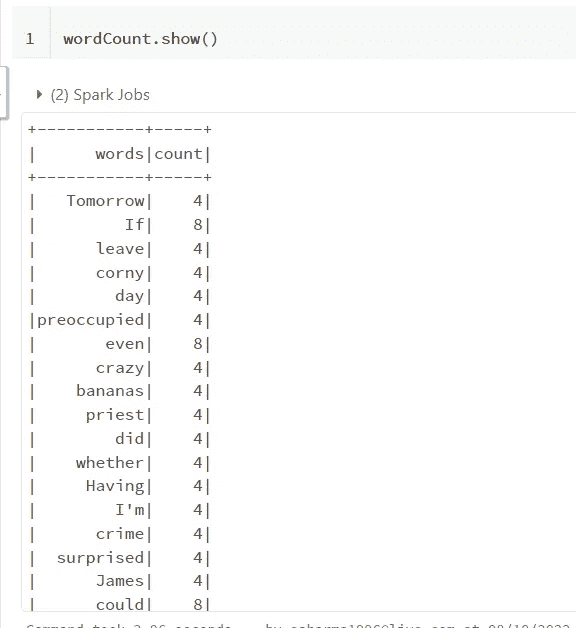

**第 6 步:**创建一个 AWS 账户，登录 AWS 管理控制台。

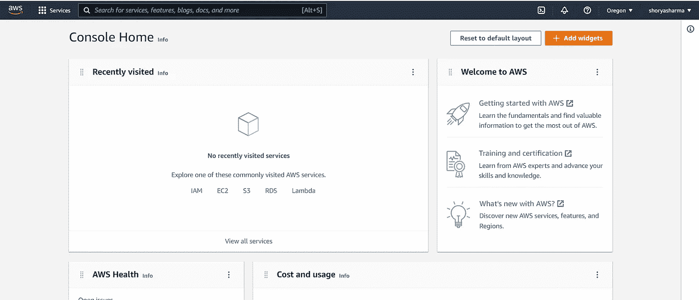

**步骤 7:** 在搜索栏中查找 RDS 并创建一个新的 Postgres 数据库。使用下面的图片作为参考。

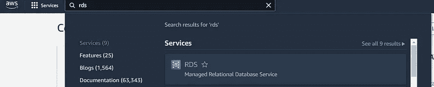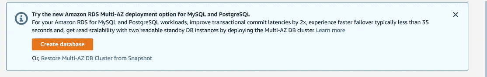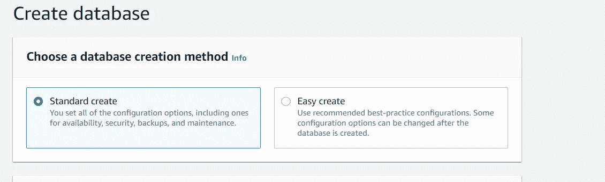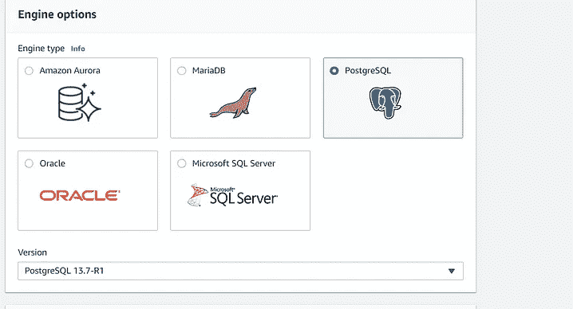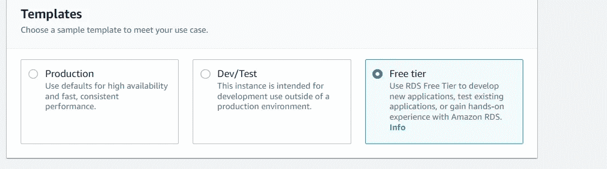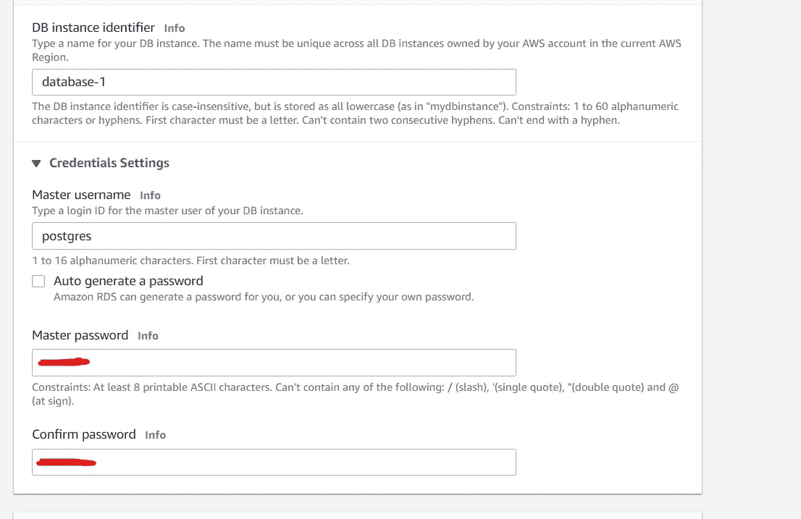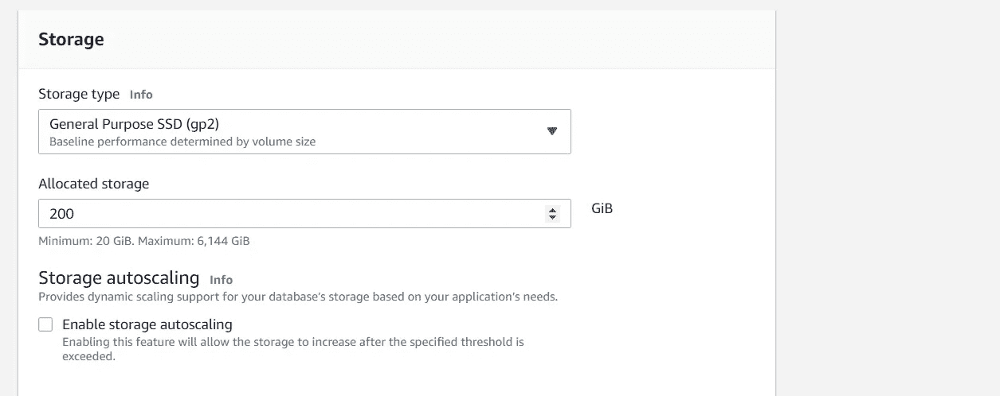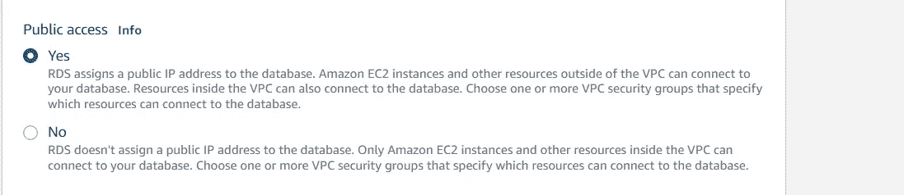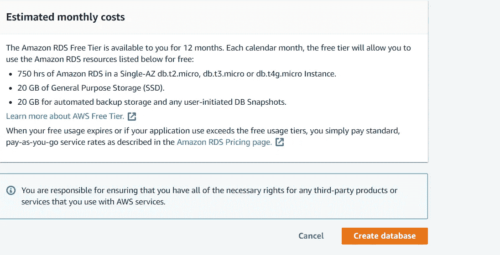

单击创建数据库图标后，创建数据库需要几分钟时间。成功创建数据库后，它看起来会像这样。

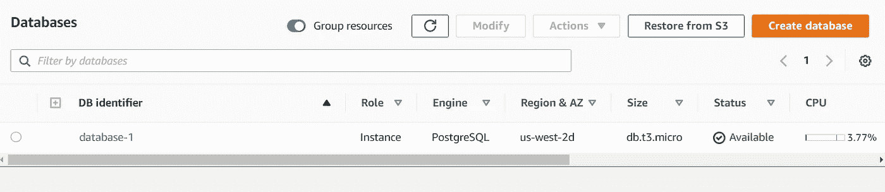

**第八步:**点击 DB 标识符，对我来说是 database-1，你会在里面找到连接字符串等信息。

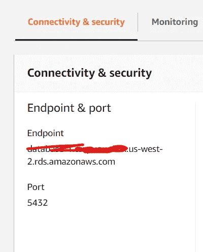

现在，单击安全组选项，您将被重定向到一个新页面。在新页面上，单击编辑入站规则并添加接受所有流量的新规则，使用图片作为参考。

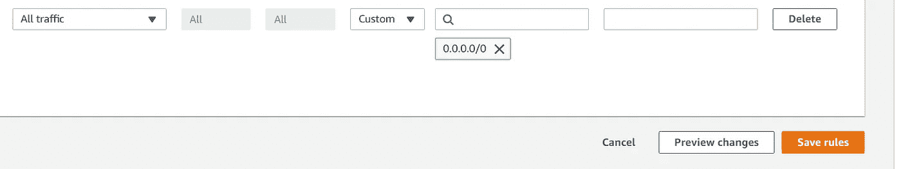

**步骤 9:** 在本地机器上安装来自[**【https://www.postgresql.org/download/】**](https://www.postgresql.org/download/)的 Postgressql，打开 PG Admin。我们需要 PG admin 来创建模式并查看表和数据。

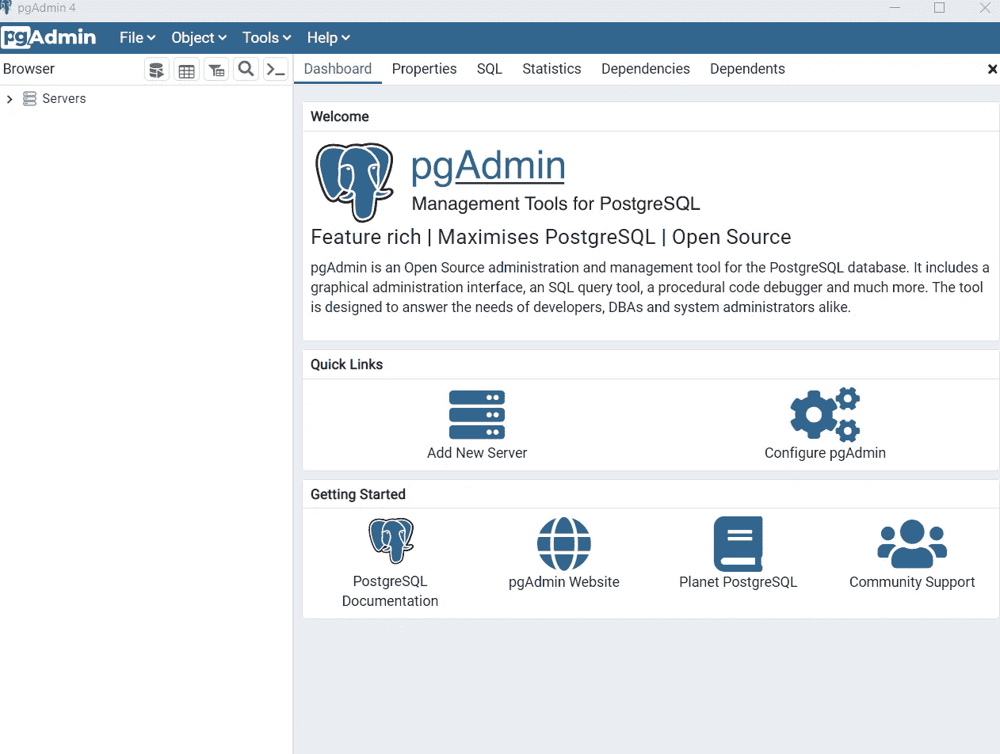

**第 10 步:**点击添加新服务器，添加我们在 AWS RDS 上创建的主机名和密码，在第 8 步中我提到了如何定位连接字符串。使用下面的图片作为参考。

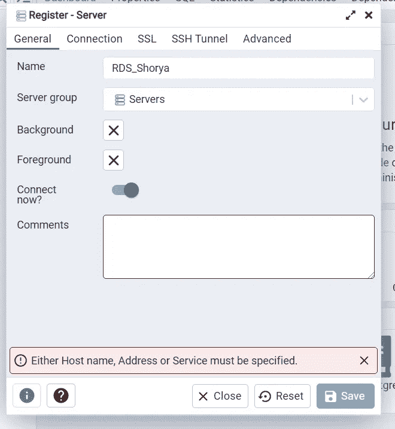

**步骤 11:** 一旦与 RDS 建立连接，您将在 servers 列表中看到您的服务器名称。单击 postgres，现在这是您的数据库，您将在该数据库下创建一个模式。

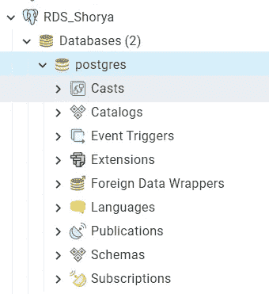

**步骤 12:** 选择 postgres 数据库，点击工具选项，然后点击查询工具选项，编写新的查询。复制&粘贴下面的查询并点击运行图标来创建一个新的模式。

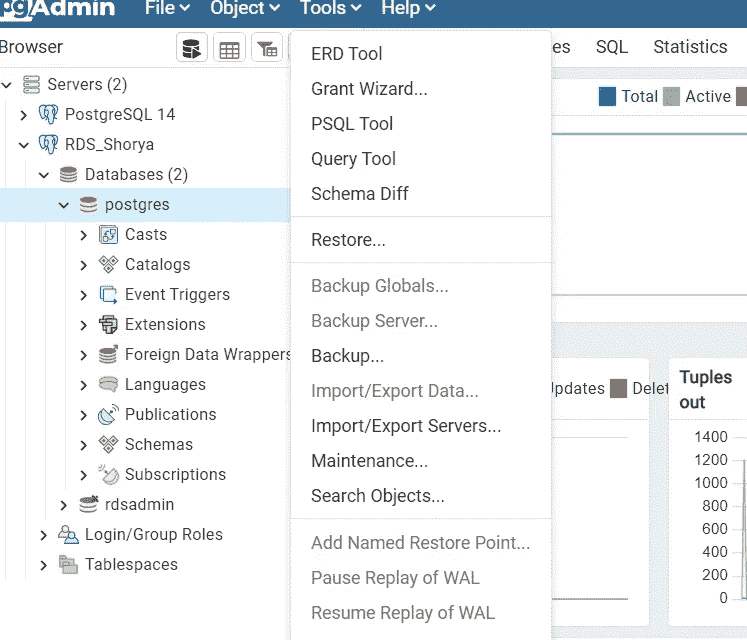

```
create schema shorya_schema_pyspark
```

**步骤 13:** 回到你的笔记本上，现在是 ETL 过程的最后一部分，即加载

> **加载步骤**

将下面的代码复制并粘贴到第三个单元格中，这里我们使用相同的连接字符串和密码与运行在 AWS 上的 postgressql 建立 JDBC 连接。

```
driver = "org.postgresql.Driver"
url = "jdbc:postgresql://<connection-string>/"
table = "shorya_schema_pyspark.WordCount"
user = "postgres"
password = ""wordCount.write.format("jdbc").option("driver", driver).option("url",url).option("dbtable", table).option("mode",
                                                                                                          "append").option("user"
                                                                                                                           ,user).option("password",password).save()
```

**让我们看看我们在 PG Admin 中创建的表格**

在查询工具中复制以下查询。

```
select * from shorya_schema_pyspark.WordCount;
```

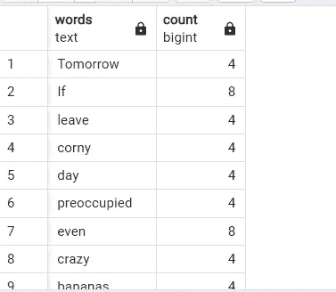

*我们的教程到此结束，祝贺你的第一个 ETL 数据管道。*

*本教程的代码(ETL.ipyn)和数据集(WordData.txt)位于:*

[](https://github.com/shorya1996/PySpark) [## GitHub - shorya1996/PySpark:该存储库包含各种 PySpark 技巧和窍门的示例

### 此时您不能执行该操作。您已使用另一个标签页或窗口登录。您已在另一个选项卡中注销，或者…

github.com](https://github.com/shorya1996/PySpark) 

***在 Linkedin 上关注我***

***LinkedIn:***[***https://www.linkedin.com/in/shorya-sharma-b94161121***](https://www.linkedin.com/in/shorya-sharma-b94161121/)*/*