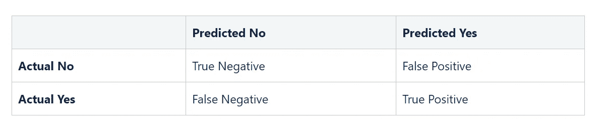
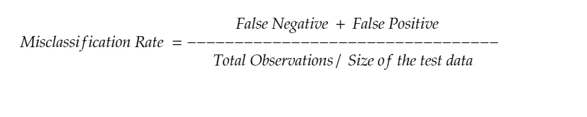
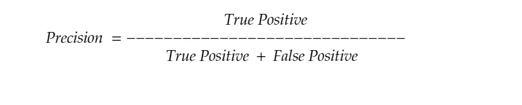
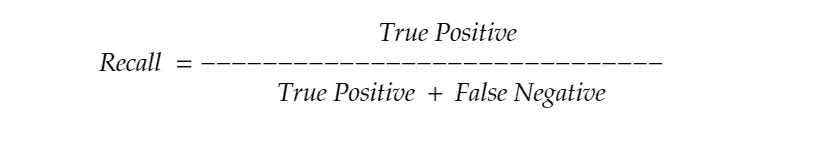

# 使用混淆矩阵评估分类模型

> 原文：<https://medium.com/nerd-for-tech/evaluating-classification-models-using-confusion-matrix-5e865cbe39d7?source=collection_archive---------24----------------------->

大量不同的分类模型，我们需要有一种方法来评估这些模型在其各种用例中的有效性。提醒一下，一些比较流行的分类算法包括:支持向量机(SVM)、线性回归、朴素贝叶斯、决策树和随机森林。

取决于分类问题的目的及其参数，例如二元分类与多元分类，一个模型可能比另一个表现得更好。如果是这种情况，那么我们如何得出一个模型优于另一个模型的结论，对此的一个解决方案是混淆矩阵。

让我们以二元分类问题的简单情况为例，即对于测试集中的每个观察值，模型将做出 1，0 /是，否的预测。生成的结果将是正确的或错误的，并且将落在我们的分类矩阵的一个可能区域中，下面将对此进行详细描述。

以上是模型预测的四个类别。让我们逐一评估。

**True Negative** —这表示我们的测试数据中的总观察值为 No，并且被预测为 No。

**真阳性** —这表示我们的测试数据中所有观察结果都是肯定的，并且预测结果也是肯定的。

**假阴性** —这表示我们的测试数据中的所有观察结果为是，而预测为否

**假阳性** —这表示我们的测试数据中的全部观察结果为否，而预测为是。

这四个给了我们一个机会来利用各种指标来评估我们的模型，这些指标包括:准确性、误分类率、精确度和召回率。

**准确性** —将此视为分类器总体正确程度的衡量标准。本质上，所有正确的是/否预测与我们测试数据中观察总数的比率。

**错误分类率** —这是准确性度量的逆过程，查看模型出错的频率。我们的模型正确的频率(准确性)是一种评估方式，对于一个好的模型，这个值应该很高。另一方面，我们也可以看看模型出错的频率，在这种情况下，错误分类率应该很低。

**精度** —这是我们的测试数据集中肯定预测的数量与实际肯定值总数的比率。解决了积极预测的比例实际上是否正确的问题。

**召回** —召回非常类似于 precision，但有一点需要注意，召回以混淆矩阵中真阳性和真阴性的比率来检查真阳性。

更直观地看上面的内容，你会发现在精确度和召回率之间有一场战争。这被称为精确召回权衡。

为了进行预测，模型具有特定的阈值，例如 0.5。基于该阈值，所有大于 0.5 的值将被分类为 1，所有小于 0 的值将被分类为 0。

提高或降低该阈值将对召回率和精确度都有影响。增加阈值将导致精确度的增加，这实质上将减少我们混淆矩阵中的假阳性的数量。这反过来将导致召回保持不变或减少。

在未来的出版物中，我可能会详细讨论这个和类似的主题，但是如果你有兴趣了解更多关于精确召回权衡的信息，可以快速阅读一下[数据科学乔治的](https://datascience-george.medium.com/the-precision-recall-trade-off-aa295faba140#:~:text=Recall%20can%20be%20defined%20as,it%20will%20tilt%20the%20scales.)出版物。