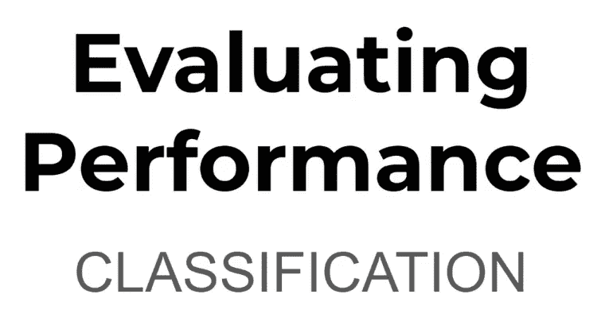
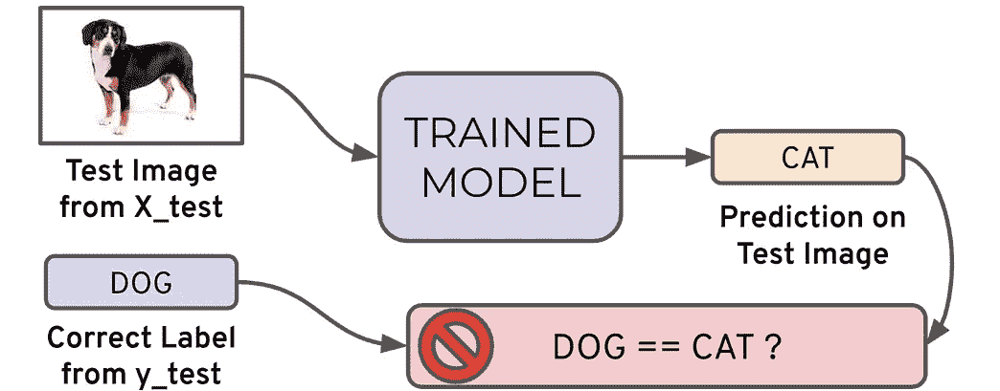
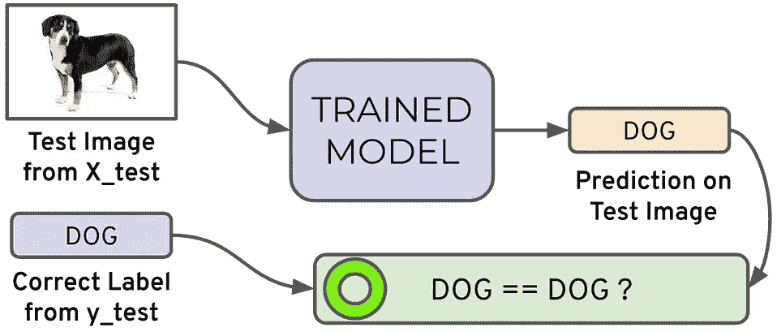
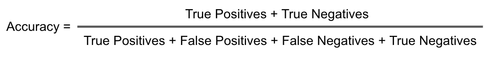
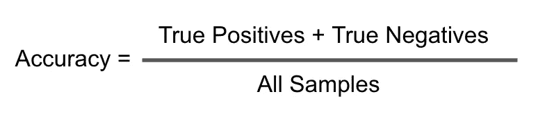
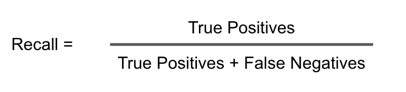
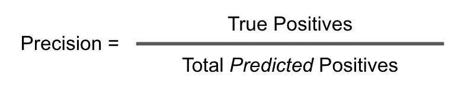
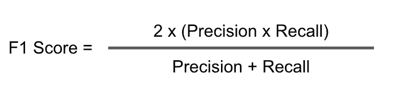
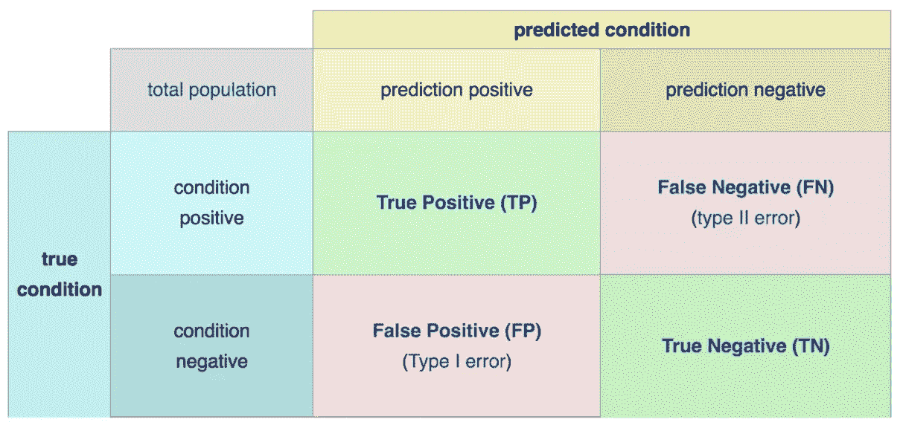

# 评估性能-分类

> 原文：<https://medium.com/nerd-for-tech/evaluating-performance-classification-f371fed140e5?source=collection_archive---------18----------------------->

评估分类任务的误差度量。

我们需要知道的关键分类指标是:

1.  准确(性)
2.  回忆
3.  精确
4.  f1-分数

通常在任何分类任务模型中只能达到两种结果:

→要么你的模型的预测是正确的。

→或者你的模型在预测中**不正确**。

为了解释度量，让我们以**二进制****分类为例，这里我们只有两个类。同样的过程可以扩展到多个类。**

**我将解释预测的场景，如果图像是狗/猫。**

********

**我们将测试图像提供给训练好的模型，将预测的输出与测试图像的标签进行比较，以评估其正确或错误的预测。我们对 X_test 数据中的所有图像重复这个过程。最后，我们将得到正确匹配和错误匹配的计数。我们需要认识到的关键点是，在现实世界中，并非所有不正确和正确的匹配都具有相同的价值。此外，在现实世界中，单个指标不能说明全部情况，这就是为什么前面提到的四个指标用于评估模型。我们可以将我们的预测值与真实值相比较，组织成一个**混淆矩阵**。**

## ****精度**:**

**分类问题的准确度是模型做出的正确预测数**除以预测总数**。**例如，如果 X_test 集合有 100 幅图像，而我们的模型正确预测了 80 幅图像，那么我们有 **80/100** 、 **0.8** 或 **80 %** 的准确率。****

****

**或者简单地简化为**

****

**当目标类很好地平衡时，准确性是有用的。在我们的例子中，猫的图像和狗的图像数量大致相同。**

**对于**不平衡的**等级，精度不是一个好的选择。假设我们有 99 张狗的图片和 1 张猫的图片。如果我们的模型只是一条预测狗的直线，我们将获得 99 %的准确率。在这种情况下，我们需要理解召回率和精确度。**

## **回忆(又名敏感度):**

**模型在数据集中找到所有相关案例的能力。简单来说，当它实际上是“是”时，它预测“是”的频率是多少。**

**召回的精确定义是真阳性的数量除以真阳性的数量加上假阴性的数量。**

****

**或者简单地说，**

****

## **精度:**

**分类模型仅识别相关数据点的能力。简而言之，当它预测“是”时，它的正确率是多少。**

**精确度被定义为真阳性的数量除以假阳性的数量。**

****

**或者简单地说，**

****

**通常当我们在召回率和准确率之间进行权衡时。回忆表达了在数据集中找到相关实例的能力，而精确表达了我们的模型所说的相关数据点实际上是相关的数据点的比例。**

## **F1 分数:**

**如果我们想要找到精确度和召回率的最佳组合，我们可以使用 F1 分数来组合这两个指标。**

**F1 分数是精确度和召回率的调和平均值，将这两个指标都考虑在以下等式中。**

****

**我们使用调和平均值而不是简单平均值的原因是因为它会惩罚极值。精度为 1.0、召回率为 0.0 的分类器的简单平均值为 0.5，但 f 1 值为 0。**

**我们还可以以混淆矩阵的形式查看所有正确分类和错误分类的图像。**

****

**困惑矩阵可能看起来令人困惑，但在您完整阅读本文之后就不会了。为了解释混淆矩阵，一个真正的阳性将是某人确实患有该疾病，而模型正确地预测他们患有该疾病，一个真正的阴性将是某人没有患有该疾病，而模型正确地预测他们没有患有该疾病，然后我们基本上有两种类型的错误预测，假阳性和假阴性。假阳性是指如果这个人没有患病，而你预测他们确实患病，那就是假阳性，因为你谎称他们对这种疾病呈阳性。假阴性基本上与此相反，这个人确实有这种疾病，模型报告他们实际上没有这种疾病。这些在统计学中也被称为 I 型误差和 II 型误差。**

## **结论:**

**要记住混淆矩阵和各种计算指标的要点是，它们都是比较预测值和真实值的基本方法。什么是“好”的度量标准，将真正取决于具体的情况。**