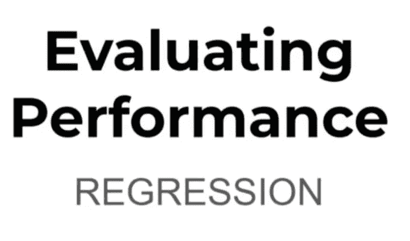
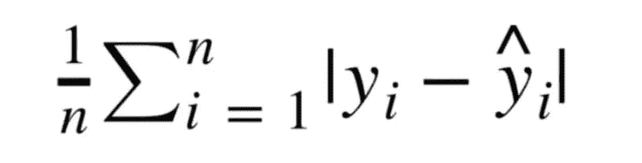
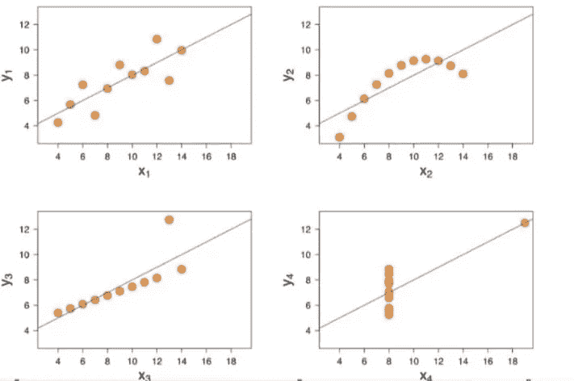
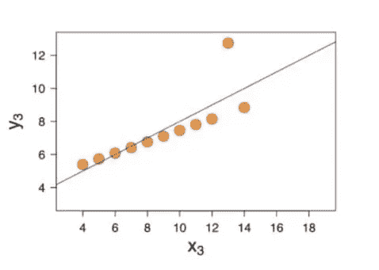
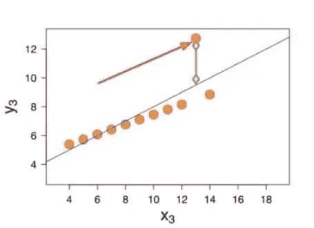
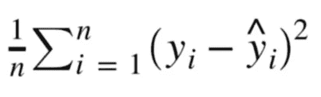

# 评估绩效—回归

> 原文：<https://medium.com/nerd-for-tech/evaluating-performance-regression-d4ef40986402?source=collection_archive---------21----------------------->

无论我们做什么，都需要评价让我们知道对错。

相信大家都知道什么是回归任务。例如

*   试图根据房屋的特点预测其价格是一项回归任务
*   尝试根据房屋的特征预测其所在的国家将是一项分类任务。

最常见的回归评估指标:

→平均绝对误差(MAE)。

→均方误差(MSE)。

→均方根误差(RMSE)。

## 平均绝对误差:

*   平均绝对误差是通过取实际值和预测值之差的绝对值的平均值来计算的。

图 1 : MAE 公式

*   MAE 的主要缺点是它不会惩罚大的错误。

图 2:安斯康贝的四重奏。

*   当我们采用 Anscombe 的四重奏时，不同数据集的最佳拟合线是相同的。MAE 不会考虑异常值。
*   在特定的情况下，我们可以拍摄下图。

图 3:预测中的异常值

*   在这张图片中有一个巨大的异常值，MAE 不会考虑这些错误。

.

.

.

.

.

图 4:异常值

.

*   我们希望我们的误差指标考虑到这些。因此，我们移动了一些其他的误差指标，如 MSE。

.

.

.

## 均方差(MSE):

*   通过取实际值和预测值之差的平方的平均值来计算均方误差。
*   当我们取该值的平方时，较大的误差比 MAE 更多，这使得 MSE 更受欢迎。

图 4 : MSE 公式

*   然而，MSE 有一个问题，当我们计算误差的平方时，(负值将被转换为正值，因为我们正在平方)，实际上它也计算单位的平方，例如当我们计算房屋预测误差的平方时，它将卢比平方为卢比平方，这对我们来说很难解释。为了克服这一点，我们去了 RMSE。

## 均方根误差(RMSE):

*   RMSE 是通过去掉均方误差的平方根计算出来的。

图 5 : RMSE

*   RMSE 是最受欢迎的，因为它既惩罚误差，又具有与预测值(y)相同的单位。

→现在出现了一个最常见的问题，

RMSE 的这种价值观好吗？

*   我们寻找的都是生意，
*   10 美元的 RMSE 非常适合预测房子的价格，但是很难预测糖果的价格。
*   将您的误差度量与数据集中标签的平均值进行比较，尝试获得其整体性能的直觉。
*   领域知识也起着重要的作用。

我希望，您知道应该记录哪些错误指标。

感谢阅读！