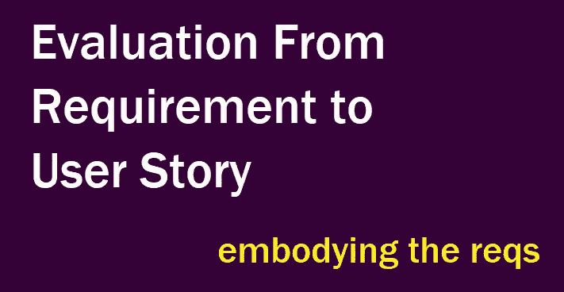
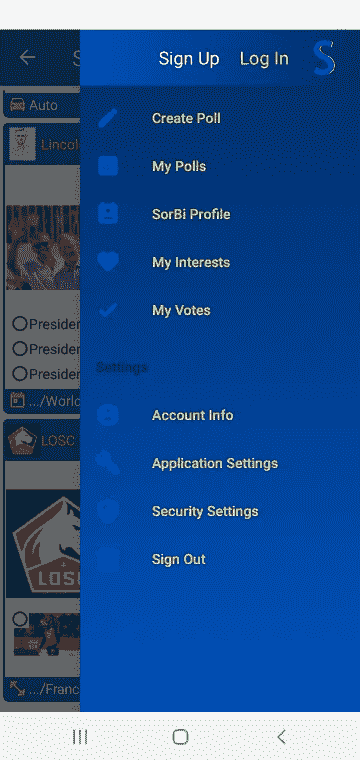
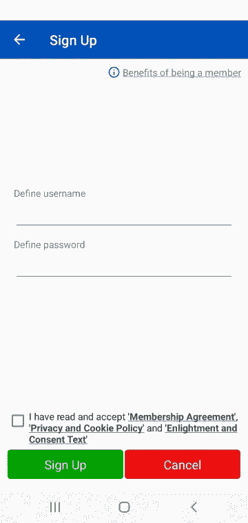
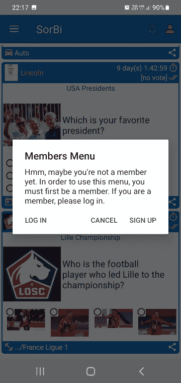
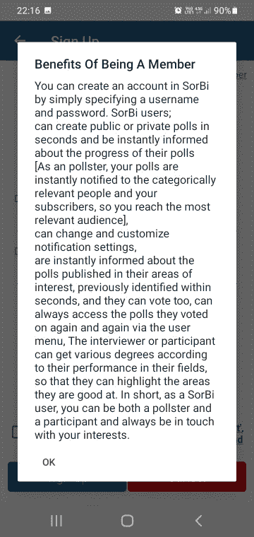

# 从需求到用户故事的评估/[测试文章系列第 3 部分中的软件开发工程师]

> 原文：<https://medium.com/nerd-for-tech/evaluation-from-requirement-to-user-story-software-developer-in-test-article-series-part-3-4602ff86959f?source=collection_archive---------11----------------------->

警告:由于我的英语不好，文章可能会有语法错误。(这是最后一次警告。我不会在前面的文章中写这个警告。好多朋友跟我说你的英语没那么差写个警告:)

**好消息:**无论如何，你会了解我们话题的几乎一切。

这是我的“如何成为一名测试中的软件开发工程师”文章系列的第三篇文章。所有这些文章都是以问答的形式写的。正如我从我的一些菲律宾朋友那里了解到的，这个方法是苏格拉底为了更好地解释事物而发明的。因此，我希望技术和非技术的家伙将受益于这些文章。

你可以在这里找到第一篇****和第二篇 [**这里**](https://kicchi.medium.com/agile-methodology-and-scrum-framework-software-developer-in-test-article-series-part-2-af5f2dd3e6ac) 。强烈建议在这篇之前先看前面的文章。****

****由于我已经做了 11 年多的软件开发人员，我将提供一些真实的和可行的示例代码。这些代码样本源自移动应用程序、桌面应用程序、web 应用程序、web 服务以及各种数据库过程。****

****为了更好地说明问题，我在文章中大量使用了 Q 女士和索比作为例子。****

*******女士 Q:*** 一位女商人，也是索比 app 的客户。她付钱给一家软件开发公司开发索比应用程序。****

*******索比:*** 一款用于创建和分享民调的 android 应用。在本系列文章中，以 SorBi 为例。这款应用在 [**Google Play**](https://play.google.com/store/apps/details?id=com.lespania.sorbi) 上可用，支持英语和土耳其语。****

****让我们享受学习体现需求的令人兴奋的东西吧！****

> ****问题:你提到了很多东西，但都有点抽象。是时候开始做些实际的事情了吗？****

******回答:**是的，其实是。首先我们来定义一下 Q 女士的应用索比的**特性**。之后，我们将定义应用**需求**。这个过程由产品所有者、业务分析师(正如我们在上一篇文章中指出的)来执行。然后，我们将为所有需求定义**用户故事**。该流程由产品负责人掌握。然后我们将定义与这些要求相关的**验收标准**。****

> ******问:**索比是一款调查类 app 吧？****

******答:**起初，Q 女士要求为他的公司开发一个私人 android 调查应用程序。但过了一会儿，她决定公开这个应用程序。在一个非常基本的水平上，她想要一个调查应用程序，用户可以创建调查和投票调查主要基于他们的兴趣。自从她改变主意使用公共应用程序后，她决定拥有创建私有和公共调查的能力。如果用户创建了私人调查，则只有拥有特定共享链接的人才能使用该调查。如果用户创建公共调查，所有应用程序用户都可以查看和投票。****

> ******问:**爽。是时候揭开神秘面纱了！****

****答:好的。我们很幸运，Q 女士很清楚自己想要什么。她希望在她的投票应用程序 SorBi 中包含这些特性；****

*   ****1.报名****
*   ****2.登录****
*   ****3.注销****
*   ****4.查看帐户信息****
*   ****5.编辑帐户****
*   ****6.调整安全设置****
*   ****7.帐户恢复****
*   ****8.投票创建****
*   ****9.投票编辑****
*   ****10.查看民意调查****
*   ****11.投票调查****
*   ****12.创建索比配置文件****
*   ****13.查看自己的投票****
*   ****14.查看自己的投票****
*   ****15.从类别列表中选择感兴趣的主题****
*   ****16.接收即时通知****
*   ****17.调整应用程序设置****

> ****问:他们不是太多了吗？****

****T21:是的。由于供应商实现了敏捷方法论最流行的框架 Scrum，Scrum 团队将逐一处理所有这些特性。正如我们之前提到的，Scrum 团队将尽快发布一个非常基础的产品，以满足客户需求并获得反馈。这就是为什么产品负责人优先考虑所有这些功能并列出它们。****

********

****索比的主菜单****

****正如你看到的菜单，Q 女士要求的每个功能都有模块。我们可以**根据功能的**依赖性**对其他功能和 q 女士的紧急**需求**进行**优先排序。我们可以理解，如果不提供注册功能，我们就无法进入“登录”、“注销”、“帐户信息”等。因为它们都依赖于用户信息，我们只能通过注册功能来获取这些信息。****

> ****问:**总得有人给开发团队做一些定义。他们怎么知道自己会做什么？**

****答:**考虑一下报名模块。**

****

**SorBi 的注册模块**

**正如你所说，必须有人解释这个注册功能；产品所有者。采购订单根据客户需求创建需求。这些是特性注册(ft。1):**

*   **Rq。1 英尺。1:用户应该注册并创建用户帐户。**
*   **Rq。2/英尺。1:用户应该提供唯一的用户名和密码来注册。**
*   **Rq。3 英尺。1:用户应通过点击会员专用菜单直接进入“注册”模块。**
*   **Rq。4/英尺。1:用户应该查看解释成为会员的好处的文本。**

> ****问:**就是这么简单。不是吗？**

**A: 有，但不够明确具体。这些需求必须通过用户故事来说明细节。PO 编写**用户故事**并对它们进行优先级排序。然后，主要是在**培训会议**上，Scrum 团队评估用户故事，根据它们的**复杂性**以及开发团队的**能力**和**速度**给它们打分。**

**这是需求 1 的用户故事(用户应该注册并创建用户帐户):**

****作为一个用户，** ***我希望能够*** 创建一个帐户，只需注册一个用户名和密码，**这样**我将成为会员，我可以访问会员相关的内容。**

> ****问:**耶哥们。现在详细多了。开发者必须对详细的解释感到满意。**

**事实上，他们不会。他们需要更多的东西来理解他们走在正确的道路上。他们想知道故事是否完成，是否如预期的那样运作。**

> ****问:**我们需要一些标准来满足和评估用户故事完成与否。那是什么？**

****答:**即**验收标准** (AC)。正如你所指出的，我们需要他们来评估用户故事是否完成。它们对于每个用户故事都是独特的。**

**AC 是 SorBi 被 PO 接受必须满足的条件。从最终用户的角度定义特性行为。**

**以上是用户故事的接受标准:**

*   **在主菜单上必须有一个用户注册按钮。**
*   **通过点击该按钮，注册屏幕必须打开。**
*   **在注册屏幕上必须有一个用户名和密码区。**
*   **在注册屏幕上必须有一个取消按钮。**

> ****问:**就这样。这就是我热爱 Scrum 的原因。作为一名开发人员，你知道该做什么和怎么做。作为一名测试人员，你知道测试什么以及如何测试。作为一个 Scrum 团队，你知道优先权和如何满足客户。用户故事不是更多吗？他们太疯狂了！**

****答:**即使屏幕看起来很简单，但总有很多事情要做。以下是注册功能的其他用户案例和相关接受标准:**

> ****要求 2/ft 1:用户应该提供一个独特的用户名和密码注册。****

****用户故事:****

**作为**用户** ***我希望能够*****拥有一个唯一的用户名，这样**我就能与其他用户区分开来。**

**作为**用户** ***我希望能够*****定义一个安全的密码，这样**我的账户仍然安全。**

****验收标准:****

*   **在注册屏幕上，必须检查提供的用户名，如果它存在于数据库中。**
*   **密码必须至少有 4 个字符，不得有空格。**
*   **必须告知用户与用户名和密码策略相关的安全措施**
*   **用户应该能够访问“会员协议”，“隐私和 Cookie 政策”，“启示和同意文本”。**
*   **用户必须接受这三个文件才能成为会员。**
*   **密码必须以加密格式保存到数据库中，不得以明文形式保存。加密必须在客户端完成。**
*   **密码和用户名必须通过 htpps 协议发送到服务器。**
*   **必须在数据库服务器上随机生成唯一的用户 id。**

> ****要求 3/ft 1:用户应通过点击会员专用菜单被引导到“注册”模块。****

****用户故事:****

**作为**用户*，我想*** 知道哪些内容是会员专用的，**这样**我就会被告知关于 app 系统的情况。**

**作为**用户*，我希望*** 在点击会员专用菜单**时被引导至注册屏幕，以便**我可以轻松访问注册模块。**

****验收标准:****

*   **在主菜单上，如果访问者点击“会员专用”菜单项，必须警告他/她该内容仅供会员使用。**
*   **通过该警告，访问者必须有机会被引导去注册模块。**

****

**会员专用菜单的注册提醒**

> ****要求 4/ft 1:用户应该查看解释成为会员的好处的文本。****

****用户故事:****

**作为**用户** ***我想*** 知道我为什么要成为会员，**这样**会更鼓励我成为会员。**

**作为**用户** ***我想让*** 知道“成为会员的好处”，**这样就能鼓励**我创建一个帐户。**

****验收标准:****

*   **在注册屏幕上会有一个关于“成为会员的好处”的信息按钮。**
*   **通过点击该按钮，必须通过弹出文本通知用户。**
*   **访问者必须被提醒他们所做的每一次投票都有“作为用户的好处”。**

****

**成为会员的好处弹出**

> ****问:**有很多事情要做。我想在底层系统中一定有很棒的东西。你能解释一下吗？**

**T21:我可以，但是现在解释太多了。在未来的会议中，我将显示所有有关注册功能的相关代码。耐心点！**

****PS** :关于 [**AC**](https://www.altexsoft.com/blog/business/acceptance-criteria-purposes-formats-and-best-practices/) 的进一步阅读。**

****现实生活中的例子:****

****用户故事:**(我儿子说)作为儿子，我希望你给我和我的朋友买冰淇淋，这样我们就可以和你一起去集市了。(有点 bribery☺)**

**爸爸必须给我们买冰淇淋。**

****

**孩子们在去集市的路上。**

**可以在这里 阅读下一篇*数据从前端流向后端* [**。**](https://kicchi.medium.com/flow-between-frontend-and-backend-software-developer-in-test-article-series-part-4-8a8d6db27e10)**