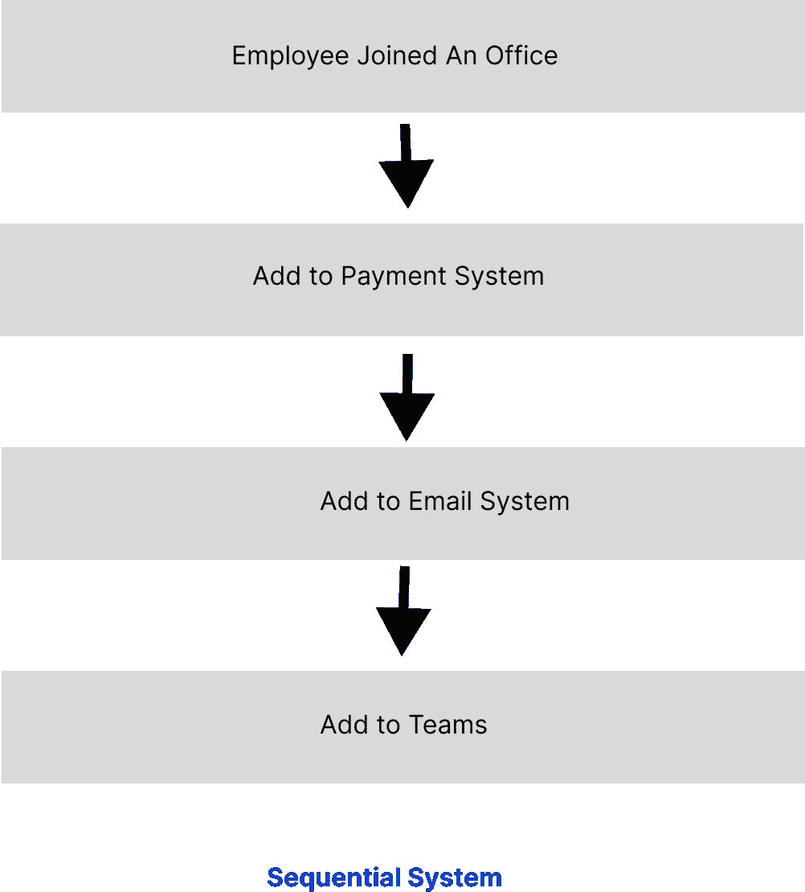
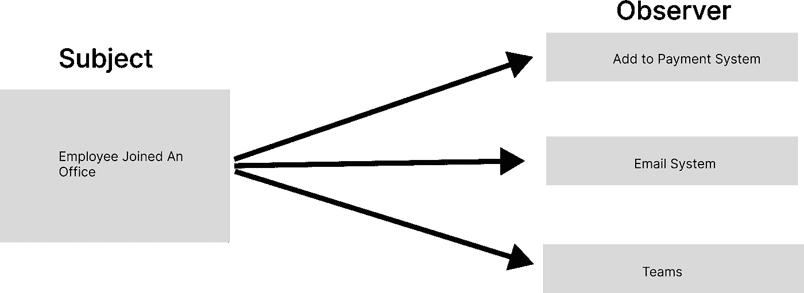
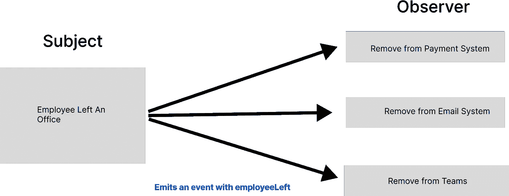
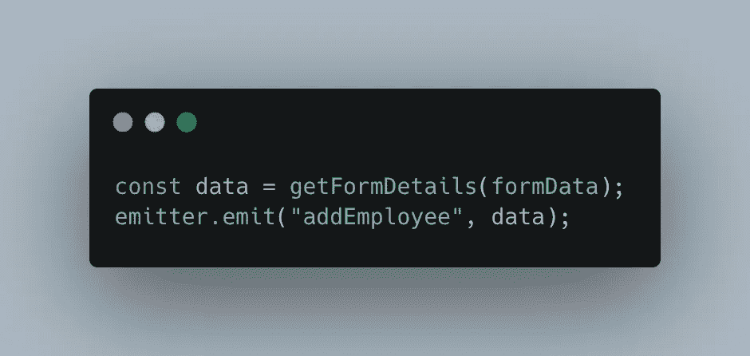
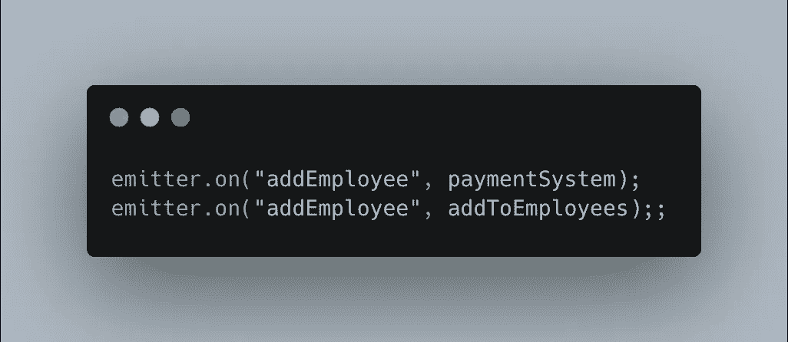

# 事件驱动架构

> 原文：<https://medium.com/nerd-for-tech/event-driven-architecture-b1b3700eff7c?source=collection_archive---------4----------------------->

顺序代码流与事件驱动代码流

# 顺序模式

在编写代码的顺序模式中，代码从一个点流向另一个点。不同的系统进程相继同步执行。

在下面的代码流示例中，显示了一个同步序列。一名员工加入了一家新公司，他的数据必须添加到不同的系统中。所有需要员工数据的系统都在一个接一个地更新数据，直到整个更新完成。

## 赞成的意见

1.  当代码按顺序流动时，我们知道什么系统已经完成，什么系统还没有开始
2.  易于控制

## 骗局

1.  代码是耦合的，如果其中一个系统出现故障，代码流就会中断
2.  高耦合。

# 事件驱动架构——主体和观察者模式

与序列模式相反，代码流被分成独立的块，这些块可以独立执行，不依赖于其他东西。当一个重要的事件发生时，一个事件被发出。它被通知给正在监听的其他系统。因为代码块是独立的，所以所有子系统并行地反应和完成这些步骤。

主题和观察者模式是实现事件驱动架构的一种方式。Subject 发出一个带有事件名称和数据的事件。观察者倾听事件并做出相应的反应。

在下面的示例中，主题正在发出事件。一旦员工被添加到系统中，就会有多个观察者监听事件。他们会回应的。即使其中一个系统出现故障，另一个系统将继续工作。这种架构是有弹性的。

发出带有“addEmployee”名称和详细数据的事件

## 赞成的意见

1.  解耦，一个系统不需要了解另一个系统
2.  我们可以很容易地用一个系统替换另一个系统，只要它与合同有约束力
3.  与语言无关，不同的系统可以用不同的语言实现。

## 骗局

2.受试者无法控制结果

## 例子

在下面的例子中，我们使用 nano [事件发射器。](https://github.com/ai/nanoevents)事件发射器用于发射添加员工事件。

发出添加员工

雇员文件监听该事件以添加雇员，并且支付系统也被更新。

