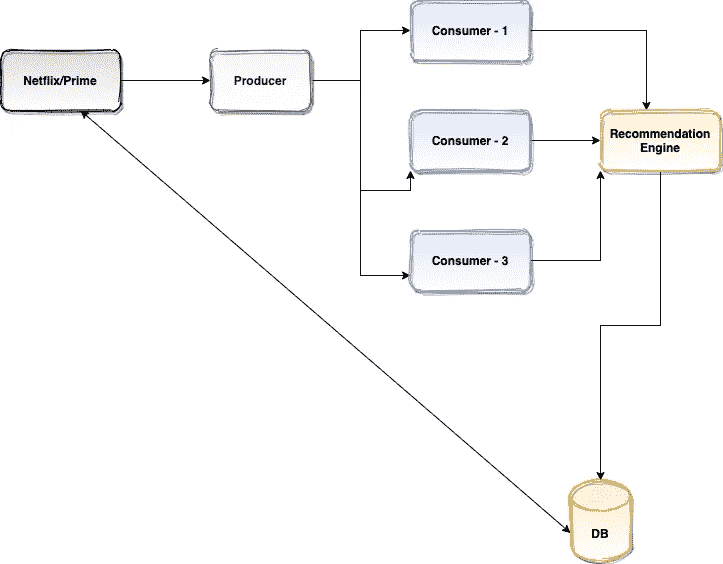
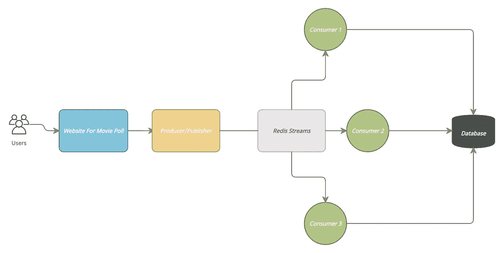
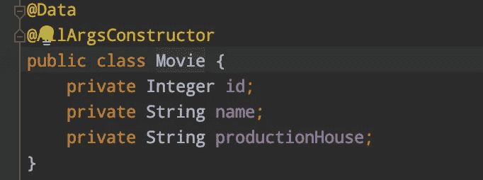
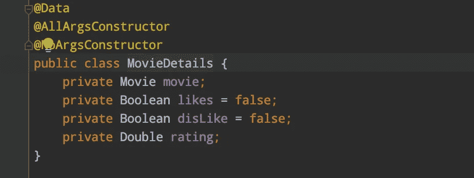
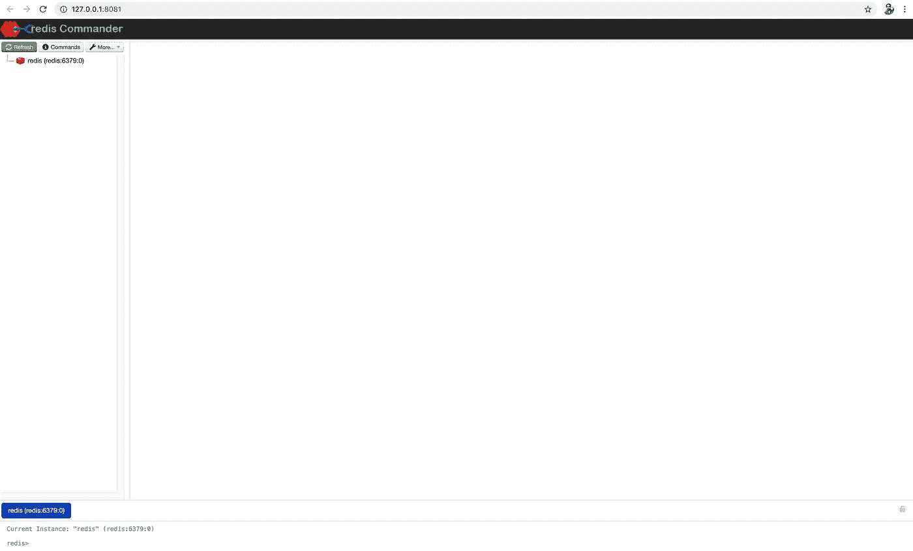
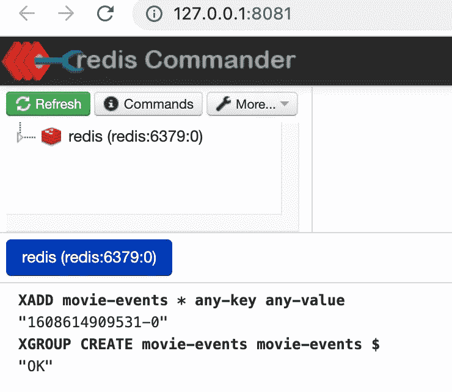
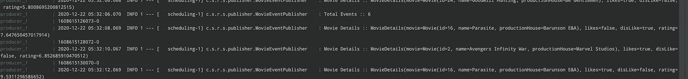
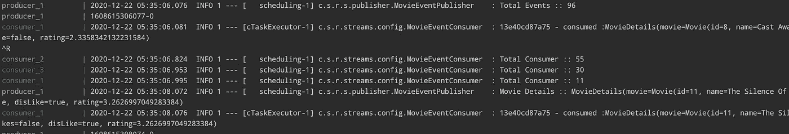
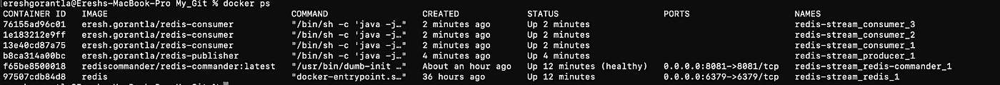
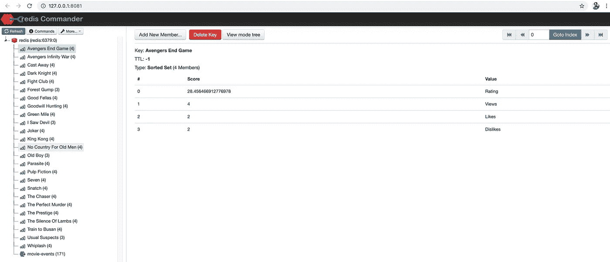

# 使用 Spring Boot 的 Redis 流的事件驱动架构

> 原文：<https://medium.com/nerd-for-tech/event-driven-architecture-with-redis-streams-using-spring-boot-a81a1c9a4cde?source=collection_archive---------0----------------------->

在这个故事中，我将讨论如何在 spring boot 中使用 Redis 流处理实时数据流。这将用生产者和消费者模型来解释。

早些时候，我尝试了 Redis 发布/子模型。但它有一个问题，当一个生产者发布一个主题时，它的所有消费者都会处理数据，这与卡夫卡使用消费者群体不同。Pubsub 不是这样工作的——消息会发送到所有连接的订阅客户端

***流处理***

以前，实时处理是以不同的方式完成的。例如:付款后，我们会将它们保存在数据库中，然后在晚上或分多批处理数据，并在系统中离线反映新数据。

但是现在我们需要处理实时数据，我们会得到连续的数据流。例如:推荐引擎的大部分。像网飞、prime 这样的现代应用。基于我们的观看/搜索历史，推荐引擎预测下一个观看列表。这发生在当下。这将提供更好的用户体验和商业价值。另一个例子是我们即时进行的信用卡交易/UPI 交易。



流处理是实时连续的数据处理。让我们看看如何通过 Spring Boot 使用 Redis 流实现简单的实时流处理。

让我们看一个电影数据库的用例。订阅用户或匿名用户观看电影，并且可以喜欢、不喜欢和评价电影。我们的任务是记录一些观点，喜欢，不喜欢，以及评级。我将通过随机化喜欢、不喜欢和评级部分来创建一个生产者/发布者服务。它们将被发布到 Redis 流，订阅了这些流的用户将在 DB 或任何其他子系统中更新它们(为了简单起见，这里我使用了 Redis 排序集)。



**技术栈**

> Java 8
> 
> Spring Boot 2.3.7 .版本
> 
> Maven For Build
> 
> Docker 为了简单起见(Redis 在 docker 中，应用程序也在 docker 中)

让我们看看代码库

***发布者配置***

为了简单起见，我使用了一个调度器，它每 2 秒钟将数据发布到流，订阅的消费者将发布到 Redis 排序集，其中包含详细信息(电影名称、喜欢数、不喜欢数和总评分)。

首先，让我们看看已发布和消费的 DTO 类。



我生成了一些随机的电影库，每 2 秒发布一次。

每 2 秒运行一次并发布到 Redis 流的电影发布事件类

***Redis 消费者***

RedisConfig 类

电影事件消费者

**将申请归档**

我使用 docker 在一个简单的 docker-compose 文件中简单地设置 Redis 和其他引导应用程序，以避免任何进一步的安装。消费者应用程序将有 3 个副本，以确保负载是分布式的。为此使用了 docker。

Docker-compose.yaml

> **redis** 图像用于 redis 实例。
> 
> **redis-commander** 是 redis 的 GUI，绑定到端口 8081。
> 
> **带环境变量的再发行商**提供了 2000 年的发行率。
> 
> **redis-consumer** 也已配置。

**再版出版商的 Docker 文件**

```
FROM openjdk:8-jdk-alpine
ADD target/*.jar redis-stream.jar
ENTRYPOINT java -jar redis-stream.jar
```

**经销商的 Docker 文件**

```
FROM openjdk:8-jdk-alpine
ADD target/*.jar redis-stream.jar
ENTRYPOINT java -jar redis-stream.jar
```

我还没有在 docker 文件中触发构建，我们必须在启动并运行 docker 容器之前进行构建。

**如何启动应用程序**

让我们同时构建发布者和消费者。导航到消费者和发布者目录，运行下面的 maven 命令来创建一个 jar 文件。

```
mvn clean package -DskipTests
```

***用 Redis 命令调出 Redis***

转到根目录并运行下面的命令

```
docker-compose up redis redis-commanderereshgorantla@Ereshs-MacBook-Pro redis-stream % docker-compose up redis redis-commander
WARNING: The Docker Engine you're using is running in swarm mode.Compose does not use swarm mode to deploy services to multiple nodes in a swarm. All containers will be scheduled on the current node.To deploy your application across the swarm, use `docker stack deploy`.Starting redis-stream_redis_1 ... done
Starting redis-stream_redis-commander_1 ... done
Attaching to redis-stream_redis_1, redis-stream_redis-commander_1
redis-commander_1  | Creating custom redis-commander config '/redis-commander/config/local-production.json'.
redis_1            | 1:C 22 Dec 2020 05:23:35.977 # oO0OoO0OoO0Oo Redis is starting oO0OoO0OoO0Oo
redis_1            | 1:C 22 Dec 2020 05:23:35.977 # Redis version=6.0.9, bits=64, commit=00000000, modified=0, pid=1, just started
redis_1            | 1:C 22 Dec 2020 05:23:35.977 # Warning: no config file specified, using the default config. In order to specify a config file use redis-server /path/to/redis.conf
redis-commander_1  | Parsing 1 REDIS_HOSTS into custom redis-commander config '/redis-commander/config/local-production.json'.
redis_1            | 1:M 22 Dec 2020 05:23:35.978 * Running mode=standalone, port=6379.
redis_1            | 1:M 22 Dec 2020 05:23:35.978 # WARNING: The TCP backlog setting of 511 cannot be enforced because /proc/sys/net/core/somaxconn is set to the lower value of 128.
redis_1            | 1:M 22 Dec 2020 05:23:35.978 # Server initialized
redis_1            | 1:M 22 Dec 2020 05:23:35.978 * Loading RDB produced by version 6.0.9
redis_1            | 1:M 22 Dec 2020 05:23:35.978 * RDB age 2642 seconds
redis_1            | 1:M 22 Dec 2020 05:23:35.978 * RDB memory usage when created 0.79 Mb
redis_1            | 1:M 22 Dec 2020 05:23:35.978 * DB loaded from disk: 0.000 seconds
redis_1            | 1:M 22 Dec 2020 05:23:35.979 * Ready to accept connections
redis-commander_1  | node ./bin/redis-commander 
redis-commander_1  | Using scan instead of keys
redis-commander_1  | No Save: false
redis-commander_1  | listening on 0.0.0.0:8081
redis-commander_1  | access with browser at [http://127.0.0.1:8081](http://127.0.0.1:8081)
redis-commander_1  | Redis Connection redis:6379 using Redis DB #0
```

进入浏览器并打开 [http://127.0.0.1:8081](http://127.0.0.1:8081)



通过名称“电影事件”创建 Redis 流，我们在应用程序中使用了相同的名称。

```
XADD movie-events * any-key any-value
```

创建一个消费者组，在消费者之间分担负载

```
XGROUP CREATE movie-events movie-events $
```



***调出***

```
docker-compose up producer
```



***让我们调出有 3 个复制品的消费者***

```
docker-compose up --scale consumer=3
```

查看控制台:您可以观察到 3 个消费者已经出现并开始消费流事件。



让我们看看 docker 实例



让我们看看 Redis commander，数据是否以带有电影名称的排序集发布。



仅此而已！快乐学习

请在这里找到[的完整源代码。](https://github.com/ereshzealous/redis-stream)

# 参考资料:

[](https://redis.io/topics/streams-intro) [## Redis 流介绍- Redis

### 流是 Redis 5.0 中引入的一种新的数据类型，它以一种更抽象的方式对日志数据结构建模…

redis.io](https://redis.io/topics/streams-intro) [](https://redislabs.com/blog/getting-started-with-redis-streams-and-java/) [## Redis 流和 Java | Redis 实验室入门

### 作为一名新的企业技术客户经理，我的首要任务之一是了解更多关于 Redis 的信息。所以我开始…

redislabs.com](https://redislabs.com/blog/getting-started-with-redis-streams-and-java/)