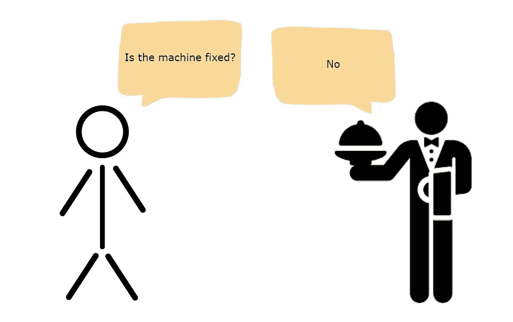
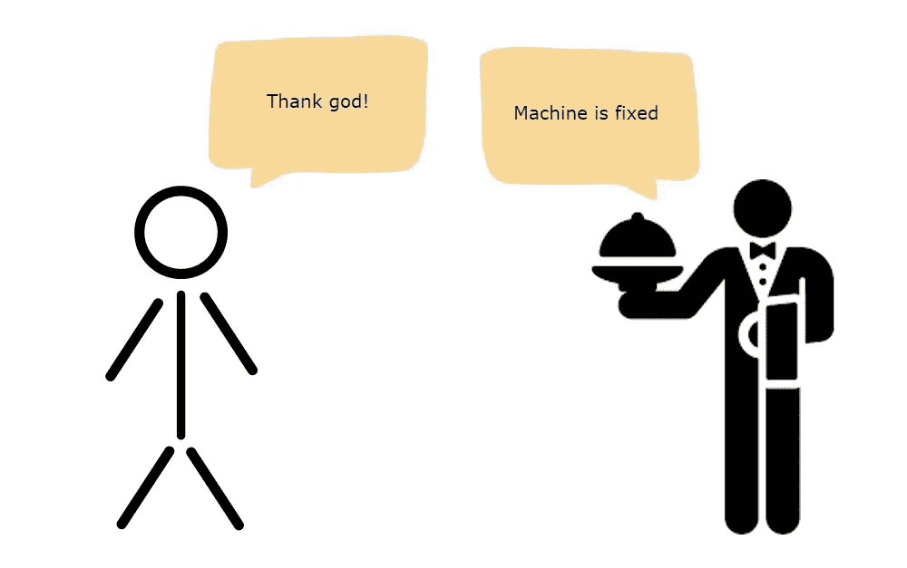
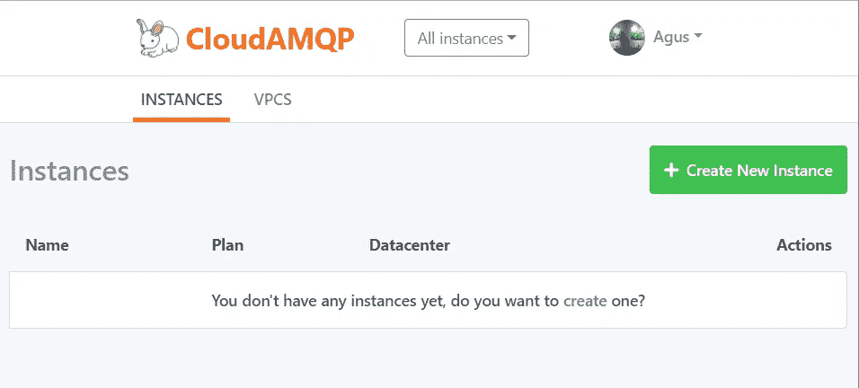
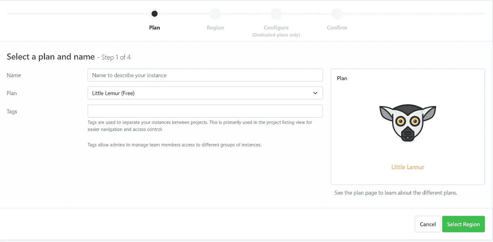
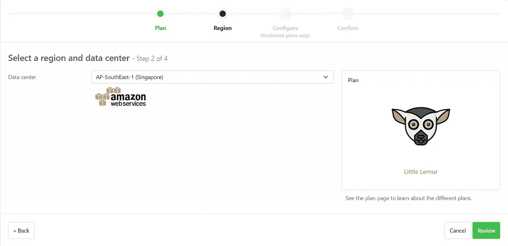
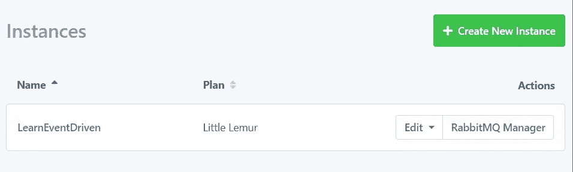

# 使用 TypeScript 和 RabbitMQ 的事件驱动架构

> 原文：<https://medium.com/nerd-for-tech/event-driven-architecture-with-typescript-and-rabbitmq-e9bafee5ab2d?source=collection_archive---------0----------------------->

让我们用 TypeScript 和 RabbitMQ 实践一下事件驱动架构


加里·本迪格在 [Unsplash](https://unsplash.com?utm_source=medium&utm_medium=referral) 上的照片

随着微服务架构的兴起，服务之间如何发送数据的问题就浮现出来了。在传统的请求驱动模式和最重要的事件驱动模式之间，我们应该选择什么样的模式？

而我们需要选择哪种模式取决于我们的应用程序。在本文中，我们将看到事件驱动架构背后的一些概念及其使用 TypeScript 和 RabbitMQ 构建的实现。

# 事件驱动架构的基本概念

首先，让我们看一个请求驱动架构的真实例子。

想象一下，你在麦当劳，非常想吃冰淇淋。你可能知道，有时当你在那里时，机器坏了。然后你问服务员:“机器什么时候能修好？”。服务员说“几分钟后”。然后你回到你的椅子上，吃你的汉堡。

五分钟后，你问“机器修好了吗？”服务员回答“没有”。然后你空手回到你的椅子上。



作者形象

同样的事情你问了好几次，服务员还是回答“没有”。直到 30 分钟后，机器修好了，你就可以拿你的冰淇淋了。

如果我是服务员，如果每隔几分钟就有人问我，我会非常恼火。那么，什么是最好的方法来确保没有人会打扰我这个服务员，但顾客仍然会感到满意？

你需要做的是告诉服务员当机器修好时通知你，但在那之前你应该等待并享受你的食物。



作者形象

好的……那么第一个场景就是我们所说的请求驱动。顾客问服务员，服务员回应。但是这种情况并不完全可取，对吗？这就是事件驱动的用武之地。顾客不需要每次都问服务员。如果机器修好了，就告诉服务员给他打电话。从技术上来说，客户是订阅服务员，服务员会发布告诉客户机器修好的事件。

在下一节中，我们将看到事件驱动架构的运行。

# 兔子 q

## 基础

在上一节中，我们有一个类似事件驱动架构的真实场景。但是注意，顾客和服务员的互动是直接完成的，没有任何中间人。因此，在本节中，我们将有另一个组件作为事件驱动架构的中间人。

一般来说，事件驱动架构由三个部分组成。创建事件的生产者、接受事件的消费者和充当中间人的队列。它是一个接受和转发事件的消息缓冲区。


[https://www . rabbit MQ . com/tutorials/tutorials-one-JavaScript . html](https://www.rabbitmq.com/tutorials/tutorial-one-javascript.html)

这就是 RabbitMQ 的位置。RabbitMQ 是一个接受和转发消息的消息代理。

你可以把它想象成一个邮局:当你把想要邮寄的邮件放入邮箱时，你可以确定邮递员最终会把邮件送到你的收件人手中。在这个类比中，RabbitMQ 是一个邮箱，一个邮局，一个信件载体。

RabbitMQ 确保当消费者不可用时，有一个存储消息的地方。想象一下，如果生产者和消费者直接交互，当消费者不可用时，会有一些消息消失。

## 安装

对于本文，我们将使用 cloudamqp 托管我们的 RabbitMQ 服务，并使用它的自由层实例。

现在，去 https://customer.cloudamqp.com/login[的](https://customer.cloudamqp.com/login)登录你的账户。但是如果你还没有创建帐户，你需要先注册。

之后，你会看到这个页面。然后点击*创建新实例*。



作者形象

您不需要提供任何信用卡或所需信息，因为我们只使用免费计划。然后填写您的实例名称，并保持计划 Litte Lemur(免费)。



现在，选择一个离你近的数据中心。



点击*审核*，然后*创建实例*。



这就是了。但是要开始编码，我们需要一个连接字符串。

要了解连接字符串，请单击实例名称。你会看到这样的东西。


因为这个 URL 是敏感数据，所以你需要保密。我们将在下一节中使用它。

# 让我们写一些代码

## 设置项目

该项目由两个微服务组成，用于注册新帐户的 auth 和向新用户发送电子邮件的通知。为了简单起见，我选择忽略注册用户和发送电子邮件的实现细节。但是您将看到事件是如何从一个服务传递到另一个服务的。

在直接跳到代码之前，我们需要设置我们的项目。如果您对如何使用 TypeScript 设置 web API 感到好奇，这里有一个很好的参考。

[](/nerd-for-tech/how-to-set-up-development-server-using-typescript-and-docker-1e63735b5ca2) [## 如何使用 Typescript 和 Docker 设置开发服务器

### 通过这些简单的步骤，摆脱设置您的第一个开发服务器的艰巨任务

medium.com](/nerd-for-tech/how-to-set-up-development-server-using-typescript-and-docker-1e63735b5ca2) 

本质上，我们需要两个 web 服务器，auth 和 notification。让我们从设置 auth web 服务器开始。在当前目录中，创建一个名为 auth 的文件夹，然后将目录切换到其中。

您可以通过运行`npm init -y`来初始化一个新项目。它将创建一个文件`package.json`。

通过运行`npm i typescript --save-dev`安装 TypeScript，然后通过运行`npx tsc --init`将您的项目更改为 TypeScript 项目。

运行上面的命令后，您将拥有`tsconfig.json`。为了使文件更简单，将其内容更新为:

创建一个`nodemon.json`用于开发配置。因此，您不必在每次更改代码时都重新构建项目。

然后将`package.json`的脚本更新为:

有了这些改变，你只需要运行`npm run dev`，来启动一个开发 web 服务器。

auth 到此为止。现在，您可以对通知服务进行同样的操作。或者复制第一个并将其重命名为 notification。

## 编码

我现在假设您在当前目录中有两个文件夹，auth 和 notification。先说 auth 服务。

通过运行以下命令，安装身份验证服务所需的一些依赖项:

```
// dev dependencies
npm i --save-dev @types/express @types/amqplib nodemon// main dependencies
npm i express amqplib body-parser
```

一个简单的 web 服务器的简单依赖列表，对吗？

现在，在 auth 目录下创建一个文件夹`src`和一个新文件`index.ts`。然后在那里写一些模板代码。

我猜上面的代码非常简单明了。这是一个只有 3 个端点的 web 服务器，`/register`、`/login`和`/`。你看，这里有`console.log`语句，我们稍后会从这里发送消息。

通知服务也可以这样做，但是`index.ts`的内容是这样的:

与 auth 非常相似，但是它只有一个虚拟端点，可以返回“Hello World”。确实很正宗！

是时候创建生产者代码了。返回到`/auth/src`目录，创建一个名为 `producer.ts`的新文件。

这里我们有一个名为`createMQProducer`的函数创建器，它返回一个我们将用来发送事件/消息的函数(参见第 22 到 24 行的定义)。第 4 到 21 行建立了到 RabbitMQ 的连接。

接下来，返回到`/notification`目录，在`src`文件夹中创建一个名为`consumer.ts`的新文件。

现在我们也有了一个叫做`createMQConsumer`的函数创建器。就像它的名字一样，它返回一个函数来监听 RabbitMQ 并等待传入的消息。

注意第 19 到 31 行。这是我们在接受消息时要做的事情，消息本身将是这样的 JSON 格式。

```
{
  "action": "REGISTER",
  "data": {
    ... user's data
  }
}
```

是时候更新两个服务中的`index.ts`文件了。

将内部授权服务中的`index.ts`更新到此。

设置 RabbitMQ 服务时，将`AMQP_URL`的值替换为您之前拥有的 AMQP URL。

注意，在第 11 行，我们运行函数创建器来获取`producer`函数。然后我们在第 22 行和第 34 行使用它。

接下来，更新`index.ts`内部通知服务。

对 AMQP 网址做和以前一样的事情。

这里，我们在第 11 行运行`consumer`的函数创建器，并在第 13 行运行返回的函数。函数`consumer`将监听传入的消息，并与 web 服务器同时运行。

我认为这种方法可能不是最好的方法，因为在不同的流程中运行消费者更好。

这就是了。让我们运行这两个服务来测试我们的项目。

如果你去`/register`并提供电子邮件和密码，然后点击它。看看通知服务。将会有一个打印的控制台，显示事件是从 auth 服务传输的，并在 notification service 中接收。

有了这个简单的例子，你就可以在收到事件时播放，就像在注册账户时发送邮件，更新上次登录时间等。

# 结论

我们已经讨论了事件驱动架构和 RabbitMQ 的概念，然后用 TypeScript 构建了一个简单的项目。尽管事件驱动架构可以使我们的微服务松散耦合并在当今被大量使用，但它仍然不是一个可以用于所有类型应用的银弹。

使用事件驱动架构的缺点包括没有集中的地方来控制工作流，回滚很复杂，尤其是在您有分布式事务的情况下。

请求驱动和事件驱动架构都有各自的优点和缺点。还可以根据应用需求选择使用混合架构。记住这一点，当您想要一个松散耦合且更灵活的分布式系统时，考虑使用事件驱动仍然是一个好主意。

下面是完整的代码:[https://github . com/agusrichard/typescript-workbook/tree/master/event-driven-article-material](https://github.com/agusrichard/typescript-workbook/tree/master/event-driven-article-material)

作为额外的参考，这里有一个稍微复杂一点的例子:[https://github . com/agusrichard/typescript-workbook/tree/master/event-driven-micro services](https://github.com/agusrichard/typescript-workbook/tree/master/event-driven-microservices)

# 资源

[](https://www.techtalksbyanvita.com/post/event-driven-vs-request-driven-rest-architecture) [## 微服务中的事件驱动与请求驱动(RESTful)架构

### “Taxi-Ride”交互示例让我们仔细看看什么是 REST API。这基本上是一种互动…

www.techtalksbyanvita.com](https://www.techtalksbyanvita.com/post/event-driven-vs-request-driven-rest-architecture)  [## 有效的消息传递- RabbitMQ

### RabbitMQ 拥有成千上万的用户，是最受欢迎的开源消息代理之一。从 T-Mobile 到…

www.rabbitmq.com](https://www.rabbitmq.com/)