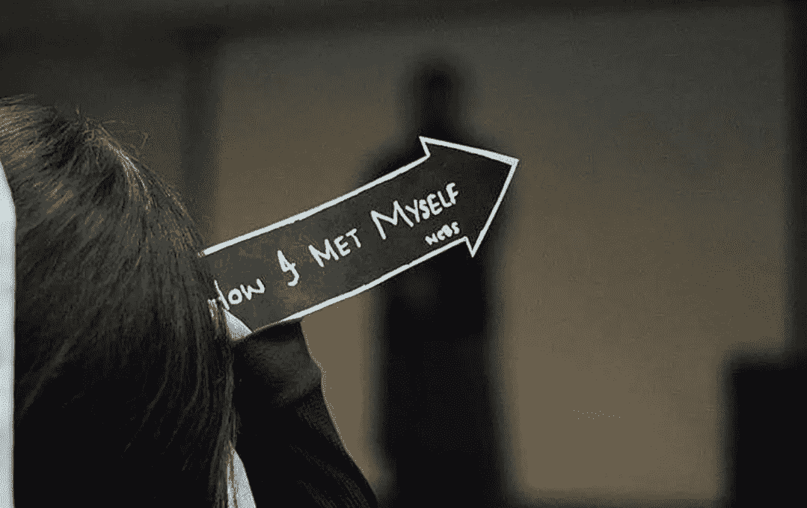
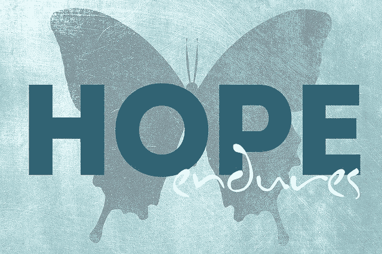
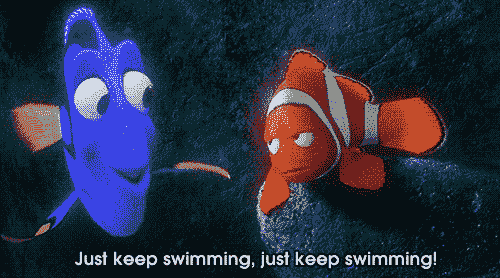

# 每个人都在挣扎

> 原文：<https://medium.com/nerd-for-tech/everybody-struggles-f6dbe33293b4?source=collection_archive---------8----------------------->

> “值得拥有的东西都来之不易”✨✨

你有没有觉得自己现在还没有准备好去做某件事？但也许，以后，它会为你工作？这正是我申请 Outreachy 之前的情况。

我是一名技术内容工程师，不涉及太多编程。所以，我一直觉得我的编码实践和技能不足以应用到这次的 Outreachy。我想我应该温习一下我的编码技能，并在下一批人中尝试一下。

然后我问自己，

> 如果下次我也有同样的感觉呢？

答案是，

> 没有完美的时间让你感觉准备好了。你只需要相信自己，投入进去。

结果一切顺利(感谢上帝)。

相信你自己

所以，是的，相信你自己。这将是一个令人兴奋、恐惧和困惑的时期，但你会做得很好。你会学到新的东西，并开始逐渐获得自信。当这一切都过去了，你会回过头来感谢你原来的自己✨🍀。

我对自己认识到的一件事是，我只害怕那些我没有接触过的东西。我有能力做我以前没有尝试过的事情。是的，有时候做同样的工作，我比别人花更多的时间。但正是我的坚持让我比别人领先一步。

图片由 [ShonEjai](https://pixabay.com/users/shonejai-1075665/?utm_source=link-attribution&amp;utm_medium=referral&amp;utm_campaign=image&amp;utm_content=1449691) 来自 [Pixabay](https://pixabay.com/?utm_source=link-attribution&amp;utm_medium=referral&amp;utm_campaign=image&amp;utm_content=1449691)

# **我的外展之旅**🚗

申请阶段的旅程是情感的过山车。“接下来会发生什么”的想法一直困扰着我。但我认为这就是成就的美妙之处，你为之努力奋斗，然后焦急地等待结果。

我一直在和自己竞争，我总是觉得我没有尽全力，但是我一直在努力。对于外展，我认为毅力是最重要的。每个项目都有很多其他的贡献者。你必须积极、坚持不懈、行动敏捷。根据我的经验，在外展工作中，聪明的工作比努力的工作更重要。

## **我的项目**

选择你喜欢的项目不仅会减轻你的精神压力，还会提高你的工作效率。

我选择的第一个项目是 [OpenFoodFacts](https://github.com/openfoodfacts/openfoodfacts-server) ，事实证明我很幸运。导师非常和蔼，非常支持。我在外展中学到的一件事是“没有问题是愚蠢的问题”。

来源:[imgflip.com](https://imgflip.com/)

## **缴费年限**

这 5 周充满了起起落落。我总觉得我的代码不够好，怎么会被合并呢？每次被卡住，我就开始质疑自己的能力。

你知道他们把这种行为叫做什么吗…..**冒名顶替综合症**。

然而，有很多地方我可以在没有任何帮助的情况下修复 bug。每次我的公关被合并，我都欣喜若狂。我记得，做一个复杂的公关。我计划在 4 天内完成，但它花了我几乎 1.5 周。这 1.5 周是艰难的，但我学到了很多新东西，调试了几次代码。然后我意识到应该花这么多时间。所以，是的，继续游，✨🌟✨

来源:giphy.com

## **结果日**

在考试时间前一个小时，我开始打扫房间，让自己忙起来，分散注意力。20 分钟后，我收到了第一条祝贺短信。我查了一下[outreach](https://www.outreachy.org/alums/2021-05/)网站和 slack 频道。一封来自我导师的祝贺短信在那里等我😇。

现在实习开始已经 3 周了。我仍然在很多地方卡住，仍然觉得我没有尽全力，但现在我知道一件事，我得到了这个💪。