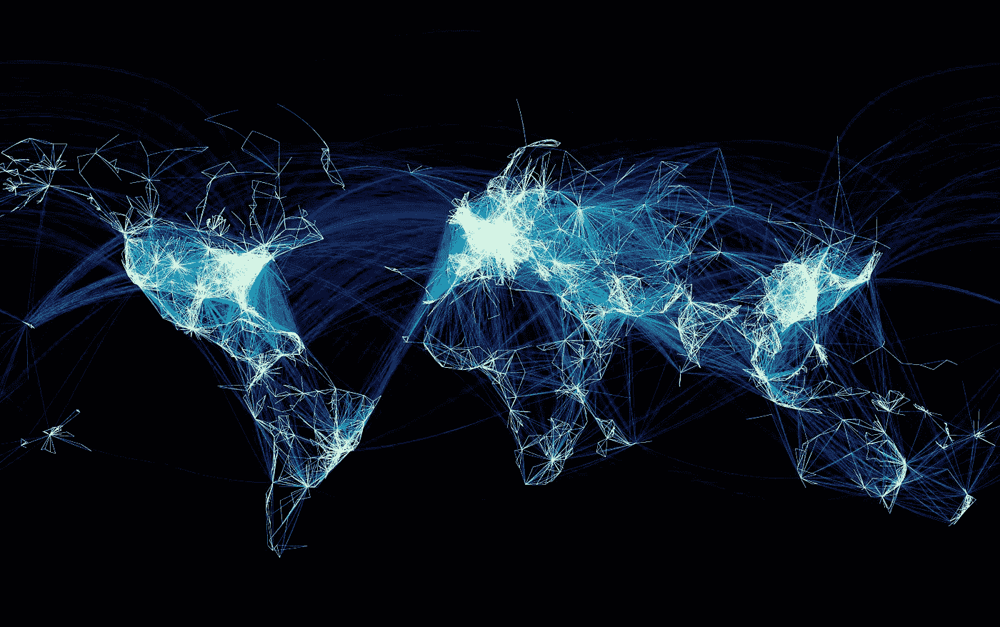

# 一切都是网络化的

> 原文：<https://medium.com/nerd-for-tech/everything-is-networked-cf4814ddfda1?source=collection_archive---------23----------------------->

网络化的世界

自从 Erdos-Runyi 关于图的论文发表以来，我们在理解自然和我们创造的事物如何联网方面取得了巨大的进展，并且我们看到，由于像 [Albert Laszlo Barabasi](https://barabasi.com/) 和其他人这样专注的科学家的工作，我们对这些网络随机性的信念并不总是正确的，因为幂律通过将它们组织在获得最多入站链接的枢纽中，在这种网络的架构中发挥了更经常的作用。我们的工业化世界是通过利用一种叫做树的特殊形式的图表来规划运营和责任的流程来设计的，这就是你所知道的所有公司的组织结构图，但这种组织形式似乎不适合当前的网络经济，我们生活在其中，事物之间关系的复杂性不像树，而是由利益中心、主题、部门组织的复杂图表……这取决于我们采取的观点。在这样的枢纽中，驱动图一个看起来离你很远的事件，你的想法，你的国家，你的公司，或者任何一种事物都会对他们产生巨大的影响。因此，了解什么是枢纽以及它们是如何连接的，有助于减轻受到事件影响的风险，在我们绘制和理解相反的图表之前，我们认为这些事件超出了我们的范围。泰国的银行破产影响了其他国家。美国的次贷危机影响了整个世界。蝴蝶效应或[多米诺效应](https://mkrdiop.medium.com/the-domino-effect-everyones-an-expert-2c6f54488369)是我们给试图解释这种行为的科学理论起的名字，但是拥有数学知识有助于更多地理解这种网络化元素的概念。如果你不明白一切都是网络化的，网络的链接和节点数量在不断增长，你可能会认为认知科学与此无关。

因为一切都倾向于与其他事物相联系，所以对每一种知识都感兴趣可能有助于在新的联系出现之前在图表中看到新的机会，这就是创新者所做的，理解[类比](https://mkrdiop.medium.com/reddit-stackoverflow-wikipedia-and-analogy-c5ddd7fab617)对预测这种联系有很大帮助。

我花了一周的时间来理解我的国家的政治图表，并且发现了一个政治行动者如果不关心图表和网络是看不到的。