# 关于 CSS 单位你需要知道的一切。

> 原文：<https://medium.com/nerd-for-tech/everything-you-need-to-know-about-css-units-f09a94acd793?source=collection_archive---------14----------------------->

## 所有 15 个 CSS 单元的详细概述。

你知道总共有 15 个 CSS 单位吗？有如此多的选项可供选择，尤其是如果你是一个初学者，想要探索 web-dev 所提供的一切，这是一个挑战。在这篇博客中，我们将会看到每一个 CSS 单元，并了解它们是如何运作的。CSS 单元可分为以下两类—

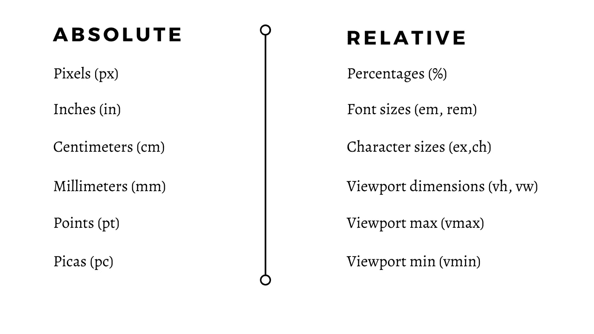

绝对和相对 CSS 单位之间的比较

# 相对单位

相对单元可以根据它们所依赖的属性进一步分类。该图显示了同样的情况。它们可以基于它们的**父元素的尺寸**或者**当前字体大小**或者甚至是**视口尺寸**。

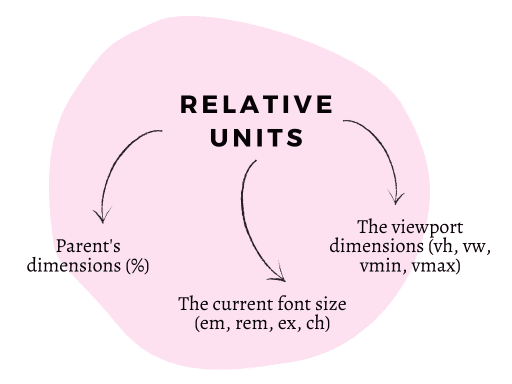

## 1.百分比(%)

这个单位是相对于它的**父元素*的高度和宽度。*** 对于 eg，如果父元素为`**200px**`宽，子 div 的 ***宽为 50%*** 那么子元素的宽度将为***200 px 的 50%***即 ***100px。*** 举以下例子——

*   案例 1 `.child {**height:50%; width:50%;** background-color:lightpink;}`
*   案例 2 `.child {**height:80%; width:50%;** background-color:lightpink;}`

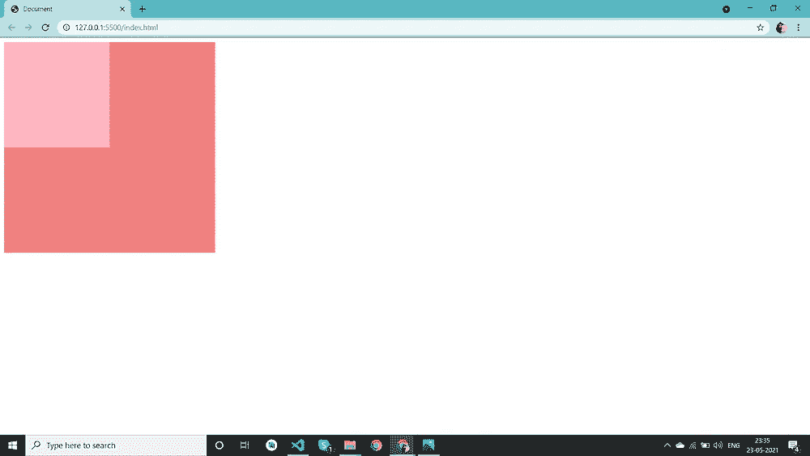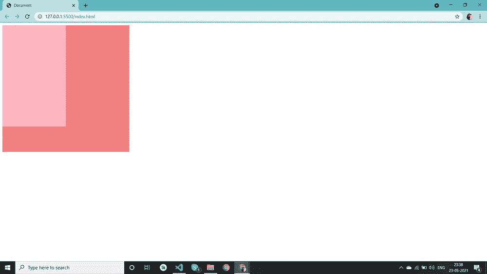

图像 1 —高度:50%图像 2 —高度:80%

## 2.vh 和 vw

顾名思义，这个单位是相对于 ***视口宽度*** 和 ***视口高度而言的。*** 为了使用这个单元，我们需要假设我们的屏幕高度和宽度被分成 100 等份。因此， ***当我说 100vh*** 时，它将意味着视口的整个高度。

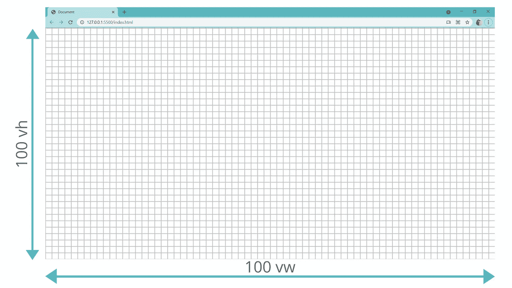

下面的例子是典型的***【VH】***和***【VW】***机组的例子。我们可以看到，每当视口改变其高度和宽度时，相应的粉红色容器的高度和宽度也会随之改变。

```
**.container {
    background-color: lightpink;
    width: 50vw;
    height: 50vh; }**
```

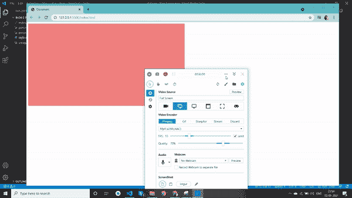

## 3.vmin 和 vmax

这是一对相对不太为人所知的单元。单位 ***vmin*** 表示元素的边取决于参数/视口的边，视口的边具有最小*长度。即如果浏览器窗口的 ***高度*** 比其 ***宽度*** 小****，`1vmin`将等同于`1vh`。如果浏览器的 ***宽度*** 比其 ***高度*** 小 ***，`1vmin`相当于`1vw`。********

**另一方面，Vmax 与 vmin 正好相反。它使用 ***的比例放大视口的*** 。**

**举个例子——**

*   **案例 1 `**.container {height:50vmax; width:50vmax;}**`**
*   **案例 2 `**.container {height:50vmin; width:50vmin;}**`**

**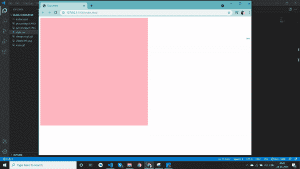****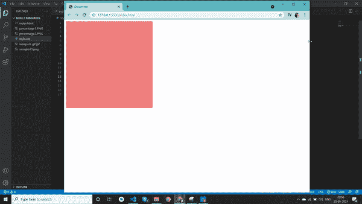**

**映像 1 —vmax 映像 2 — vmin**

**我知道，理解 vmin 和 vmax 可能有点困难。这是它们在 CSS 中没有被广泛使用的原因之一。继续前进。**

## **4.ems 和 rems**

**我最喜欢和最广泛使用的一套单位！这些是基于字体大小的单位。**

****Em** —该单位取决于**父字体大小**。也就是说如果父字体大小是 10px，`**1em = 10px**`。这通常用于调整各种元素的大小。以下是显示相同内容的一些案例。尽管**子元素的尺寸在**的每种情况下都是 1em，但是当**父元素的字体大小发生变化时，它的大小也会发生实质性的变化。****

**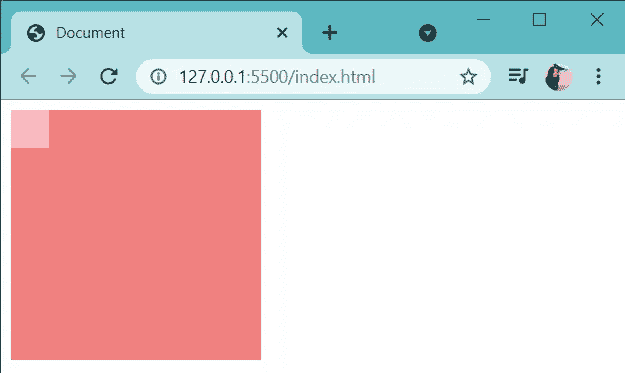****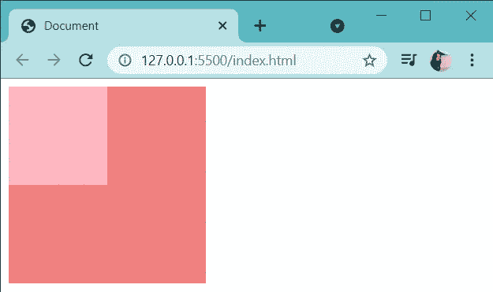**

```
****CASE 1**.parent{
    height: 200px;
    width: 200px;
    ***font-size: 30px;***
}
.child{
    height: 1em;
    width: 1em;
}**CASE 2**.parent{
    height: 200px;
    width: 200px;
    ***font-size: 100px;***
}
.child{
    height: 1em;
    width: 1em;
}**
```

****Rem —** Rem 就是***‘root-em’的意思。*** 这个单位是基于**字体大小的根。**现在默认情况下，任何 HTML 文档的根大小都是 16px。这意味着`**1 rem = 16 px**`总是直到并且除非你明确定义它。当涉及到边距和填充时，这个单位非常有用。这也是一个让你的网站响应更快的更聪明的方法。你可以改变根字体的大小，所有其他的元素都会随之调整。**

**这里有几个雷姆单位的例子。看看明确定义的根字体大小。**

**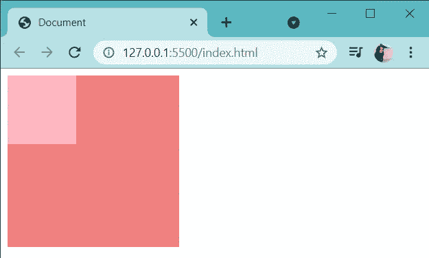****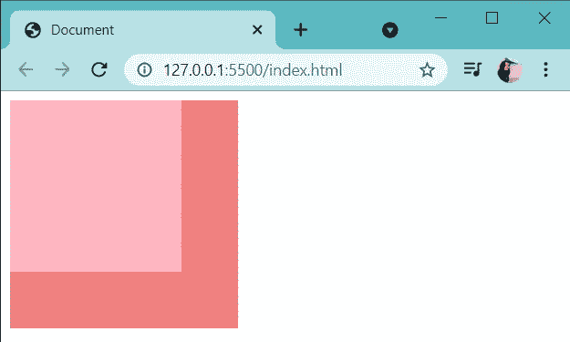**

```
****CASE 1
:root{
    *font-size: 80px;*
}**
.parent{
    height: 200px;
    width: 200px;
}
.child{
    height: 1rem;
    width: 1rem;
}**CASE 2
:root{
    *font-size: 150px;*
}**
.parent{
    height: 200px;
    width: 200px;
}
.child{
    height: 1rem;
    width: 1rem;
}**
```

## **5.ex 和 ch**

**这绝对是我觉得最搞笑的一对单元。让我们来看看它们。**

**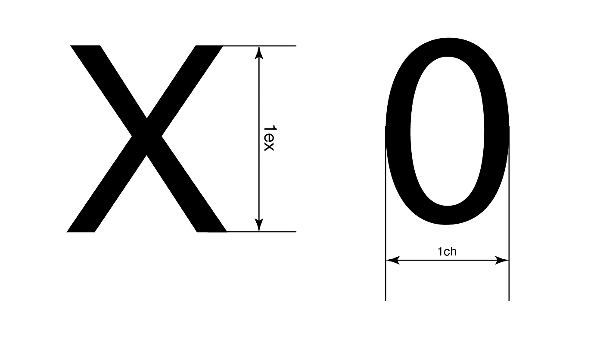**

**ex 和 ch 单元**

*****ex —*** 本质上是指父 div 中字母‘x’的**高度。它不仅会随着父字体属性而改变，还会随着字体系列而改变。例如，与无衬线字体相比，衬线字体的 ex 单位更小，即使字体大小相同。这是字体系列配置的结果。****

*****ch***—ex 是字母 x 的高度，ch 是数字‘0’的**宽度。想象一下测量 0 的宽度，也就是 1ch 对于父字体的特定大小是多少。****

# **绝对单位**

**这些不是基于页面上的任何其他内容。相反，这些是真实世界的测量。它们主要用于印刷应用、原型制作、线框制作等。基本上，更多地涉及到任何项目的设计方面。**

## **1.像素(像素)**

**谁不爱像素？像素是世界运转的方式。设计以像素为单位，网页以像素为单位呈现，javascript 以像素为单位读取图像，因此，由于以上所有原因以及更多原因，像素是各种领域中最常用的单位。**

**如果我说我希望我的容器是这样的`**.container { height: 200px; width: 200px;}**` ，它只是给我这个作为输出。**

**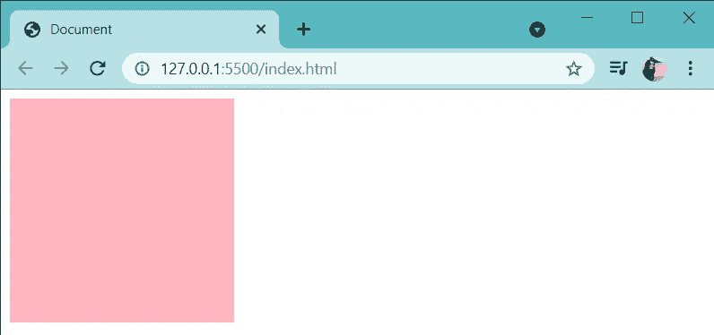**

## **2.英寸、厘米、毫米、磅和十二点活字**

**预定义的长度包括这 5 个单位。这些单位的关系如下-**

*   **1 英寸= 2.5 厘米= 25 毫米**
*   **1 厘米= 10 毫米**
*   **1 点= 1/72 英寸**
*   **1 点活字= 1/6 英寸= 12 点**
*   **1 px = 1/96 英寸**

**下面是一个使用中的例子。**

**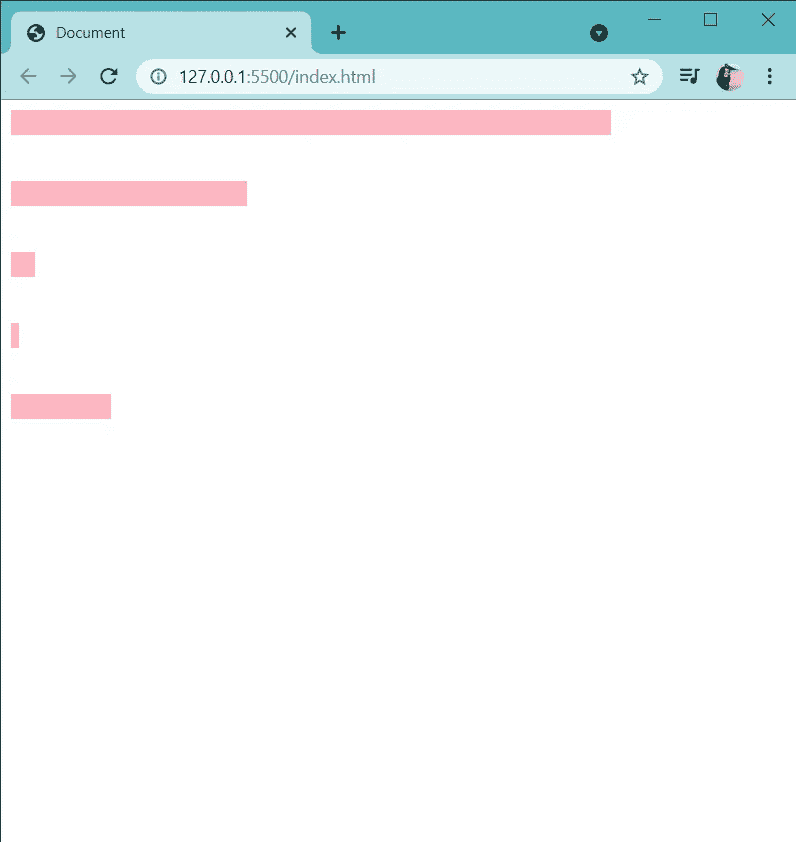**

```
****height of every element is fixed at 20px****.one{
    width: 5in;
}****.two{
    width: 5cm;
}****.three{
    width: 5mm;
}****.four{
    width: 5pt;
}****.five{
    width: 5pc;
}****
```

**因此，我们来到 CSS 单元的末尾。你会惊讶于使用 CSS 所能创造的东西。拥有错综复杂的元素和奢侈的动画的最花哨的网站的样式都可以归结为简单的 CSS。所以，不要犹豫尝试 CSS，尝试新事物！**

**希望你们都喜欢这个博客。
在 LinkedIn 上联系我[这里](https://www.linkedin.com/in/asavariambavane/)！**