# 作为初学者需要了解的关于 MongoDB 的一切:)

> 原文：<https://medium.com/nerd-for-tech/everything-you-need-to-know-about-mongodb-as-a-beginner-481c5bb22e41?source=collection_archive---------10----------------------->

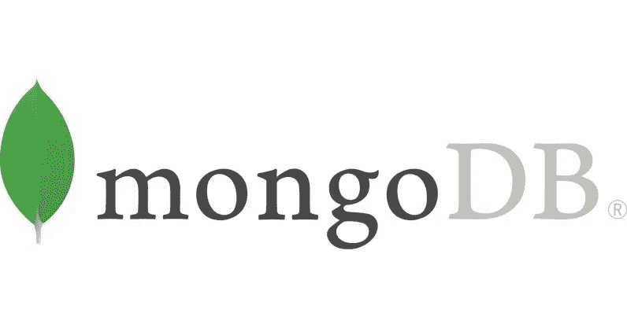

# 什么是 mongoDB？

它是世界上最著名的数据库程序之一，在当今的大部分数据需求中被高度使用。

MongoDB 是由一家名为“MongoDB Inc”的公司开发的，它是一个无 SQL 数据库程序，这是 mongoDB 最重要的特点。人们不需要 SQL 知识来管理 mongoDB 数据库，这让人感觉很轻松。

mongoDB 是开源的关系数据库，有助于以 JSON 格式存储非结构化数据。开源是它流行的主要原因之一。

# 为什么选择 mongoDB？

mongoDB 最常见也是最大的优势是，它是一个没有固定模式的数据库架构。在这种数据库中，管理大数据很容易，这种数据库对于实时 web 应用程序非常有用。作为一个例子，facebook 使用了一个没有固定模式的数据库架构。正如我之前提到的，NoSQL 数据库是 mongoDB 所属的架构，而 NoSQL 也是一个无固定模式的数据库架构。

作为一名软件工程专业的本科生，我曾多次使用 mongoDB 作为实时 web 应用程序的数据库客户端，这些应用程序是与我的同事一起构建的。我也想分享一下我关于 mongoDB 的经验。

我认为 mongoDB 的主要特点是用户友好。我们创建的所有数据都可以以一种有意义的方式被看到，这使我们永远不会为此而烦恼。

下一点是，我们可以很容易地看到，添加，编辑，删除可用的数据 *(CRUD 操作)*没有任何错误，从 mongodb 它本身。

说到性能，它实际上处于很好的位置，因为插入的数据来的很快，正如我所看到的，我所看到的一个缺点是，删除数据文档可能没有插入数据文档快。实际上这并不需要考虑太多，因为没有一个数据库客户端是完美的。

对于那些即将体验 mongoDB 的人，以及那些希望满足其 web 应用程序或任何成功项目的数据管理需求的人，我高度推荐 mongoDB。

# MongoDB Vs SQL，选什么？

这是困扰任何人的主要问题。让我们分别看一下 mongoDB 和 SQL，并通过深入这些概念来理解最佳方法。

SQL 或 NoSQL 的选择实际上是基于您的业务或项目的数据结构。

什么是 SQL？SQL 代表*结构化查询语言。*它用于结构化关系数据库管理系统中，对那些数据库管理系统中存在的结构化数据进行编程和管理。由于 SQL 是一种基于查询的语言，程序员不得不编写 SQL 查询来检索和修改数据库中以表格形式存在的数据记录。

为了深入学习 SQL，请确保参加专门的 SQL 课程:)

说到数据库编程，SQL 是 2000 年以前唯一使用的方法。人们对数据的需求越来越大，因此，以结构化的方式管理非结构化数据并不容易，这就是为什么像 mongoDB 这样的 NoSQL 数据库出现了。只要获得了业务需求，并且如果使用 SQL，数据库引擎的性能将会降低，并且管理数据库将变得复杂，因为数据以表格格式存储以减少数据重复。mongoDB 更像是 2000 年末引入的数据库管理的现代解决方案。

我的观点是，如果你的数据很小，如果这些数据根据关系模式是可用的，如果这些数据是结构化的，你可以使用 SQL 作为数据库。如果您是 it 行业的初学者，您可以通过与 IT 交互来了解更多关于 SQL 如何工作的知识，以满足特定项目的小而有组织的数据需求。我为此激励你。:)

对于 mongoDB 来说，数据可以以 JSON 格式存储，这使得用户可以存储数据文件，这是当今动态 web 应用程序的现代需求。这就是为什么 mongoDB 被称为非结构化的，数据之间没有关系。

由于 mongoDB 是最受欢迎的数据库，主要由世界各地的开发人员和用户使用，如果你是一名大学生，正在做关于如何创建和设计具有动态数据需求的 web 应用程序的实验，我鼓励你使用 mongoDB 作为数据库客户端，因为它是一个高可伸缩性、高性能和最用户友好的数据库客户端。

# mongoDB 安全吗？

mongoDB 是一个安全的数据库程序。存储在 mongoDB 中的所有数据都将被加密，无论是其他用户还是 mongoDB 本身都无法解密。拥有数据库的用户只能查看和管理数据。

我的建议是，即使它是安全的，最好的做法是在存储密码数据之前从 web 应用程序端对其进行加密。如果某个特定的数据库暴露给不拥有该数据库的其他人，那么某个特定企业的用户的机密就面临着最大的风险，因此在将敏感数据(如密码)发送到 mongoDB 之前，一定要记住对其进行加密。

无论如何，特定 mongoDB 数据库的所有者也不应该看到他们客户的敏感数据，所以请从 web 应用程序部署端进行安全实现，让我们让这个世界变得更美好:)

# mongoDB 入门

让我们深入了解一下设置 mongoDB 工作空间的初学者指南。

**第一步——创建您的 mongoDB 帐户**

如下图所示，您可以通过填写表单来创建您的 mongoDB 帐户。使用此链接访问 mongoDB 的注册页面—[https://account.mongodb.com/account/register](https://account.mongodb.com/account/register)

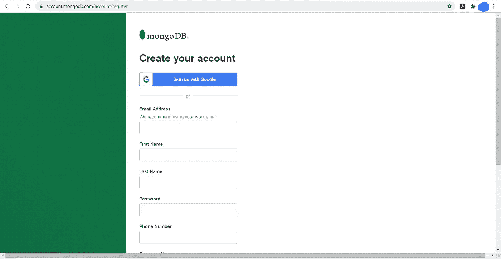

注册页面

注册成功后，您将收到一封确认电子邮件，如下图所示。

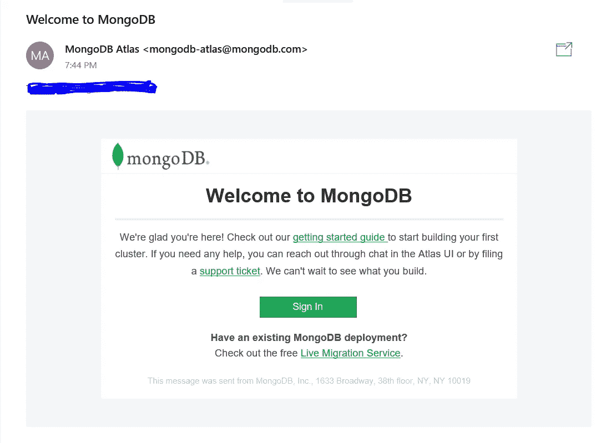

**步骤 2——创建一个 mongoDB 项目**

您可以简单地给出一个项目名称以及您的组织名称，然后单击继续按钮，如下图所示。

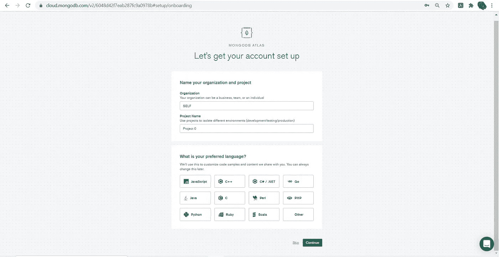

项目创建页面

**步骤 3——创建集群**

在 mongoDB 中，会有一些选项来选择集群类型，以便创建特定的集群。大多数选项都是付费选项，每个选项都代表特定群集的一些功能限制和空间限制。

因为你是这个 mongoDB 的初学者，我可以肯定免费选项对你来说已经足够好了。它包括足够的所需功能和 512 MB 的空间，对于您创建的项目来说已经足够了。:)

下面的屏幕截图代表了所有的东西。

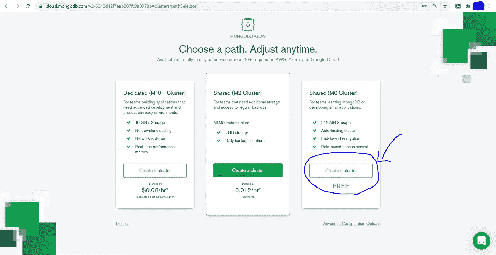

创建集群

点击我画圆的按钮后，您将被导航到另一个页面，在这里您必须选择选项，只需将所有内容保留为默认设置，然后创建集群。

下图代表了这些东西。

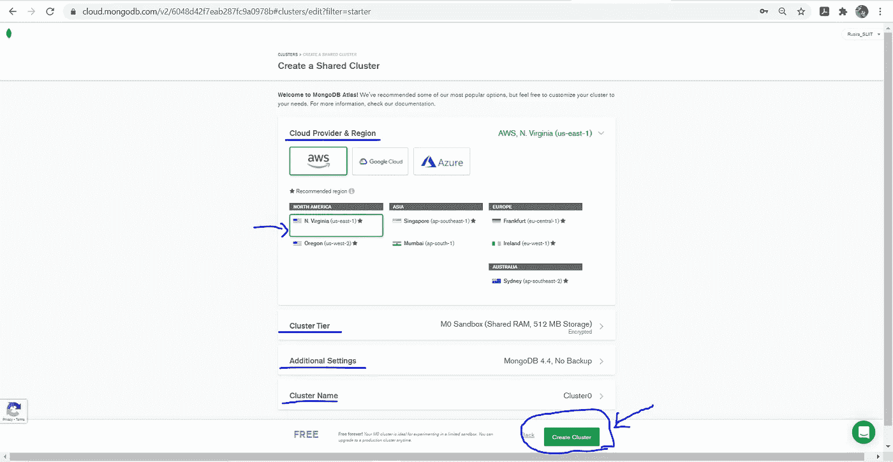

创建集群的最后一步

一旦你的集群被创建，你将会看到它的环境，如下图所示。你也会在左上角看到你的项目名称。

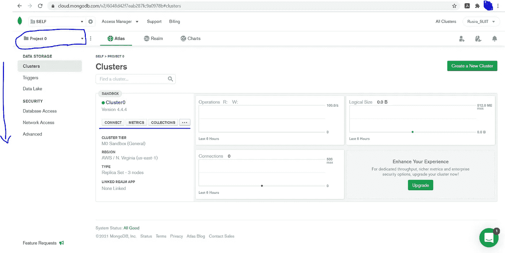

集群的主页

**第 4 步—构建数据库访问**

为了从特定的 pc 访问 mongoDB 数据库，应该向 mongoDB 提供它的 ip 地址。

为了设置数据库访问，请从左下角的下拉列表中单击数据库访问，如下图所示。

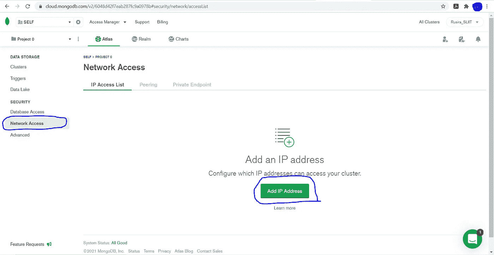

网络地址配置

点击，添加 IP 地址，你会看到一个弹出窗口，如下图所示。

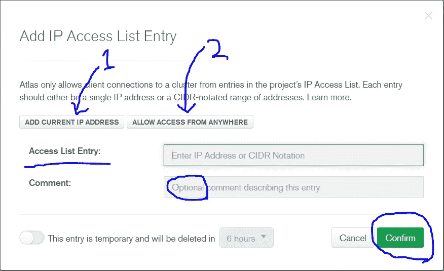

如果您只想从您的 pc 访问，而不是从其他设备访问，您可以选择 1 获取您当前的 ip 地址。

如果您想从任何地点访问任何设备，您可以选择选项 2，它也可以让您进入那个环境。

***需要考虑——如果您选择选项 1，当您的当前 ip 地址发生变化时(当您从 pc 注销时，互联网连接发生变化),您将无法访问 mongoDB 数据库。***

如果你是唯一一个将要访问和使用数据库的人，我总是建议你给出选项 2，因为每当你的 ip 地址改变时，你必须一次又一次地给出你当前的 ip 地址。

一旦你成功地给出了你的 ip 地址，你就可以看到它，如下图所示。设置您的 ip 地址需要几秒钟/几分钟。

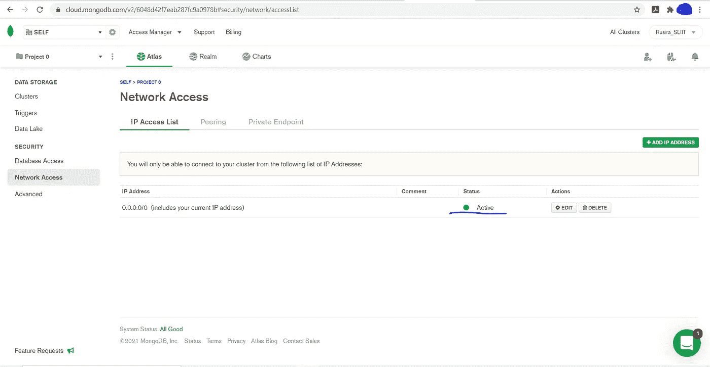

设置网络访问

**步骤 5——设置数据库访问**

在这一步中，我们将创建一个可以访问数据库的用户。对于我们创建的每个用户，我们可以对他们能够对数据库进行的操作进行限制。

下面的屏幕截图代表了这一点。只需点击*添加新数据库用户*

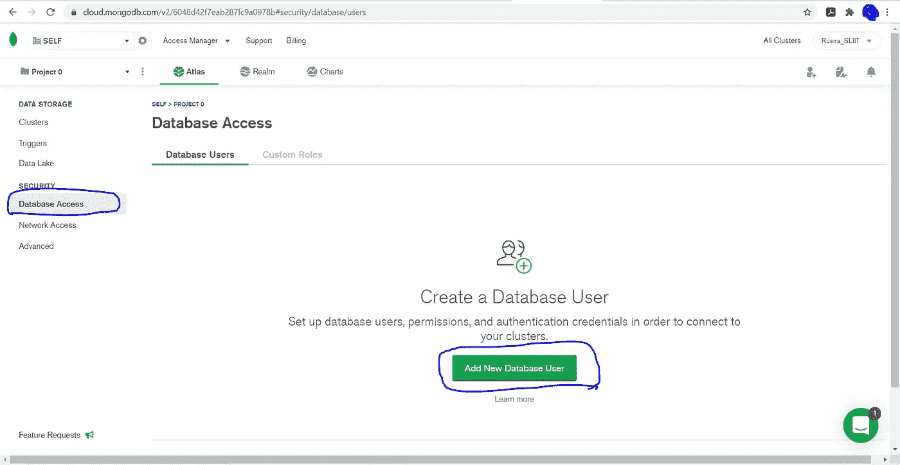

数据库访问配置

您可以选择身份验证方法，给出用户的用户名和密码，并选择数据库访问权限。完成后，点击添加用户。

看下图。

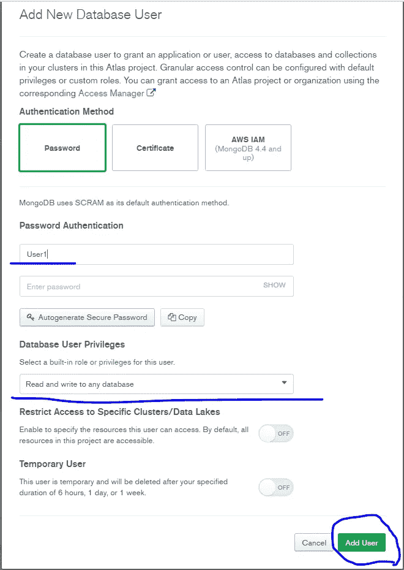

添加新的数据库用户

成功创建数据库用户后，您将能够在列表中看到创建的用户，如下图所示。

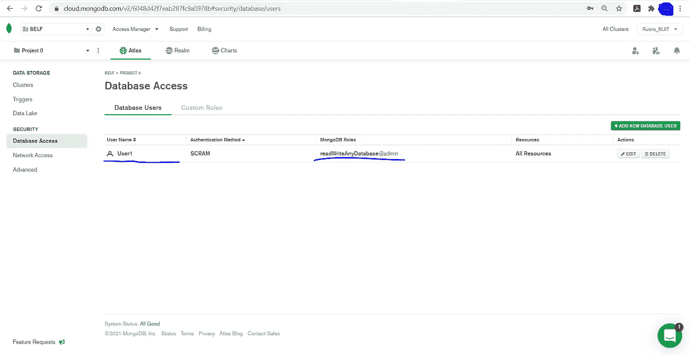

数据库访问列表

**第六步——建立收藏。**

集合是您可以创建数据库的地方，在这些数据库中，您可以创建您的集合。

在 Collections 中，您将能够看到 JSON 格式的数据文档，并且一旦您将 mongoDB 与 web 应用程序链接，来自您的客户端的所有数据都将在这里可用。

为了在属于特定数据库的特定集合中存储数据，我们必须在 web 应用程序开发端对其进行编程。在后面的文章里再来说说怎么做。

在群集的主页中，单击集合选项卡，如下图所示。

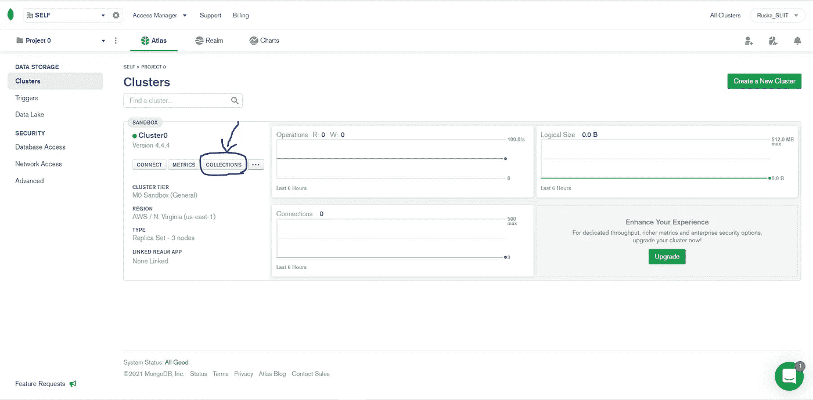

点击圆形标签

一旦你点击它，你将被导航到一个这样的窗口，在这个窗口中，你可以创建一个由他们提供的样本数据集，或者你可以创建自己的数据。

在本主题中，让我们通过获取他们提供给我们的样本数据来了解一下。

看看下面这张图。

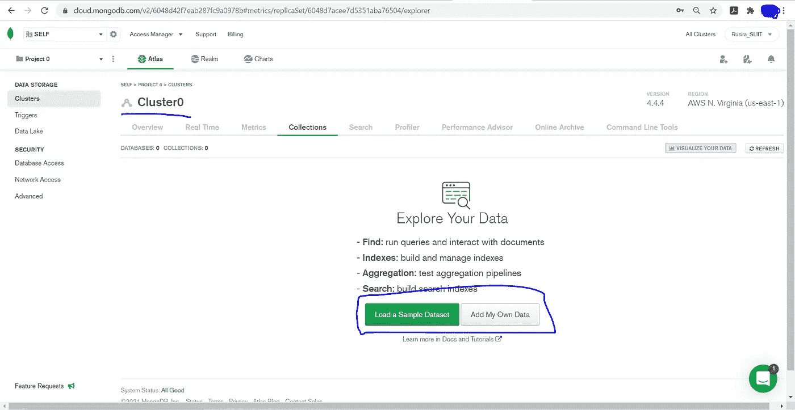

设置集合

点击绿色按钮，一旦你的样本数据被创建，你将能够看到这样的数据，如下图所示。

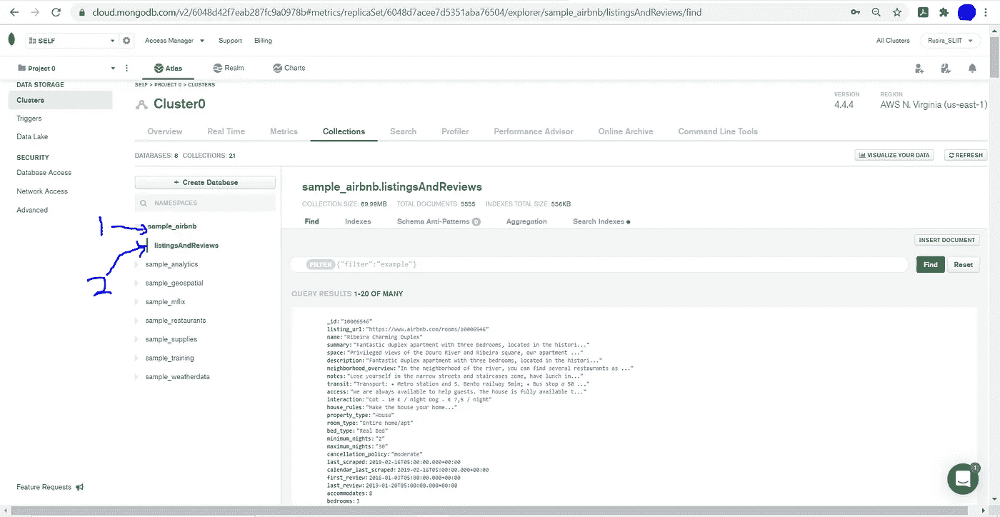

在这张照片中，

***1 —数据库名称，2 —集合名称***

在这里可以看到 JSON 格式的所有数据文档。确保在这个地方自己尝试一些 CRUD 操作:)

**步骤 7——将 mongoDB 与 web 应用程序连接起来。**

到第 6 步，您差不多完成了 mongoDB 的设置，现在是将 mongoDB 与 web 应用程序连接的时候了。

再次回到集群的主页，点击连接按钮，如下图所示。

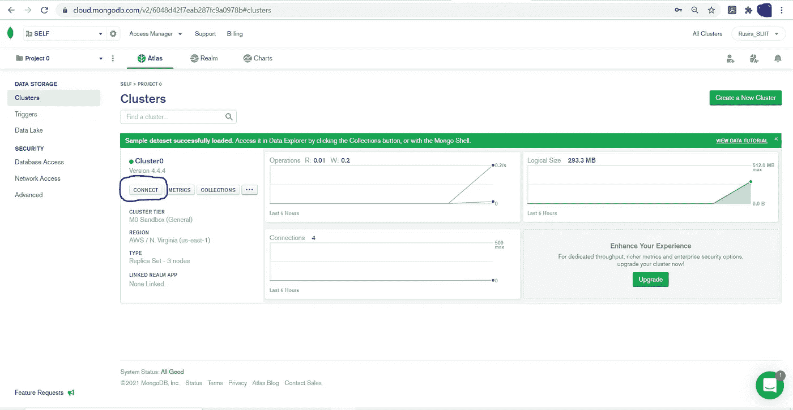

一旦你点击那个按钮，你会得到一个弹出窗口，如下图所示。

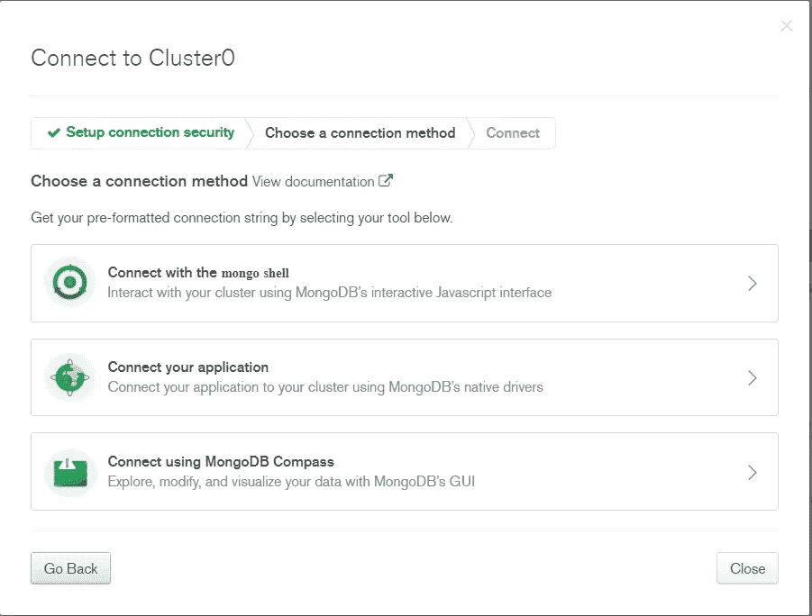

正如您在这里看到的，您有 3 种连接方法来连接 mongoDB。

让我们逐一看看。

*方法 1——用 mongo shell 连接。*

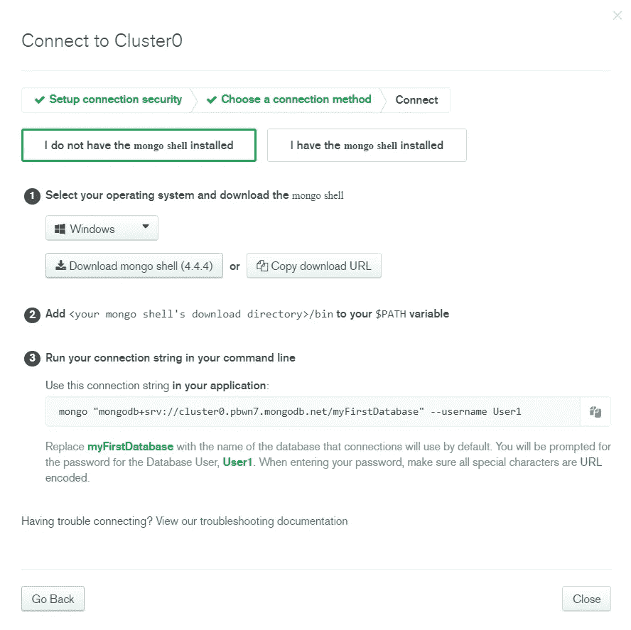

mongoDB 引入了他们自己的 shell，称为 mongo shell，如果您喜欢与这些数据库交互，并且在 mongo shell 中建立了一些应用程序逻辑，您可以使用它。

您必须将连接字符串复制并粘贴到您的 shell 中，这样就可以开始了。

*方法 2——本地 mongo 驱动程序连接您的 web 应用程序。*

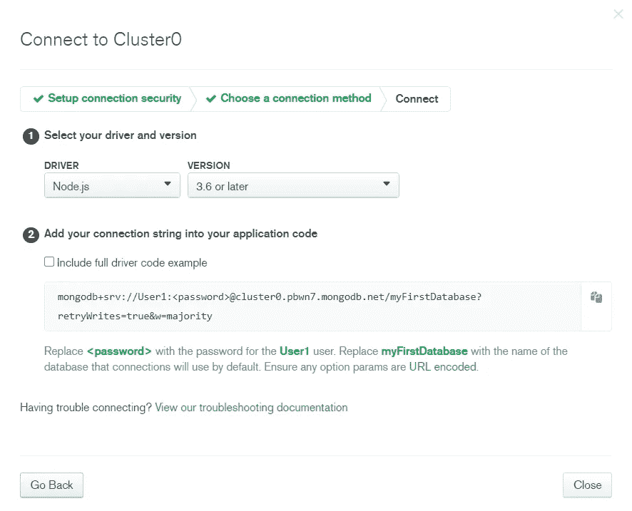

这是您必须使用的选项，以便连接到您的 web 应用程序。一旦选择了节点驱动程序，就必须将连接字符串复制并粘贴到 web 应用程序开发工作空间中。

正如我之前提到的，我已经将 mongoDB 用于一些 web 应用程序项目，所以我想展示一下，我是如何将连接字符串添加到 scratch 中的，在 scratch 中，我使用 MERN 堆栈技术开发了一个 web 应用程序。

看下图。

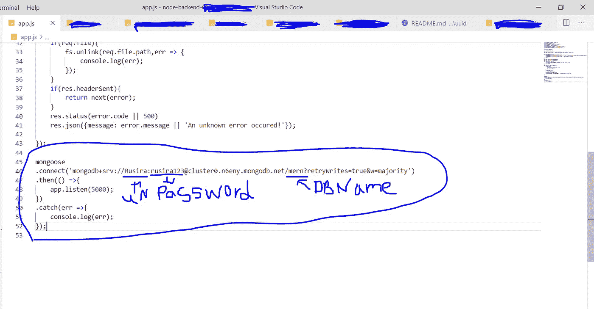

它显示了数据库用户的 UN、PW 和数据库名称的代码

在上图中，您可以看到特定项目的特定 mongoDB 集群的连接字符串。

在这个主题中，我们不会讨论如何创建集合的逻辑，以及如何在 web 应用程序点创建 JSON 数据结构。让我们在后面的文章中讨论它们。

现在让我们进入最后一个方法。

*方法 3 —使用 mongoDB 指南针连接*

mongoDB compass 也是 mongoDB 提供的 IDE，在其他方法中，我们必须将连接字符串复制并粘贴到 mongoDB compass 中。

看下图。

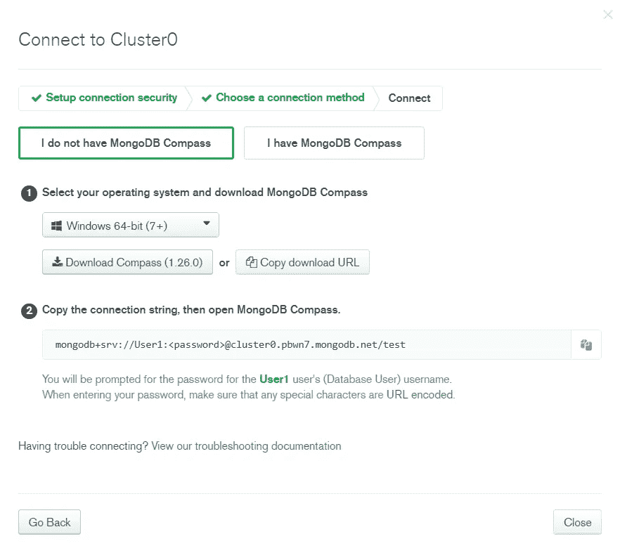

这些是我们可以用来连接 mongoDB 客户端的方法。

***收尾***

在本节中，我们学习了如何在 7 个步骤内开始使用 mongoDB，我希望您能够使用 mongoDB 作为您的数据库客户端，以满足您客户的数据需求。:)

# 结论

在本文中，我们讨论了所有关于 mongoDB 的内容。让我们回顾一下我们在这篇文章中学到了什么。

*   什么是 MongoDB？
*   mongoDB 对现代数据管理的需求。
*   什么是 SQL 和 NoSQL，什么是现代 web 应用程序的最佳选择。
*   mongoDB 安全吗？
*   如何入门 mongoDB？

在这篇文章的最后，我想和你分享一个外部资源。

由于 mongoDB 主要由数百万开发人员用于 web 应用程序，当涉及到 web 应用程序开发时，REACT 是正在使用的现代技术。我参加了一个使用 REACT 开发 web 应用程序的课程。我建议您查看此链接并进入课程。

 [## React，NodeJS，Express & MongoDB-MERN 全栈指南 Udemy 免费下载…

### 关于 ReactJS 的基础知识是必需的，ReactJS 钩子知识是推荐的，关于节点的基础知识，表示…

freecourseudemy.com](https://freecourseudemy.com/react-nodejs-express-mongodb-the-mern-fullstack-guide/) 

如果你从这个项目中了解了 MERN 是如何工作的，你一定会有机会亲自体验 mongoDB 是如何实际工作的。我鼓励每个人都参加这个课程，用 mongoDB 开发 web 应用程序:)

我希望这篇文章对那些想开始使用 mongoDB 的人来说非常有用。我鼓励你越来越多地研究 mongoDB，并掌握好知识，以便成为一名专家。