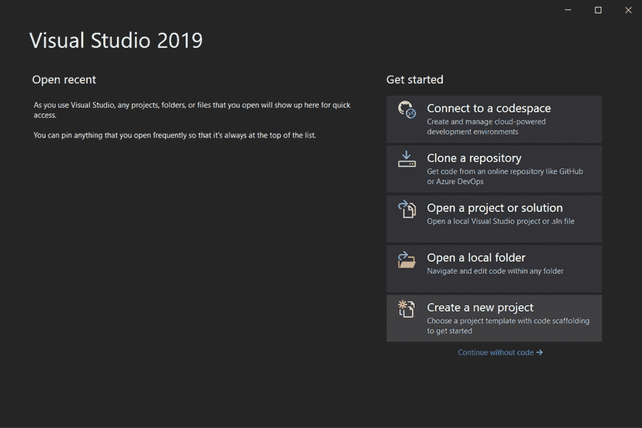
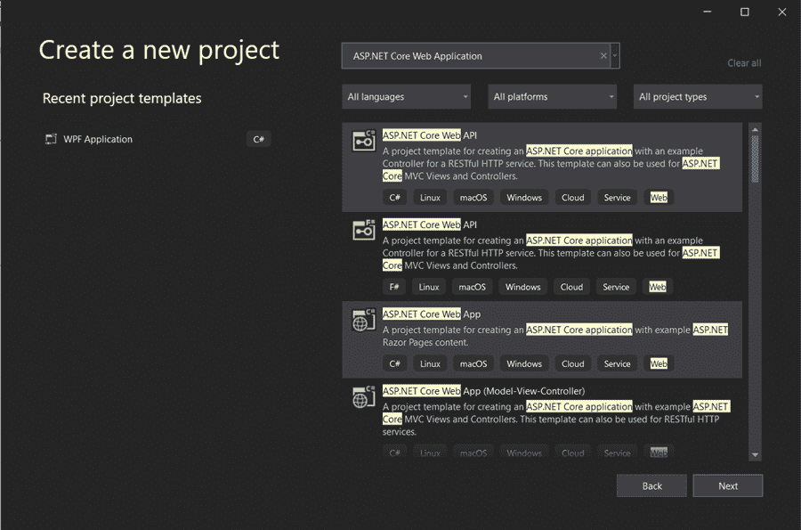
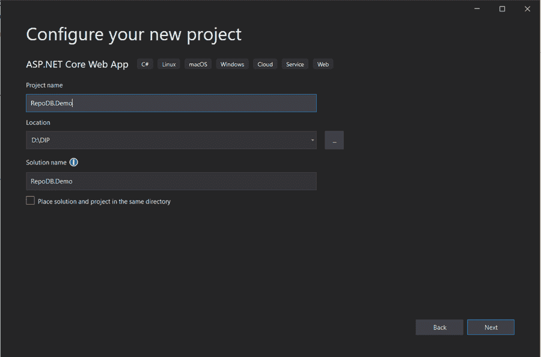
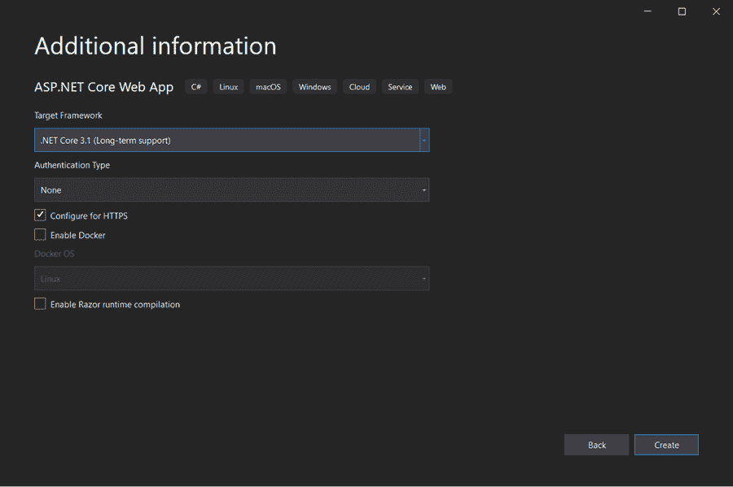
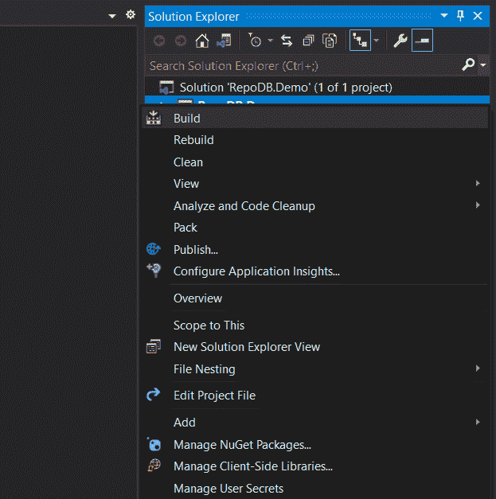

# 关于 RepoDB 你需要知道的一切

> 原文：<https://medium.com/nerd-for-tech/everything-you-need-to-know-about-repodb-23cd4b9939c1?source=collection_archive---------9----------------------->

在开发任何软件或产品时，对数据库的访问起着非常关键的作用。因此，精心设计是至关重要的。为此，开发人员利用 ORM(对象关系映射)来方便他们访问数据。使用 ORM 库有助于加快任何应用程序的开发，同时简化和巩固实现。在 C#世界中有许多流行的 ORM 库，如 Entity Framework、NHibernate、Dapper、LLBLGen Pro、RepoDB 等。有这么多选项可供选择，开发人员有必要选择最合适的 ORM，其中之一肯定是 RepoDB。

在本帖中，让我们详细了解一下什么是 RepoDB，它对用户有什么好处。

**目录:**

1.  什么是 RepoDB？
2.  为什么选择 RepoDB
3.  使用 RepoDB 的优势
4.  如何创建基于 RepoDB 的应用程序？
5.  结论

# 什么是 RepoDB？

Dapper 是一个微 ORM 框架，以其代码简单而闻名，而 Entity Framework core 为程序员提供了自动生成的 SQL。具有这两种特性的混合 ORM 是 RepoDB。它代表知识库数据库。RepoDB 以其纠正模式/编程结构、加速应用程序开发和以更快的方式处理公司原始数据等功能而闻名。RepoDBis 对于开发人员来说是一个很好的选择，因为它提供了 Dapper 的简单性，同时将一些复杂的操作封装为实体框架核心。

# RepoDB 的功能

RepoDB 是一个轻量级，高性能，高效和动态的混合 ORM 的。NET 框架。这里的“高性能”指的是从原始数据创建类对象以及将该类对象作为实际数据传输到数据库的速度。这里的“高效”是指 ORM 在处理数据库的原始数据时对内存的使用。因为它提供了微 ORM 和全 ORM 的特性，所以 RepoDB 被认为是“混合 ORM”。在“微”和“全”操作的使用之间切换是容易的，这在开发应用时给开发者带来了灵活性。

该库支持微 ORM 的所有功能，因为 RepoDB 可用于通过原始 SQL 执行创建、检索、更新、删除(CRUD)操作。开发人员可以灵活地使用基于方法的操作来操作数据，这是使用 RepoDB 时 full-ORM 的特性。

以下是 RepoDB 提供的功能:

*   操作(异步)
*   递归查询
*   圈复杂度
*   类型映射
*   野外制图
*   多重映射
*   表达式树
*   贮藏
*   描摹
*   SQL 语句生成器
*   处理

# RepoDB 的优势

以下是 RepoDB 的重要优势，开发人员牢记这些优势，使其优于现有的库:

*   库的性能/速度构成了它的心脏。速度是使用这个库的主要原因。
*   RepoDB 执行的所有操作都经过了高度优化，因为它消耗的计算机内存更少。
*   在 RepoDB 中，在“微”和“全”操作之间切换很容易，这为开发人员开发应用程序提供了灵活性。
*   RepoDB 是一个混合 ORM，有可能在轻量级 ORM(如 Dapper)和大型 ORM(如 Entity Framework Core 和 NHibernate)之间生存。
*   默认情况下，该库使用 MemoryCache，这是一个内部类，因此提供了二级缓存机制。

# 如何开始使用基于 RepoDB 的应用？

下面是开始使用 RepoDB 的不同步骤:

## 第一步

通过在 Visual Studio 中选择**创建新项目**来创建一个新的 ASP.NET 核心 Web API 应用程序。

## 第二步

从项目模板中选择【ASP.NET 核心 Web 应用

## 第三步

现在输入应用程序的名称。在下面的例子中，我们使用了 RepoDB.demo。

## 第四步

这是创建项目的最后一步。在此，单击可用的 API 模板选项。保留默认值，点击**创建**按钮创建 ASP.NET 核心 Web 应用程序

## 第五步

创建项目后，您必须将 RepoDB Nuget 包添加到该项目中。为了做到这一点，右键单击项目名称并选择 **Manage NuGet Packages** 选项。

## 第六步

打开一个包管理器窗口，您必须在其中搜索 **RepoDb** NuGet 包。现在安装版本为 **1.11.3** 的 **RepoDb** NuGet 包。

## 第七步

完成第 6 步后，安装 **RepoDb 的 **1.0.10** 版本。SqlServer** NuGet 包。现在安装的 NuGet 包依赖于微软的 RepoDb。Data.SqlClient NuGet 包和**系统。data . SqlClient**n 获取包。

# 结论

存储库数据库是一个非常轻量级和简单的库。尽管 RepoDB 被认为是一种混合 ORM，但它仍然被认为是一种微 ORM，因为它不提供许多高级功能，如状态跟踪、更改跟踪等。RepoDB 对于那些在使用完整 ORM 提供的操作的同时又能熟练使用 micro-ORM 的人来说特别有用。

*原载于*[*https://www . partech . nl*](https://www.partech.nl/nl/publicaties/2021/04/everything-you-need-to-know-about-repodb)*。*