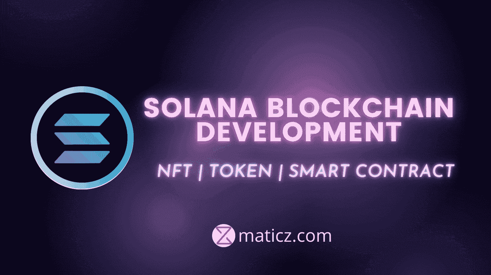

# 关于 Solana 区块链开发你需要知道的一切

> 原文：<https://medium.com/nerd-for-tech/everything-you-need-to-know-about-solana-blockchain-development-51f8ad8dea75?source=collection_archive---------4----------------------->

## 索拉纳区块链

在人类生活中，他们发现新的技术和创新。同时，这项技术提高了人们的生活水平。其中一种类型是区块链技术在分布式数据库中工作，并维护一个称为区块的共享记录列表。这些块不容易被修改，因为它们将数据存储在分布在世界各地的计算机的每个块中。以及 Solana 区块链中包含的关键功能。

索拉纳区块链由完全开源和去中心化的公共区块链网络组成。这种去中心化的网络可以让每个人共享你的交易账本中的哈希值，但是没有一个漏洞可以让维护的记录不被黑客攻击，但是没有人可以控制这些数据。索拉纳·区块链在一个分散的区块链平台上花费了 400 毫秒的时间。Solana 是一款功能强大的区块链，可以让你在无缝、安全、可扩展、分散的应用程序和市场中使用。

## Solana 区块链的关键特性

索拉纳区块链的主要特点有

*   历史证明
*   BFT 塔
*   湾流
*   海平面
*   管道铺设
*   涡轮
*   云破裂

**历史的证明**

首要的关键特征是 POH 机制在 Solana 区块链中起着至关重要的作用。这有助于在网络中获得更高的效率和吞吐量。这种类型的协议通过在每个事务接受中实现时间戳来提高区块链的效率。在交易的历史记录的方式是更容易跟踪交易和保持跟踪交易的顺序。

**塔 BFT**

它旨在帮助提供验证器来投票决定总账的状态。这记录了以前的投票，并通过授权以前的投票而不是运行整个链来加速验证。

**墨西哥湾流**

它基于内存池概念工作。这是一个新推出的概念，在索拉纳区块链，以提高交易速度。Mempool 充当下一个事务的等待区域，它在事务结束之前验证事务的转发。

**海平面**

Sealevel 提供了智能合同网络的更大优势。它用于执行可以并行运行的智能合约

**流水线作业**

这个 Solana 区块链使用了一个交易处理单元。并且该协议改善了块验证时间。

**涡轮**

索拉纳区块链的另一个特点是涡轮。这个区块链广播系统可以把重要的数据分割成小块。这些数据包可以以更快的速度和最低的带宽要求发送到计算机。

**云破**

该系统通过允许系统同时读取和写入数据来增强迭代。

## Solana 区块链的优势

这些是选择 Solana 区块链的主要原因

*   使用 Solana 区块链的主要好处是交易费用非常低，并且具有成本效益。
*   Solana 处理事务的速度为每秒 50，000 个事务。与其他区块链网络相比，索拉纳有着巨大的记录。
*   它在时钟验证方面有独到之处
*   对于用户和开发者来说，索拉纳交易费不到 0.01 美元
*   Solana 区块链中集成了节点同步功能，因此您的事务处理速度很快

## 顶级 Solana 区块链开发服务

企业家在 [Solana 区块链开发](https://maticz.com/solana-blockchain-development)平台上开始他们的商业冒险，以开发他们最好的 NFT 市场、DApps、铸造平台、DeFi 和智能合同。让你的创新想法被插入他们的概念在索拉纳区块链开发服务

**索拉纳智能合约**

索拉纳智能合约是预先写好的智能合约。索拉纳致力于历史机制的证明。这些智能合约提供了用户友好和免黑客攻击的最佳功能。

**索拉纳·NFT**

NFT 在加密领域发展更快。NFT 的使用在我们的生活中日益增加，所以推出您的第一个坚固的索拉纳 NFT。用你的创新想法来开发你成功的索拉纳 NFT。

**索拉纳克隆脚本**

[索拉纳克隆脚本](https://maticz.com/solanart-clone-script)是建立在索拉纳区块链网络上的 NFT 市场之一。在密码市场的最近趋势中，NFT 要求正在增加。在过去的一年里，NFT 的销售额达到了 250 亿美元，这是密码行业的一个伟大的里程碑式的成就。年轻的企业家正在竞争激烈的密码市场中寻求一个发展良好的 NFT 市场，因此让您的索拉纳 NFT 市场成为启动他们业务的正确选择。

**索拉纳·DApp 开发**

一个去中心化的应用是独立的，没有人控制它，因为它是建立在一个去中心化的网络之下。我们的 Defi 开发者已经在[索拉纳 DApp 开发](https://maticz.com/solana-dapp-development)完成了 20 多个项目。这是正确的时间来推出你的索拉纳 DApp 和改变你的利润扶摇直上。

**索拉纳令牌**

Solana 使用节点同步机制，使您的交易比其他加密货币更快。在短时间内发射你的索拉纳令牌。

**索拉纳 Defi 交易所**

Defi exchange 已经进入分散平台。当用户可以轻松地交换你的令牌和货币是天衣无缝的。

# 结论

作为 Solana 区块链开发公司的领先品牌，Maticz 在以太坊、币安智能链、Tron、Polygon networks 等基于区块链的平台上为您提供了高等级的标准质量。如果你有任何想法在区块链的业务。我们的技术专家将引导您走上品尝成功区块链商业的正确道路。