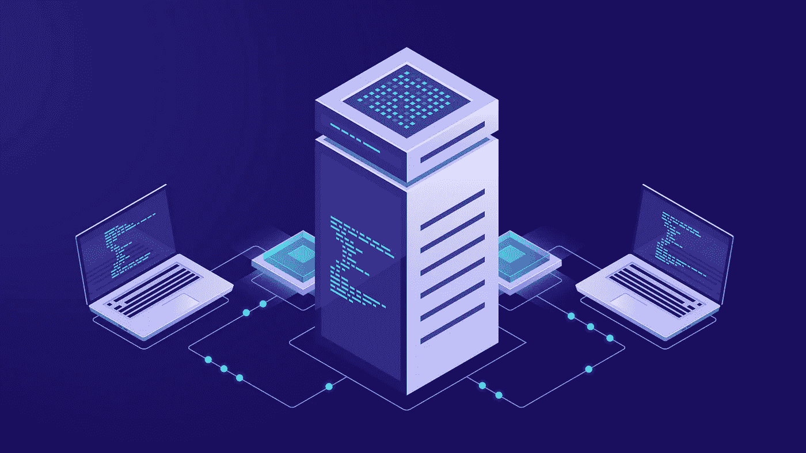

# 关于 Terra 你需要知道的一切

> 原文：<https://medium.com/nerd-for-tech/everything-you-need-to-know-about-terra-fc90087d5d4c?source=collection_archive---------9----------------------->

随着比特币、以太币和 Dogecoin 等加密货币的价值在最近几个月出现波动，许多个人都渴望投资 Terra 等所谓的稳定货币，因为它们的价值更加一致。

管理 Terra 加密货币项目的 Terraform Labs 已经从其日益流行中获益。[学习加密交易](https://www.blockchain-council.org/certifications/certified-cryptocurrency-trader/)更多了解这个新世界，成为加密货币专家。

**什么是 Terra？**

Terra 是 Terraform Labs 的区块链项目，支持初创公司的加密货币和金融产品。在这些加密货币中，有一种叫 UST 的货币，它通过一种算法与美元挂钩。

Terra 是一种稳定的货币，旨在减少比特币等加密货币的波动性。一些稳定货币，如 Tether，与更传统的货币，如美元挂钩，使用现金和货币等价物，而不是算法和相应的储备令牌。

【Terra 是如何工作的？

Terra 协议通过保证 Terra 稳定币的供给和需求持续平衡来维持 Terra 稳定币的价格，因为稳定币的基本价值来自于价格挂钩的稳定性，因此避免了加密货币的典型波动性。

与 Terra stablecoin 抗衡的变量是 Luna，它吸收了它的波动性。为了掌握 Terra 是如何运作的，想象整个 Terra“经济”是一个 Terra 池和一个 Luna 池。Luna 供应池增加或减少 Terra 的供应来维持 Terra 的价格；用户烧 Luna 来薄荷 Terra，烧 Terra 来薄荷 Luna。

(Terra 库的)扩张:当 Terra 以高比例交易时，它意味着对稳定货币的需求大于供给；这意味着土地供应应该增加以满足需求。该协议鼓励用户铸造 Terra 并焚烧 Luna，这降低了 Terra 的价格(因为供应量增加)，同时提高了 Luna 的价格(因为供应量减少)。用户将继续套利，直到 Terra 达到其目标钉住价格。

(Terra 库的)收缩:当 Terra 的交易量与其挂钩的比例较低时，情况正好相反，这意味着稳定的货币供大于求。这将需要限制 Terra 的供应，直到它与需求相匹配。该协议然后激励用户燃烧 Terra 和 mint Luna，这提高了 Terra 的价格(因为可用性有限)，同时降低了 Luna 的价格(通过增加其供应量)。用户将继续这一套利过程，直到 Terra 以其目标价格交易。

Terra 对未来有什么计划？

Terraform Labs 希望通过使用 Terra 的区块链和相关加密货币(包括一种与韩元挂钩的货币)，创建一个独立于大银行和金融科技应用开发商的数字金融系统。到目前为止，它的主要增长来源是在韩国，那里的个人使用基于 Terra 的区块链开发的 Chai 支付应用在商店购买商品，如咖啡。Kwon 表示，该公司的链接镜像交易应用程序正在中国和泰国发展。

**结束**

Terra 是一个开源的区块链支付网络，用于监控货币或其他资产价值的算法稳定货币或加密货币。Terra stablecoins 可以在 Terra 网络上快速消费、保存、交易或交换。报名参加加密货币交易课程，开始成为[加密审计员](https://www.blockchain-council.org/certifications/certified-cryptocurrency-auditor/)的旅程