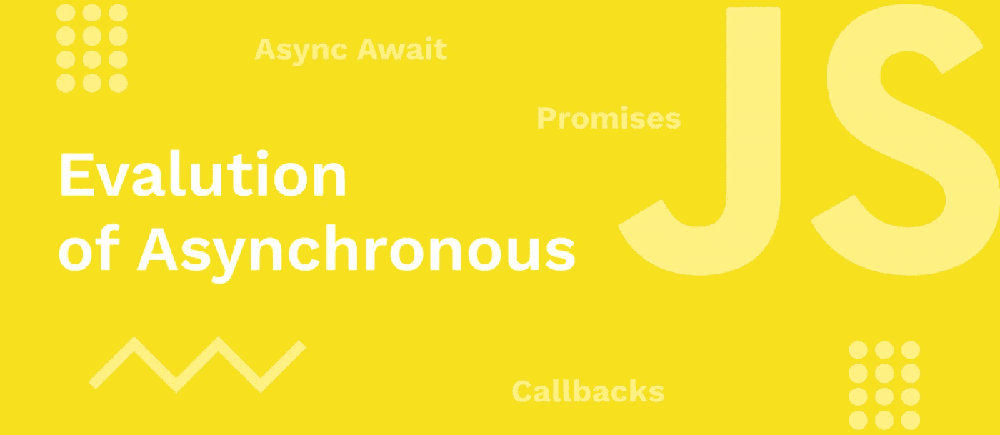
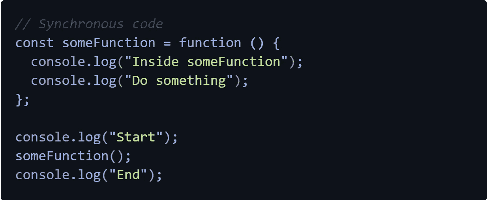
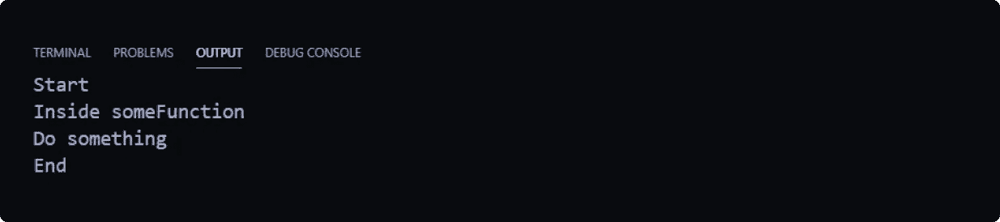
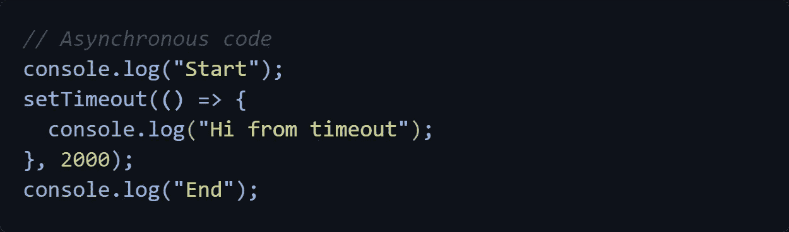
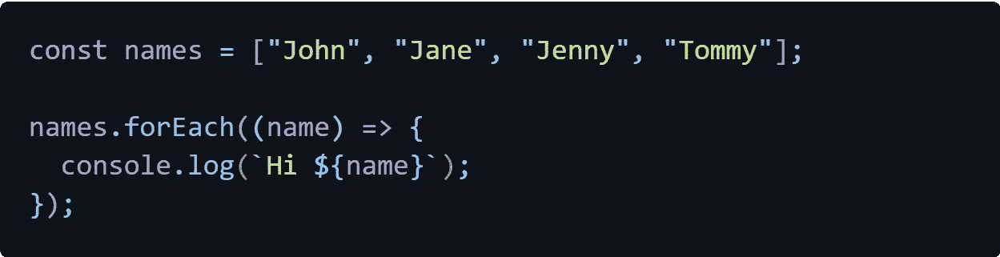
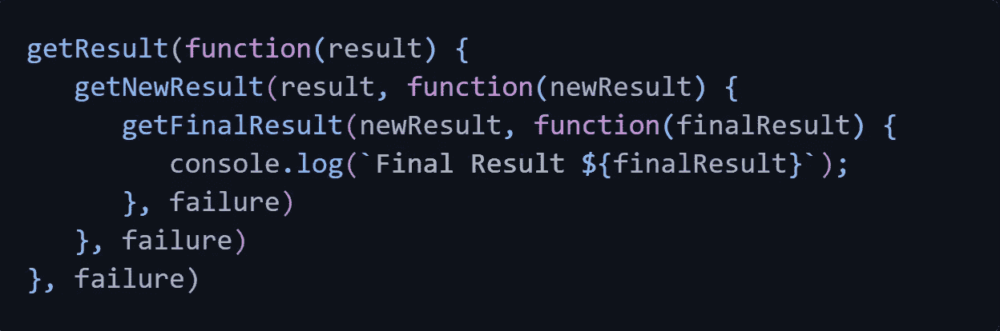
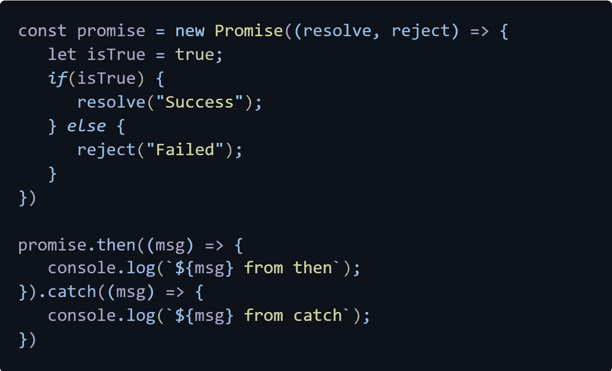
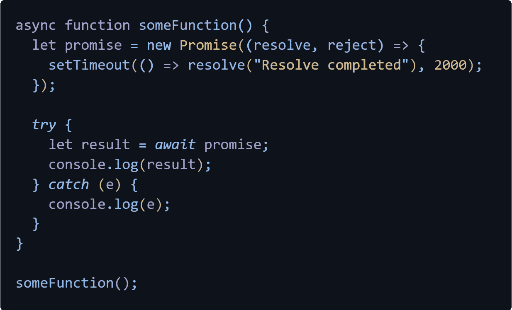

# 异步 JavaScript 的发展

> 原文：<https://medium.com/nerd-for-tech/evolution-of-asynchronous-javascript-3cf61b062757?source=collection_archive---------19----------------------->

JavaScript 是一种单线程编程语言，这意味着 JavaScript 引擎可以一次一行地执行一条语句。也称为同步代码。在这里，我将讨论同步、异步 JavaScript 的使用如何随时间变化，以及异步代码如何使用回调、承诺和异步/等待。

## 什么是同步 JavaScript？

如上所述，由于是单线程的，JavaScript 本质上是一种同步编程语言。这意味着 JavaScript 从上到下一次执行一条语句。然而，这种行为在某些时候并不理想，比如从 API 或数据库请求数据。因为这个过程可能需要一些时间，然后其他语句在这个过程之后等待执行。这就是异步风格代码发挥作用的地方。

## 什么是异步 JavaScript？

基本上，异步风格代码意味着现在开始执行，以后再完成。在上述场景中，当从 API 或数据库获取数据时。我们使用异步函数而不是同步函数。那么一旦接收到数据，该功能可以现在开始，稍后完成。当执行代码时，如果有异步代码，它将从调用堆栈中删除，浏览器将跟踪，直到完成任务。然后其他语句可以毫无延迟地执行。现在我将使用异步的设置超时函数来解释它。

在这里，我们将讨论回调、承诺和异步等待语法。基本上，这些是处理异步数据的方法。

## 复试

回调是作为参数传递给另一个函数以便以后执行的函数。如果我们从 API 接收到数据，我们可以传递一个回调函数来调用，并在接收到数据后对其进行处理。我们可以这样做，因为 JavaScript 函数是根据调用的顺序执行的，而不是根据定义的顺序。使用回调，我们可以延迟一个函数的执行，直到从某个需要花费一些时间的地方获取数据的时候。任何接收另一个函数作为参数的函数称为高阶函数，而作为参数传递的函数称为回调函数。在下面的场景中，someFunction 是高阶函数，sayWelcome 是回调函数。

不管您是否了解命名约定，您很可能以前使用过它们，因为它们在 JavaScript 代码中非常流行。对于每个人来说，其中最受欢迎的是下面提到的。

可以独立创建多个函数并用作回调函数，这将创建一个多级函数，当你有太多这样的嵌套函数时，代码将变得无法阅读。这个缺点被称为回调地狱，让我们看一个例子来更好地理解。

回调函数对于简短的异步任务很有用。因此，在 ES6 中引入了解决这个问题的承诺。

## 承诺

承诺，这个名字本身就说明了一切。这是一种承诺，如果其他事情是真的，那么它就不会是真的。用于处理任务的异步结果的承诺和比回调干净得多的语法。在这种情况下，isTrue 作为基于结果的结果，resolve 函数或 reject 函数将被调用。然后，如果调用 resolve，将对承诺调用 Then 方法，如果调用 reject 方法，将调用 catch 方法。任何在里面的东西都将被解析，任何在 catch 里面的东西都将被拒绝。通常 catch 用于处理错误。

## 异步/等待

Async/Await 实际上只是语法上的糖衣，让承诺更容易处理。这是一种像编写同步代码一样编写异步代码的方法。当在函数前使用 async 关键字时，该函数将返回一个承诺。这意味着，它接受一个返回值，并自动将其解析为一个承诺。此外，设置一个上下文来使用 await 关键字，这将只在异步函数中起作用。这里，我们使用 try and catch 进行错误处理。

现在，您已经了解了回调、承诺和 Async/Await 的所有基础知识，它们使得读取和编写 JavaScript 代码变得更加容易和有效。