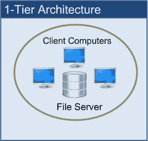
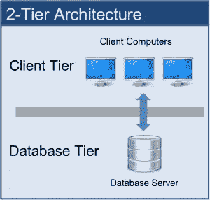
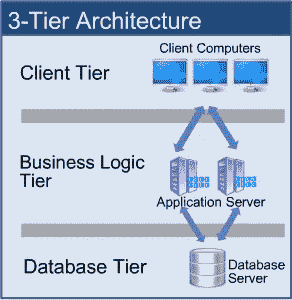

# 软件架构的演变

> 原文：<https://medium.com/nerd-for-tech/evolution-of-software-architectures-66b75db87f36?source=collection_archive---------6----------------------->

[兰斯·安德森](https://unsplash.com/@lanceanderson?utm_source=medium&utm_medium=referral)在 [Unsplash](https://unsplash.com?utm_source=medium&utm_medium=referral) 上拍照

如果你是一个企业家，正计划开发一个应用程序，或者如果你想成为一个高级企业公司的技术领导，那么在你开始开发你的软件之前，有一件你需要从各个方面了解的事情。也就是为你的应用程序决定最合适的软件架构。如果你是一名软件工程师或技术爱好者，即使你没有太多关于软件架构的知识，你也已经知道它真的很重要。因此，在这篇文章中，我将解释软件架构以及它们是如何随着时间的推移而演变的。

在解释体系结构的类型之前，您需要理解作为软件体系结构基础的不同层。有三种类型的层被称为**表示层、应用层和数据层。**

## **表示层**

这一层也被称为**客户端层**，这是我们在使用软件时看到的(用户界面)。这一层的主要职责是与应用层进行通信。这一层将用户通过键盘操作、鼠标点击给出的信息传递给应用层。

## **应用层**

也被称为**业务逻辑层**。因此，这一层决定如何处理从表示层接收的用户输入。此外，这一层充当表示层和数据库层之间的桥梁。我们使用这一层来编写软件的整个业务逻辑。

## **数据层**

数据总是存储在该层中。应用层与数据库层通信以检索数据。它包含连接数据库并执行所需操作(如插入、更新和删除)的方法。

# 单层架构

图片:单层架构(https://www.perfmatrix.com/)

一层架构也称为**单层架构**，在单个软件包中包含所有层，如表示层、业务层、数据层。这意味着用户界面、业务逻辑和数据库层可由同一本地驱动器下的应用程序访问。客户端和服务器都驻留在同一台机器上。因此，正如您已经猜到的，这是最简单的应用程序架构。然而，一层架构并不适合 web 应用程序，因为它只能访问单台计算机或服务器上的数据。

这是一种经济高效的架构。所以，如果你想开发一个基于这种架构的应用程序，构建起来会更容易，更便宜。然而，这种体系结构的主要缺点是，它不能在一台客户机之间共享信息。有时，如果在机器中做了一些更改，基于这种架构的应用程序就无法工作。

像 MP3 播放器、MS Office 这样的应用程序属于一层应用程序。

# 双层架构

图片:双层架构(https://www.perfmatrix.com/)

在这种体系结构中，客户端处理表示层和应用层，服务器处理数据库层。两层架构也被称为**“客户端-服务器应用程序”**。在两层体系结构中，通信发生在客户机和服务器之间。这意味着，客户端和服务器不在同一台计算机上。因此，客户端系统向服务器系统发送请求，服务器系统处理请求并将响应发送回客户端系统。

两层应用程序架构易于维护和修改。客户机和服务器之间的通信非常快，即使它是以请求和响应的形式发生的。然而，这种体系结构的主要缺点是，如果客户机的数量超过了容量，那么服务器可能无法响应所有这些客户机发出的请求。因此，它降低了服务器的生产率。

此外，如果在应用程序中进行了一些更改，可能需要重新安装客户端应用程序。因为业务层驻留在客户端，所以客户端应该具有很高的处理能力。

# 三层架构

图片:三层架构(https://www.perfmatrix.com/)

三层架构是非常流行和常见的架构。在这种架构中，所有三个主要层都是相互分离的。表示层位于客户层，应用层充当中间件，数据层位于数据层。与两层体系结构不同，两个服务器执行该体系结构中的主要任务。一台服务器用于业务层，另一台用于数据库层。

这种架构用于设计 web 应用程序。在这种体系结构中，应用服务器充当客户机和服务器层之间的接口。因此，应用层帮助客户端与服务器通信。数据库层存储所有数据，并根据应用层逻辑做出响应。这一层还增加了应用程序的安全性。

三层体系结构的主要目标是，每一层都在自己的基础设施上运行，每一层都可以由单独的开发团队同时开发，并且可以根据需要进行更新或扩展，而不会影响其他层。

# 多层架构

n 层架构也称为**分布式架构**或**多层架构。**类似于三层架构，但是增加了应用服务器的数量，并在单独的层中表示，以便分布业务逻辑，使逻辑可以分布。

这种建筑以其灵活性而闻名。它可以通过增加数据库服务器的数量来提高灵活性。基于 n 层的应用程序比体系结构的其他层更安全。甚至可以在任何一层进行更改或修改，而不会影响其他层。在任何时候，您都可以修改业务逻辑、增加数据库大小，而无需接触客户端。

> 注意:Java EE 架构基于 n 层架构。

随着互联网的兴起，开发者寻求一种通过互联网获得他们的应用和系统的方法。因此，他们能够构建名为**的三个组件:Web 服务器、Web 容器和应用服务器。**因此，在本章中，我将解释这三个组成部分。

## 网络服务器

web 服务器是一种存储、处理和向客户端传送网页的计算机系统。客户端几乎总是 web 浏览器或移动应用程序。根据设置，web 服务器可以存储一个或多个网站。这种类型的服务器只提供静态 HTML 内容，如文档、图像、视频和字体。

通常，web 服务器不处理动态内容或服务器端编程，但是您仍然可以添加组件来处理动态内容。此外，web 服务器只接受和满足超文本传输协议(HTTP 或 HTTPS)请求。

> **流行的网络服务器:** Nginx、Apache、微软 IIS、Jetty 和 LightSpeed

## Web 容器

web 容器是 web 服务器的组件，它与 Java servlets 交互，web 应用程序在 Web 服务器的这些 Web 容器中运行。Web 容器通过提供命名上下文和生命周期管理的组件来提供运行时环境。一些 Web 服务器还可以提供额外的服务，如安全性和并发控制。这些 web 容器实现了 Java 工程架构的 web 组件方面；它为各种组件(如事务、并发和部署)指定了运行时环境。

## 应用服务器

应用服务器是一个软件框架，它为客户端应用程序生成动态内容和资产。客户端包括基于网络的应用、浏览器和移动应用。Application server 可以转换数据，以提供由业务、服务或应用程序提供的专用功能。应用程序服务器增强了网站的交互部分，根据请求的上下文，这些部分会以不同的方式出现。

> **注意:** Web 服务器和应用服务器有一个共同点，它们需要一个专用的服务器来运行软件。

应用服务器是客户端和服务器端代码之间的主要链接。应用服务器的典型任务包括:

*   事务管理
*   安全性
*   依赖注入
*   并发

# 微服务架构

图片:单片和微服务架构(https://pretius.com/)

微服务架构旨在帮助开发人员避免让他们的软件和应用程序变得笨拙、单一和不灵活。我们的目标不是构建一个大软件，而是创建许多不同的小程序，然后每当有人想添加新功能时就创建一个新的小程序。因此，这些微服务中每一个都有自己独特的职责和团队，可以独立于其他微服务开发它们。他们之间唯一的依赖就是沟通。当微服务相互通信时，您必须确保它们之间发送的消息保持向后兼容。

如果你想知道为什么微服务比其他架构如此特殊和受欢迎，那么我们来比较一下微服务和传统的整体架构。与微服务不同，monolith 应用程序是作为单个大型单元构建的。这使得对应用程序的更改很慢，因为它会影响整个应用程序。如果您想对一小部分代码进行修改，可能需要构建和部署应用程序的全新版本。扩展应用程序的特定功能，也意味着您必须扩展整个应用程序。

## 微服务架构的优势

*   微服务架构为开发人员提供了独立开发和部署服务的自由
*   一个微服务可以由一个相当小的团队开发
*   不同服务的代码可以用不同的语言编写
*   易于集成和自动部署(使用开源的持续集成工具，如 Jenkins、Hudson 等。)
*   易于开发人员理解和修改，因此可以帮助一个新的团队成员迅速变得富有成效
*   开发者可以利用最新的技术
*   代码是围绕业务功能组织的
*   更快地启动 web 容器，因此部署也更快
*   当应用程序的某个部分需要更改时，只需修改和重新部署相关的服务，而无需修改和重新部署整个应用程序

所以，这是文章的结尾，我希望你喜欢它。快乐编码👨‍💻。

## 参考

 [## 软件架构及其类型| 1 层 2 层 3 层 N 层架构|

### 软件体系结构是一个系统，用来表示完成特定功能或集合的组件的集合

www.perfmatrix.com](https://www.perfmatrix.com/software-architecture-and-its-types/)  [## Web 服务器、Web 容器和应用服务器

### HTTP 服务器 web 服务器是一种软件，它帮助将 web 内容(网页)传送给客户端(例如 web 浏览器)

javajee.com](https://javajee.com/web-server-web-container-and-application-server)  [## 如何选择正确的软件架构:五大模式

### 好莱坞电影有多少情节？一些批评家说只有五个。有多少种方法可以构建一个…

techbeacon.com](https://techbeacon.com/app-dev-testing/top-5-software-architecture-patterns-how-make-right-choice)