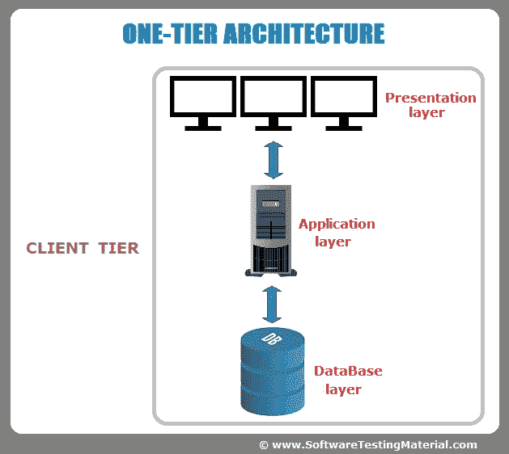
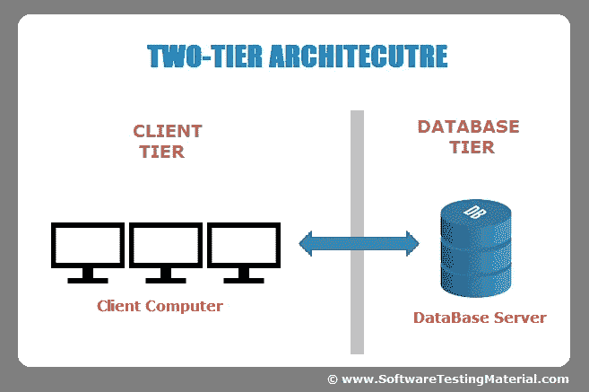
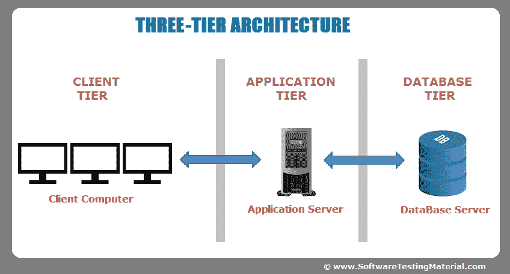
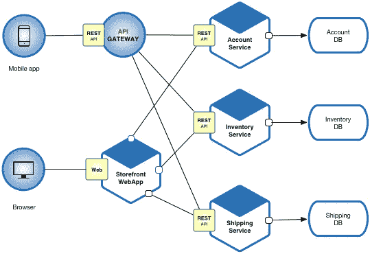

# 软件工程的发展

> 原文：<https://medium.com/nerd-for-tech/evolution-of-software-engineering-589c4106b057?source=collection_archive---------13----------------------->

(图片:[**https://medium . com/@ bfil/evolution-of-a-software-engineer-a9f 88531084**](/@bfil/evolution-of-a-software-engineer-a9f88531084))

在这篇文章中，我将讨论软件架构从独立到微服务的演变。

## 单层架构

(图片:[https://www . software testing material . com/software-architecture/](https://www.softwaretestingmaterial.com/software-architecture/))

在单个设备上，这种类型的设计包含多种选项。配置、数据和营销逻辑都是设置的一部分。由于服务，1 层架构是最值得信赖的来源之一；然而，管理这样的架构有点挑战，因为数据以多种形式存储。下面列出了构成 1 层体系结构的各层。

1.  **表示层** —这包括向最终用户提供用户界面或向客户端返回响应所涉及的所有类。
2.  **业务层—** 包括应用程序实现其功能需求所需的所有逻辑，同时保持与领域规则的分离。
3.  **数据访问层—** 这基本上是存储应用程序数据的服务器

## 双层架构

(图片:[https://www . software testing material . com/software-architecture/](https://www.softwaretestingmaterial.com/software-architecture/))

两层设计提供了最佳的客户机/服务器环境，它允许用户界面存储在客户机系统上，而整个数据库保存在服务器计算机上。尽管业务逻辑和数据库逻辑位于客户机上而不是服务器上，并且它们必须被维护。因为有了局域网，这才成为可能。

这分为两个部分，

*   客户端应用程序(客户端层)
*   数据库(数据层)

这种方法提供了一些优势，包括卓越的性能、2 层体系结构的应用程序设计的简易性，以及用户对体系结构响应的满意度。这也创造了一个同质的环境。这个系统有一些缺点，包括缺乏安全性、扩展用户的可能性会损害架构性能，以及缺乏可移植性。

## 三层架构

(图片:[https://www . software testing material . com/software-architecture/](https://www.softwaretestingmaterial.com/software-architecture/))

在三层架构中，中间件位于客户机和服务器之间。
如果用户需要来自服务器的特定信息，用户将提交请求，该请求将被中间层接收，然后被发送到服务器进行处理。
响应将以同样的方式交付给用户。首先由中间层接收，然后将从服务器接收的数据发送到用户端。数据逻辑和业务逻辑可以通过中间件来控制和存储。
在三层架构中使用中间件提高了设计的灵活性和性能。说到优点，它在数据完整性和安全性方面比双层有了更大的提高，同时它隐藏了数据库结构。

## 多层架构

*多层架构*是一种软件架构，其中不同的软件组件组织成层，提供专门的功能，这也被称为“**多层架构**”。它类似于三层设计，除了应用服务器的数量被扩展并在不同的层中表示，以分散业务逻辑。

> **Java EE 架构**也属于 N 层架构。

开发人员想要扩展他们的系统，这就是互联网的用武之地。通过 Web 服务器，引入了 Web 容器和应用服务器。

## 网络服务器

web 服务器的作用是存储、处理和向客户端分发网页。HTTP 协议用于客户端和服务器之间的通信。最常见的页面类型是 HTML 文档，除了文本之外，它可能还包括图形、样式表和脚本。

让我们看看 web 服务器是如何工作的，

当你输入一个网址时，浏览器会在电脑的缓存文件中搜索该地址对应的 IP 地址(因为 cookies)。如果没有，那么浏览器会将网址发送到 DNS 服务器以获取 IP 地址。

Apache HTTP Server、Nginx、IIS、LiteSpeed Web Server 和 GWS 是一些常见的 Web 服务器。

## Web 容器

它知道如何运行服务器端 java 程序的生命周期，如 Servlets(在服务器上执行的 Java 类，用于生成动态网页)、JSP (Java 服务器页面)、JSF (Java 服务器界面)以及 web 服务。之后，它会将响应发送回浏览器。Apache Tomcat 是 web 容器的一个常见例子。

## 应用服务器

顾名思义，它是一种服务器，旨在为最终用户安装、操作和托管应用程序及相关服务，他们将为应用程序提供服务，如事务、安全、依赖注入和并发。在层次结构中，应用服务器位于顶层，web 服务器位于最后一层。应用服务器的主要优点是，

*   一种减少客户程序大小和复杂性的机制。
*   需要缓存和控制数据流以获得更好的性能。
*   一种实现数据和最终用户流量安全的机制。

JBoss，Weblogic，Websphere 和**，Glassfish** 是一些常见的应用服务器。

> **E**enterprise**J**ava**B**eans(EJB)是一个开发架构，用于构建高度可伸缩和健壮的企业级应用程序，部署在符合 J2EE 标准的应用服务器上，如 JBOSS、Web Logic 等。

# 微服务架构

微服务架构，通常称为微服务，是一种将单个应用程序结构化为一系列松散链接的服务的技术。应用程序通常从一个整体架构开始(稍后将详细介绍)，然后随着时间的推移演变为一组链接的微服务。

微服务的主要概念是将一些类型的程序分解成许多小组件，这些小组件一起工作，使得它们更容易设计和维护。
尽管设计越来越复杂，但相比整体结构，微服务仍然具有一些优势。

(图片:[https://microservices.io/](https://microservices.io/))

微服务目前在许多大公司的架构中使用。网飞是这项技术最早也是最著名的采用者之一。其他著名的例子有易贝、亚马逊、推特等等。

## 微服务的优势

*   **改进的故障隔离**:单个模块的故障对大型应用的影响很小。
*   **消除供应商或技术锁定**:微服务为您提供了在每个服务基础上试验不同技术堆栈的自由。需要担心的依赖性将会更少，恢复更改将会更加容易。代码越少，自由就越多。
*   **易于理解:**通过增加简单性，开发人员可以更好地理解服务的功能。
*   **更小更快的部署**:更小的代码库和范围=更快的部署，这也允许您开始探索持续部署的好处。
*   **可伸缩性**:由于您的服务是独立的，您可以在适当的时候更容易地扩展最需要的服务，而不是整个应用程序。如果操作正确，这可能会影响成本节约。

这就是从独立到微服务的过程。实际上还有很多细节要说，这些将在以后的文章中讨论。

# 参考

 [## 分层架构很好——DZone Java

### Darek 是一个在所有 Tidy Java 帖子发布前都会对其进行评论的人，他建议我可以做一个关于…

dzone.com](https://dzone.com/articles/layered-architecture-is-good)  [## 客户端-服务器架构|组件、类型、示例

### 为了建立战略联盟或在机器之间获取和交换信息，联网是…

teachcomputerscience.com](https://teachcomputerscience.com/client-server-architecture/#1_1_Tier_Architecture)  [## 什么是客户服务器网络？优点、缺点、例子

### 定义-客户服务器网络是这样一种模型，其中一方服务器向另一方提供各种服务…

digitalthinkerhelp.com](https://digitalthinkerhelp.com/what-is-client-server-architecture-diagram-types-examples-components/)  [## 解释了客户端服务器架构

### 本教程详细解释了客户端-服务器网络架构和应用。了解什么是客户端-服务器…

www.computernetworkingnotes.com](https://www.computernetworkingnotes.com/networking-tutorials/client-server-architecture-explained.html)  [## Web 服务器、Web 容器和应用服务器的区别

### 在本文中，我们将学习如何区分 web 服务器、web 容器和应用服务器。基于…

ducmanphan . github . io](https://ducmanhphan.github.io/2020-04-01-The-difference-between-web-server-web-container-application-server/)  [## 什么是应用服务器？|类型和使用示例|优点

### 应用服务器是一种设计用于安装、操作和托管应用程序的服务器。在…的早期

www.educba.com](https://www.educba.com/what-is-application-server/)  [## 什么是微服务架构？微服务解释

### 微服务架构，又名微服务，是一种设计软件系统的特定方法，以构建一个单一的…

www.bmc.com](https://www.bmc.com/blogs/microservices-architecture/)  [## 微服务架构的优势和劣势

### 让我们从设置什么是微服务的基础开始讨论。微服务是打破大…

cloudacademy.com](https://cloudacademy.com/blog/microservices-architecture-challenge-advantage-drawback/)