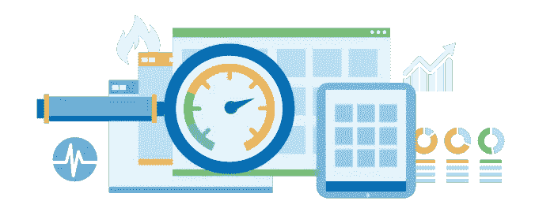
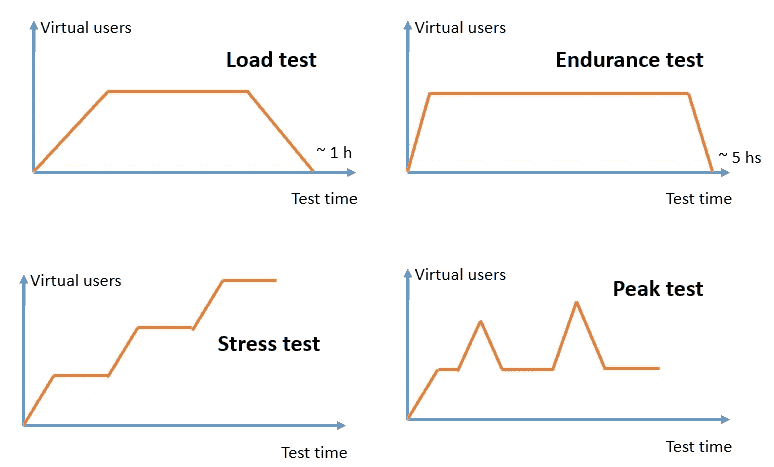
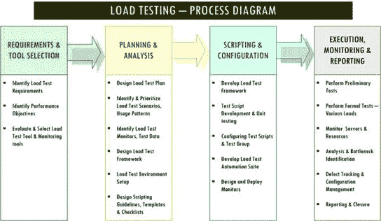

# 基于实际负载条件检查系统性能

> 原文：<https://medium.com/nerd-for-tech/examine-system-performance-based-on-real-life-load-conditions-8054521fefc7?source=collection_archive---------20----------------------->

> 考虑以下场景:在节日或促销期间，电子商务可能会经历访问量的增加；登记或注册更新活动，有截止日期；当博客被主流报纸引用时。这些和其他场景可能会将您的系统推向极限，甚至超过极限。识别和防止这种问题的最有效的方法之一是执行性能测试。这个术语指的是测量应用程序性能的测试。存在不同的方法来实现这个目标。本文的目的是考察基于实际负载条件确定系统稳定性的可能性。



性能测试服务— [Qrapp 技术](https://www.qrapp.org.uk/performance-testing)

你可能已经经历过这样一种情况，你看到一个在线销售的广告，折扣高达 80%。想象一下，你想买的产品也在促销活动中做了广告。立刻，你拿起手机，在谷歌上搜索，试图访问它，但网站无法加载。您刷新页面，认为问题出在您的连接上，但您仍然无法访问。你会不断尝试，直到你厌倦了等待，放弃购买。

上面的情况比你想象的更普遍。这是一个影响各种网站的性能问题的例子。识别和防止这种问题的最有效的方法之一是执行性能测试。通过这样做，可以确定哪些事务可能影响应用程序的执行，定义允许软件满足指定要求的最低架构配置，从而最大限度地降低与性能要求相关的风险。

本文的目的是检验基于实际负荷条件确定系统稳定性的可能性。我们将提出一个使用 k6 作为负载测试引擎的解决方案。

# 性能试验

术语“峰值”、“耐久性”、“负载”和“压力”通常用于描述测试，这些测试试图理解软件在执行给定任务期间的表现。一般来说，所有这些术语都是指测量应用程序性能的测试，但是它们都使用不同的方法来实现这个目标。



性能测试的类型—摘自[摘要](https://abstracta.us/blog/performance-testing/types-performance-tests/attachment/why-perf-testing-is-nec-chart-2/)

这些性能测试各有其优点。确定测试的目的以确定应用哪种类型很重要:

*   **负载测试:**包括评估系统在预期工作负载下的性能。
*   **耐久性测试:**确定系统是否能够长期承受持续的预期负载。
*   **压力测试:**评估应用程序在远高于预期工作负载的负载下的性能。
*   **峰值测试:**分析用户数量突然增加时系统的行为。

# 负载测试

执行负载测试是为了确定系统在正常和预期峰值负载条件下的行为。它有助于确定应用程序的最大运行容量以及任何可能导致性能下降的瓶颈。当施加在系统上的负载超过正常使用模式时，测试系统在异常高或峰值负载下的响应，这就是所谓的压力测试。

流行的负载测试工具提供了对缓慢性能原因的洞察。系统性能缓慢有许多可能的原因，包括但不限于以下原因:

*   应用服务器或软件
*   数据库服务器
*   网络(延迟、拥塞等)
*   客户端处理
*   多台服务器之间的负载平衡

成功的负载测试的先决条件是有目标。例如， ***高于什么水平的响应时间是不可接受的，和/或什么是可接受的请求失败率*** 。确保您的负载测试在功能上是正确的也是一个很好的实践。

# **K6**

k6 是一个开源的负载测试工具，旨在使负载测试变得简单易行。使用它，您将能够更早地发现性能退化和问题，允许您构建有弹性的系统和健壮的应用程序。主要特性包括:

*   CLI 工具
*   JavaScript 中的脚本
*   自动负载测试的可能性

k6 用户通常是开发人员、QA 和 DevOps 工程师。他们使用 k6 测试 API、微服务和网站的性能。常见的 k6 用例有:

*   负载测试:设计用于在预生产和 QA 环境中运行高负载测试。
*   监控:您可以在少量负载的情况下运行测试，以持续监控您的生产环境的性能。

这项服务背后的公司也有一个在云中运行的商业选项。借助该 SaaS，可以从多个位置扩展测试，获得可操作的性能洞察并安排测试。

# 用例

最基本类型的负载测试用于确定 Web 在正常条件和高负载水平下的行为。随着负载测试的开始，建议从少量虚拟用户开始，然后逐渐增加负载，从正常增加到峰值。



负载测试工作流—从 [linhadecodigo](http://www.linhadecodigo.com.br/artigo/3259/testes-de-performance-testes-de-carga-stress-e-virtualizacao-parte-3.aspx) 中检索

我们将展示一些使用 k6 作为工具的负载测试场景。我们的测试将在本地进行。首先，你需要[安装二进制文件](https://k6.io/docs/getting-started/installation/)。这将是一个简单的 HTTP 请求测试。正如你在下面的方块中看到的，我们建造了一个 ***。js*** 脚本，包含我们测试所需的配置。我们可以通过 options 对象来规定测试的阶段(上升/下降模式)。性能和功能目标可以使用[阈值](https://k6.io/docs/using-k6/thresholds)和[检查](https://k6.io/docs/using-k6/checks)进行编码。另外，请注意，我们正在保存对 ***res*** 的响应，稍后可以访问。

```
import http from 'k6/http';import { sleep, check } from 'k6';import { Counter } from 'k6/metrics'; export const requests = new Counter('http_reqs');export const options = { stages: [ { target: 20, duration: '1m' }, { target: 15, duration: '1m' }, { target: 0, duration: '1m' }, ], thresholds: { requests: ['count < 100'], },};export default function () { const res = http.get('http://test.k6.io'); sleep(1); const checkRes = check(res, { 'status is 200': (r) => r.status === 200, 'response body': (r) => r.body.indexOf('Feel free to browse') !== -1, });}
```

要开始实验，只需运行以下命令:

```
$ k6 run single-request.js /\      |‾‾| /‾‾/   /‾‾/
     /\  /  \     |  |/  /   /  /
    /  \/    \    |     (   /   ‾‾\
   /          \   |  |\  \ |  (‾)  |
  / __________ \  |__| \__\ \_____/ .ioexecution: local
 script: single-request.js
 output: -scenarios: (100.00%) 1 scenario, 20 max VUs, 3m30s max duration (incl. graceful stop):
 * default: Up to 20 looping VUs for 3m0s over 3 stages (gracefulRampDown: 30s, gracefulStop: 30s)
```

最后，它会显示结果:

```
default ✓ [======================================] 00/20 VUs  3m0s ✓ status is 200
     ✗ response body
      ↳  0% — ✓ 0 / ✗ 1871 checks.........................: 50.00% ✓ 1871 ✗ 1871
     data_received..................: 21 MB  117 kB/s
     data_sent......................: 142 kB 788 B/s
     http_req_blocked...............: avg=1.64ms   min=2µs      med=4µs      max=192.17ms p(90)=6µs      p(95)=8µs
     http_req_connecting............: avg=1.62ms   min=0s       med=0s       max=192.11ms p(90)=0s       p(95)=0s
     http_req_duration..............: avg=156.27ms min=138.97ms med=152.57ms max=426.66ms p(90)=167.92ms p(95)=172.34ms
       { expected_response:true }...: avg=156.27ms min=138.97ms med=152.57ms max=426.66ms p(90)=167.92ms p(95)=172.34ms
     http_req_failed................: 0.00%  ✓ 0    ✗ 1871
     http_req_receiving.............: avg=236.51µs min=43µs     med=116µs    max=21.17ms  p(90)=425µs    p(95)=801.5µs
     http_req_sending...............: avg=21.6µs   min=8µs      med=20µs     max=158µs    p(90)=27µs     p(95)=32µs
     http_req_tls_handshaking.......: avg=0s       min=0s       med=0s       max=0s       p(90)=0s       p(95)=0s
     http_req_waiting...............: avg=156.01ms min=138.83ms med=152.32ms max=426.18ms p(90)=167.71ms p(95)=171.52ms
     http_reqs......................: 1871   10.374419/s
     iteration_duration.............: avg=1.15s    min=1.13s    med=1.15s    max=1.42s    p(90)=1.17s    p(95)=1.17s
     iterations.....................: 1871   10.374419/s
     vus............................: 1      min=1  max=20
     vus_max........................: 20     min=20 max=20
```

正如我们所看到的，默认情况下，服务已经收集了有助于评估应用程序性能的相关信息。有了它，我们可以确定延迟、并发虚拟用户的数量以及与请求相关的数据。在其官方文档中，你可以找到更多的[教程和示例](https://k6.io/docs/examples/)。

# 结论

本文的目的是考察基于实际负荷条件确定系统稳定性的可能性。术语“峰值”、“耐久性”、“负载”和“压力”通常用于描述测试，这些测试试图理解软件在执行给定任务期间的表现。更具体地说，执行负载测试是为了确定系统在正常和预期峰值负载条件下的行为。我们使用开源负载测试工具 k6 提出了一个解决方案。使用它，开发人员、QA 和 DevOps 工程师可以更早地拦截性能问题，允许他们构建弹性系统和健壮的应用程序。