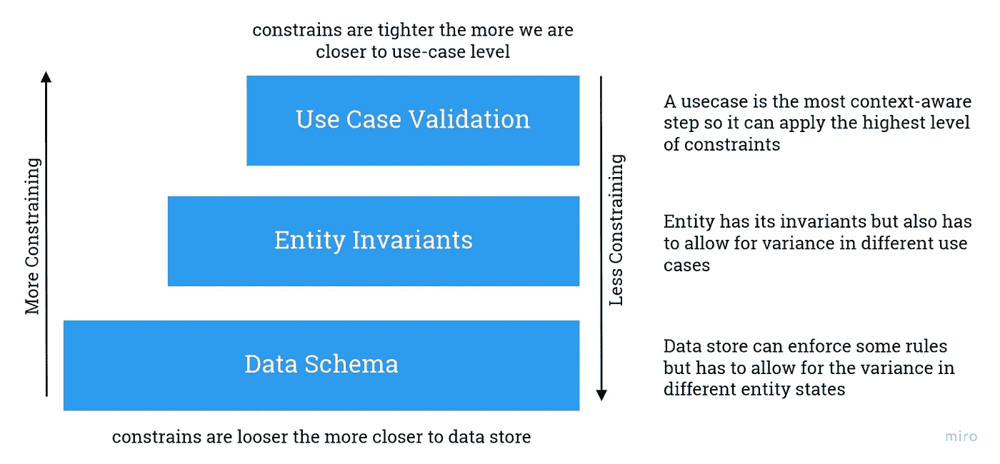
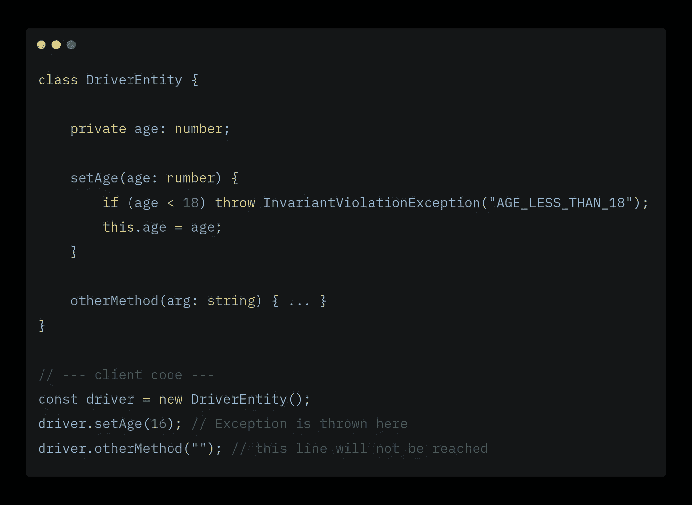
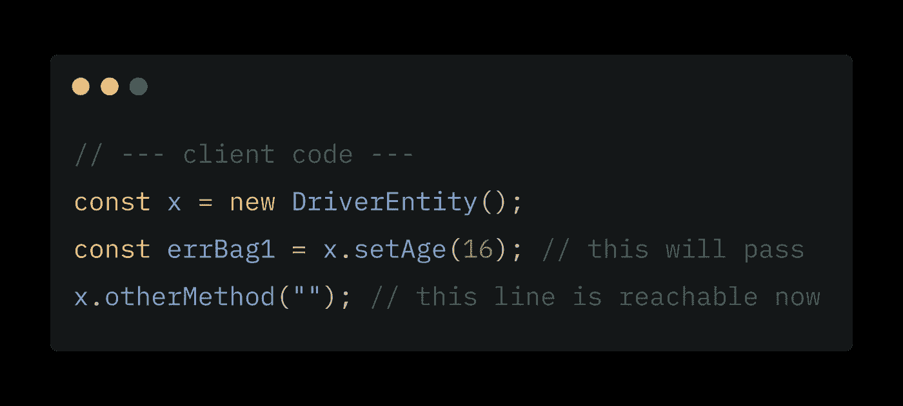
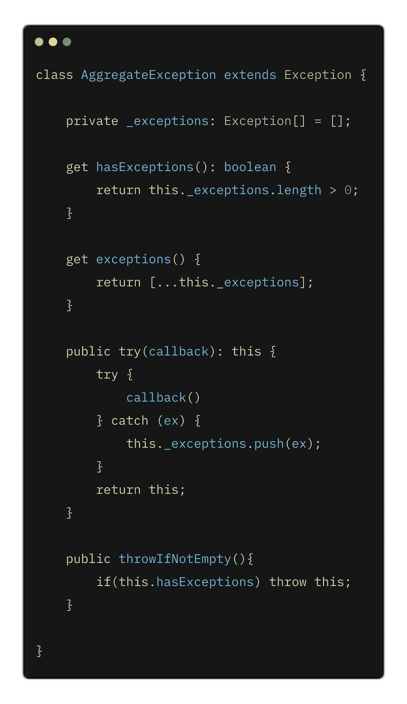
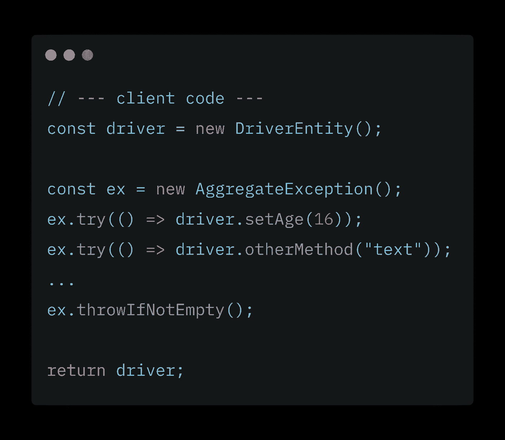
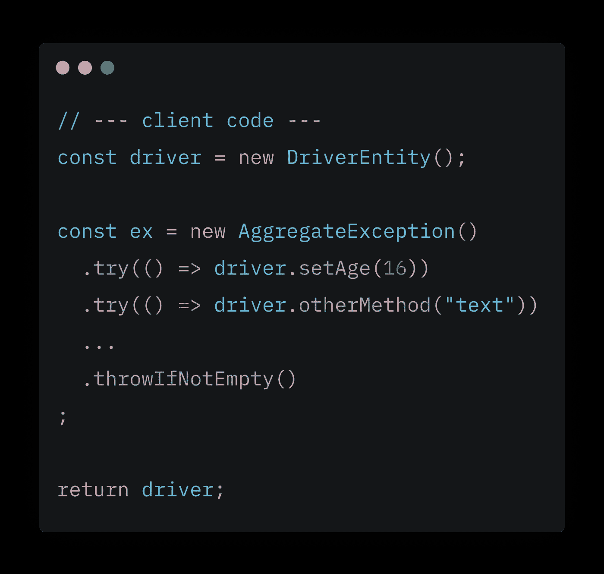

# 异常聚合——一种新的验证模式

> 原文：<https://medium.com/nerd-for-tech/exception-aggregation-a-new-validation-pattern-71d26f2ffee8?source=collection_archive---------10----------------------->

验证是我们保证系统完整性和一致性的方法，因此，几乎每一个软件都有验证，不管它有多大。

*这是关于验证的系列文章的第一篇，点击关注以获得关于后续文章的更新！*

# 介绍

从验证的角度来看，我们可以将大多数软件系统分成 3 个主要部分:用例、实体和构建者，以及数据存储。

图 1:验证约束与上下文感知的关系

## 用例

用例是您的实体和其他系统组件满足业务需求的使用场景，因此用例是您的系统中最了解上下文的组件，因为它掌握了用户以某种方式使用系统的真实意图。

我们可以指定一个用例需要的所有验证，而不依赖于系统中的任何其他部分，但这些规则中的一些不是任何用例都可以违反的，而是它们跨越许多用例和场景，这些被称为“**不变量**”。

## 实体和不变量

> *不变量是一组断言，在一个对象的生命周期中，这些断言必须始终为真，程序才能有效。*

因此，最好将这些封装在它们的相关对象中，这保证了使用这些对象的任何客户端代码都将相应地执行这些规则，因此**不变量是横切**在您的应用程序中，我们将持有不变业务规则的对象称为“**实体**”。

## 数据存储

一些规则具有另一种性质，如并发问题和状态持久性，在某些情况下，可以委托给数据存储，但数据存储必须比用例或实体更能容忍它可以应用的验证，数据存储只能在验证方面提供任何帮助，因为它必须为实体状态的变化(如可空字段)留出空间。

# 验证和错误报告

虽然验证对几乎所有系统都至关重要，但如果应用不正确，它也可能是有害的，例如，来自后端的不完整的错误反馈可能会损害您的用户体验，此外，不一致的错误处理和报告可能会导致系统出错，或者充其量是难以调试的系统。

## 异常与自定义错误

根据我的经验，我遇到了两种验证方式，要么抛出
“异常”，要么返回“验证错误”，这两种方式都有一些严重的缺点。在本文中，我想向您介绍第三种模式，它结合了两者的优点。

## 方法 1:使用异常

正如你在上面的例子中看到的，抛出的“异常”会破坏代码执行的连续性，它们不允许进一步的错误处理，这使得错误报告非常麻烦，并且不允许收集更多的错误。

我们不应该在每个请求上一个错误接一个错误地返回，因为这会毁掉 UX。

想象一下，一个用户看到一个“短名称”的错误，然后在修复并重新提交后，我们向他发送另一个关于同一字段的“非法字符”的错误。这将令人沮丧。

优点:

*   防止构造无效实体。

缺点:

*   破坏代码执行的连续性。
*   一错再错会破坏用户体验。

## 方法 2:使用自定义错误

我们可以在我们的方法中使用某种错误收集机制，并使用错误包作为进行验证的方法的返回值，这解决了破坏代码执行连续性的问题。

乍一看，返回一个错误集合似乎是个好主意，但是正如你所看到的，另一方面，这会污染你的设计，因为太多的方法会有一些验证逻辑。

仅仅这一点就会阻止你使用有意义的返回类型，阻止你的接口暴露出它们背后的真实意图，这反过来会使设计处于更糟糕的状态。

但是让我们再来看看客户端代码:

在`const errBag1 = x.setAge(16);`上，是的，我们正在返回一个错误包，但我们仍然依赖于客户端开发人员足够警惕地使用这些返回类型，因为他/她可以很容易地忽略返回值，导致可以存储和操作的无效实体，这反过来违反了总是有效实体的原则。

阅读 Greg Young 的更多关于永远有效的实体的文章:[点击这里](http://codebetter.com/gregyoung/2009/05/22/always-valid/)。

优点:

*   一种更好的向用户返回错误的方式。

缺点:

*   对返回的错误的可能消除将导致无效实体被处理。
*   严重损害了界面设计。

## 方法 3:异常聚合

这里提出的解决方案是我所谓的“异常聚合”——IDK，如果这是一个好名字的话，这是一个结合了两种解决方案的模式，使用异常(不中断)*代码执行连续性进行报告。

首先是`AggregateException`，一个继承自`Exception`基类的类(在 typescript 中它是`Error`类，但是我在这里使用`Exception`是为了不与非 typescript 用户的自定义错误解决方案相混淆)。

客户端代码将如下所示:

或者更好:

虽然这显然比正常的流程需要更多的击键，但是这种简单的模式迫使客户端通过聚集异常来主动处理异常，而不会破坏执行的连续性，也不会牺牲实体的界面整洁性或传达其意图。

优点:

*   强制客户端主动处理异常。
*   它不会牺牲你的设计。
*   一种更好的向用户返回错误的方式。

缺点:

*   需要使用闭包。

*注 1:使用这种模式的最佳场合是您构建或重建工厂、建筑商等实体的地方，在那里错误将被主动处理，在那里您能够控制是* ***返回有效实体*** *还是* ***抛出*******聚合异常*** *。**

# *结论*

*“异常聚合”是在不中断代码执行连续性的情况下处理错误的好方法，因为它结合了两者的优点，而不会牺牲您的设计或破坏用户体验。*

*这种模式可以与映射器结合使用，以遍历聚合异常中的错误，并为客户端应用程序返回更具描述性的验证错误。*

*关于验证还有很多要说的，但是我想从介绍这个模式开始，因为它已经被证明是有用的。*

*如果你觉得这篇文章有用，请分享并关注更多类似的文章。*