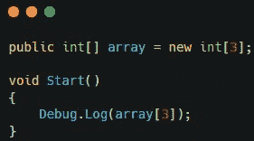
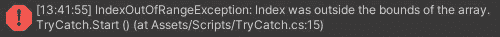
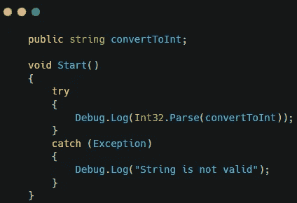
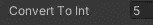
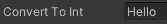
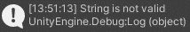

# Unity 中的例外

> 原文：<https://medium.com/nerd-for-tech/exceptions-in-unity-cc52df30e8a7?source=collection_archive---------9----------------------->

异常是在程序执行过程中发生的问题，它会导致程序异常结束。在创建程序时，如果希望代码正常工作，就需要处理这些异常。有两种不同类型的异常。

首先是检查异常。这些异常是编译代码时出现的语法错误。这种类型的异常将导致代码下面出现红色曲线。

第二种类型是未检查的异常。这些异常是代码执行过程中出现的逻辑错误。这些错误不容易被发现，因为它们不会在您的代码下产生红色的曲线。

处理这些异常的一种方法是使用 try-catch 块。try-catch 块通过尝试执行代码块来工作。如果发生异常，它将被捕获并执行不同的代码块。这将捕捉任何异常，并允许程序继续执行。

