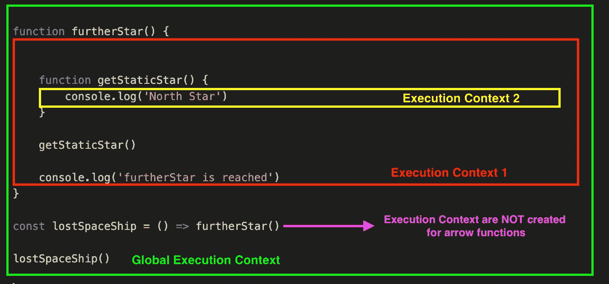
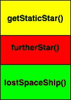
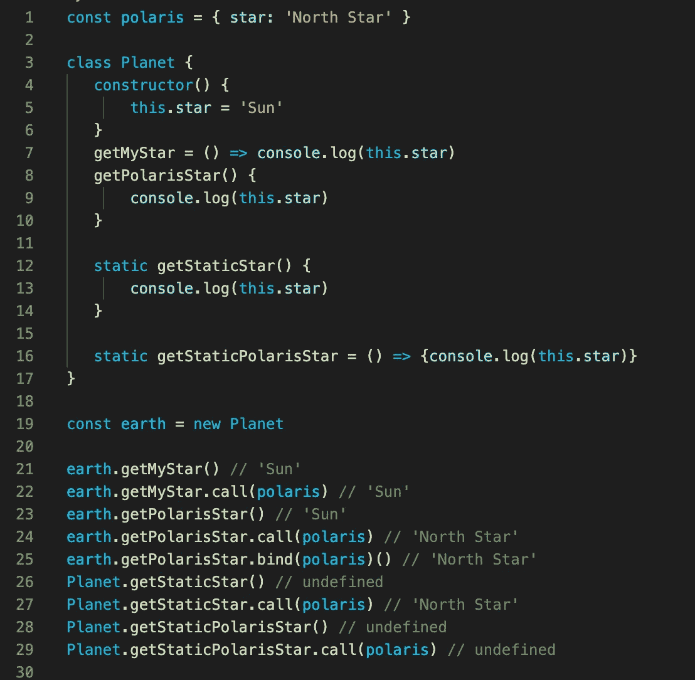
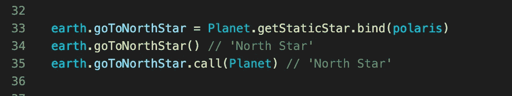

# JavaScript 和“this”的执行上下文

> 原文：<https://medium.com/nerd-for-tech/execution-context-of-javascript-and-this-e080e22f2245?source=collection_archive---------26----------------------->

本文的主要目的是使用`this` context setter 关键字将执行上下文概念绘制到 excel 中。在进入细节之前，让我们通过简要解释执行上下文是如何创建的来画出轮廓。

我们的 JS 代码经历了两个阶段。

## 1.创建阶段

JS 引擎从上到下浏览我们的代码(即忽略值),如果检查了[提升](https://www.w3schools.com/js/js_hoisting.asp)和[作用域](https://blog.bitsrc.io/understanding-scope-and-scope-chain-in-javascript-f6637978cf53)规则，它会制定一个关于何时以及如何使用给定变量和函数的计划。当这个计划准备好时，它看起来像一个**有序的**待办事项列表，并且为每个列表项创建一个 [**执行上下文**](https://www.javascripttutorial.net/javascript-execution-context/) 。最后我们会有一个 [**执行上下文堆栈(ESC)**](https://blog.bitsrc.io/understanding-execution-context-and-execution-stack-in-javascript-1c9ea8642dd0) 。本文创建阶段的重要部分是`this`关键字值是在这个阶段确定的。

## 2.执行阶段

执行阶段是 JS 引擎按顺序执行堆栈的时候。要记住的关键信息是 JS 是单线程语言，这意味着每个堆栈都要等待上一个堆栈的完成(同步执行)。同样在这个阶段，`this`的值可以通过 [**显式上下文设置器方法**](/@omergoldberg/javascript-call-apply-and-bind-e5c27301f7bb) ( `call`、`apply`、`bind`)来改变。

执行上下文 1 有两个函数调用，`getStaticStar()`和`console.log('furtherStar is reached')`。它们中哪个先被调用，哪个就先被执行。

ESC 是自下而上构建的，自上而下执行

# 这解释道

在上面，`this`被多次提到，正如你所看到的，在我们的星球物体没有做任何改变的情况下，我们看到了不同方法的不同结果。这意味着对于同一方法的每一个不同的结果，`this`的执行上下文是不同的，这使得我们的执行上下文**是动态的**。

先开始说`call`和`bind`方法。这些方法显式设置执行上下文。换句话说，他们可能会改变`this`的价值。在第 23 行和第 24 行，我们得到了不同的结果，因为`.call(polaris)`将我们的上下文设置为`polaris`对象，它的`star`是“北极星”。在第 25 行，我们用`bind`方法将我们的上下文设置为`polaris`。
***注意:*** `*apply*` *和* `*call*` *方法会立即触发它们所调用的方法，而* `*bind*` *方法只设置上下文。因此在第 25 行，调用符号被用在了末尾。*

第 26、27 行的逻辑与第 23 和 24 行相同。然而，引起注意的另一点是第 26 行。我们得到`undefined`结果的原因是`this`的值是行星类，它没有`star`属性。

第 21、22、28、29 行调用`getMyStar()`和`getStaticPolarisStar()` [**箭头功能**](https://developer.mozilla.org/en-US/docs/Web/JavaScript/Reference/Functions/Arrow_functions) 。正如你所看到的，执行上下文 setter 方法并没有改变 arrow 函数的上下文。原因是箭头函数受制于 [**词法作用域**](https://developer.mozilla.org/en-US/docs/Web/JavaScript/Closures) 。简而言之，arrow 函数的词法范围意味着定义函数的位置很重要，而不是调用它的位置。因此，箭头功能的执行上下文是在创建阶段确定的，不能更改。

另一个要点是你不能设置执行上下文**超过 1 次。上面，`goToNorthStar`函数被分配给一个已经通过`bind`绑定到`polaris`的函数。因此，调用任何其他上下文设置器方法都不会改变上下文。在第 35 行，`call(Planet)`不影响我们的上下文。你可以认为这是一个附加的恒等式。如果你愿意，你可以认为箭头函数被绑定在它们已经声明的地方，所以对它们调用`call`、`apply`、`bind`不起作用。**

第 26 行和第 28 行的结果相同。然而下面的原因是不同的。正如我们上面提到的，`this`代表`getStaticStar()`是行星类天体。`getStaticPolarisStar()`方法是一个箭头函数。因此，由于词法范围，它的`this`值在我们的 Planet 类定义的地方是全局的，在本例中是`undefined`。